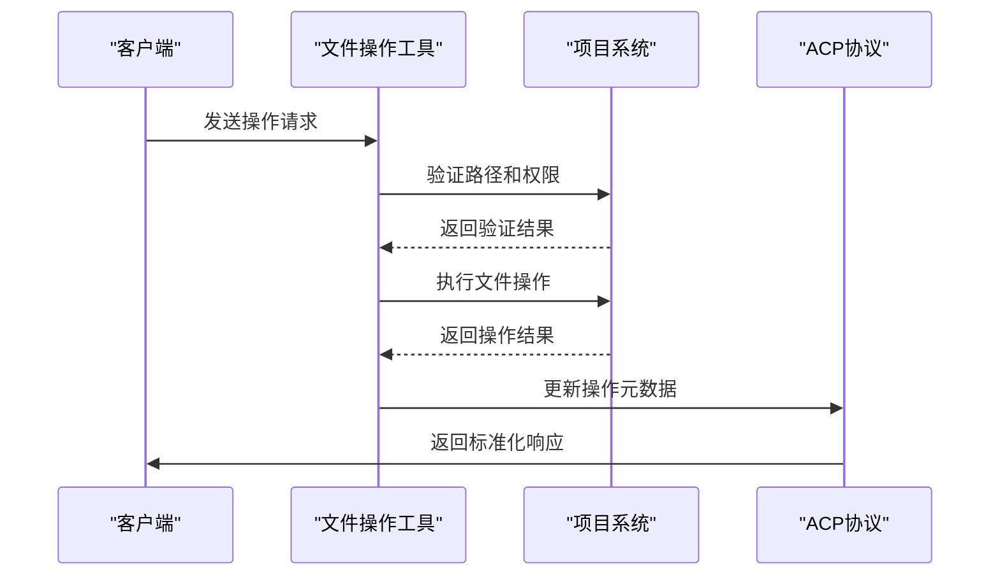
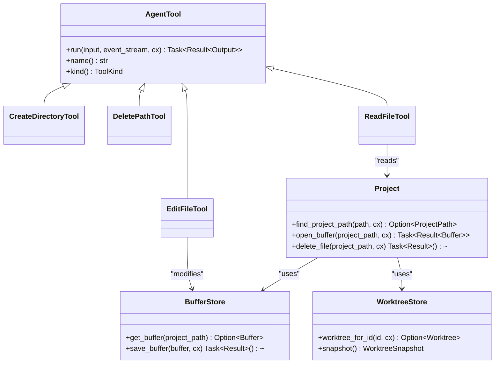

# 文件操作工具API

<cite>
**本文档中引用的文件**  
- [create_directory_tool.rs](file://crates/agent2/src/tools/create_directory_tool.rs)
- [delete_path_tool.rs](file://crates/agent2/src/tools/delete_path_tool.rs)
- [move_path_tool.rs](file://crates/agent2/src/tools/move_path_tool.rs)
- [read_file_tool.rs](file://crates/agent2/src/tools/read_file_tool.rs)
- [edit_file_tool.rs](file://crates/agent2/src/tools/edit_file_tool.rs)
- [list_directory_tool.rs](file://crates/agent2/src/tools/list_directory_tool.rs)
- [find_path_tool.rs](file://crates/agent2/src/tools/find_path_tool.rs)
- [tool_schema.rs](file://crates/agent2/src/tool_schema.rs)
- [project.rs](file://crates/project/src/project.rs)
- [buffer_store.rs](file://crates/project/src/buffer_store.rs)
- [worktree_store.rs](file://crates/project/src/worktree_store.rs)
</cite>

## 目录
1. [简介](#简介)
2. [核心工具功能](#核心工具功能)
3. [HTTP API端点](#http-api端点)
4. [请求参数结构](#请求参数结构)
5. [响应格式与错误码](#响应格式与错误码)
6. [agent2模块实现逻辑](#agent2模块实现逻辑)
7. [ACP协议结果返回](#acp协议结果返回)
8. [实际调用示例](#实际调用示例)
9. [权限校验与安全检查](#权限校验与安全检查)
10. [并发访问控制](#并发访问控制)
11. [与project模块集成](#与project模块集成)
12. [总结](#总结)

## 简介
rcoder系统提供了一套完整的文件操作工具集，通过agent2模块实现对项目文件系统的安全访问和操作。这些工具通过ACP（Agent Communication Protocol）协议与外部系统交互，支持创建目录、删除路径、移动文件、读取文件、编辑文件、列出目录内容和查找路径等核心功能。本API文档详细说明了每个工具的功能、接口定义、安全机制和集成方式。

## 核心工具功能

### 创建目录工具
提供在项目中创建新目录的功能，支持递归创建父目录（类似`mkdir -p`）。该工具确保新目录路径在项目范围内，并返回创建成功的确认信息。

**工具名称**: `create_directory`  
**工具类型**: `Read`  
**功能描述**: 在指定路径创建新目录，自动创建所有必要的父目录。

### 删除路径工具
支持删除文件或目录（包括目录内容递归删除）的功能。该工具会先验证路径在项目范围内，然后执行删除操作并返回确认信息。

**工具名称**: `delete_path`  
**工具类型**: `Delete`  
**功能描述**: 删除指定路径的文件或目录，支持递归删除目录内容。

### 移动路径工具
提供移动或重命名文件/目录的功能。当源路径和目标路径的目录相同时，执行重命名操作；否则执行移动操作。

**工具名称**: `move_path`  
**工具类型**: `Move`  
**功能描述**: 移动或重命名文件/目录，保持内容不变。

### 读取文件工具
支持读取项目中文件内容的功能，可指定读取的行范围（起始行和结束行）。对于大文件，会自动生成大纲而非完整内容。

**工具名称**: `read_file`  
**工具类型**: `Read`  
**功能描述**: 读取指定文件的内容，支持部分读取和大文件优化。

### 编辑文件工具
提供创建新文件或编辑现有文件的功能。支持三种模式：编辑现有文件、创建新文件、覆盖整个文件内容。

**工具名称**: `edit_file`  
**工具类型**: `Edit`  
**功能描述**: 创建或编辑文件，支持细粒度编辑和格式化保存。

### 列出目录工具
列出指定目录中的文件和子目录内容，将文件和目录分别分组显示。支持安全过滤，排除私有和排除的文件。

**工具名称**: `list_directory`  
**工具类型**: `Read`  
**功能描述**: 列出目录内容，区分文件和文件夹，应用安全过滤。

### 查找路径工具
基于glob模式匹配快速查找文件路径，支持通配符搜索和分页结果。适用于按名称模式查找文件。

**工具名称**: `find_path`  
**工具类型**: `Search`  
**功能描述**: 按glob模式匹配文件路径，返回分页的匹配结果。

**Section sources**
- [create_directory_tool.rs](file://crates/agent2/src/tools/create_directory_tool.rs#L1-L90)
- [delete_path_tool.rs](file://crates/agent2/src/tools/delete_path_tool.rs#L1-L140)
- [move_path_tool.rs](file://crates/agent2/src/tools/move_path_tool.rs#L1-L124)
- [read_file_tool.rs](file://crates/agent2/src/tools/read_file_tool.rs#L1-L799)
- [edit_file_tool.rs](file://crates/agent2/src/tools/edit_file_tool.rs#L1-L799)
- [list_directory_tool.rs](file://crates/agent2/src/tools/list_directory_tool.rs#L1-L670)
- [find_path_tool.rs](file://crates/agent2/src/tools/find_path_tool.rs#L1-L250)

## HTTP API端点
文件操作工具通过HTTP API端点暴露功能，所有端点均遵循统一的命名规范和请求/响应格式。

### 创建目录
- **端点**: `POST /tools/file/create_dir`
- **方法**: POST
- **功能**: 创建新目录

### 删除路径
- **端点**: `POST /tools/file/delete_path`
- **方法**: POST
- **功能**: 删除文件或目录

### 移动路径
- **端点**: `POST /tools/file/move_path`
- **方法**: POST
- **功能**: 移动或重命名文件/目录

### 读取文件
- **端点**: `POST /tools/file/read_file`
- **方法**: POST
- **功能**: 读取文件内容

### 编辑文件
- **端点**: `POST /tools/file/edit_file`
- **方法**: POST
- **功能**: 编辑文件内容

### 列出目录
- **端点**: `POST /tools/file/list_directory`
- **方法**: POST
- **功能**: 列出目录内容

### 查找路径
- **端点**: `POST /tools/file/find_path`
- **方法**: POST
- **功能**: 按模式查找路径

**Section sources**
- [create_directory_tool.rs](file://crates/agent2/src/tools/create_directory_tool.rs#L1-L90)
- [delete_path_tool.rs](file://crates/agent2/src/tools/delete_path_tool.rs#L1-L140)
- [move_path_tool.rs](file://crates/agent2/src/tools/move_path_tool.rs#L1-L124)
- [read_file_tool.rs](file://crates/agent2/src/tools/read_file_tool.rs#L1-L799)
- [edit_file_tool.rs](file://crates/agent2/src/tools/edit_file_tool.rs#L1-L799)
- [list_directory_tool.rs](file://crates/agent2/src/tools/list_directory_tool.rs#L1-L670)
- [find_path_tool.rs](file://crates/agent2/src/tools/find_path_tool.rs#L1-L250)

## 请求参数结构
所有文件操作工具的请求参数基于`ToolSchema`定义，遵循JSON Schema规范，确保类型安全和文档自动生成。

### 创建目录参数
```json
{
  "path": "string"
}
```
- **path**: 要创建的新目录路径

### 删除路径参数
```json
{
  "path": "string"
}
```
- **path**: 要删除的文件或目录路径

### 移动路径参数
```json
{
  "source_path": "string",
  "destination_path": "string"
}
```
- **source_path**: 源路径
- **destination_path**: 目标路径

### 读取文件参数
```json
{
  "path": "string",
  "start_line": "integer",
  "end_line": "integer"
}
```
- **path**: 文件路径
- **start_line**: 起始行号（1-based）
- **end_line**: 结束行号（1-based，包含）

### 编辑文件参数
```json
{
  "display_description": "string",
  "path": "string",
  "mode": "enum"
}
```
- **display_description**: 编辑描述
- **path**: 文件路径
- **mode**: 操作模式（edit/create/overwrite）

### 列出目录参数
```json
{
  "path": "string"
}
```
- **path**: 要列出内容的目录路径

### 查找路径参数
```json
{
  "glob": "string",
  "offset": "integer"
}
```
- **glob**: glob模式
- **offset**: 分页偏移量

**Section sources**
- [tool_schema.rs](file://crates/agent2/src/tool_schema.rs#L1-L43)
- [create_directory_tool.rs](file://crates/agent2/src/tools/create_directory_tool.rs#L1-L90)
- [delete_path_tool.rs](file://crates/agent2/src/tools/delete_path_tool.rs#L1-L140)
- [move_path_tool.rs](file://crates/agent2/src/tools/move_path_tool.rs#L1-L124)
- [read_file_tool.rs](file://crates/agent2/src/tools/read_file_tool.rs#L1-L799)
- [edit_file_tool.rs](file://crates/agent2/src/tools/edit_file_tool.rs#L1-L799)
- [list_directory_tool.rs](file://crates/agent2/src/tools/list_directory_tool.rs#L1-L670)
- [find_path_tool.rs](file://crates/agent2/src/tools/find_path_tool.rs#L1-L250)

## 响应格式与错误码
所有工具返回统一的响应格式，包含操作结果和元数据，错误情况返回详细的错误信息。

### 成功响应格式
```json
{
  "success": true,
  "data": {},
  "message": "string"
}
```

### 错误响应格式
```json
{
  "success": false,
  "error": {
    "code": "string",
    "message": "string",
    "details": {}
  }
}
```

### 常见错误码
- **404_NOT_FOUND**: 路径未找到
- **403_FORBIDDEN**: 权限不足或路径被排除
- **400_BAD_REQUEST**: 请求参数无效
- **500_INTERNAL_ERROR**: 内部服务器错误

### 工具特定错误
- **创建目录**: 路径超出项目范围
- **删除路径**: 路径不在项目中
- **读取文件**: 文件被排除或私有
- **编辑文件**: 文件不存在或父目录不存在
- **列出目录**: 路径不是目录
- **查找路径**: glob模式无效

**Section sources**
- [create_directory_tool.rs](file://crates/agent2/src/tools/create_directory_tool.rs#L1-L90)
- [delete_path_tool.rs](file://crates/agent2/src/tools/delete_path_tool.rs#L1-L140)
- [read_file_tool.rs](file://crates/agent2/src/tools/read_file_tool.rs#L1-L799)
- [edit_file_tool.rs](file://crates/agent2/src/tools/edit_file_tool.rs#L1-L799)
- [list_directory_tool.rs](file://crates/agent2/src/tools/list_directory_tool.rs#L1-L670)
- [find_path_tool.rs](file://crates/agent2/src/tools/find_path_tool.rs#L1-L250)

## agent2模块实现逻辑
文件操作工具在agent2模块中实现，遵循统一的`AgentTool` trait接口，确保一致的行为和错误处理。

### 工具执行流程
1. 参数验证和路径解析
2. 权限和安全检查
3. 执行实际文件操作
4. 返回结果和更新状态

### 项目路径解析
所有工具首先通过`find_project_path`方法将相对路径解析为项目路径，确保操作在项目范围内。

### 异步任务处理
使用`Task<Result<T>>`返回类型，支持异步执行和错误传播，避免阻塞主线程。

### 事件流更新
通过`ToolCallEventStream`实时更新操作状态，支持进度反馈和结果流式传输。

**Section sources**
- [create_directory_tool.rs](file://crates/agent2/src/tools/create_directory_tool.rs#L1-L90)
- [delete_path_tool.rs](file://crates/agent2/src/tools/delete_path_tool.rs#L1-L140)
- [read_file_tool.rs](file://crates/agent2/src/tools/read_file_tool.rs#L1-L799)
- [edit_file_tool.rs](file://crates/agent2/src/tools/edit_file_tool.rs#L1-L799)

## ACP协议结果返回
工具通过ACP协议与外部系统通信，遵循标准化的结果返回格式和元数据更新。

### 结果内容格式
- **文本结果**: 直接返回字符串
- **文件结果**: 返回`LanguageModelToolResultContent`
- **分页结果**: 包含总数量和当前页

### 元数据更新
通过`ToolCallUpdateFields`更新操作的元数据，包括：
- **locations**: 操作涉及的文件位置
- **content**: 返回的内容或资源链接
- **title**: 操作标题

### 资源链接
对于查找路径等操作，返回资源链接而非纯文本，支持直接跳转到文件。



**Diagram sources**
- [find_path_tool.rs](file://crates/agent2/src/tools/find_path_tool.rs#L1-L250)
- [read_file_tool.rs](file://crates/agent2/src/tools/read_file_tool.rs#L1-L799)
- [tool_schema.rs](file://crates/agent2/src/tool_schema.rs#L1-L43)

**Section sources**
- [find_path_tool.rs](file://crates/agent2/src/tools/find_path_tool.rs#L1-L250)
- [read_file_tool.rs](file://crates/agent2/src/tools/read_file_tool.rs#L1-L799)
- [tool_schema.rs](file://crates/agent2/src/tool_schema.rs#L1-L43)

## 实际调用示例
以下示例展示如何从外部系统触发文件操作。

### 创建目录示例
```json
POST /tools/file/create_dir
{
  "path": "src/components"
}
```

### 读取文件示例
```json
POST /tools/file/read_file
{
  "path": "src/main.rs",
  "start_line": 10,
  "end_line": 20
}
```

### 编辑文件示例
```json
POST /tools/file/edit_file
{
  "display_description": "修复API端点URL",
  "path": "src/api/client.js",
  "mode": "edit"
}
```

### 查找路径示例
```json
POST /tools/file/find_path
{
  "glob": "**/*.test.js",
  "offset": 0
}
```

**Section sources**
- [create_directory_tool.rs](file://crates/agent2/src/tools/create_directory_tool.rs#L1-L90)
- [read_file_tool.rs](file://crates/agent2/src/tools/read_file_tool.rs#L1-L799)
- [edit_file_tool.rs](file://crates/agent2/src/tools/edit_file_tool.rs#L1-L799)
- [find_path_tool.rs](file://crates/agent2/src/tools/find_path_tool.rs#L1-L250)

## 权限校验与安全检查
系统实施多层次的安全检查，确保文件操作的安全性和合规性。

### 路径范围检查
- 验证所有路径在项目工作树范围内
- 拒绝绝对路径和路径遍历尝试

### 排除规则检查
- 应用全局`file_scan_exclusions`设置
- 应用工作树特定的排除规则

### 私有文件检查
- 应用全局`private_files`设置
- 应用工作树特定的私有文件规则

### 安全策略优先级
1. 工作树本地设置
2. 全局用户设置
3. 系统默认设置

**Section sources**
- [read_file_tool.rs](file://crates/agent2/src/tools/read_file_tool.rs#L1-L799)
- [list_directory_tool.rs](file://crates/agent2/src/tools/list_directory_tool.rs#L1-L670)
- [project.rs](file://crates/project/src/project.rs#L1-L100)

## 并发访问控制
系统设计考虑并发访问场景，确保数据一致性和操作原子性。

### 缓冲区管理
- 使用`buffer_store`管理文件缓冲区
- 支持多用户同时编辑不同文件
- 文件锁定机制防止冲突编辑

### 操作队列
- 文件操作按顺序执行
- 相关操作自动排序以避免冲突

### 事务性操作
- 移动和重命名操作原子执行
- 编辑操作支持撤销和重做

**Section sources**
- [buffer_store.rs](file://crates/project/src/buffer_store.rs#L1-L50)
- [worktree_store.rs](file://crates/project/src/worktree_store.rs#L1-L50)
- [edit_file_tool.rs](file://crates/agent2/src/tools/edit_file_tool.rs#L1-L799)

## 与project模块集成
文件操作工具深度集成project模块，利用其核心组件实现功能。

### buffer_store集成
- 读取文件时从`buffer_store`获取缓冲区
- 编辑文件后自动保存到`buffer_store`
- 支持实时预览和语法高亮

### worktree_store集成
- 通过`worktree_store`访问工作树快照
- 列出目录时使用工作树快照
- 查找路径时遍历所有工作树

### 项目路径管理
- 使用`ProjectPath`抽象表示项目内路径
- 支持多根目录项目结构
- 自动处理路径解析和验证



**Diagram sources**
- [project.rs](file://crates/project/src/project.rs#L1-L100)
- [buffer_store.rs](file://crates/project/src/buffer_store.rs#L1-L50)
- [worktree_store.rs](file://crates/project/src/worktree_store.rs#L1-L50)

**Section sources**
- [project.rs](file://crates/project/src/project.rs#L1-L100)
- [buffer_store.rs](file://crates/project/src/buffer_store.rs#L1-L50)
- [worktree_store.rs](file://crates/project/src/worktree_store.rs#L1-L50)

## 总结
rcoder的文件操作工具API提供了一套完整、安全且高效的文件系统交互接口。通过agent2模块和ACP协议，实现了从外部系统到项目文件的安全操作通道。系统实施了严格的权限校验、路径安全检查和并发控制，确保操作的可靠性和数据一致性。与project模块的深度集成使得工具能够充分利用缓冲区管理和工作树快照等核心功能，为开发者提供流畅的文件操作体验。