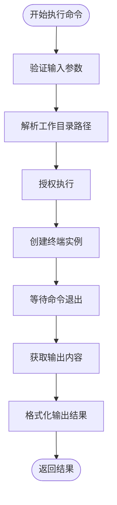
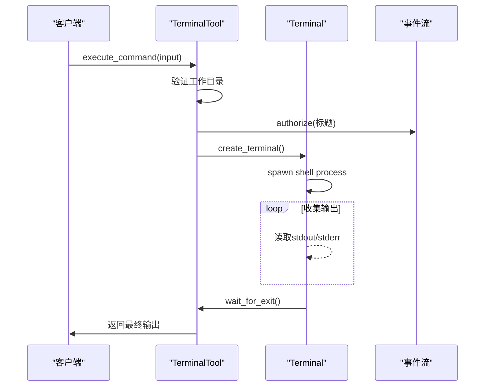
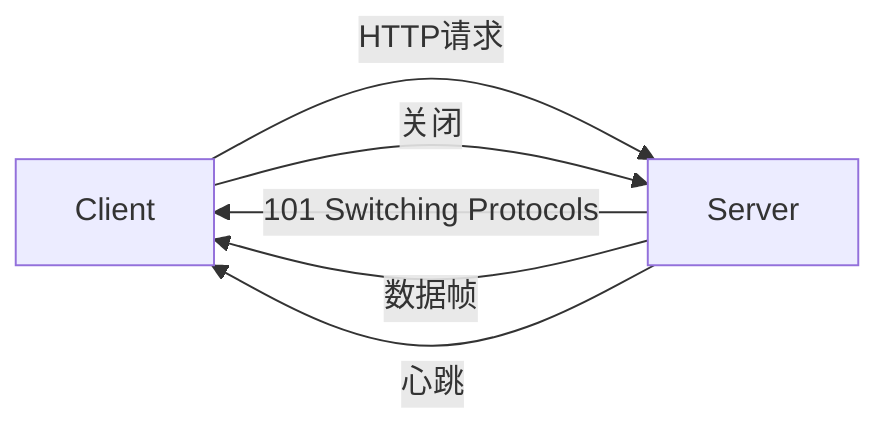
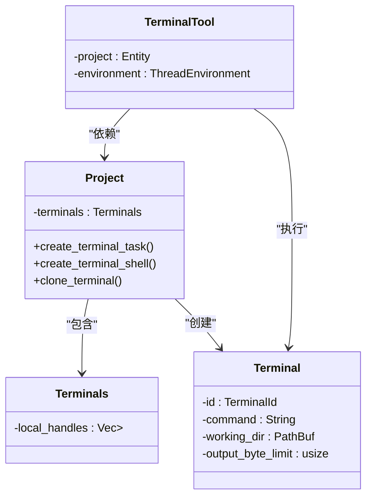

# 终端工具API

<cite>
**本文档引用的文件**
- [terminal_tool.rs](file://crates/agent2/src/tools/terminal_tool.rs)
- [terminal.rs](file://crates/acp_thread/src/terminal.rs)
- [terminals.rs](file://crates/project/src/terminals.rs)
</cite>

## 目录
1. [简介](#简介)
2. [核心功能与API端点](#核心功能与api端点)
3. [命令执行流程](#命令执行流程)
4. [终端会话管理](#终端会话管理)
5. [异步执行与输出流处理](#异步执行与输出流处理)
6. [PTY会话创建与信号处理](#pty会话创建与信号处理)
7. [WebSocket/SSE流式响应示例](#websocket/sse流式响应示例)
8. [与项目模块的集成](#与项目模块的集成)
9. [安全与资源限制](#安全与资源限制)
10. [总结](#总结)

## 简介
本文档详细描述了终端工具相关的API设计与实现机制，重点围绕远程命令执行功能展开。系统通过HTTP请求触发命令执行，支持参数传递（如命令字符串、工作目录、环境变量等），并采用异步机制处理长时间运行的任务。输出流（stdout/stderr）以实时方式返回，结合WebSocket或SSE实现流式响应。文档还阐述了PTY会话的创建、信号处理及资源清理流程，并说明了与`project`模块中`terminals`组件的集成关系，包括会话隔离、资源限制和安全沙箱配置。

**Section sources**
- [terminal_tool.rs](file://crates/agent2/src/tools/terminal_tool.rs#L1-L213)

## 核心功能与API端点
终端工具的核心功能是执行shell命令并返回结果。主要API端点为`/execute_command`，用于触发远程命令执行。该接口接收包含命令字符串和工作目录的输入结构体`TerminalToolInput`，并通过异步任务执行命令。

`TerminalToolInput`包含以下字段：
- **command**: 要执行的shell命令字符串
- **cd**: 命令执行的工作目录，必须是项目根目录之一

命令执行后，系统返回组合的输出结果（stdout和stderr），并保留写入顺序。输出结果受`COMMAND_OUTPUT_LIMIT`（16KB）限制，超出部分将被截断。

**Section sources**
- [terminal_tool.rs](file://crates/agent2/src/tools/terminal_tool.rs#L15-L45)

## 命令执行流程
命令执行流程由`TerminalTool`结构体驱动，其`run`方法负责启动执行任务。流程如下：

1. 验证并解析工作目录路径，确保其属于项目的某个工作树（worktree）
2. 授权执行操作，生成初始标题用于UI展示
3. 调用环境接口`create_terminal`创建终端实例
4. 等待命令执行完成，获取退出状态
5. 获取当前输出内容并进行格式化处理

若工作目录为`.`或空字符串且项目仅有一个工作树，则默认使用该工作树的根路径；否则需显式指定有效的工作目录。

**Diagram sources**
- [terminal_tool.rs](file://crates/agent2/src/tools/terminal_tool.rs#L85-L115)

**Section sources**
- [terminal_tool.rs](file://crates/agent2/src/tools/terminal_tool.rs#L85-L115)

## 终端会话管理
终端会话由`Terminal`结构体表示，封装了命令标识、工作目录、底层终端句柄及输出状态。每个会话具有唯一ID（`TerminalId`），可用于后续查询或终止操作。

会话状态包括：
- 启动时间（`started_at`）
- 当前输出内容及是否被截断
- 退出状态（`exit_status`）
- 原始输出长度与行数统计

会话可通过`kill`方法强制终止，触发底层进程的清理流程。

**Section sources**
- [terminal.rs](file://crates/acp_thread/src/terminal.rs#L5-L45)

## 异步执行与输出流处理
命令执行采用异步任务模型，通过`Task<Result<Output>>`返回执行结果。输出流在后台持续收集，支持实时获取中间结果。

`current_output`方法可随时调用以获取当前输出状态，返回结构体`TerminalOutputResponse`包含：
- **output**: 当前输出内容（已截断）
- **truncated**: 是否因超出限制而被截断
- **exit_status**: 退出状态（若尚未完成则为None）

当输出超过`output_byte_limit`时，系统会在最后一个换行符处截断内容，避免破坏文本完整性。

**Diagram sources**
- [terminal.rs](file://crates/acp_thread/src/terminal.rs#L50-L100)
- [terminal_tool.rs](file://crates/agent2/src/tools/terminal_tool.rs#L95-L110)

**Section sources**
- [terminal.rs](file://crates/acp_thread/src/terminal.rs#L50-L100)

## PTY会话创建与信号处理
PTY（Pseudo-Terminal）会话由`project`模块中的`Terminals`组件管理。`create_terminal_task`方法负责构建并启动新的终端任务，支持完整的shell环境和交互式命令执行。

关键特性包括：
- 自动检测并激活Python虚拟环境（venv）
- 支持远程连接场景下的shell代理
- 可配置的shell类型（系统默认、自定义程序等）
- 环境变量继承与扩展机制

信号处理由底层`portable_pty`库实现，确保SIGINT、SIGTERM等信号能正确传递至子进程。`kill`操作会调用`kill_active_task`终止当前运行的任务。

**Section sources**
- [terminals.rs](file://crates/project/src/terminals.rs#L50-L150)

## WebSocket/SSE流式响应示例
虽然当前代码未直接实现WebSocket或SSE，但事件流机制（`ToolCallEventStream`）为流式响应提供了基础。可通过以下方式扩展支持：

实际应用中，可将`event_stream.update_fields`用于推送实时输出更新，结合SSE的`text/event-stream`格式发送增量数据。

**Diagram sources**
- [terminal_tool.rs](file://crates/agent2/src/tools/terminal_tool.rs#L100-L105)

## 与项目模块的集成
终端工具深度集成于`project`模块的`terminals`组件中，实现会话生命周期管理。所有本地终端句柄存储在`local_handles`向量中，通过弱引用（`WeakEntity`）避免内存泄漏。

会话隔离通过以下机制实现：
- 每个终端绑定特定项目路径上下文
- 环境变量按工作树作用域继承
- 工具链激活脚本按路径上下文注入

`clone_terminal`方法支持基于现有会话创建新终端，继承其配置和环境状态。

**Diagram sources**
- [terminals.rs](file://crates/project/src/terminals.rs#L1-L50)
- [terminal_tool.rs](file://crates/agent2/src/tools/terminal_tool.rs#L50-L60)

**Section sources**
- [terminals.rs](file://crates/project/src/terminals.rs#L1-L200)

## 安全与资源限制
系统实施多项安全与资源控制措施：

1. **路径限制**：仅允许在项目的工作树目录内执行命令，防止路径遍历攻击
2. **输出限制**：单次命令输出上限为16KB，防止资源耗尽
3. **环境隔离**：每个命令在独立的shell进程中执行，无状态共享
4. **权限控制**：通过`authorize`机制确保用户确认高风险操作

此外，`exec_in_shell`方法可用于构建非交互式命令执行器，适用于脚本化场景。

**Section sources**
- [terminal_tool.rs](file://crates/agent2/src/tools/terminal_tool.rs#L10-L15)
- [terminals.rs](file://crates/project/src/terminals.rs#L300-L350)

## 总结
本文档全面解析了终端工具的API设计与实现机制，涵盖命令执行、会话管理、异步处理、PTY集成及安全控制等方面。系统通过模块化设计实现了高内聚低耦合的架构，支持本地与远程场景下的安全命令执行。未来可进一步扩展流式响应支持，提升用户体验。