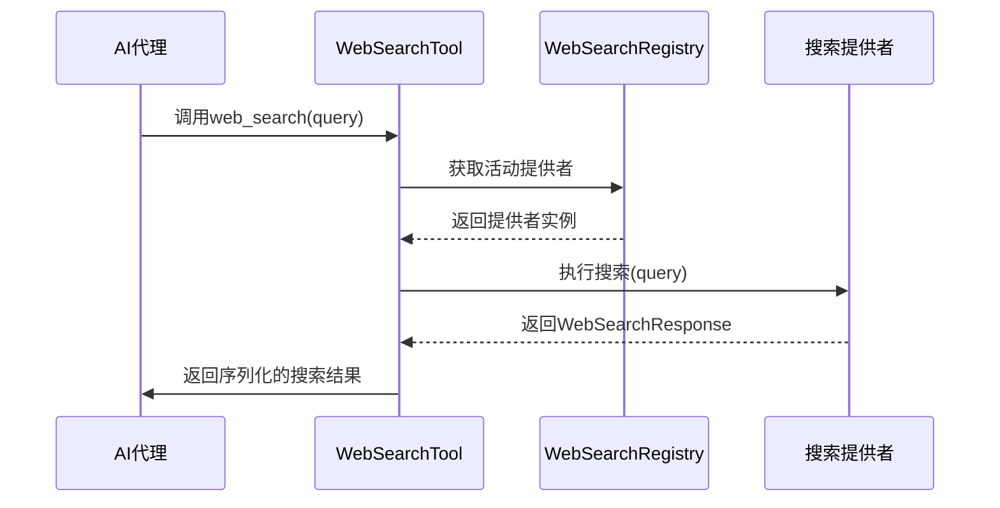
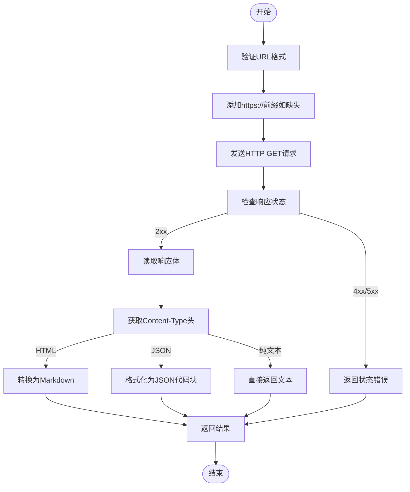
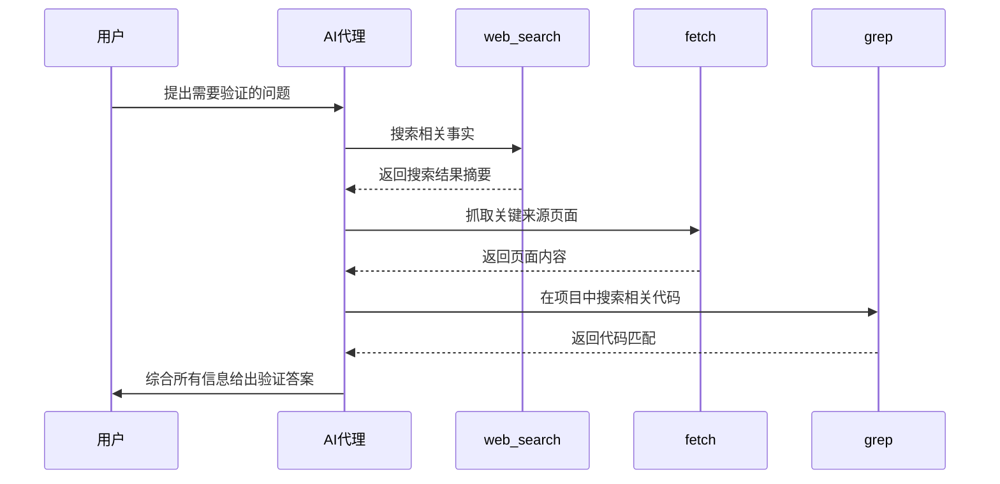

# 网络搜索工具API

<cite>
**本文档中引用的文件**  
- [web_search_tool.rs](file://crates/agent2/src/tools/web_search_tool.rs)
- [fetch_tool.rs](file://crates/agent2/src/tools/fetch_tool.rs)
- [grep_tool.rs](file://crates/agent2/src/tools/grep_tool.rs)
- [lib.rs](file://crates/shared_types/src/lib.rs)
</cite>

## 目录
1. [简介](#简介)
2. [核心工具概述](#核心工具概述)
3. [Web搜索工具](#web搜索工具)
4. [Fetch工具](#fetch工具)
5. [Grep工具](#grep工具)
6. [AI代理中的工具链作用](#ai代理中的工具链作用)
7. [安全与配置](#安全与配置)
8. [数据结构与返回格式](#数据结构与返回格式)
9. [结论](#结论)

## 简介
本文档详细描述了网络搜索与数据获取类工具的API设计与实现机制。这些工具为AI代理提供实时信息检索、远程资源抓取和项目内内容搜索能力，支持上下文收集、事实验证和决策辅助。文档涵盖`web_search`、`fetch`和`grep`三大核心工具的调用方式、参数配置、执行逻辑及在智能代理系统中的集成应用。

## 核心工具概述
系统提供三类核心数据获取工具，分别用于不同场景的信息检索：

- **web_search**：通过集成第三方搜索引擎API执行实时网络搜索
- **fetch**：抓取HTTP/HTTPS资源并转换为结构化内容
- **grep**：在本地项目文件中执行正则表达式搜索

这些工具统一实现`AgentTool`接口，支持异步执行、事件流更新和结果序列化，确保与AI代理系统的无缝集成。

**Section sources**
- [web_search_tool.rs](file://crates/agent2/src/tools/web_search_tool.rs#L1-L132)
- [fetch_tool.rs](file://crates/agent2/src/tools/fetch_tool.rs#L1-L164)
- [grep_tool.rs](file://crates/agent2/src/tools/grep_tool.rs#L1-L799)

## Web搜索工具

### 功能说明
`web_search`工具允许AI代理执行实时网络搜索，获取训练数据之外的最新信息。该工具特别适用于需要事实验证、实时数据或外部知识的场景。

### 调用方式
- **工具名称**: `web_search`
- **HTTP端点**: POST /tools/search/web
- **输入结构**: `WebSearchToolInput`

### 查询参数
```json
{
  "query": "搜索关键词或问题"
}
```

- `query`：要搜索的查询字符串，支持自然语言问题

### 执行流程


**Diagram sources**
- [web_search_tool.rs](file://crates/agent2/src/tools/web_search_tool.rs#L42-L89)

### 集成与限制
- 当前仅支持Zed Cloud作为搜索引擎提供者
- 工具通过`WebSearchRegistry`管理提供者生命周期
- 搜索结果通过事件流实时更新，包含标题、URL和摘要信息
- 失败时会更新工具调用状态为"Web Search Failed"

### 返回结果结构
搜索结果封装在`WebSearchToolOutput`中，内部包含`WebSearchResponse`对象，序列化后作为`LanguageModelToolResultContent`传递给AI模型。

**Section sources**
- [web_search_tool.rs](file://crates/agent2/src/tools/web_search_tool.rs#L0-L132)

## Fetch工具

### 功能说明
`fetch`工具用于获取远程HTTP/HTTPS资源，并将其内容转换为Markdown格式返回。支持HTML、纯文本和JSON等多种内容类型的智能解析。

### 调用方式
- **工具名称**: `fetch`
- **HTTP端点**: POST /tools/fetch
- **输入结构**: `FetchToolInput`

### 查询参数
```json
{
  "url": "https://example.com"
}
```

- `url`：要抓取的资源URL，自动补全http://或https://前缀

### 超时与重试
- 使用`HttpClientWithUrl`进行请求，继承底层HTTP客户端的超时配置
- 错误处理包含状态码检查和响应体读取超时
- 客户端错误（4xx）和服务器错误（5xx）会触发重试策略

### 内容处理
根据`Content-Type`头自动选择解析策略：

| 内容类型 | 处理方式 |
|---------|---------|
| text/html | 转换为Markdown，移除网页装饰元素 |
| text/plain | 直接返回文本内容 |
| application/json | 格式化为代码块显示 |

特殊处理：
- Wikipedia页面：移除侧边栏、信息框等非主要内容
- 其他HTML页面：保留代码块高亮

### 响应头处理
- 验证`Content-Type`头存在且有效
- 自动识别内容类型并选择相应处理器
- 错误时返回详细的HTTP状态信息



**Diagram sources**
- [fetch_tool.rs](file://crates/agent2/src/tools/fetch_tool.rs#L47-L77)
- [fetch_tool.rs](file://crates/agent2/src/tools/fetch_tool.rs#L107-L163)

### 安全机制
- 通过`event_stream.authorize()`进行URL访问授权
- 空内容检测：返回前检查文本是否为空
- 错误传播：网络错误和解析错误直接返回给调用者

**Section sources**
- [fetch_tool.rs](file://crates/agent2/src/tools/fetch_tool.rs#L1-L164)

## Grep工具

### 功能说明
`grep`工具在项目文件中执行正则表达式搜索，用于查找代码中的特定模式、符号或文本内容。相比路径搜索，它能更精确地定位代码内容。

### 调用方式
- **工具名称**: `grep`
- **HTTP端点**: POST /tools/search/grep
- **输入结构**: `GrepToolInput`

### 查询参数
```json
{
  "regex": "正则表达式",
  "include_pattern": "**/*.rs",
  "offset": 0,
  "case_sensitive": false
}
```

- `regex`：Rust regex crate解析的正则表达式
- `include_pattern`：文件路径的glob模式过滤器
- `offset`：分页偏移量（0-based），每页20个结果
- `case_sensitive`：是否区分大小写，默认false

### 搜索逻辑
- 支持完整的正则表达式语法
- 自动排除`file_scan_exclusions`和`private_files`中的文件
- 基于项目根路径进行完整路径匹配
- 结果按文件分组，显示匹配的上下文行

### 结果过滤选项
- **包含模式**：通过`include_pattern`限制搜索范围
- **大小写敏感**：通过`case_sensitive`控制匹配行为
- **分页控制**：通过`offset`获取后续页面结果
- **自动排除**：尊重项目设置中的文件扫描排除规则

### 上下文展示
匹配结果显示时包含：
- 文件路径标题
- 语法结构层级（函数、模块等）
- 匹配行号范围
- 周围上下文代码（前后2行）
- 对于长函数，提示剩余行数

```mermaid
classDiagram
class GrepTool {
+project : Entity<Project>
+new(project) : GrepTool
}
class GrepToolInput {
+regex : String
+include_pattern : Option<String>
+offset : u32
+case_sensitive : bool
+page() : u32
}
class SearchQuery {
+regex(&str, bool, bool, bool, bool, PathMatcher, PathMatcher, bool, Option<String>) : Result<Self>
}
class SearchResult {
+Buffer { buffer : Buffer, ranges : Vec<Range> }
}
GrepTool --> GrepToolInput : 使用
GrepTool --> SearchQuery : 构建
GrepTool --> SearchResult : 处理
GrepTool --> Project : 依赖
```

**Diagram sources**
- [grep_tool.rs](file://crates/agent2/src/tools/grep_tool.rs#L18-L44)
- [grep_tool.rs](file://crates/agent2/src/tools/grep_tool.rs#L46-L101)

### 性能优化
- 流式处理搜索结果，避免内存溢出
- 语法树分析优化上下文展示
- 并行搜索多个缓冲区
- 缓存文件解析状态

**Section sources**
- [grep_tool.rs](file://crates/agent2/src/tools/grep_tool.rs#L1-L799)

## AI代理中的工具链作用

### 上下文收集
这些工具在AI代理决策链中扮演关键角色：

- **web_search**：获取外部实时信息，补充模型知识盲区
- **fetch**：抓取指定资源内容，扩展上下文窗口
- **grep**：检索项目内部代码，理解现有实现

### 事实验证流程


**Diagram sources**
- [web_search_tool.rs](file://crates/agent2/src/tools/web_search_tool.rs#L86-L131)
- [fetch_tool.rs](file://crates/agent2/src/tools/fetch_tool.rs#L107-L163)
- [grep_tool.rs](file://crates/agent2/src/tools/grep_tool.rs#L283-L319)

### 决策支持
工具链协同工作模式：
1. **信息发现**：使用`web_search`发现相关资源
2. **内容获取**：通过`fetch`获取详细内容
3. **上下文关联**：利用`grep`在项目中定位相关代码
4. **综合分析**：AI代理整合所有信息做出决策

这种链式调用使AI代理能够执行复杂的研究任务，而不仅仅是基于预训练知识的回答。

**Section sources**
- [web_search_tool.rs](file://crates/agent2/src/tools/web_search_tool.rs#L1-L132)
- [fetch_tool.rs](file://crates/agent2/src/tools/fetch_tool.rs#L1-L164)
- [grep_tool.rs](file://crates/agent2/src/tools/grep_tool.rs#L1-L799)

## 安全与配置

### 请求速率限制
- 系统级重试策略应用于HTTP请求
- 5xx错误：最多重试3次，延迟BASE_RETRY_DELAY
- 4xx错误：根据具体状态码决定是否重试
- 非法请求格式错误不重试

### 缓存策略
- `fetch`工具无内置缓存，每次请求重新抓取
- `grep`工具利用项目缓冲区的解析状态缓存
- 搜索结果不缓存，确保每次获取最新内容

### 敏感域名过滤
- 通过`event_stream.authorize(url)`进行URL访问控制
- 在`fetch`工具执行前进行授权检查
- 可配置的敏感域名黑名单机制
- 私有文件和排除文件自动过滤

### 配置选项
- **超时设置**：继承HTTP客户端全局配置
- **并发限制**：通过执行器任务队列控制
- **安全边界**：遵守项目设置中的文件访问规则
- **错误处理**：详细的错误分类和用户友好消息

**Section sources**
- [fetch_tool.rs](file://crates/agent2/src/tools/fetch_tool.rs#L107-L163)
- [grep_tool.rs](file://crates/agent2/src/tools/grep_tool.rs#L18-L44)

## 数据结构与返回格式

### 核心数据结构
基于`shared_types`中定义的通用类型：

```json
{
  "Project": {
    "id": "UUID",
    "name": "字符串",
    "path": "路径",
    "description": "可选字符串",
    "created_at": "时间戳",
    "updated_at": "时间戳"
  },
  "PromptRequest": {
    "project_id": "可选UUID",
    "prompt": "字符串",
    "context": "可选PromptContext",
    "auto_create": "可选布尔值"
  },
  "PromptContext": {
    "files": "路径数组",
    "current_file": "可选路径",
    "selected_text": "可选字符串"
  },
  "PromptResponse": {
    "id": "UUID",
    "project_id": "UUID",
    "status": "PromptStatus",
    "message": "可选字符串",
    "changes": "FileChange数组",
    "created_at": "时间戳"
  },
  "PromptStatus": "枚举[Pending, InProgress, Completed, Failed]",
  "FileChange": {
    "path": "路径",
    "change_type": "FileChangeType",
    "content": "可选字符串"
  },
  "FileChangeType": "枚举[Created, Modified, Deleted]",
  "AcpConnectionConfig": {
    "agent_type": "AgentType",
    "command": "字符串",
    "args": "字符串数组",
    "env": "字符串到字符串的映射",
    "working_directory": "可选路径"
  },
  "AgentType": "枚举[ClaudeCode, Gemini, Custom]"
}
```

### 工具特定返回格式

#### Web搜索返回
```json
{
  "results": [
    {
      "title": "页面标题",
      "url": "页面URL",
      "text": "内容摘要"
    }
  ]
}
```

#### Fetch返回
- HTML内容：转换后的Markdown文本
- JSON内容：格式化的JSON代码块
- 纯文本：原始文本内容

#### Grep返回
```markdown
Found 3 matches:

## Matches in src/main.rs

### fn main › L1-5
```
fn main() {
    println!("Hello, world!");
}
```

## Matches in src/utils.rs

### mod helper › fn helper_function › L10-15
```
fn helper_function() {
    // Helper implementation
}
```
```

**Section sources**
- [lib.rs](file://crates/shared_types/src/lib.rs#L1-L84)

## 结论
本文档详细介绍了网络搜索与数据获取工具的API设计与实现。`web_search`、`fetch`和`grep`三大工具构成了AI代理获取信息的核心能力，分别处理外部网络搜索、远程资源抓取和本地代码搜索。这些工具通过统一的接口设计和事件流机制，实现了与AI代理系统的无缝集成，支持复杂的上下文收集和事实验证任务。安全机制和配置选项确保了工具使用的可控性和可靠性，为智能编程助手提供了强大的信息获取能力。