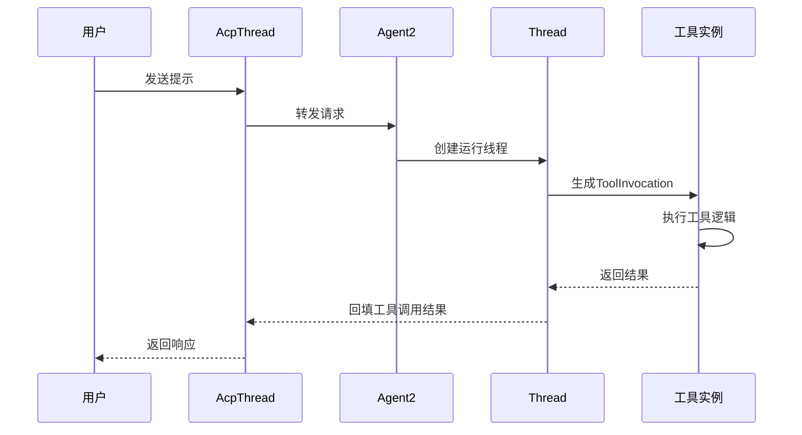
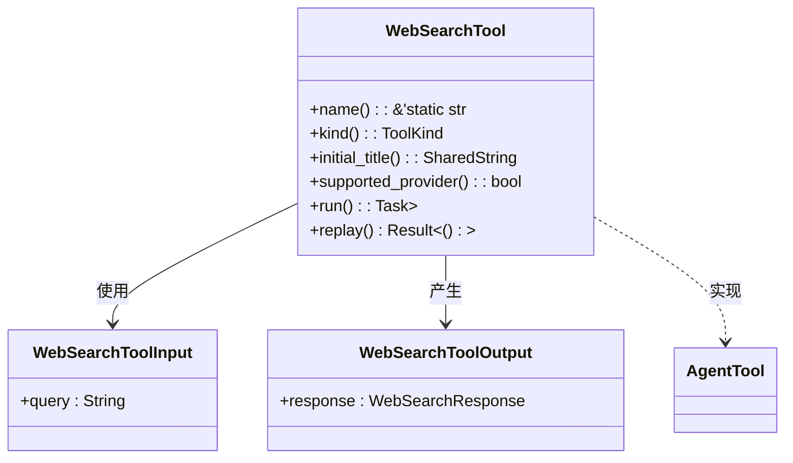
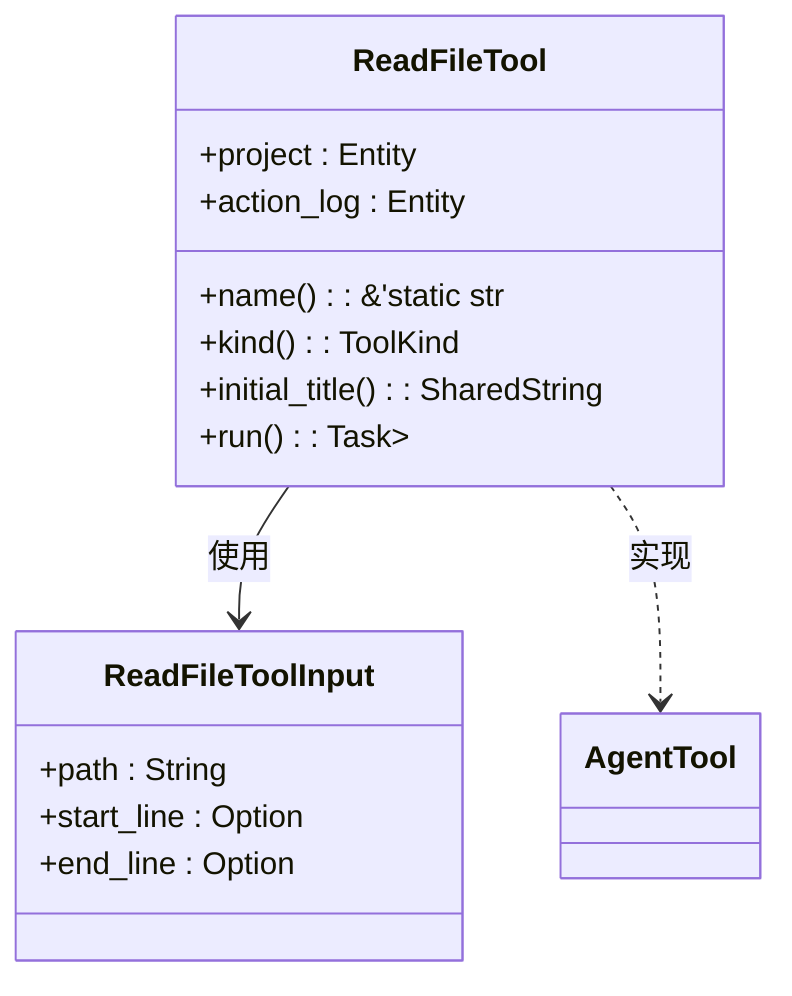
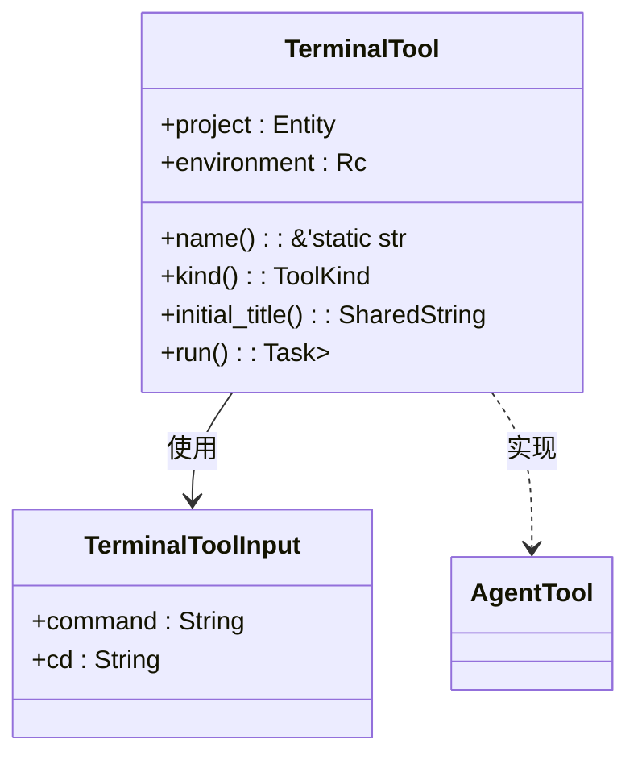
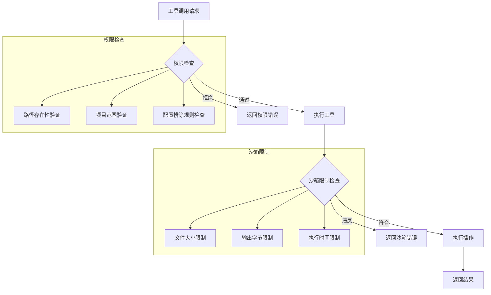
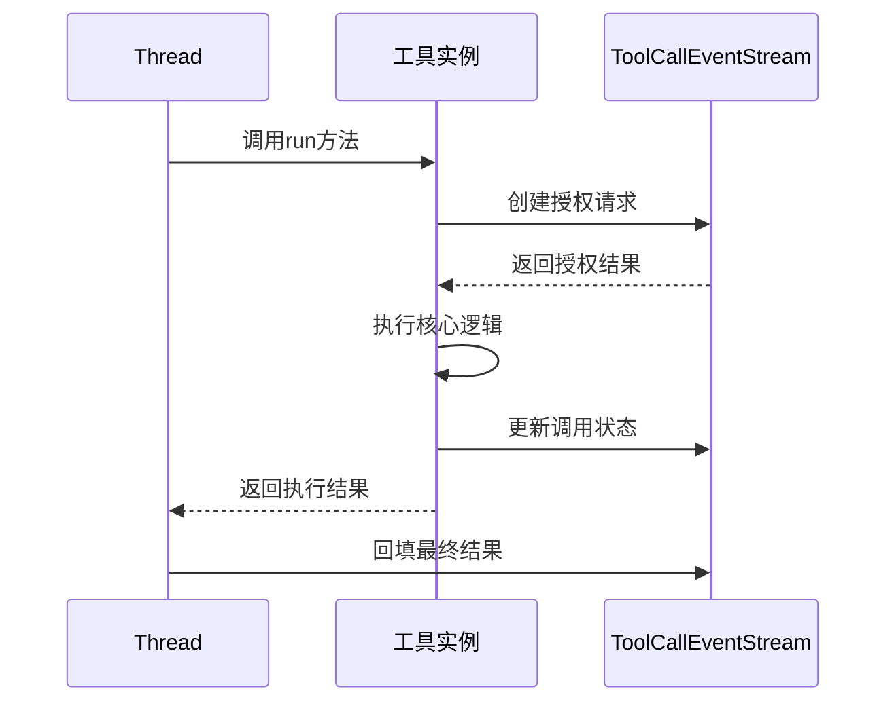
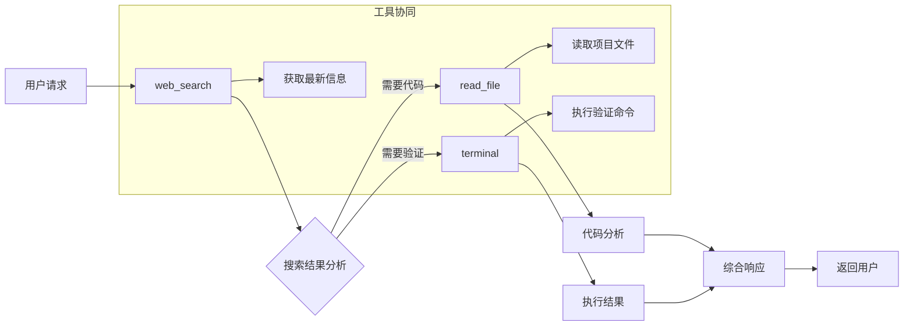
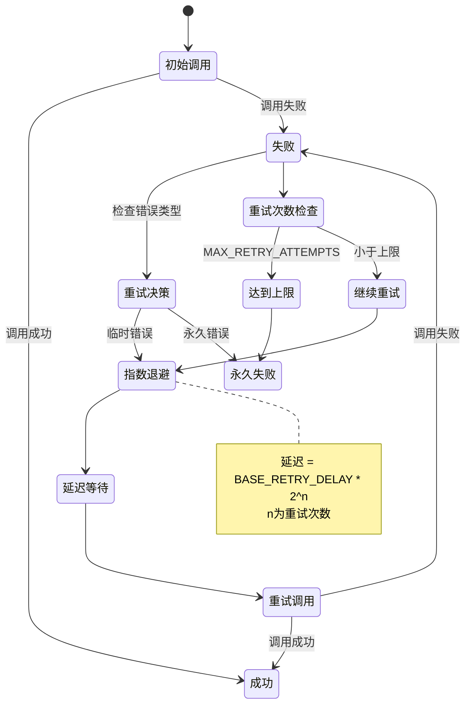

# 执行中的工具调用

<cite>
**本文档中引用的文件**  
- [agent.rs](file://crates/agent2/src/agent.rs)
- [thread.rs](file://crates/agent2/src/thread.rs)
- [tools.rs](file://crates/agent2/src/tools.rs)
- [web_search_tool.rs](file://crates/agent2/src/tools/web_search_tool.rs)
- [read_file_tool.rs](file://crates/agent2/src/tools/read_file_tool.rs)
- [terminal_tool.rs](file://crates/agent2/src/tools/terminal_tool.rs)
</cite>

## 目录
1. [引言](#引言)
2. [工具调用机制概述](#工具调用机制概述)
3. [核心工具实现分析](#核心工具实现分析)
4. [权限控制与沙箱限制](#权限控制与沙箱限制)
5. [调用链追踪与错误处理](#调用链追踪与错误处理)
6. [复杂提示示例](#复杂提示示例)
7. [重试策略](#重试策略)
8. [结论](#结论)

## 引言
本文档深入解析agent2系统中工具调用的执行机制，重点阐述web_search、terminal、read_file等核心工具如何在响应提示时被动态调用。文档详细说明了ToolInvocation请求的生成、执行和结果回填流程，描述了工具权限控制、沙箱限制和调用链追踪机制，并提供了包含多个工具协同工作的复杂提示示例，同时解释了错误传播和重试策略。

**Section sources**
- [agent.rs](file://crates/agent2/src/agent.rs#L0-L1558)

## 工具调用机制概述

**Diagram sources**
- [agent.rs](file://crates/agent2/src/agent.rs#L0-L1558)
- [thread.rs](file://crates/agent2/src/thread.rs#L0-L2659)

**Section sources**
- [agent.rs](file://crates/agent2/src/agent.rs#L0-L1558)
- [thread.rs](file://crates/agent2/src/thread.rs#L0-L2659)

## 核心工具实现分析

### Web搜索工具分析

**Diagram sources**
- [web_search_tool.rs](file://crates/agent2/src/tools/web_search_tool.rs#L0-L132)

**Section sources**
- [web_search_tool.rs](file://crates/agent2/src/tools/web_search_tool.rs#L0-L132)

### 文件读取工具分析

**Diagram sources**
- [read_file_tool.rs](file://crates/agent2/src/tools/read_file_tool.rs#L0-L969)

**Section sources**
- [read_file_tool.rs](file://crates/agent2/src/tools/read_file_tool.rs#L0-L969)

### 终端工具分析

**Diagram sources**
- [terminal_tool.rs](file://crates/agent2/src/tools/terminal_tool.rs#L0-L213)

**Section sources**
- [terminal_tool.rs](file://crates/agent2/src/tools/terminal_tool.rs#L0-L213)

## 权限控制与沙箱限制

**Diagram sources**
- [read_file_tool.rs](file://crates/agent2/src/tools/read_file_tool.rs#L0-L969)
- [terminal_tool.rs](file://crates/agent2/src/tools/terminal_tool.rs#L0-L213)

**Section sources**
- [read_file_tool.rs](file://crates/agent2/src/tools/read_file_tool.rs#L0-L969)
- [terminal_tool.rs](file://crates/agent2/src/tools/terminal_tool.rs#L0-L213)

## 调用链追踪与错误处理

**Diagram sources**
- [thread.rs](file://crates/agent2/src/thread.rs#L0-L2659)
- [tools.rs](file://crates/agent2/src/tools.rs#L0-L60)

**Section sources**
- [thread.rs](file://crates/agent2/src/thread.rs#L0-L2659)
- [tools.rs](file://crates/agent2/src/tools.rs#L0-L60)

## 复杂提示示例

**Diagram sources**
- [web_search_tool.rs](file://crates/agent2/src/tools/web_search_tool.rs#L0-L132)
- [read_file_tool.rs](file://crates/agent2/src/tools/read_file_tool.rs#L0-L969)
- [terminal_tool.rs](file://crates/agent2/src/tools/terminal_tool.rs#L0-L213)

**Section sources**
- [web_search_tool.rs](file://crates/agent2/src/tools/web_search_tool.rs#L0-L132)
- [read_file_tool.rs](file://crates/agent2/src/tools/read_file_tool.rs#L0-L969)
- [terminal_tool.rs](file://crates/agent2/src/tools/terminal_tool.rs#L0-L213)

## 重试策略

**Diagram sources**
- [thread.rs](file://crates/agent2/src/thread.rs#L0-L2659)

**Section sources**
- [thread.rs](file://crates/agent2/src/thread.rs#L0-L2659)

## 结论
本文档全面解析了agent2系统中工具调用的完整生命周期，从请求生成到结果回填的各个阶段。通过分析web_search、read_file和terminal等核心工具的实现，揭示了系统在权限控制、沙箱限制和调用链追踪方面的设计考量。文档还展示了多个工具协同工作的复杂场景，并解释了系统的错误传播和重试策略，为理解和优化工具调用机制提供了全面的技术参考。