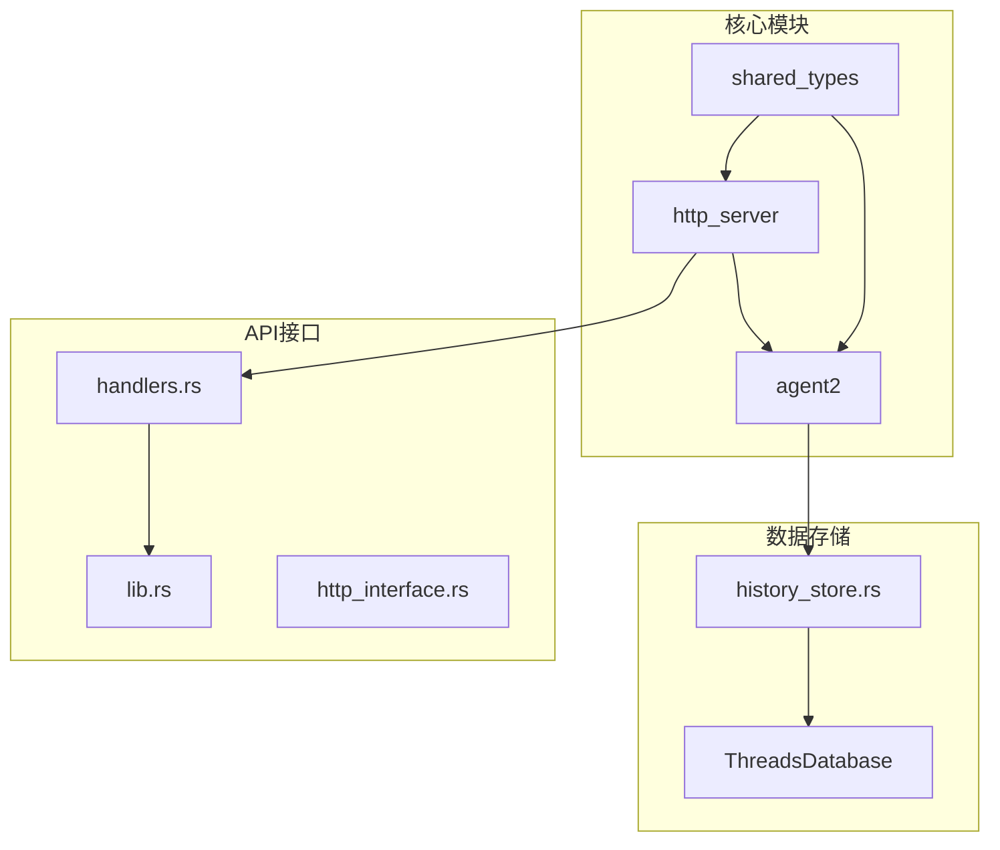
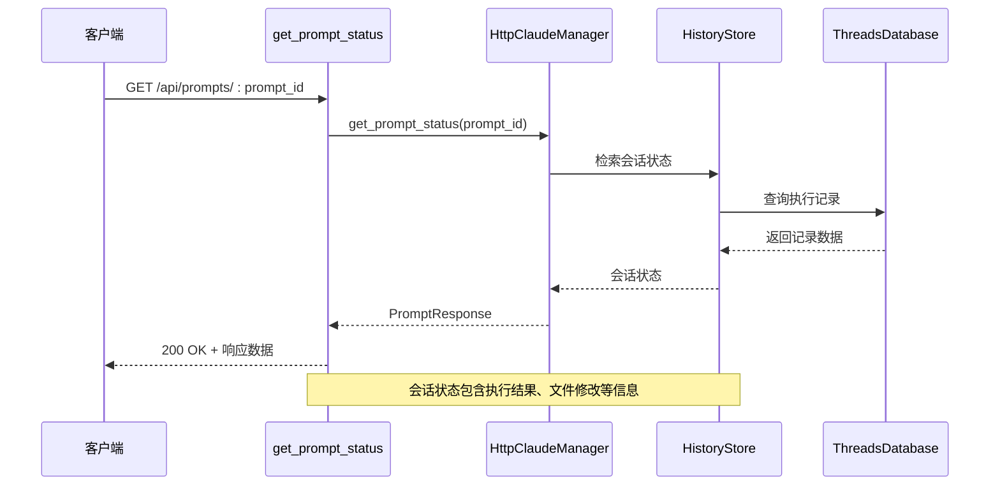
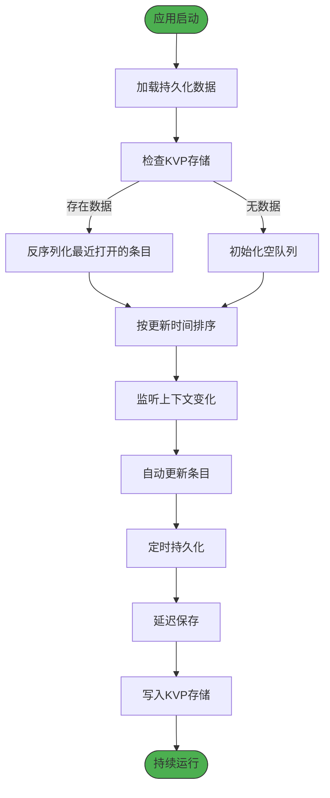
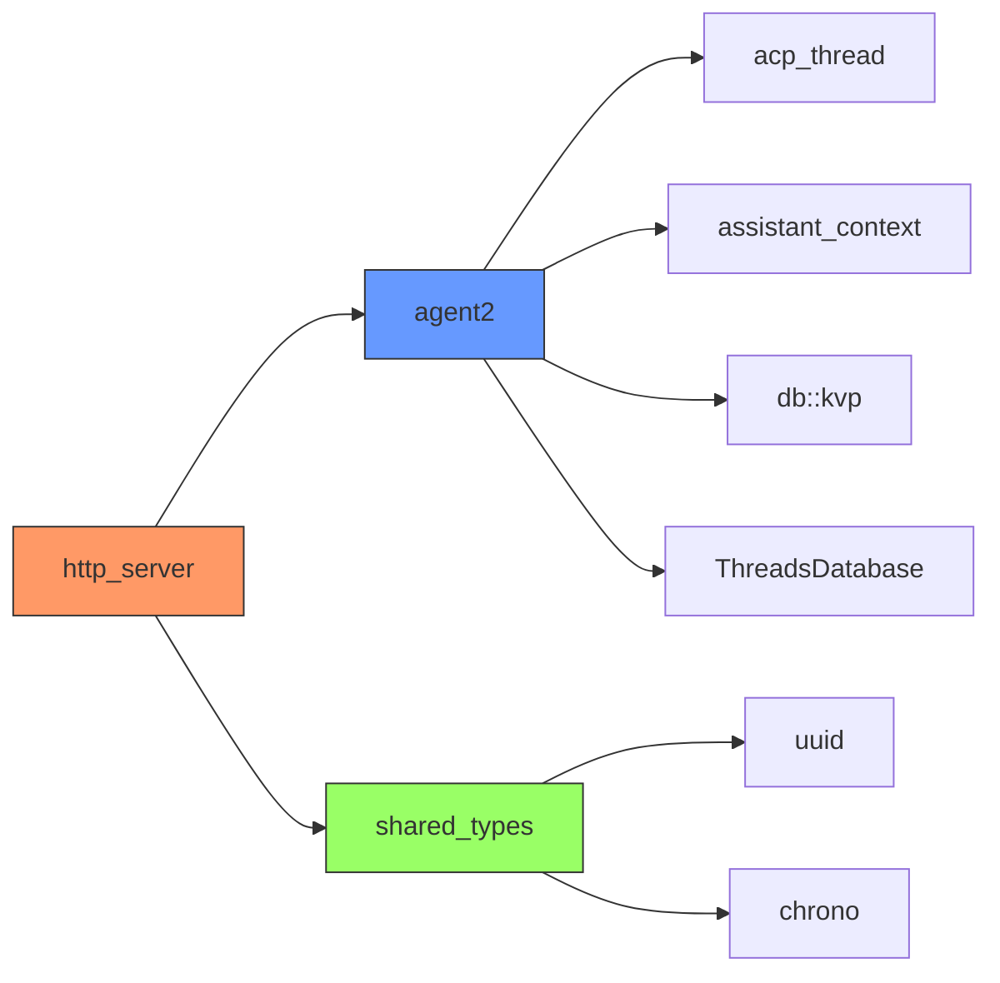

# 执行历史查询

<cite>
**本文档引用的文件**   
- [history_store.rs](file://crates/agent2/src/history_store.rs)
- [handlers.rs](file://crates/http_server/src/handlers.rs)
- [lib.rs](file://crates/http_server/src/lib.rs)
- [http_interface.rs](file://crates/http_server/src/http_interface.rs)
</cite>

## 目录
1. [简介](#简介)
2. [项目结构](#项目结构)
3. [核心组件](#核心组件)
4. [架构概述](#架构概述)
5. [详细组件分析](#详细组件分析)
6. [依赖分析](#依赖分析)
7. [性能考虑](#性能考虑)
8. [故障排除指南](#故障排除指南)
9. [结论](#结论)

## 简介
本文档详细说明了系统中执行历史查询功能的设计与实现，重点介绍 `GET /prompts` 端点的列表查询能力。文档涵盖分页参数、过滤条件、排序行为、数据持久化机制以及典型使用场景。通过分析 `history_store.rs` 模块和相关 HTTP 处理逻辑，全面展示系统如何支持高效的历史记录检索。

## 项目结构
本项目采用模块化设计，主要功能分布在多个 crate 中。执行历史相关功能主要集中在 `agent2` 和 `http_server` 两个模块中。`agent2` 负责执行记录的存储与管理，而 `http_server` 提供外部访问接口。



**Diagram sources**
- [history_store.rs](file://crates/agent2/src/history_store.rs#L1-L358)
- [handlers.rs](file://crates/http_server/src/handlers.rs#L1-L260)
- [lib.rs](file://crates/http_server/src/lib.rs#L1-L48)

**Section sources**
- [history_store.rs](file://crates/agent2/src/history_store.rs#L1-L358)
- [handlers.rs](file://crates/http_server/src/handlers.rs#L1-L260)

## 核心组件
系统的核心组件包括历史记录存储模块（`HistoryStore`）和 HTTP 接口处理模块。`HistoryStore` 负责管理执行历史记录的持久化和检索，而 HTTP 接口模块提供 RESTful API 供外部系统查询历史记录。

**Section sources**
- [history_store.rs](file://crates/agent2/src/history_store.rs#L80-L123)
- [handlers.rs](file://crates/http_server/src/handlers.rs#L219-L225)

## 架构概述
系统采用分层架构设计，从上到下分为接口层、业务逻辑层和数据存储层。接口层通过 `http_server` 暴露 REST API，业务逻辑层由 `agent2` 实现核心功能，数据存储层使用 `ThreadsDatabase` 持久化数据。

```mermaid
graph TD
A[客户端] --> B[/api/prompts/:prompt_id\GET]
B --> C[get_prompt_status]
C --> D[HttpClaudeManager]
D --> E[get_prompt_status]
E --> F[HistoryStore]
F --> G[ThreadsDatabase]
G --> H[(持久化存储)]
style A fill:#f9f,stroke:#333
style H fill:#bbf,stroke:#333
```

**Diagram sources**
- [lib.rs](file://crates/http_server/src/lib.rs#L43)
- [handlers.rs](file://crates/http_server/src/handlers.rs#L219)
- [http_interface.rs](file://crates/http_server/src/http_interface.rs#L212)

## 详细组件分析

### 历史记录存储分析
`HistoryStore` 是执行历史记录的核心管理组件，负责维护和检索执行会话的历史数据。

```mermaid
classDiagram
class HistoryStore {
+threads : Vec~DbThreadMetadata~
+entries : Vec~HistoryEntry~
+recently_opened_entries : VecDeque~HistoryEntryId~
+new(context_store, cx) : Self
+reload(cx) : void
+update_entries(cx) : void
+entries() : Iterator~HistoryEntry~
+push_recently_opened_entry(entry, cx) : void
}
class HistoryEntry {
+updated_at() : DateTime~Utc~
+id() : HistoryEntryId
+title() : &SharedString
}
class HistoryEntryId {
<<enumeration>>
AcpThread
TextThread
}
class DbThreadMetadata {
+id : SessionId
+title : String
+updated_at : DateTime~Utc~
}
HistoryStore --> HistoryEntry : 包含
HistoryEntry --> HistoryEntryId : 标识
HistoryStore --> DbThreadMetadata : 管理
HistoryStore --> "VecDeque" : 最近打开
```

**Diagram sources**
- [history_store.rs](file://crates/agent2/src/history_store.rs#L80-L123)
- [history_store.rs](file://crates/agent2/src/history_store.rs#L21-L25)

### API查询流程分析
`GET /prompts/:prompt_id` 端点的处理流程展示了从HTTP请求到数据检索的完整调用链。



**Diagram sources**
- [handlers.rs](file://crates/http_server/src/handlers.rs#L219-L225)
- [http_interface.rs](file://crates/http_server/src/http_interface.rs#L212-L215)

### 数据持久化机制
系统通过多层机制实现执行历史的持久化存储和高效检索。



**Diagram sources**
- [history_store.rs](file://crates/agent2/src/history_store.rs#L125-L150)
- [history_store.rs](file://crates/agent2/src/history_store.rs#L200-L230)

## 依赖分析
系统各组件之间存在明确的依赖关系，确保功能的解耦和可维护性。



**Diagram sources**
- [Cargo.toml](file://crates/http_server/Cargo.toml)
- [Cargo.toml](file://crates/agent2/Cargo.toml)

**Section sources**
- [lib.rs](file://crates/http_server/src/lib.rs#L10-L15)
- [history_store.rs](file://crates/agent2/src/history_store.rs#L1-L10)

## 性能考虑
系统在设计执行历史查询功能时，考虑了多项性能优化措施：

1. **数据缓存**：`HistoryStore` 在内存中维护历史记录的缓存，避免频繁的数据库查询。
2. **延迟保存**：对最近打开的条目采用延迟保存策略，减少磁盘I/O操作。
3. **批量加载**：一次性加载所有相关数据，减少数据库连接次数。
4. **索引优化**：在数据库层面为常用查询字段建立索引，提高检索效率。

## 故障排除指南
当执行历史查询功能出现问题时，可参考以下排查步骤：

**Section sources**
- [handlers.rs](file://crates/http_server/src/handlers.rs#L220-L225)
- [history_store.rs](file://crates/agent2/src/history_store.rs#L100-L120)

## 结论
本文档详细介绍了执行历史查询功能的实现机制。通过 `HistoryStore` 组件和 REST API 的协同工作，系统能够高效地存储和检索执行历史记录。该设计支持分页、过滤和排序等高级查询功能，适用于审计日志、用户操作追溯和性能分析等多种场景。系统的模块化设计和清晰的依赖关系确保了功能的可维护性和可扩展性。