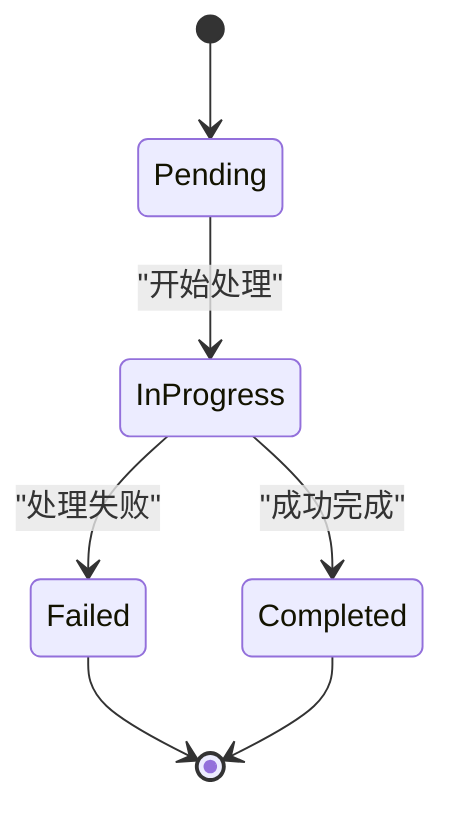
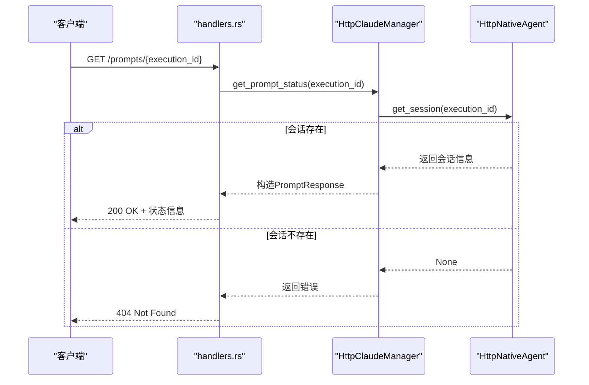

# 执行状态监控

<cite>
**本文档中引用的文件**  
- [lib.rs](file://crates/shared_types/src/lib.rs#L48-L54)
- [http_interface.rs](file://crates/http_server/src/http_interface.rs#L221-L236)
- [handlers.rs](file://crates/http_server/src/handlers.rs#L219-L232)
- [agent.rs](file://crates/agent2/src/agent.rs)
- [agent2.rs](file://crates/agent2/src/agent2.rs)
</cite>

## 目录
1. [简介](#简介)
2. [执行状态枚举与转换逻辑](#执行状态枚举与转换逻辑)
3. [状态轮询端点实现](#状态轮询端点实现)
4. [Agent 实例状态更新机制](#agent-实例状态更新机制)
5. [轮询策略与超时设置建议](#轮询策略与超时设置建议)
6. [前端集成模式](#前端集成模式)
7. [WebSocket 替代方案探讨](#websocket-替代方案探讨)
8. [结论](#结论)

## 简介
本文档详细说明了如何通过 `GET /prompts/{execution_id}` 端点轮询提示执行状态。文档涵盖 `ExecutionStatus` 枚举（在代码中为 `PromptStatus`）的不同状态值及其转换逻辑，解释 `agent2` 模块中 `Agent` 实例如何更新执行状态并通过 HTTP 响应暴露进度信息，并提供轮询策略、超时设置和前端集成的最佳实践建议。

## 执行状态枚举与转换逻辑
系统使用 `PromptStatus` 枚举来表示提示执行的生命周期状态。该枚举定义了四种核心状态，每种状态代表执行过程中的一个关键阶段。

**Diagram sources**
- [lib.rs](file://crates/shared_types/src/lib.rs#L48-L54)

### 状态值详解
- **Pending (待处理)**: 提示已接收并加入队列，但尚未开始处理。这是新创建提示的初始状态。
- **InProgress (处理中)**: 系统已开始处理提示，`Agent` 正在执行任务，可能正在进行文件修改、工具调用或生成响应。
- **Completed (已完成)**: 提示已成功处理完毕。所有任务均已完成，相关文件可能已被修改，最终响应已生成。
- **Failed (已失败)**: 提示处理过程中发生错误，导致执行中断。失败原因可能包括模型调用失败、文件系统错误或权限问题。

### 状态转换逻辑
状态转换遵循严格的单向流程，确保状态机的清晰和可预测性：
1.  **Pending → InProgress**: 当调度器或 `Agent` 开始处理一个待处理的提示时触发。
2.  **InProgress → Completed**: 当 `Agent` 成功完成所有任务并生成最终结果时触发。
3.  **InProgress → Failed**: 当处理过程中捕获到任何不可恢复的错误时触发。
4.  **Completed/Failure → Terminal**: 完成和失败是最终状态，不会发生进一步的转换。

此状态机设计保证了执行流程的原子性和一致性，避免了状态混乱。

**Section sources**
- [lib.rs](file://crates/shared_types/src/lib.rs#L48-L54)

## 状态轮询端点实现
系统通过 `GET /prompts/{execution_id}` HTTP 端点提供执行状态的轮询功能。该端点允许客户端通过执行 ID 查询当前的执行状态。

### 端点路由与处理
端点的实现分为两个主要部分：HTTP 路由处理和底层状态查询。

**Diagram sources**
- [handlers.rs](file://crates/http_server/src/handlers.rs#L219-L232)
- [http_interface.rs](file://crates/http_server/src/http_interface.rs#L221-L236)

### 核心函数分析
- **`get_prompt_status` (handlers.rs)**: 这是 HTTP 请求的入口点。它接收 `execution_id`（作为 `prompt_id`），调用 `HttpClaudeManager` 的对应方法，并将结果封装成 JSON 响应返回给客户端。
- **`get_prompt_status` (http_interface.rs)**: 此方法查询 `HttpNativeAgent` 以检查指定 `session_id` 的会话是否存在。如果存在，则返回一个状态为 `"active"` 的 `PromptResponse`；如果不存在，则返回错误。

**Section sources**
- [handlers.rs](file://crates/http_server/src/handlers.rs#L219-L232)
- [http_interface.rs](file://crates/http_server/src/http_interface.rs#L221-L236)

## Agent 实例状态更新机制
`agent2` 模块中的 `Agent` 实例负责执行提示并管理其内部状态。状态的更新是通过一系列内部事件和会话管理来实现的。

### Agent 与会话管理
`NativeAgent` 结构体是核心，它维护一个 `sessions` 映射，将 `session_id` 与 `Session` 结构体关联。每个 `Session` 包含一个指向 `Thread` 实体的引用，该实体代表了实际的执行线程。

当 `Agent` 处理一个提示时，它会：
1.  检查或创建一个会话。
2.  在 `Thread` 中执行提示处理逻辑。
3.  通过观察 `Thread` 发出的事件（如 `ThreadEvent::UserMessage`, `ThreadEvent::AgentText`）来跟踪执行进度。

### 状态暴露
`Agent` 本身不直接存储 `PromptStatus` 枚举。相反，其状态是通过会话的“存在性”和“活动性”来间接反映的：
- **Pending/InProgress**: 当会话存在时，表示执行正在进行中。`HttpClaudeManager` 将其统一报告为 `"active"` 状态。
- **Completed/Failed**: 当 `Thread` 完成其任务后，会话可能会被关闭或保留。`get_prompt_status` 端点目前仅通过会话是否存在来判断，因此无法区分 `Completed` 和 `Failed` 状态。更精细的状态报告需要在 `PromptResponse` 结构体中集成 `PromptStatus` 枚举。

**Section sources**
- [agent.rs](file://crates/agent2/src/agent.rs)
- [agent2.rs](file://crates/agent2/src/agent2.rs)

## 轮询策略与超时设置建议
为了有效监控执行状态，客户端应采用合理的轮询策略。

### 轮询策略
- **指数退避**: 初始轮询间隔可以较短（例如 500ms），如果状态未改变，则将间隔时间按指数增长（如 1s, 2s, 4s, 8s...），直到达到最大间隔（如 30s）。这可以减少对服务器的无效请求。
- **最大轮询次数/时间**: 客户端应设置一个最大轮询次数或总超时时间（例如 5 分钟）。如果在此时间内状态仍未变为 `Completed` 或 `Failed`，应停止轮询并提示用户操作超时。

### 超时设置
- **HTTP 超时**: 客户端发起的每个 `GET` 请求都应设置合理的超时（如 10 秒），以防止因网络问题导致请求无限挂起。
- **服务端超时**: 服务端应在 `Agent` 执行逻辑中实现超时机制，防止某个提示无限期运行。这通常在 `Thread` 或底层模型调用中配置。

## 前端集成模式
前端应用可以通过以下模式集成状态轮询功能：

1.  **启动执行**: 用户提交提示后，前端调用 `POST /prompts` 创建执行。
2.  **获取执行ID**: 从 `POST` 响应中提取 `session_id` 或 `execution_id`。
3.  **启动轮询**: 使用上一步获取的 ID，启动一个轮询循环，定期调用 `GET /prompts/{execution_id}`。
4.  **更新UI**: 根据返回的 `status` 字段更新用户界面，例如显示“处理中...”、“已完成”或“执行失败”。
5.  **处理完成**: 当状态变为 `Completed` 或 `Failed` 时，停止轮询，并根据响应内容（如 `files_modified`, `response`）展示结果或错误信息。

## WebSocket 替代方案探讨
当前的轮询机制虽然简单，但存在资源浪费和延迟的缺点。WebSocket 提供了一种更高效的替代方案。

### 优势
- **实时性**: 服务器可以在状态改变的瞬间主动推送更新，无需客户端轮询。
- **低延迟**: 消除了轮询间隔带来的延迟。
- **低开销**: 避免了大量无用的 HTTP 请求，显著降低了网络和服务器负载。

### 实现思路
1.  **建立连接**: 客户端在提交提示后，建立一个到服务器的 WebSocket 连接，并传递 `execution_id`。
2.  **事件监听**: 服务器端的 `Agent` 在状态改变时（如从 `Pending` 变为 `InProgress`），触发一个事件。
3.  **主动推送**: 服务器监听这些事件，并通过 WebSocket 连接将新的状态信息推送给客户端。
4.  **连接管理**: 在执行完成后，服务器可以主动关闭 WebSocket 连接。

采用 WebSocket 方案可以极大地提升用户体验，尤其是在处理长时间运行的任务时。

## 结论
本文档详细阐述了基于 `GET /prompts/{execution_id}` 端点的执行状态监控机制。系统通过 `PromptStatus` 枚举定义了清晰的状态生命周期，并通过 `agent2` 模块中的 `Agent` 实例进行管理。当前的轮询实现提供了基本的监控能力，但建议采用指数退避等策略以优化性能。长远来看，引入 WebSocket 作为主动推送的替代方案，将是提升系统实时性和效率的关键方向。