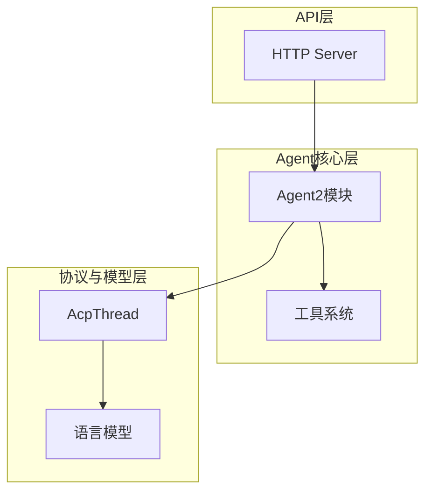
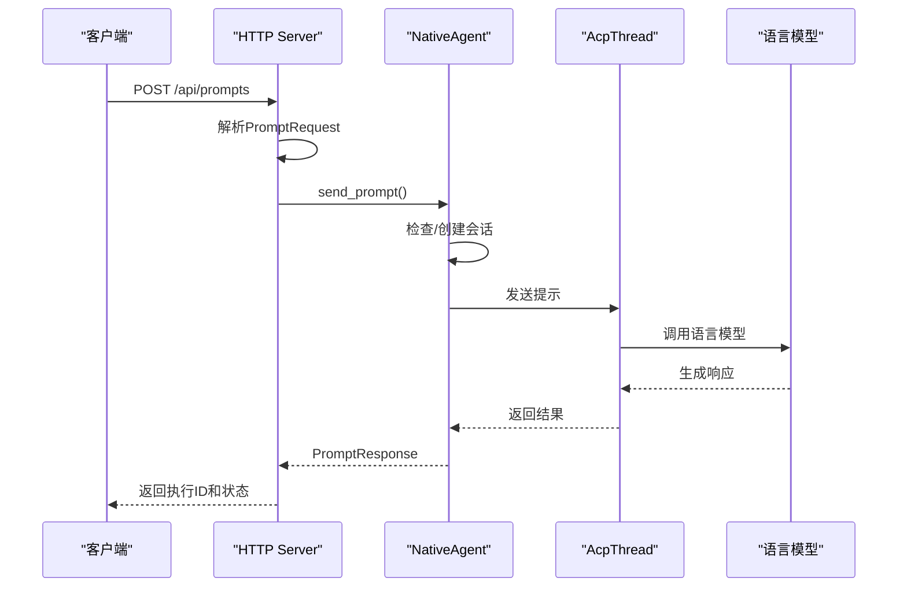
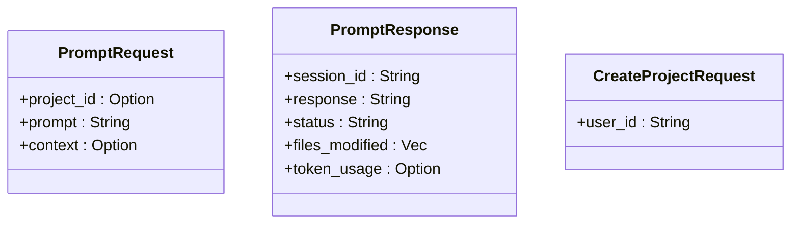
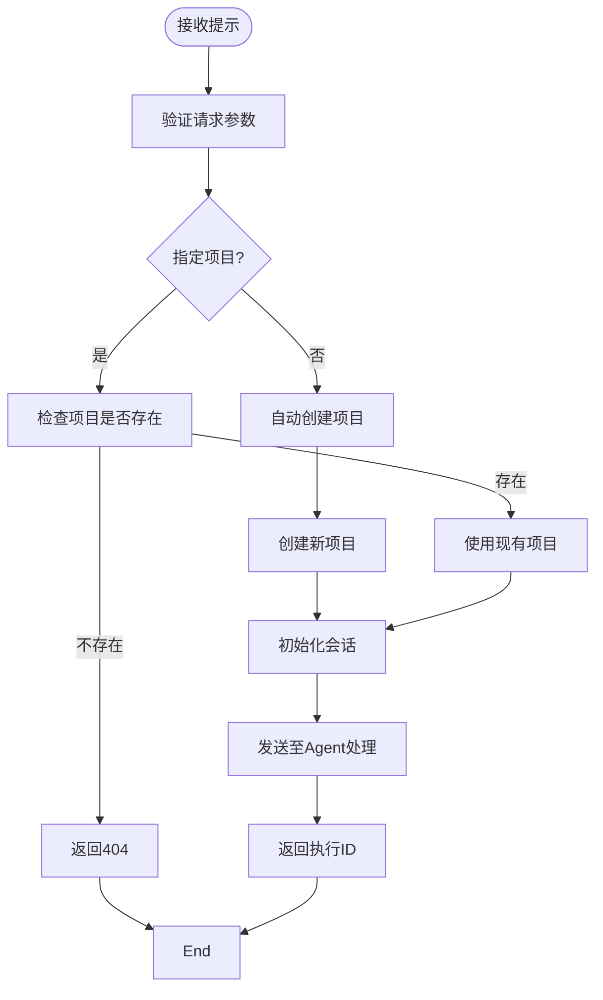
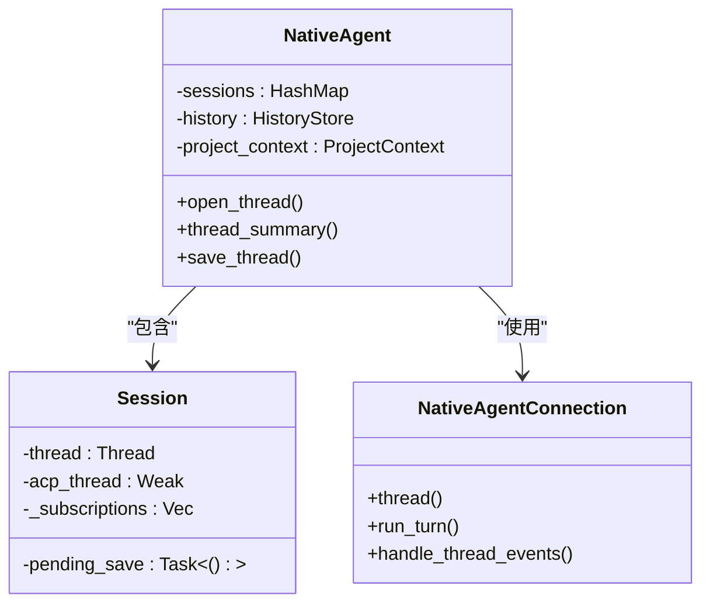
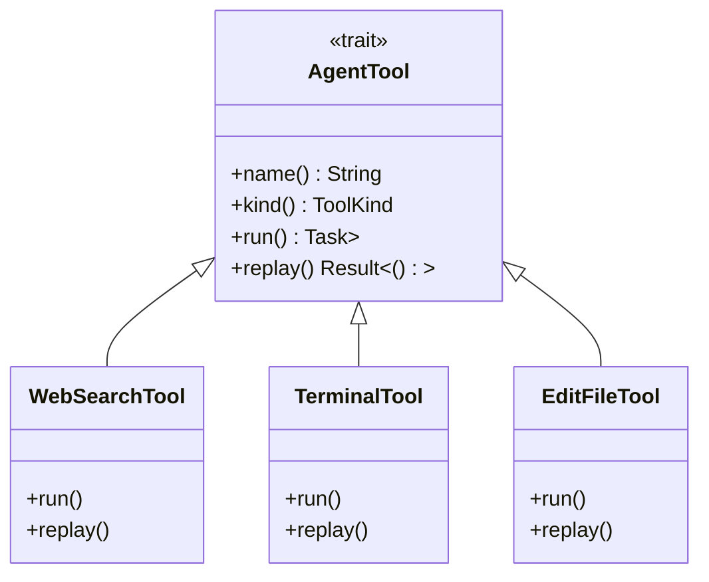
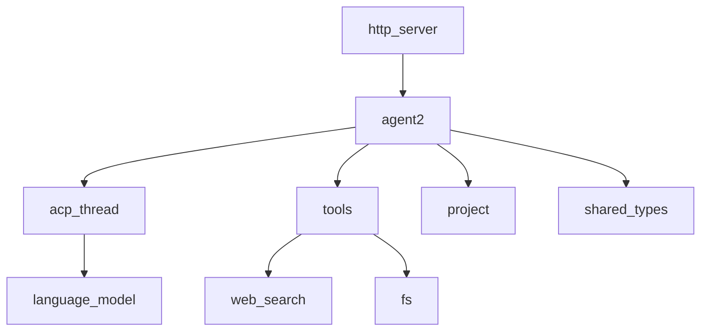

# 提示执行API

<cite>
**本文档中引用的文件**  
- [lib.rs](file://crates/http_server/src/lib.rs)
- [handlers.rs](file://crates/http_server/src/handlers.rs)
- [http_interface.rs](file://crates/http_server/src/http_interface.rs)
- [agent.rs](file://crates/agent2/src/agent.rs)
- [agent2.rs](file://crates/agent2/src/agent2.rs)
- [tools.rs](file://crates/agent2/src/tools.rs)
- [web_search_tool.rs](file://crates/agent2/src/tools/web_search_tool.rs)
</cite>

## 目录
1. [简介](#简介)
2. [项目结构](#项目结构)
3. [核心组件](#核心组件)
4. [架构概述](#架构概述)
5. [详细组件分析](#详细组件分析)
6. [依赖分析](#依赖分析)
7. [性能考虑](#性能考虑)
8. [故障排除指南](#故障排除指南)
9. [结论](#结论)

## 简介
本文档旨在为AI提示提交和执行功能提供完整的API文档。重点描述`POST /prompts`端点的使用方法，包括`PromptRequest`结构的定义、上下文信息的传递方式以及请求如何触发`agent2`模块中的Agent实例处理流程。文档还涵盖执行ID生成、状态轮询机制、工具调用（如web_search、terminal）的角色、复杂提示示例、执行超时处理、错误恢复机制以及执行历史查询功能。

## 项目结构
本项目采用Rust语言开发，基于模块化架构设计，主要包含`http_server`、`agent2`、`acp_thread`等核心模块。`http_server`负责提供RESTful API接口，`agent2`模块实现核心Agent逻辑，`acp_thread`处理与AI模型的协议通信。整体结构清晰，职责分离明确。

**图示来源**  
- [lib.rs](file://crates/http_server/src/lib.rs#L1-L65)
- [agent2.rs](file://crates/agent2/src/agent2.rs#L1-L20)

**本节来源**  
- [lib.rs](file://crates/http_server/src/lib.rs#L1-L65)
- [agent2.rs](file://crates/agent2/src/agent2.rs#L1-L20)

## 核心组件
核心功能由`http_server`的路由处理、`agent2`的Agent实例以及工具系统共同实现。`POST /prompts`请求由`send_prompt`函数处理，该函数负责项目管理、会话创建和提示分发。`NativeAgent`类管理所有会话生命周期，`WebSearchTool`等工具提供扩展能力。

**本节来源**  
- [handlers.rs](file://crates/http_server/src/handlers.rs#L200-L259)
- [agent.rs](file://crates/agent2/src/agent.rs#L1-L799)
- [web_search_tool.rs](file://crates/agent2/src/tools/web_search_tool.rs#L1-L133)

## 架构概述
系统采用分层架构，前端通过HTTP API与`http_server`交互，`http_server`将请求转发给`agent2`模块。`agent2`创建或复用会话，通过`AcpThread`与底层语言模型通信，并利用各种工具执行具体操作。

**图示来源**  
- [lib.rs](file://crates/http_server/src/lib.rs#L1-L65)
- [handlers.rs](file://crates/http_server/src/handlers.rs#L200-L259)
- [agent.rs](file://crates/agent2/src/agent.rs#L1-L799)

## 详细组件分析

### API端点分析
`POST /api/prompts`端点是系统的主要入口，接收`PromptRequest`对象并返回`PromptResponse`。

#### 请求结构

**图示来源**  
- [http_interface.rs](file://crates/http_server/src/http_interface.rs#L100-L130)

#### 处理流程

**图示来源**  
- [handlers.rs](file://crates/http_server/src/handlers.rs#L200-L259)
- [http_interface.rs](file://crates/http_server/src/http_interface.rs#L50-L99)

**本节来源**  
- [handlers.rs](file://crates/http_server/src/handlers.rs#L200-L259)
- [http_interface.rs](file://crates/http_server/src/http_interface.rs#L50-L130)

### Agent处理流程分析
`NativeAgent`类负责管理所有Agent会话的生命周期。

#### 会话管理

**图示来源**  
- [agent.rs](file://crates/agent2/src/agent.rs#L1-L799)

#### 工具系统分析
系统内置多种工具，支持复杂的AI代理行为。

**图示来源**  
- [tools.rs](file://crates/agent2/src/tools.rs#L1-L61)
- [web_search_tool.rs](file://crates/agent2/src/tools/web_search_tool.rs#L1-L133)

**本节来源**  
- [agent.rs](file://crates/agent2/src/agent.rs#L1-L799)
- [tools.rs](file://crates/agent2/src/tools.rs#L1-L61)
- [web_search_tool.rs](file://crates/agent2/src/tools/web_search_tool.rs#L1-L133)

## 依赖分析
系统各模块之间存在清晰的依赖关系，确保了高内聚低耦合的设计原则。

**图示来源**  
- [Cargo.toml](file://crates/http_server/Cargo.toml)
- [Cargo.toml](file://crates/agent2/Cargo.toml)

**本节来源**  
- [Cargo.toml](file://crates/http_server/Cargo.toml)
- [Cargo.toml](file://crates/agent2/Cargo.toml)

## 性能考虑
系统在设计时考虑了性能优化，包括会话复用、异步处理和资源管理。`NativeAgent`通过会话映射避免重复创建，所有I/O操作均采用异步模式，确保高并发下的响应性能。工具调用采用后台任务执行，避免阻塞主线程。

## 故障排除指南
当API调用出现问题时，可参考以下常见问题及解决方案：

**本节来源**  
- [handlers.rs](file://crates/http_server/src/handlers.rs#L200-L259)
- [agent.rs](file://crates/agent2/src/agent.rs#L1-L799)

## 结论
本文档详细介绍了提示执行API的设计与实现，涵盖了从API端点到内部Agent处理的完整流程。系统通过清晰的分层架构和模块化设计，实现了高效、可靠的AI提示处理能力。开发者可基于此文档快速理解系统工作原理并进行二次开发。