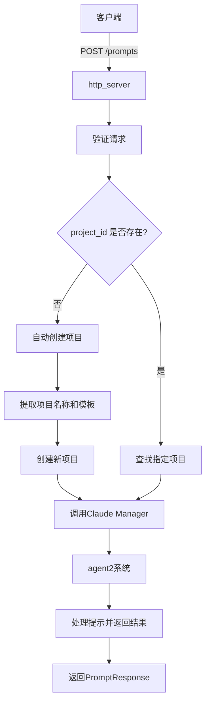
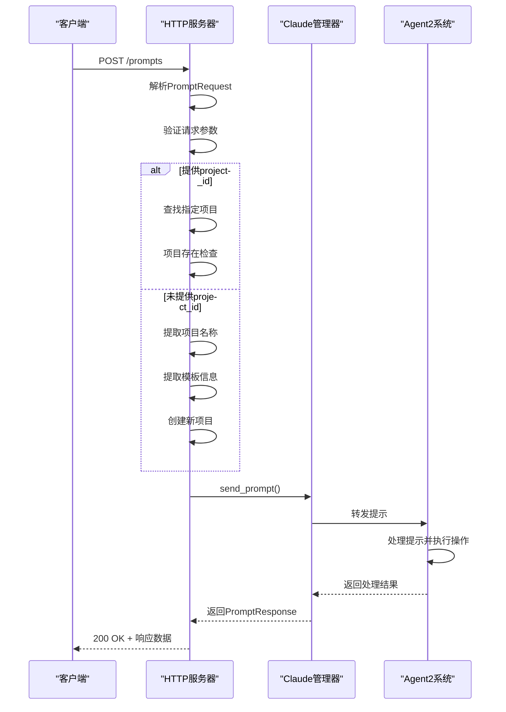
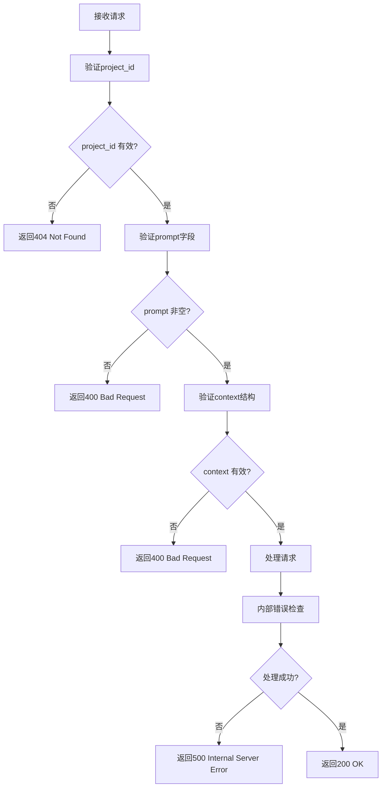

# 提示提交

<cite>
**本文档中引用的文件**  
- [lib.rs](file://crates/shared_types/src/lib.rs)
- [handlers.rs](file://crates/http_server/src/handlers.rs)
- [agent.rs](file://crates/agent2/src/agent.rs)
- [thread.rs](file://crates/agent2/src/thread.rs)
- [http_interface.rs](file://crates/http_server/src/http_interface.rs)
</cite>

## 目录
1. [简介](#简介)
2. [请求结构](#请求结构)
3. [字段说明](#字段说明)
4. [处理流程](#处理流程)
5. [API调用示例](#api调用示例)
6. [错误处理](#错误处理)
7. [验证规则](#验证规则)
8. [结论](#结论)

## 简介
本文档详细描述了提示提交功能的API设计，重点介绍`POST /prompts`端点的请求结构和处理流程。该功能允许用户向系统提交自然语言提示，系统将根据提示内容自动创建或关联项目，并通过agent2系统进行处理。文档涵盖了请求数据结构、字段行为、处理逻辑、调用示例以及错误处理机制。

## 请求结构
提示提交API通过`POST /prompts`端点接收请求，请求体包含`PromptRequest`数据结构，该结构定义了提示的核心信息和上下文。



**Diagram sources**
- [handlers.rs](file://crates/http_server/src/handlers.rs#L200-L250)

**Section sources**
- [handlers.rs](file://crates/http_server/src/handlers.rs#L200-L250)
- [lib.rs](file://crates/shared_types/src/lib.rs#L23-L29)

## 字段说明
`PromptRequest`数据结构包含四个核心字段，每个字段都有特定的用途和行为模式。

### project_id
**用途**: 指定提示要关联的项目ID  
**行为**: 当提供有效的UUID时，系统将查找并使用指定的项目进行处理。如果项目不存在，API将返回404错误。此字段为可选，允许系统根据提示内容自动创建项目。

### prompt
**用途**: 包含用户提交的自然语言提示文本  
**行为**: 这是必填字段，包含用户希望系统执行的具体指令或问题。系统将此文本传递给语言模型进行处理。提示内容将用于提取项目名称和模板信息，特别是在自动创建项目时。

### context
**用途**: 提供与提示相关的上下文信息  
**行为**: 可选字段，包含文件路径列表、当前文件和选中文本等信息。这些上下文数据帮助系统更好地理解提示的背景，从而提供更准确的响应。上下文信息将被整合到语言模型的输入中。

### auto_create
**用途**: 控制是否允许自动创建项目  
**行为**: 布尔值字段，当`project_id`未提供时决定是否自动创建项目。如果设置为`false`且未提供`project_id`，系统将返回错误。此字段为可选，默认行为由系统配置决定。

**Section sources**
- [lib.rs](file://crates/shared_types/src/lib.rs#L23-L29)
- [http_interface.rs](file://crates/http_server/src/http_interface.rs#L156-L161)

## 处理流程
提示提交的处理流程涉及多个组件的协同工作，从HTTP请求接收开始，到最终结果返回结束。



**Diagram sources**
- [handlers.rs](file://crates/http_server/src/handlers.rs#L200-L250)
- [agent.rs](file://crates/agent2/src/agent.rs#L1-L50)

**Section sources**
- [handlers.rs](file://crates/http_server/src/handlers.rs#L200-L250)
- [agent.rs](file://crates/agent2/src/agent.rs#L1-L50)
- [thread.rs](file://crates/agent2/src/thread.rs#L1-L50)

## API调用示例
以下示例展示了如何使用curl命令和Rust客户端调用提示提交API。

### 正常提交示例
```bash
curl -X POST http://localhost:8080/prompts \
  -H "Content-Type: application/json" \
  -d '{
    "project_id": "a1b2c3d4-e5f6-7890-g1h2-i3j4k5l6m7n8",
    "prompt": "请创建一个用户认证API，包含注册、登录和用户信息管理功能",
    "context": {
      "files": ["/src/auth.rs", "/src/models/user.rs"],
      "current_file": "/src/auth.rs",
      "selected_text": "struct User { id: String, email: String }"
    },
    "auto_create": true
  }'
```

### 自动创建项目示例
```bash
curl -X POST http://localhost:8080/prompts \
  -H "Content-Type: application/json" \
  -d '{
    "prompt": "创建一个名为'blog-api'的Rust Web API项目，包含文章管理功能",
    "auto_create": true
  }'
```

### Rust客户端调用
```rust
let request = PromptRequest {
    project_id: Some(Uuid::parse_str("a1b2c3d4-e5f6-7890-g1h2-i3j4k5l6m7n8").unwrap()),
    prompt: "优化这段代码的性能".to_string(),
    context: Some(PromptContext {
        files: vec!["/src/performance.rs".into()],
        current_file: Some("/src/performance.rs".into()),
        selected_text: Some("fn slow_function() { /* 大量计算 */ }".to_string()),
    }),
    auto_create: Some(true),
};

let response = client.post("/prompts")
    .json(&request)
    .send()
    .await?;
```

**Section sources**
- [handlers.rs](file://crates/http_server/src/handlers.rs#L200-L250)
- [lib.rs](file://crates/shared_types/src/lib.rs#L23-L29)

## 错误处理
系统实现了全面的错误处理机制，确保客户端能够获得清晰的错误信息。



当请求包含无效的`project_id`时，系统返回404状态码。如果必填的`prompt`字段缺失或为空，返回400状态码。在处理过程中发生内部错误时，返回500状态码。所有错误响应都包含详细的错误信息，帮助客户端诊断问题。

**Diagram sources**
- [handlers.rs](file://crates/http_server/src/handlers.rs#L200-L250)

**Section sources**
- [handlers.rs](file://crates/http_server/src/handlers.rs#L200-L250)
- [lib.rs](file://crates/shared_types/src/lib.rs#L23-L29)

## 验证规则
系统对提示提交请求实施了严格的验证规则，确保数据的完整性和一致性。

| 字段 | 是否必需 | 类型 | 约束条件 | 默认值 |
|------|----------|------|----------|--------|
| project_id | 可选 | UUID | 必须是有效的UUID格式 | 无 |
| prompt | 必需 | 字符串 | 长度必须大于0 | 无 |
| context | 可选 | 对象 | 结构必须符合PromptContext定义 | 无 |
| auto_create | 可选 | 布尔值 | true或false | 由系统决定 |

项目关联机制通过`project_id`字段实现精确匹配，当该字段未提供时，系统通过`auto_create`字段和提示内容中的关键词自动创建项目。项目名称提取算法会识别"创建一个名为X的项目"或"make a X project"等模式，确保自动创建的项目具有有意义的名称。

**Section sources**
- [handlers.rs](file://crates/http_server/src/handlers.rs#L200-L250)
- [lib.rs](file://crates/shared_types/src/lib.rs#L23-L29)

## 结论
提示提交功能提供了一个强大而灵活的接口，使用户能够通过自然语言与系统交互。通过精心设计的`PromptRequest`结构和清晰的处理流程，系统能够有效地处理各种提示场景，无论是关联现有项目还是自动创建新项目。API的错误处理和验证机制确保了系统的健壮性，而丰富的调用示例则降低了客户端集成的难度。这一功能为用户提供了直观的方式来启动和指导开发任务，显著提升了开发效率。