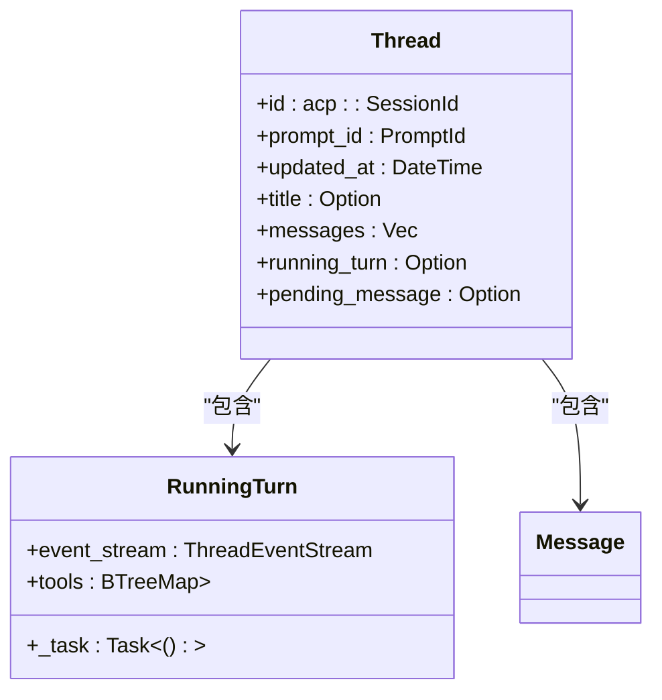
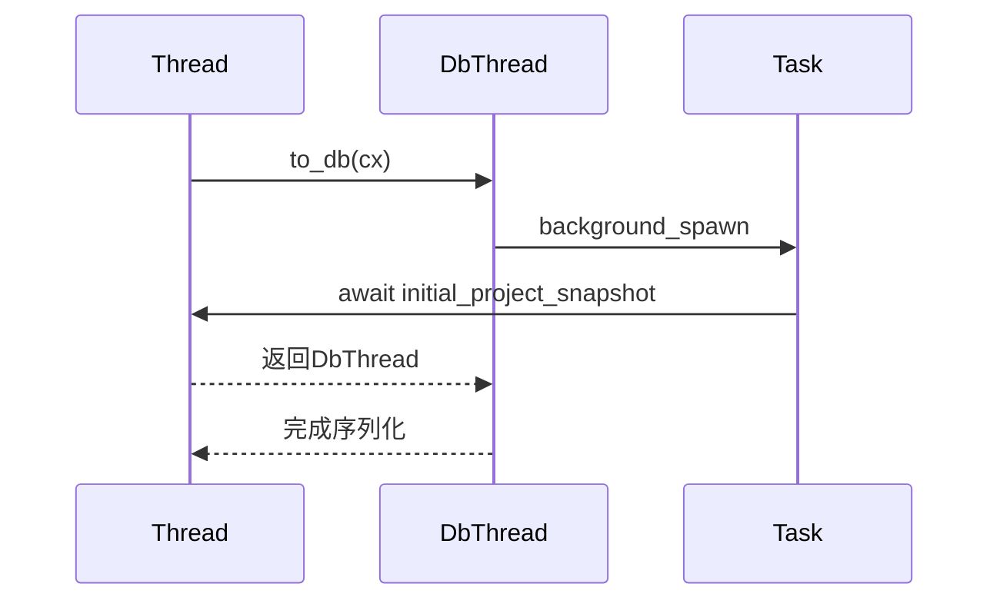
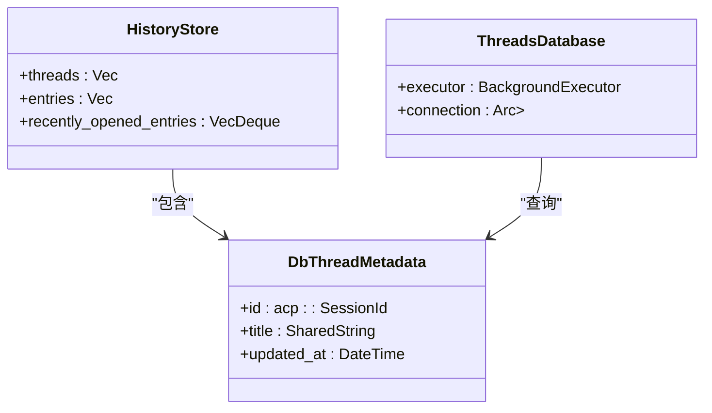
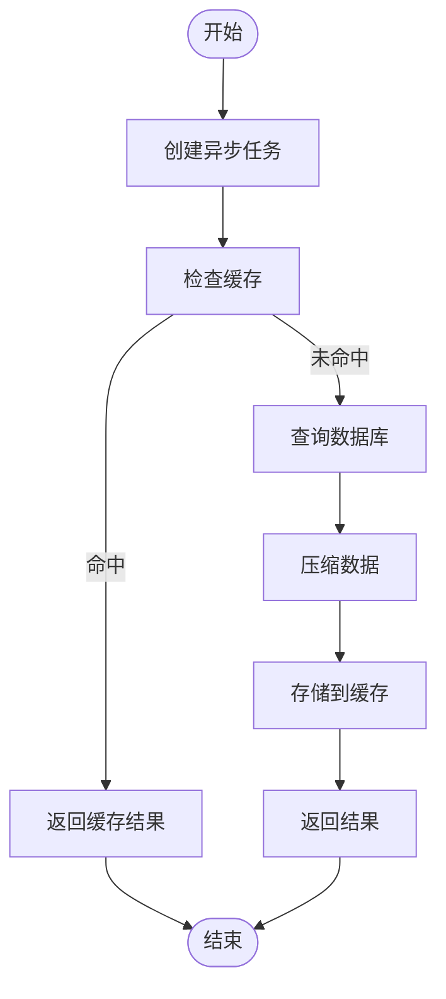

# 结果获取

<cite>
**本文档中引用的文件**  
- [thread.rs](file://crates/agent2/src/thread.rs)
- [agent2.rs](file://crates/agent2/src/agent2.rs)
- [db.rs](file://crates/agent2/src/db.rs)
- [history_store.rs](file://crates/agent2/src/history_store.rs)
- [tools.rs](file://crates/agent2/src/tools.rs)
</cite>

## 目录
1. [简介](#简介)
2. [执行结果的数据结构](#执行结果的数据结构)
3. [会话历史记录的组织方式](#会话历史记录的组织方式)
4. [多轮交互结果的序列化](#多轮交互结果的序列化)
5. [分页查询与增量更新](#分页查询与增量更新)
6. [大结果集处理的最佳实践](#大结果集处理的最佳实践)

## 简介
本文档详细说明了从系统中检索已完成提示执行结果的机制。重点描述了返回数据结构中包含的生成代码、工具调用记录和上下文变更。同时解释了`thread.rs`中会话历史记录的组织方式，以及如何将多轮交互结果序列化为响应体。最后提供了分页查询、增量更新和大结果集处理的最佳实践。

## 执行结果的数据结构
提示执行结果包含生成的代码、工具调用记录和上下文变更。这些信息被组织在`Thread`结构中，通过`Message`枚举来表示用户和代理的消息。

```mermaid
classDiagram
class Message {
+User(UserMessage)
+Agent(AgentMessage)
+Resume
}
class UserMessage {
+id : UserMessageId
+content : Vec<UserMessageContent>
}
class AgentMessage {
+content : Vec<AgentMessageContent>
+tool_results : IndexMap<LanguageModelToolUseId, LanguageModelToolResult>
}
class AgentMessageContent {
+Text(String)
+Thinking { text : String, signature : Option<String> }
+RedactedThinking(String)
+ToolUse(LanguageModelToolUse)
}
Message --> UserMessage : "包含"
Message --> AgentMessage : "包含"
AgentMessage --> AgentMessageContent : "包含"
```

**图示来源**
- [thread.rs](file://crates/agent2/src/thread.rs#L150-L200)

**本节来源**
- [thread.rs](file://crates/agent2/src/thread.rs#L150-L200)

## 会话历史记录的组织方式
会话历史记录在`thread.rs`中通过`Thread`结构体进行组织。每个会话都有一个唯一的`SessionId`，并维护一个消息列表，包括用户消息、代理消息和恢复消息。



**图示来源**
- [thread.rs](file://crates/agent2/src/thread.rs#L300-L350)

**本节来源**
- [thread.rs](file://crates/agent2/src/thread.rs#L300-L350)

## 多轮交互结果的序列化
多轮交互结果通过`to_db`方法序列化为数据库格式。该方法将当前会话状态转换为`DbThread`结构，以便持久化存储。



**图示来源**
- [thread.rs](file://crates/agent2/src/thread.rs#L800-L850)

**本节来源**
- [thread.rs](file://crates/agent2/src/thread.rs#L800-L850)

## 分页查询与增量更新
分页查询和增量更新通过`HistoryStore`和`ThreadsDatabase`实现。`HistoryStore`维护最近打开的会话列表，而`ThreadsDatabase`负责与数据库交互。



**图示来源**
- [history_store.rs](file://crates/agent2/src/history_store.rs#L50-L100)
- [db.rs](file://crates/agent2/src/db.rs#L100-L150)

**本节来源**
- [history_store.rs](file://crates/agent2/src/history_store.rs#L50-L100)
- [db.rs](file://crates/agent2/src/db.rs#L100-L150)

## 大结果集处理的最佳实践
处理大结果集时，应采用以下最佳实践：
1. 使用异步任务避免阻塞主线程
2. 实现结果缓存以提高性能
3. 采用分页查询减少单次请求的数据量
4. 使用压缩算法减少存储空间



**图示来源**
- [db.rs](file://crates/agent2/src/db.rs#L200-L250)

**本节来源**
- [db.rs](file://crates/agent2/src/db.rs#L200-L250)