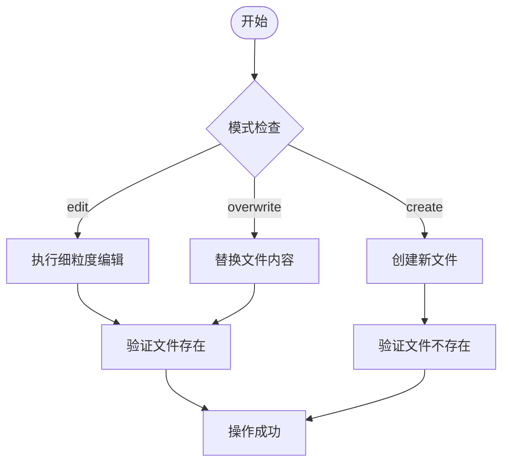
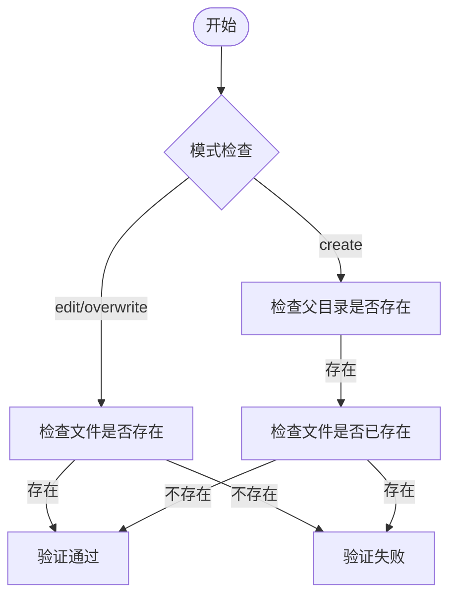
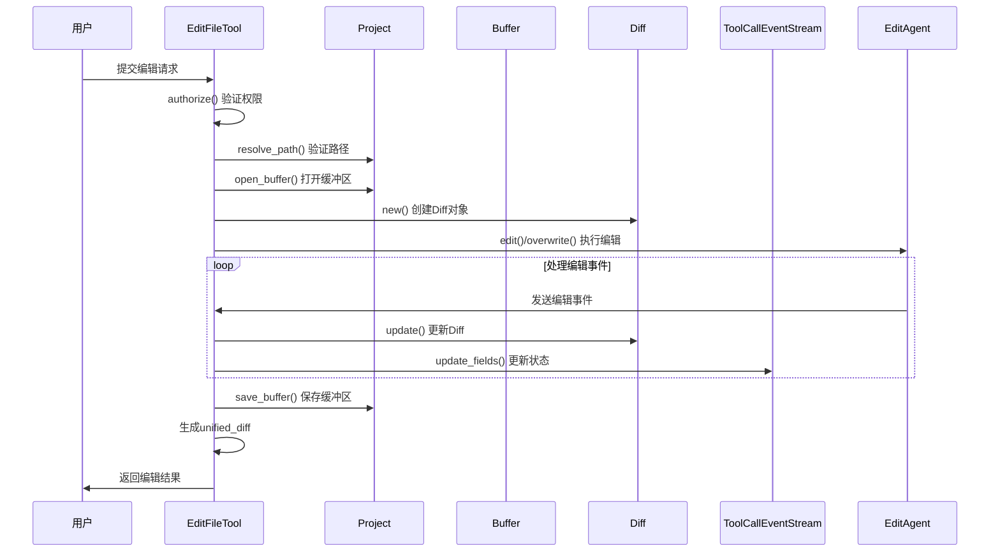
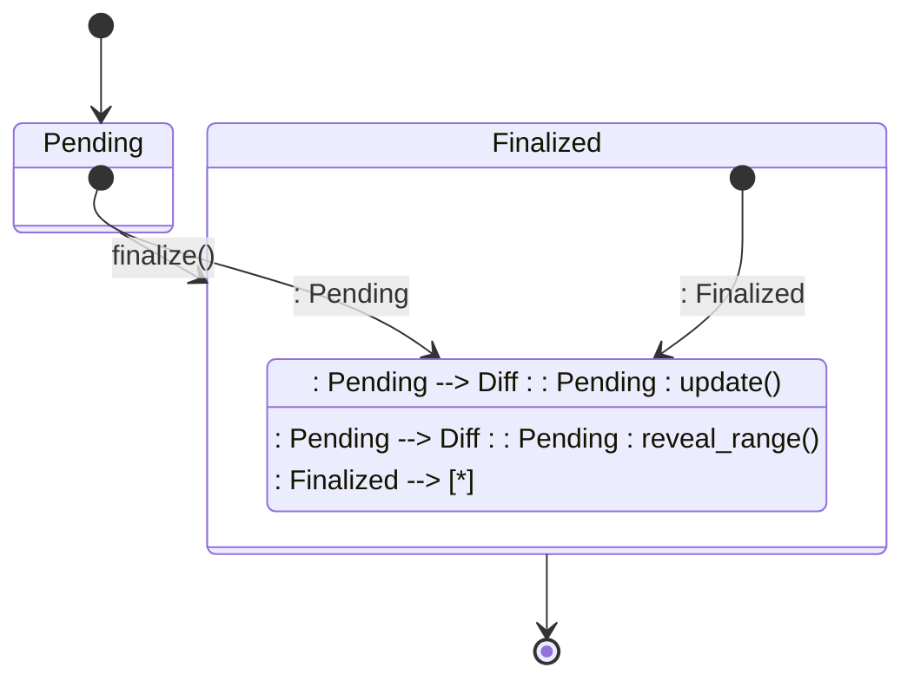
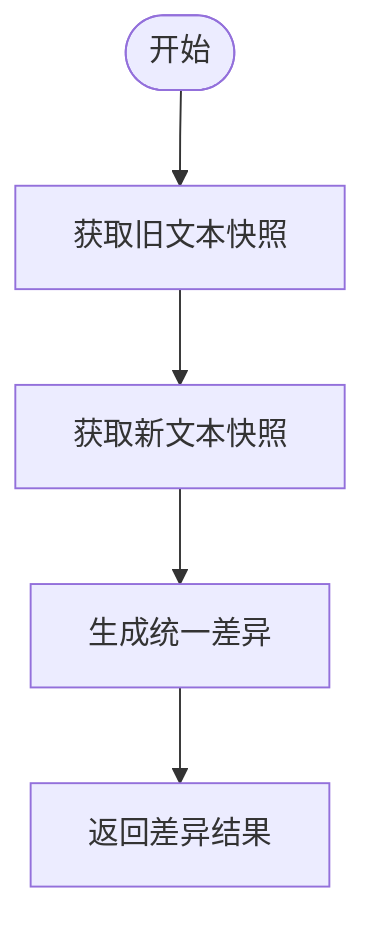
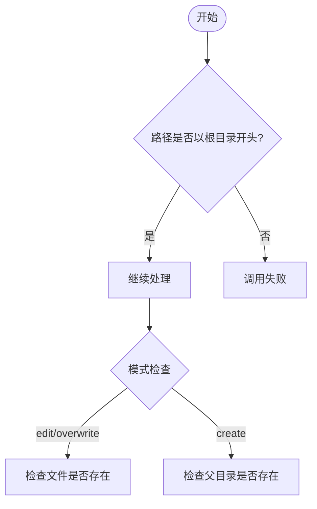

# 文件写入API

<cite>
**本文档中引用的文件**  
- [edit_file_tool.rs](file://crates/agent2/src/tools/edit_file_tool.rs)
- [diff.rs](file://crates/acp_thread/src/diff.rs)
- [buffer_store.rs](file://crates/project/src/buffer_store.rs)
- [project.rs](file://crates/project/src/project.rs)
</cite>

## 目录
1. [简介](#简介)
2. [核心数据结构分析](#核心数据结构分析)
3. [编辑模式与验证逻辑](#编辑模式与验证逻辑)
4. [EditFileTool执行流程](#editfiletool执行流程)
5. [buffer_store暂存机制](#buffer_store暂存机制)
6. [增量补丁提交与display_description生成](#增量补丁提交与display_description生成)
7. [路径合法性与项目根目录约束](#路径合法性与项目根目录约束)

## 简介
本文档深入解析`PUT /projects/:project_id/files/:path`接口的实现机制，重点分析`FileEditRequest`的数据结构、不同编辑模式的行为差异及其验证逻辑。详细说明`EditFileTool`如何将用户请求转化为具体的文件变更操作，并通过`buffer_store`暂存修改直至持久化。同时提供关于如何提交增量补丁（diff-based edit）和生成清晰`display_description`的最佳实践，强调路径合法性校验和项目根目录约束的重要性。

## 核心数据结构分析
本节分析文件编辑功能的核心数据结构，包括输入参数、编辑模式和输出结果。

### EditFileToolInput 结构
该结构定义了文件编辑操作的输入参数。

**Section sources**
- [edit_file_tool.rs](file://crates/agent2/src/tools/edit_file_tool.rs#L26-L73)

### EditFileMode 枚举
定义了三种编辑模式：`edit`、`create`和`overwrite`。

**Section sources**
- [edit_file_tool.rs](file://crates/agent2/src/tools/edit_file_tool.rs#L83-L90)

### EditFileToolOutput 结构
该结构封装了文件编辑操作的输出结果。

**Section sources**
- [edit_file_tool.rs](file://crates/agent2/src/tools/edit_file_tool.rs#L92-L102)

## 编辑模式与验证逻辑
本节详细说明不同编辑模式的行为差异及其验证逻辑。

### 编辑模式行为差异
- `edit`：对现有文件进行细粒度编辑
- `create`：创建新文件（如果不存在）
- `overwrite`：替换现有文件的全部内容

**Diagram sources**
- [edit_file_tool.rs](file://crates/agent2/src/tools/edit_file_tool.rs#L83-L90)

### 路径验证逻辑
实现路径合法性校验的函数`resolve_path`根据不同的编辑模式执行相应的验证。

**Diagram sources**
- [edit_file_tool.rs](file://crates/agent2/src/tools/edit_file_tool.rs#L249-L288)

**Section sources**
- [edit_file_tool.rs](file://crates/agent2/src/tools/edit_file_tool.rs#L249-L288)

## EditFileTool执行流程
本节分析`EditFileTool`如何将用户请求转化为具体的文件变更操作。

**Diagram sources**
- [edit_file_tool.rs](file://crates/agent2/src/tools/edit_file_tool.rs#L125-L247)

**Section sources**
- [edit_file_tool.rs](file://crates/agent2/src/tools/edit_file_tool.rs#L125-L247)

## buffer_store暂存机制
本节分析`buffer_store`在文件编辑过程中的暂存机制。

### BufferStore 结构
`BufferStore`管理一组打开的缓冲区，是文件编辑的核心组件。

**Section sources**
- [buffer_store.rs](file://crates/project/src/buffer_store.rs#L31-L42)

### BufferStoreEvent 枚举
定义了缓冲区存储的各种事件类型。

**Section sources**
- [buffer_store.rs](file://crates/project/src/buffer_store.rs#L76-L88)

### Diff 状态转换
`Diff`对象在`Pending`和`Finalized`状态之间转换，实现编辑过程的可视化。

**Diagram sources**
- [diff.rs](file://crates/acp_thread/src/diff.rs#L16-L19)

## 增量补丁提交与display_description生成
本节说明如何提交增量补丁而非全量覆盖，以及如何生成清晰的`display_description`。

### display_description最佳实践
- 保持简洁但描述性强
- 避免通用指令
- 不要在描述中提及文件路径
- 在输入对象中将此字段放在首位

**Section sources**
- [edit_file_tool.rs](file://crates/agent2/src/tools/edit_file_tool.rs#L35-L45)

### 增量补丁生成
系统通过比较编辑前后的文本快照生成统一差异（unified diff）。

**Diagram sources**
- [edit_file_tool.rs](file://crates/agent2/src/tools/edit_file_tool.rs#L235-L238)

## 路径合法性与项目根目录约束
本节强调路径合法性校验和项目根目录约束的重要性。

### 路径合法性要求
- 必须以项目根目录之一开头
- 编辑或覆盖模式下，路径必须指向现有文件
- 创建模式下，文件必须不存在但父目录必须存在

### 项目根目录约束
当指定需要更改的文件路径时，必须以项目的一个根目录开头。

**Diagram sources**
- [edit_file_tool.rs](file://crates/agent2/src/tools/edit_file_tool.rs#L60-L70)

**Section sources**
- [edit_file_tool.rs](file://crates/agent2/src/tools/edit_file_tool.rs#L55-L73)
- [edit_file_tool.rs](file://crates/agent2/src/tools/edit_file_tool.rs#L249-L288)