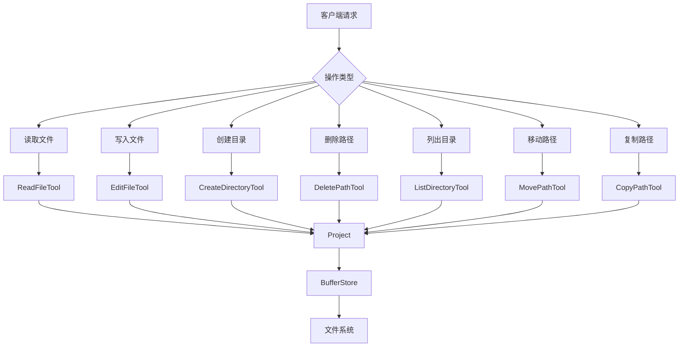
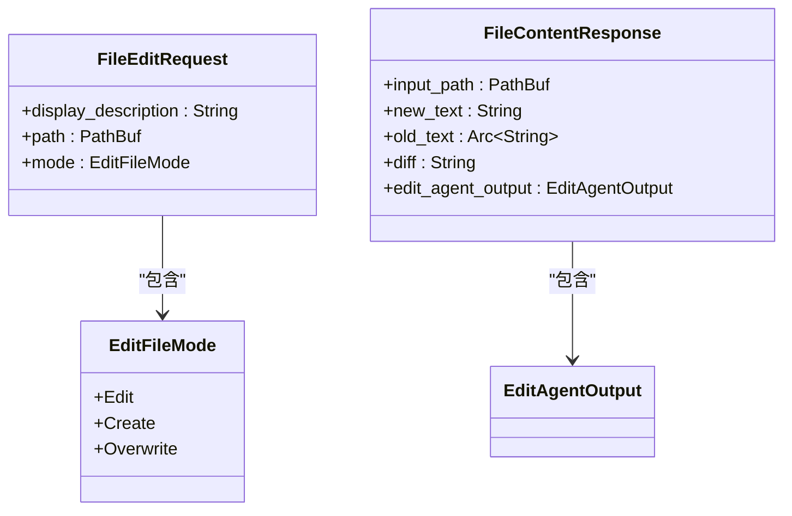
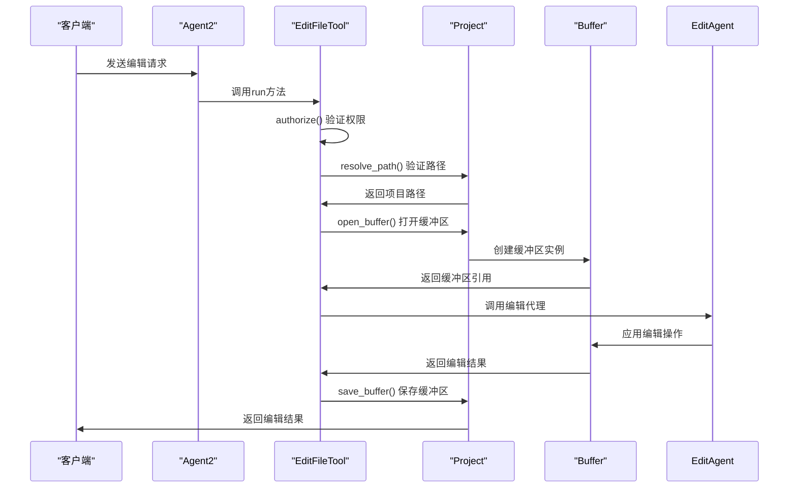
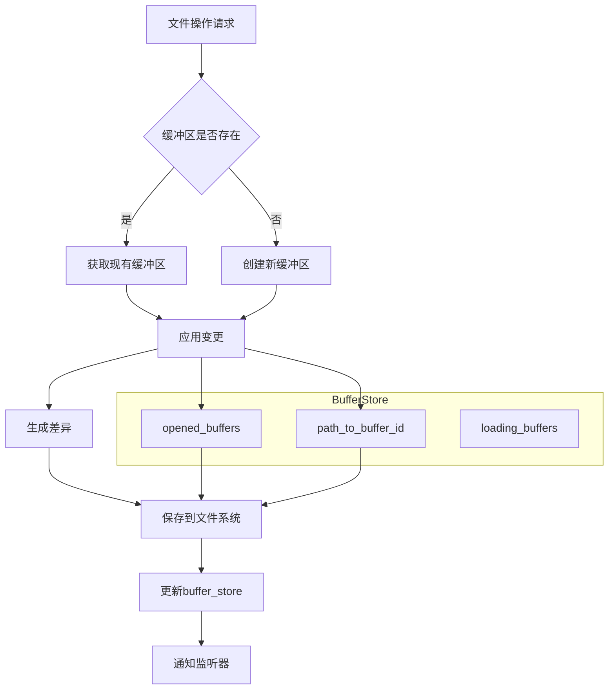
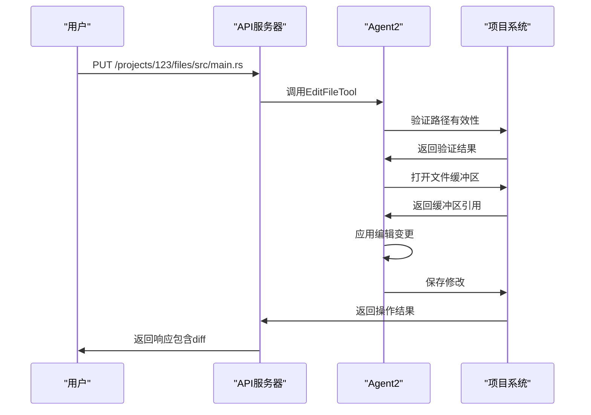
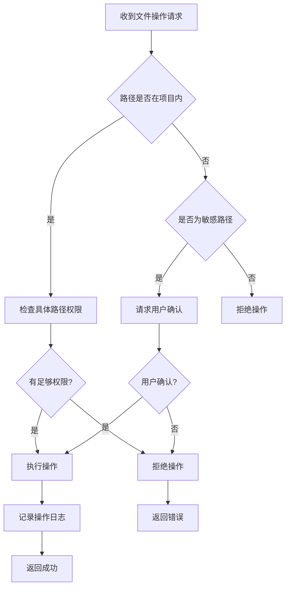

# 文件操作API

<cite>
**本文档中引用的文件**  
- [edit_file_tool.rs](file://crates/agent2/src/tools/edit_file_tool.rs)
- [buffer_store.rs](file://crates/project/src/buffer_store.rs)
- [read_file_tool.rs](file://crates/agent2/src/tools/read_file_tool.rs)
- [create_directory_tool.rs](file://crates/agent2/src/tools/create_directory_tool.rs)
- [delete_path_tool.rs](file://crates/agent2/src/tools/delete_path_tool.rs)
- [list_directory_tool.rs](file://crates/agent2/src/tools/list_directory_tool.rs)
- [move_path_tool.rs](file://crates/agent2/src/tools/move_path_tool.rs)
- [copy_path_tool.rs](file://crates/agent2/src/tools/copy_path_tool.rs)
- [handlers.rs](file://crates/http_server/src/handlers.rs)
</cite>

## 目录
1. [简介](#简介)
2. [核心文件操作API](#核心文件操作api)
3. [请求与响应结构](#请求与响应结构)
4. [与agent2工具集成](#与agent2工具集成)
5. [buffer_store暂存机制](#buffer_store暂存机制)
6. [二进制与文本文件处理](#二进制与文本文件处理)
7. [代码修改提交示例](#代码修改提交示例)
8. [路径验证与访问控制](#路径验证与访问控制)

## 简介
rcoder平台提供了一套完整的文件操作API，支持读取、写入、创建目录、删除路径等核心功能。这些API通过agent2中的工具链实现，并与buffer_store机制深度集成，确保文件变更的安全性和一致性。本文档详细说明相关端点、数据结构、集成方式及最佳实践。

## 核心文件操作API

### 文件读取 (GET /projects/:project_id/files/:path)
通过`ReadFileTool`实现文件内容读取。支持指定起始和结束行号进行部分读取。

### 文件写入 (PUT /projects/:project_id/files/:path)
通过`EditFileTool`实现文件创建或修改，支持三种模式：编辑（edit）、创建（create）、覆盖（overwrite）。

### 创建目录
通过`CreateDirectoryTool`实现新目录的创建。

### 删除路径
通过`DeletePathTool`实现文件或目录的删除。

### 列出目录内容
通过`ListDirectoryTool`获取指定路径下的文件和子目录列表。

### 移动/重命名路径
通过`MovePathTool`实现文件或目录的移动或重命名操作。

### 复制路径
通过`CopyPathTool`实现文件或目录的复制操作。

**文件操作API概览**


**Diagram sources**
- [edit_file_tool.rs](file://crates/agent2/src/tools/edit_file_tool.rs#L26-L73)
- [read_file_tool.rs](file://crates/agent2/src/tools/read_file_tool.rs#L15-L56)
- [create_directory_tool.rs](file://crates/agent2/src/tools/create_directory_tool.rs)
- [delete_path_tool.rs](file://crates/agent2/src/tools/delete_path_tool.rs)
- [list_directory_tool.rs](file://crates/agent2/src/tools/list_directory_tool.rs)
- [move_path_tool.rs](file://crates/agent2/src/tools/move_path_tool.rs)
- [copy_path_tool.rs](file://crates/agent2/src/tools/copy_path_tool.rs)

**Section sources**
- [edit_file_tool.rs](file://crates/agent2/src/tools/edit_file_tool.rs#L26-L73)
- [read_file_tool.rs](file://crates/agent2/src/tools/read_file_tool.rs#L15-L56)

## 请求与响应结构

### FileEditRequest 结构
对应`EditFileToolInput`，用于文件编辑请求：

- **display_description**: 编辑的简短描述（Markdown格式）
- **path**: 文件的完整路径（必须以项目根目录开头）
- **mode**: 操作模式（'edit'、'create'、'overwrite'）

### FileContentResponse 结构
对应`EditFileToolOutput`，用于文件编辑响应：

- **input_path**: 输入的文件路径
- **new_text**: 新的文件内容
- **old_text**: 原始文件内容
- **diff**: 内容差异（diff格式）
- **edit_agent_output**: 编辑代理的输出结果



**Diagram sources**
- [edit_file_tool.rs](file://crates/agent2/src/tools/edit_file_tool.rs#L26-L81)

**Section sources**
- [edit_file_tool.rs](file://crates/agent2/src/tools/edit_file_tool.rs#L26-L81)

## 与agent2工具集成

### EditFileTool 集成
`EditFileTool`是agent2中处理文件编辑的核心工具，其主要组件包括：

- **thread**: 弱引用的线程实体
- **language_registry**: 语言注册表
- **project**: 项目实体

工具执行流程：
1. 验证路径有效性
2. 授权检查
3. 构建补全请求
4. 执行编辑操作
5. 格式化保存
6. 生成差异报告

### 其他文件操作工具
- `ReadFileTool`: 读取文件内容
- `CreateDirectoryTool`: 创建目录
- `DeletePathTool`: 删除路径
- `ListDirectoryTool`: 列出目录内容
- `MovePathTool`: 移动/重命名路径
- `CopyPathTool`: 复制路径



**Diagram sources**
- [edit_file_tool.rs](file://crates/agent2/src/tools/edit_file_tool.rs#L119-L123)
- [project.rs](file://crates/project/src/project.rs#L5178-L5180)

**Section sources**
- [edit_file_tool.rs](file://crates/agent2/src/tools/edit_file_tool.rs#L119-L123)

## buffer_store暂存机制

### BufferStore 架构
`BufferStore`管理项目中所有打开的缓冲区，其核心组件包括：

- **state**: 缓冲区状态（本地或远程）
- **loading_buffers**: 正在加载的缓冲区
- **worktree_store**: 工作树存储
- **opened_buffers**: 已打开的缓冲区
- **path_to_buffer_id**: 路径到缓冲区ID的映射
- **shared_buffers**: 共享的缓冲区

### 缓冲区事件处理
`BufferStoreEvent`枚举定义了缓冲区的各种事件：

- **BufferAdded**: 缓冲区已添加
- **BufferOpened**: 缓冲区已打开
- **SharedBufferClosed**: 共享缓冲区已关闭
- **BufferDropped**: 缓冲区已丢弃
- **BufferChangedFilePath**: 缓冲区文件路径已更改

### 暂存流程
1. 文件操作请求到达
2. 在buffer_store中创建或获取缓冲区
3. 应用变更到缓冲区
4. 生成差异报告
5. 保存到文件系统



**Diagram sources**
- [buffer_store.rs](file://crates/project/src/buffer_store.rs#L31-L42)
- [buffer_store.rs](file://crates/project/src/buffer_store.rs#L76-L88)

**Section sources**
- [buffer_store.rs](file://crates/project/src/buffer_store.rs#L31-L42)

## 二进制与文本文件处理

### 文本文件处理
- 使用`Buffer`类进行文本内容管理
- 支持行结束符（line ending）的自动检测和转换
- 提供完整的文本编辑功能（插入、删除、替换）
- 支持语法高亮和语言特定功能

### 二进制文件处理
- 当前系统主要针对文本文件设计
- 二进制文件的处理需要特殊考虑
- 建议通过专用工具或外部程序处理二进制文件
- 直接编辑二进制文件可能导致数据损坏

### 处理注意事项
1. **编码检测**: 自动检测文件编码，支持UTF-8等常见编码
2. **大文件处理**: 对大文件进行分块处理，避免内存溢出
3. **文件锁定**: 在编辑期间锁定文件，防止并发修改冲突
4. **备份机制**: 在重大修改前自动创建备份

## 代码修改提交示例

### 示例1: 创建新文件
```json
{
  "display_description": "创建新的API路由文件",
  "path": "backend/src/routes/api.rs",
  "mode": "create"
}
```

### 示例2: 编辑现有文件
```json
{
  "display_description": "修复用户认证逻辑中的安全漏洞",
  "path": "backend/src/auth/mod.rs",
  "mode": "edit"
}
```

### 示例3: 覆盖文件内容
```json
{
  "display_description": "更新配置文件以反映新的部署环境",
  "path": "backend/config/production.json",
  "mode": "overwrite"
}
```

### 完整的API调用流程


**Diagram sources**
- [handlers.rs](file://crates/http_server/src/handlers.rs#L99-L138)
- [edit_file_tool.rs](file://crates/agent2/src/tools/edit_file_tool.rs#L26-L73)

**Section sources**
- [edit_file_tool.rs](file://crates/agent2/src/tools/edit_file_tool.rs#L26-L73)

## 路径验证与访问控制策略

### 路径验证规则
1. **根目录检查**: 所有路径必须以项目根目录开头
2. **存在性验证**: 
   - `edit`和`overwrite`模式要求文件必须存在
   - `create`模式要求文件不存在但父目录存在
3. **类型验证**: 确保路径指向文件而非目录
4. **权限验证**: 检查用户对目标路径的访问权限

### 访问控制策略
1. **本地设置文件保护**: 防止修改编辑器本地设置
2. **全局配置目录保护**: 防止修改全局配置
3. **项目边界限制**: 确保所有操作都在项目范围内
4. **敏感路径提示**: 对可能影响系统配置的操作进行提示

### 安全检查流程


**Diagram sources**
- [edit_file_tool.rs](file://crates/agent2/src/tools/edit_file_tool.rs#L471-L514)
- [edit_file_tool.rs](file://crates/agent2/src/tools/edit_file_tool.rs#L1495-L1526)

**Section sources**
- [edit_file_tool.rs](file://crates/agent2/src/tools/edit_file_tool.rs#L471-L514)