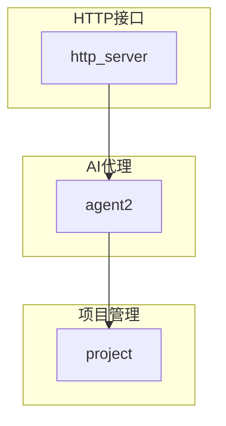
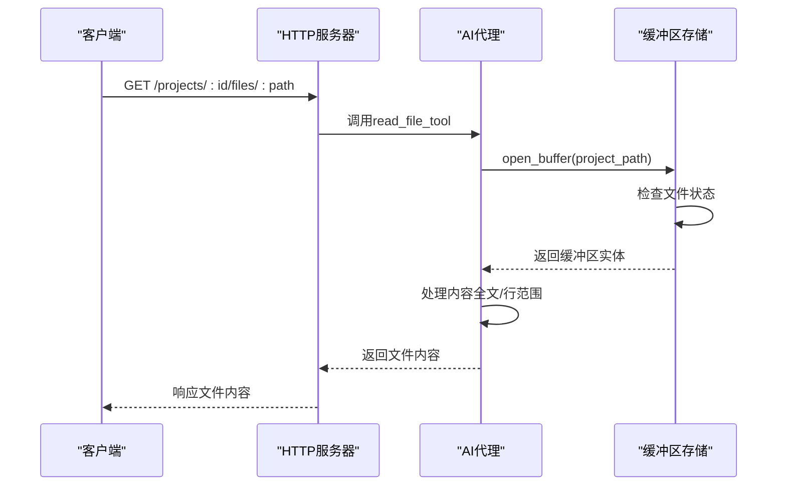
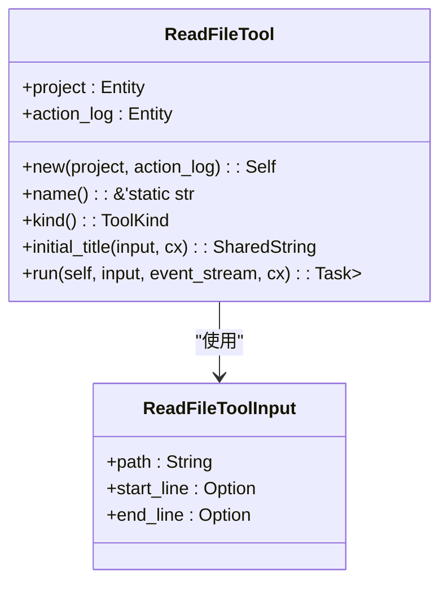
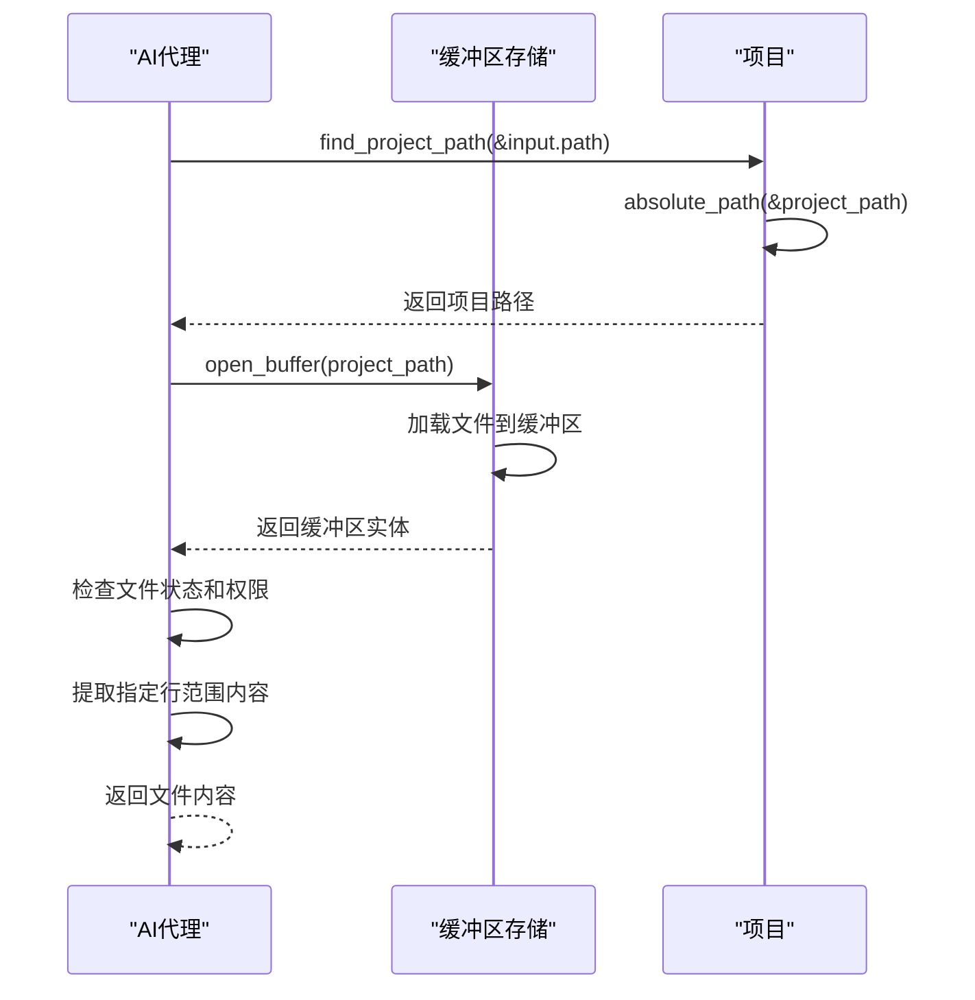
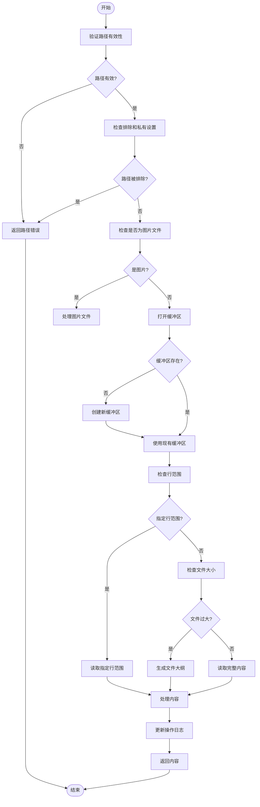
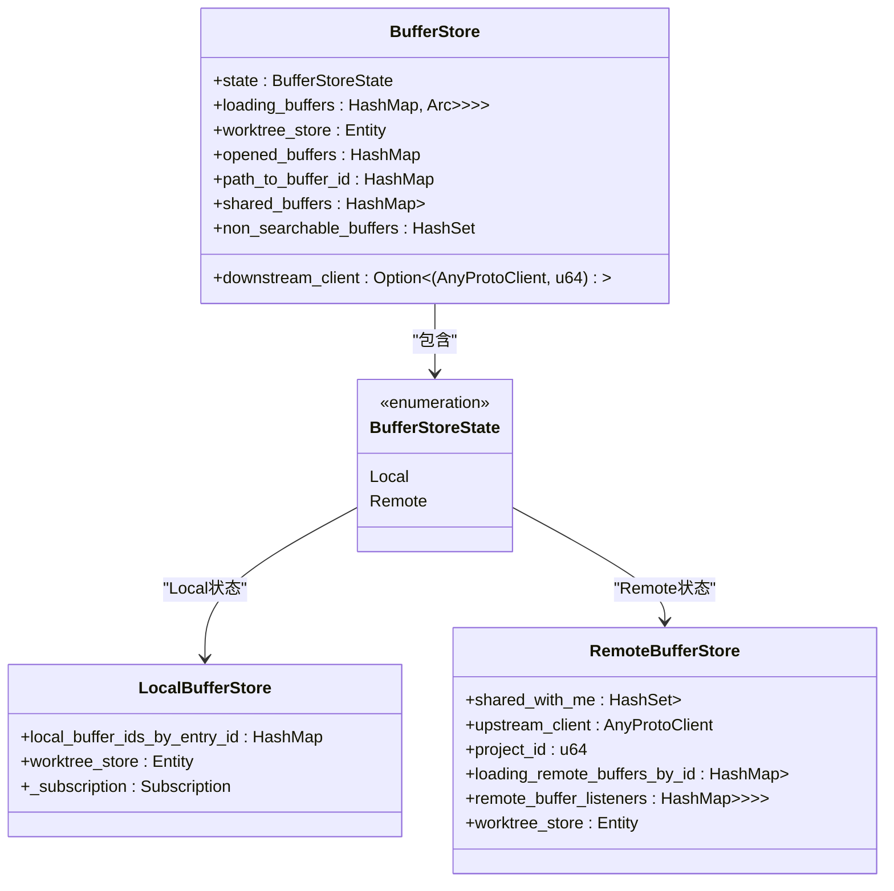
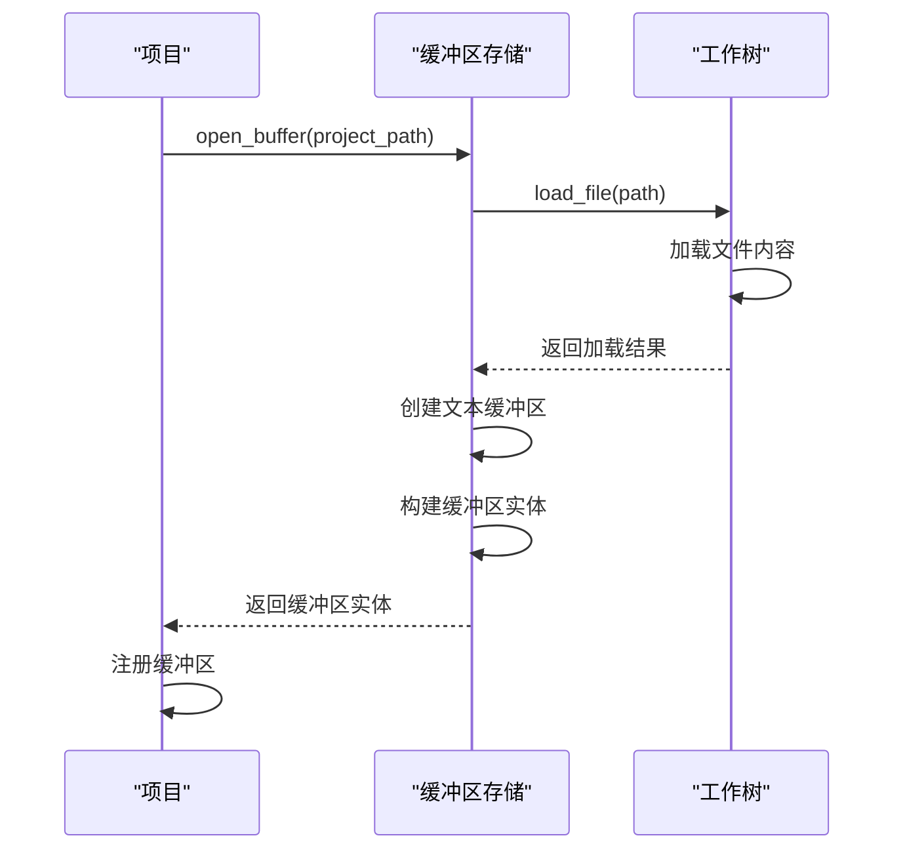
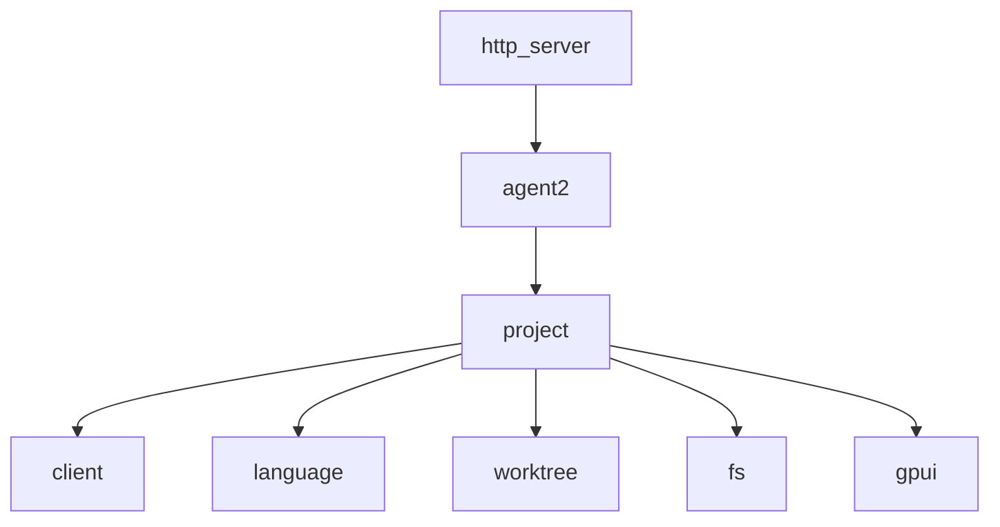

# 文件读取API

<cite>
**本文档引用的文件**
- [read_file_tool.rs](file://crates/agent2/src/tools/read_file_tool.rs)
- [buffer_store.rs](file://crates/project/src/buffer_store.rs)
- [project.rs](file://crates/project/src/project.rs)
- [handlers.rs](file://crates/http_server/src/handlers.rs)
- [lib.rs](file://crates/http_server/src/lib.rs)
</cite>

## 目录
1. [简介](#简介)
2. [项目结构](#项目结构)
3. [核心组件](#核心组件)
4. [架构概述](#架构概述)
5. [详细组件分析](#详细组件分析)
6. [依赖分析](#依赖分析)
7. [性能考虑](#性能考虑)
8. [故障排除指南](#故障排除指南)
9. [结论](#结论)
10. [附录](#附录)（如有必要）

## 简介
本文档详细记录了rcoder的文件读取功能实现，重点描述GET /projects/:project_id/files/:path接口的请求参数、响应结构（如FileContentResponse）及错误处理机制。说明read_file_tool如何与buffer_store协同工作以支持未保存的文件内容读取，并解释其在AI代理上下文中的调用流程。提供处理大文件流式传输的最佳实践，以及文本编码（UTF-8）和二进制文件（如图片）的识别与处理策略。结合代码示例展示如何通过API安全地获取文件内容用于代码分析。

## 项目结构
rcoder的项目结构采用模块化设计，核心功能分布在多个crates中。文件读取功能主要涉及agent2、project和http_server三个模块。agent2负责AI代理工具的实现，project模块管理项目和缓冲区，http_server提供HTTP接口。

**图表来源**
- [lib.rs](file://crates/http_server/src/lib.rs#L0-L47)
- [project.rs](file://crates/project/src/project.rs#L0-L5686)

**章节来源**
- [lib.rs](file://crates/http_server/src/lib.rs#L0-L47)
- [project.rs](file://crates/project/src/project.rs#L0-L5686)

## 核心组件
文件读取功能的核心组件包括read_file_tool、buffer_store和HTTP处理器。read_file_tool作为AI代理工具，负责处理文件读取请求；buffer_store管理项目中的缓冲区状态；HTTP处理器暴露REST API接口。

**章节来源**
- [read_file_tool.rs](file://crates/agent2/src/tools/read_file_tool.rs#L15-L56)
- [buffer_store.rs](file://crates/project/src/buffer_store.rs#L31-L74)

## 架构概述
文件读取功能的架构涉及多个层次的协作。HTTP请求首先由http_server处理，然后通过agent2的read_file_tool与project模块的buffer_store交互，最终实现文件内容的读取和返回。

**图表来源**
- [handlers.rs](file://crates/http_server/src/handlers.rs#L51-L97)
- [read_file_tool.rs](file://crates/agent2/src/tools/read_file_tool.rs#L15-L56)
- [buffer_store.rs](file://crates/project/src/buffer_store.rs#L615-L634)

## 详细组件分析

### 文件读取工具分析
read_file_tool是AI代理的核心工具之一，负责读取项目中的文件内容。它支持按行范围读取，能够处理大文件的摘要显示，并与缓冲区存储系统紧密集成。

#### 对象导向组件

**图表来源**
- [read_file_tool.rs](file://crates/agent2/src/tools/read_file_tool.rs#L15-L56)

#### API/服务组件

**图表来源**
- [read_file_tool.rs](file://crates/agent2/src/tools/read_file_tool.rs#L15-L56)
- [buffer_store.rs](file://crates/project/src/buffer_store.rs#L615-L634)

#### 复杂逻辑组件

**图表来源**
- [read_file_tool.rs](file://crates/agent2/src/tools/read_file_tool.rs#L15-L56)

**章节来源**
- [read_file_tool.rs](file://crates/agent2/src/tools/read_file_tool.rs#L15-L56)

### 缓冲区存储分析
buffer_store是项目模块的核心组件，负责管理所有打开的缓冲区。它与工作树存储协同工作，处理缓冲区的创建、保存和同步。

#### 对象导向组件

**图表来源**
- [buffer_store.rs](file://crates/project/src/buffer_store.rs#L31-L74)

#### API/服务组件

**图表来源**
- [buffer_store.rs](file://crates/project/src/buffer_store.rs#L615-L634)
- [project.rs](file://crates/project/src/project.rs#L2871-L2908)

**章节来源**
- [buffer_store.rs](file://crates/project/src/buffer_store.rs#L615-L634)

## 依赖分析
文件读取功能依赖于多个模块的协同工作。http_server模块依赖agent2模块的工具实现，agent2模块又依赖project模块的项目和缓冲区管理功能。

**图表来源**
- [Cargo.toml](file://crates/http_server/Cargo.toml)
- [Cargo.toml](file://crates/agent2/Cargo.toml)
- [Cargo.toml](file://crates/project/Cargo.toml)

**章节来源**
- [lib.rs](file://crates/http_server/src/lib.rs#L0-L47)
- [read_file_tool.rs](file://crates/agent2/src/tools/read_file_tool.rs#L15-L56)

## 性能考虑
文件读取功能在处理大文件时采用了优化策略。对于过大的文件，系统会生成文件大纲而不是加载完整内容，这有助于提高性能并减少内存使用。缓冲区系统还实现了延迟加载和按需加载机制，确保只有在需要时才加载文件内容。

## 故障排除指南
当文件读取功能出现问题时，可以检查以下方面：
1. 路径是否在项目范围内
2. 文件是否被排除或标记为私有
3. 缓冲区是否正确加载
4. 权限设置是否正确

**章节来源**
- [read_file_tool.rs](file://crates/agent2/src/tools/read_file_tool.rs#L15-L56)
- [buffer_store.rs](file://crates/project/src/buffer_store.rs#L31-L74)

## 结论
rcoder的文件读取功能通过模块化设计实现了高效、安全的文件访问。通过HTTP接口、AI代理工具和缓冲区存储系统的协同工作，提供了灵活的文件读取能力，同时确保了性能和安全性。