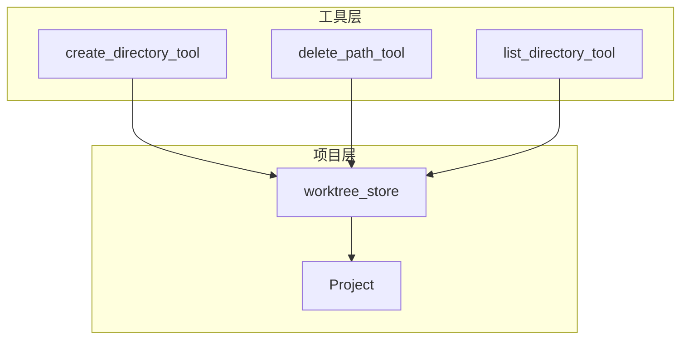
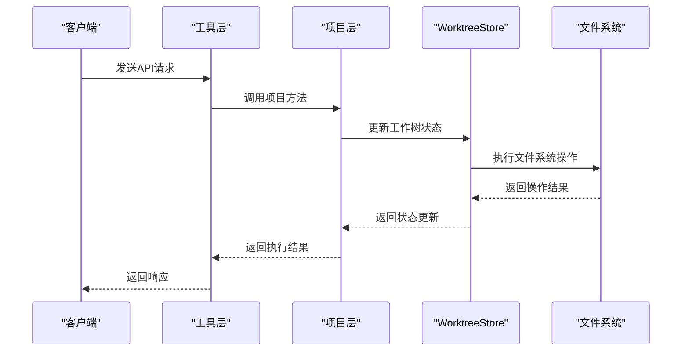
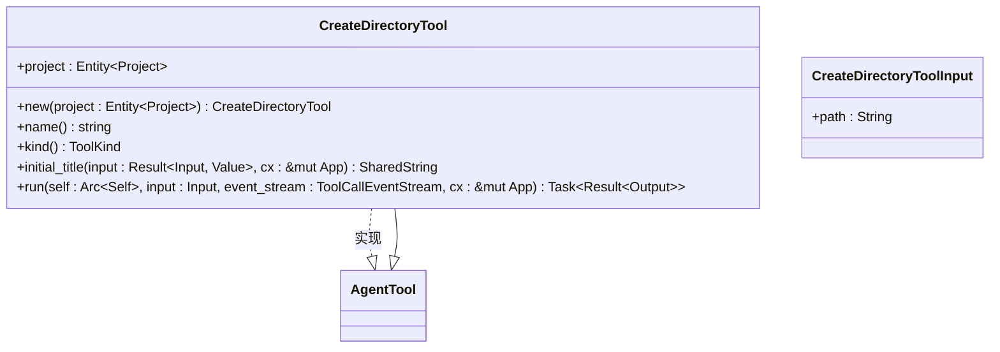
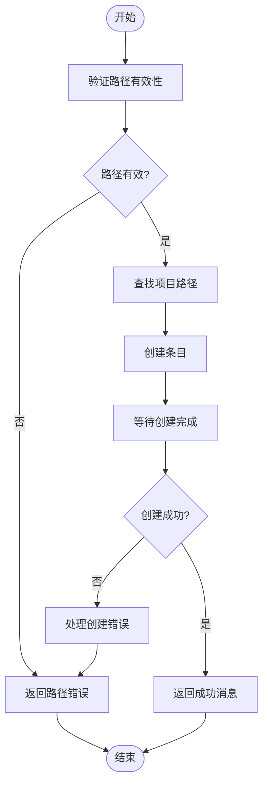
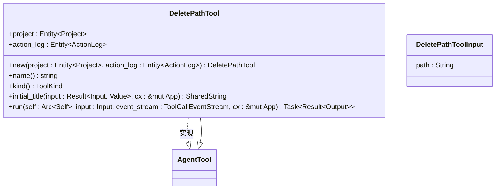
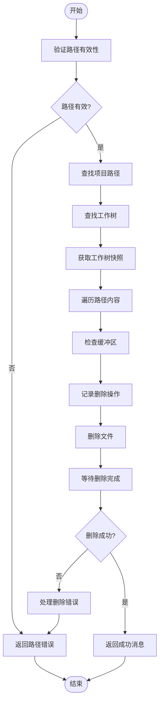
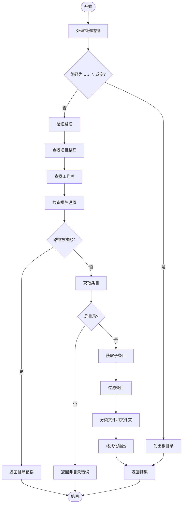
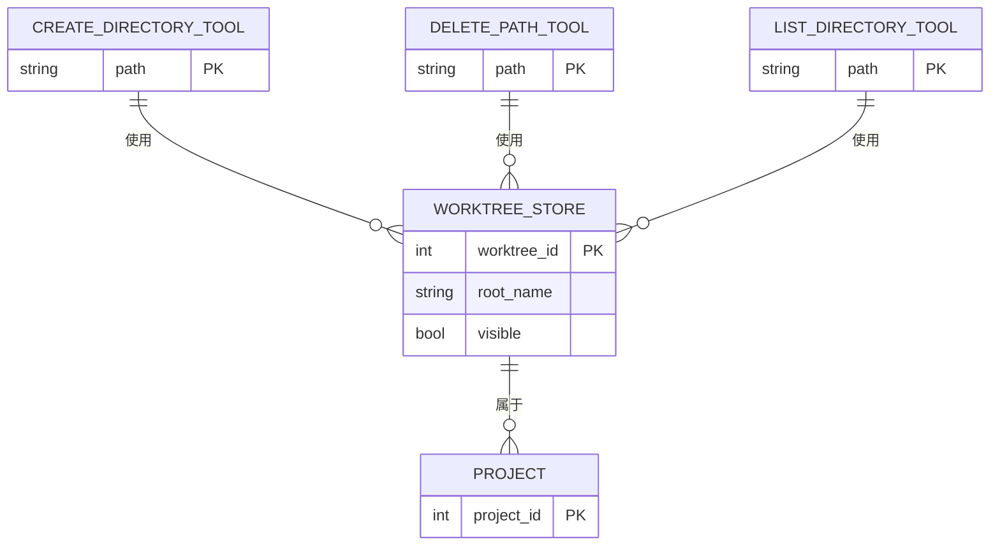

# 目录管理API

<cite>
**本文档中引用的文件**  
- [create_directory_tool.rs](file://crates/agent2/src/tools/create_directory_tool.rs)
- [delete_path_tool.rs](file://crates/agent2/src/tools/delete_path_tool.rs)
- [list_directory_tool.rs](file://crates/agent2/src/tools/list_directory_tool.rs)
- [worktree_store.rs](file://crates/project/src/worktree_store.rs)
</cite>

## 目录

1. [简介](#简介)
2. [项目结构](#项目结构)
3. [核心组件](#核心组件)
4. [架构概览](#架构概览)
5. [详细组件分析](#详细组件分析)
6. [依赖分析](#依赖分析)
7. [性能考虑](#性能考虑)
8. [故障排除指南](#故障排除指南)
9. [结论](#结论)

## 简介
本文档系统化地记录了目录管理相关的API端点，包括创建、删除和查询目录的操作。重点涵盖 `POST /projects/:project_id/directory`、`DELETE /projects/:project_id/path` 和 `GET /projects/:project_id/directory/:path` 三个核心端点。文档详细说明了各接口的请求体格式、状态码语义以及递归操作的限制条件。同时，阐述了 `create_directory_tool` 和 `delete_path_tool` 如何与 `worktree_store` 交互以维护项目树结构的一致性，并说明 `list_directory_tool` 在AI代理决策链中的前置探查作用。最后，提供了防止路径遍历攻击的安全实践指南。

## 项目结构
目录管理功能分布在多个模块中，主要涉及工具层（tools）和项目存储层（project）。工具层负责提供对外的API接口，而项目存储层则负责底层的文件系统操作和状态维护。

**Diagram sources**
- [create_directory_tool.rs](file://crates/agent2/src/tools/create_directory_tool.rs#L1-L90)
- [delete_path_tool.rs](file://crates/agent2/src/tools/delete_path_tool.rs#L1-L140)
- [list_directory_tool.rs](file://crates/agent2/src/tools/list_directory_tool.rs#L1-L670)
- [worktree_store.rs](file://crates/project/src/worktree_store.rs#L1-L1004)

**Section sources**
- [create_directory_tool.rs](file://crates/agent2/src/tools/create_directory_tool.rs#L1-L90)
- [delete_path_tool.rs](file://crates/agent2/src/tools/delete_path_tool.rs#L1-L140)
- [list_directory_tool.rs](file://crates/agent2/src/tools/list_directory_tool.rs#L1-L670)
- [worktree_store.rs](file://crates/project/src/worktree_store.rs#L1-L1004)

## 核心组件
本节分析三个核心工具组件：`create_directory_tool`、`delete_path_tool` 和 `list_directory_tool`，它们分别对应目录的创建、删除和查询操作。

**Section sources**
- [create_directory_tool.rs](file://crates/agent2/src/tools/create_directory_tool.rs#L1-L90)
- [delete_path_tool.rs](file://crates/agent2/src/tools/delete_path_tool.rs#L1-L140)
- [list_directory_tool.rs](file://crates/agent2/src/tools/list_directory_tool.rs#L1-L670)

## 架构概览
目录管理API的整体架构分为工具层和存储层。工具层接收外部请求并进行参数验证，然后调用项目层的相应方法。项目层通过 `worktree_store` 管理工作树的状态，并与底层文件系统交互。

**Diagram sources**
- [create_directory_tool.rs](file://crates/agent2/src/tools/create_directory_tool.rs#L1-L90)
- [delete_path_tool.rs](file://crates/agent2/src/tools/delete_path_tool.rs#L1-L140)
- [list_directory_tool.rs](file://crates/agent2/src/tools/list_directory_tool.rs#L1-L670)
- [worktree_store.rs](file://crates/project/src/worktree_store.rs#L1-L1004)

## 详细组件分析
本节详细分析每个组件的实现细节、交互逻辑和安全机制。

### 创建目录工具分析
`create_directory_tool` 负责创建新的目录，支持递归创建父目录。

#### 类图

**Diagram sources**
- [create_directory_tool.rs](file://crates/agent2/src/tools/create_directory_tool.rs#L1-L90)

#### 执行流程

**Diagram sources**
- [create_directory_tool.rs](file://crates/agent2/src/tools/create_directory_tool.rs#L1-L90)

**Section sources**
- [create_directory_tool.rs](file://crates/agent2/src/tools/create_directory_tool.rs#L1-L90)

### 删除路径工具分析
`delete_path_tool` 负责删除文件或目录，支持递归删除目录内容。

#### 类图

**Diagram sources**
- [delete_path_tool.rs](file://crates/agent2/src/tools/delete_path_tool.rs#L1-L140)

#### 执行流程

**Diagram sources**
- [delete_path_tool.rs](file://crates/agent2/src/tools/delete_path_tool.rs#L1-L140)

**Section sources**
- [delete_path_tool.rs](file://crates/agent2/src/tools/delete_path_tool.rs#L1-L140)

### 列出目录工具分析
`list_directory_tool` 负责列出指定路径下的文件和目录内容。

#### 类图

**Diagram sources**
- [list_directory_tool.rs](file://crates/agent2/src/tools/list_directory_tool.rs#L1-L670)

#### 执行流程

**Diagram sources**
- [list_directory_tool.rs](file://crates/agent2/src/tools/list_directory_tool.rs#L1-L670)

**Section sources**
- [list_directory_tool.rs](file://crates/agent2/src/tools/list_directory_tool.rs#L1-L670)

## 依赖分析
目录管理工具依赖于项目层的 `worktree_store` 来维护工作树状态和执行文件系统操作。

**Diagram sources**
- [worktree_store.rs](file://crates/project/src/worktree_store.rs#L1-L1004)

**Section sources**
- [worktree_store.rs](file://crates/project/src/worktree_store.rs#L1-L1004)

## 性能考虑
- **并发操作**：所有工具操作都在后台任务中执行，避免阻塞主线程。
- **批量处理**：删除操作会批量处理目录内容，减少I/O开销。
- **缓存机制**：`worktree_store` 维护工作树快照，减少重复的文件系统访问。
- **流式处理**：大目录的遍历采用流式处理，避免内存溢出。

## 故障排除指南
### 常见问题及解决方案
- **路径不存在**：确保提供的路径在项目范围内，且父目录已存在（创建目录时除外）。
- **权限不足**：检查文件系统权限，确保应用有读写权限。
- **路径被排除**：检查 `file_scan_exclusions` 和 `private_files` 设置，确保路径未被排除。
- **递归删除失败**：对于大型目录，可能需要更长的超时时间或分批处理。

**Section sources**
- [create_directory_tool.rs](file://crates/agent2/src/tools/create_directory_tool.rs#L1-L90)
- [delete_path_tool.rs](file://crates/agent2/src/tools/delete_path_tool.rs#L1-L140)
- [list_directory_tool.rs](file://crates/agent2/src/tools/list_directory_tool.rs#L1-L670)

## 结论
本文档全面记录了目录管理API的设计、实现和使用方法。通过 `create_directory_tool`、`delete_path_tool` 和 `list_directory_tool` 三个核心组件，系统提供了完整的目录管理功能。这些工具通过 `worktree_store` 与项目层紧密集成，确保了项目树结构的一致性和安全性。同时，系统实现了完善的安全机制，防止路径遍历攻击和敏感文件访问。建议在使用这些API时，遵循最佳实践，合理处理错误情况，并注意性能优化。