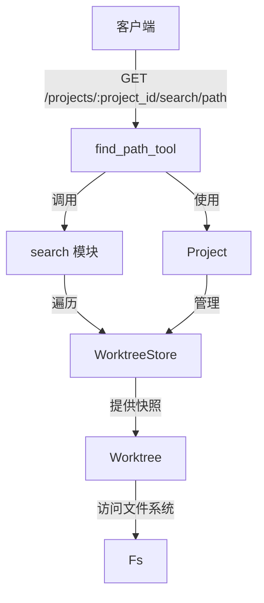
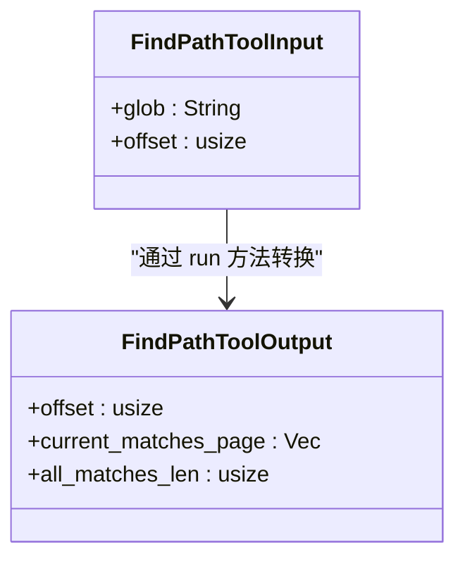
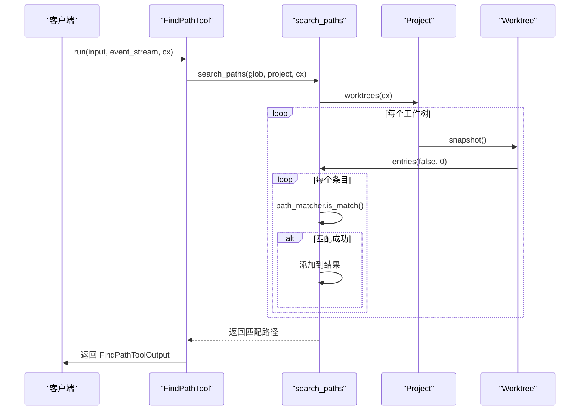
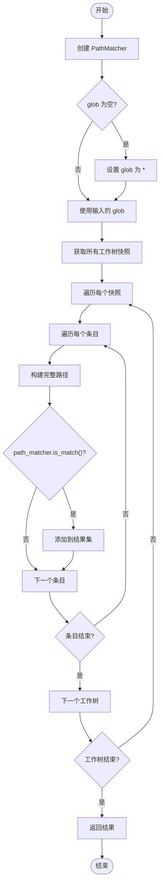
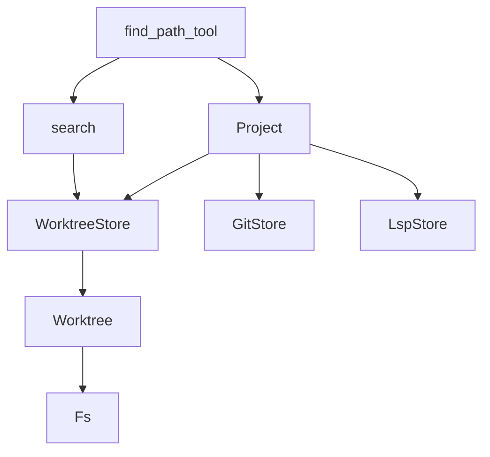

# 路径查找API

<cite>
**本文档中引用的文件**  
- [find_path_tool.rs](file://crates/agent2/src/tools/find_path_tool.rs)
- [search.rs](file://crates/project/src/search.rs)
- [project.rs](file://crates/project/src/project.rs)
</cite>

## 目录
1. [简介](#简介)
2. [核心组件](#核心组件)
3. [架构概述](#架构概述)
4. [详细组件分析](#详细组件分析)
5. [依赖分析](#依赖分析)
6. [性能考虑](#性能考虑)
7. [故障排除指南](#故障排除指南)
8. [结论](#结论)

## 简介
本文档详细描述了基于关键字或模式匹配的路径查找功能，重点聚焦于 `GET /projects/:project_id/search/path` 接口的设计与实现。该功能通过 `find_path_tool` 工具调用底层 `search` 模块，实现高效的文件路径检索，支持通配符和正则表达式查询。文档还解释了响应结果的排序逻辑（如相关性、路径深度）及分页机制，并提供典型用例，如AI代理在执行跨文件修改前定位所有相关模块。同时强调查询性能优化和资源消耗控制策略。

## 核心组件
`find_path_tool` 是一个快速文件路径模式匹配工具，适用于任意规模的代码库。它支持 glob 模式（如 "**/*.js" 或 "src/**/*.ts"），返回按字母顺序排序的匹配文件路径。当需要根据名称模式查找文件时，应优先使用此工具。结果以每页50个匹配项进行分页，可通过可选的 'offset' 参数请求后续页面。

**核心功能包括：**
- 支持 glob 和正则表达式模式匹配
- 结果分页与偏移控制
- 高效的路径匹配算法
- 与项目工作树（Worktree）集成

**Section sources**
- [find_path_tool.rs](file://crates/agent2/src/tools/find_path_tool.rs#L1-L250)

## 架构概述
路径查找功能的架构涉及多个核心模块的协同工作。`find_path_tool` 作为前端工具接收查询请求，调用底层 `search` 模块执行实际的路径匹配。`Project` 模块负责管理项目状态和工作树，而 `WorktreeStore` 提供对文件系统条目的访问。

**Diagram sources**
- [find_path_tool.rs](file://crates/agent2/src/tools/find_path_tool.rs#L1-L250)
- [search.rs](file://crates/project/src/search.rs#L1-L728)
- [project.rs](file://crates/project/src/project.rs#L1-L5686)

## 详细组件分析

### find_path_tool 分析
`find_path_tool` 是实现路径查找功能的核心工具。它实现了 `AgentTool` trait，能够接收输入参数，执行搜索任务，并返回结构化输出。

#### 输入与输出结构

**Diagram sources**
- [find_path_tool.rs](file://crates/agent2/src/tools/find_path_tool.rs#L19-L65)

#### 执行流程

**Diagram sources**
- [find_path_tool.rs](file://crates/agent2/src/tools/find_path_tool.rs#L145-L193)

### search 模块分析
`search` 模块提供了底层的路径匹配功能，使用 `PathMatcher` 进行高效的模式匹配。

#### 路径匹配逻辑

**Diagram sources**
- [search.rs](file://crates/project/src/search.rs#L1-L728)

## 依赖分析
路径查找功能依赖于多个核心模块，形成了清晰的依赖链。

**Diagram sources**
- [find_path_tool.rs](file://crates/agent2/src/tools/find_path_tool.rs#L1-L250)
- [search.rs](file://crates/project/src/search.rs#L1-L728)
- [project.rs](file://crates/project/src/project.rs#L1-L5686)

**Section sources**
- [find_path_tool.rs](file://crates/agent2/src/tools/find_path_tool.rs#L1-L250)
- [search.rs](file://crates/project/src/search.rs#L1-L728)
- [project.rs](file://crates/project/src/project.rs#L1-L5686)

## 性能考虑
路径查找功能在设计时充分考虑了性能和资源消耗：

1. **分页机制**：通过 `RESULTS_PER_PAGE` 常量（默认50）限制每页结果数量，防止内存溢出。
2. **异步执行**：使用 `cx.background_spawn` 在后台线程执行搜索任务，避免阻塞主线程。
3. **高效匹配**：利用 `PathMatcher` 进行快速模式匹配，减少不必要的文件系统访问。
4. **资源控制**：通过 `WorktreeStore` 的 `find_search_candidates` 方法限制并发文件扫描数量（`MAX_CONCURRENT_FILE_SCANS`）。

这些策略确保了即使在大型代码库中也能保持良好的响应性能。

## 故障排除指南
当路径查找功能出现问题时，可参考以下常见问题及解决方案：

1. **无匹配结果**：
   - 检查 glob 模式是否正确
   - 确认项目路径是否存在
   - 验证工作树是否已正确加载

2. **性能缓慢**：
   - 检查是否使用了过于宽泛的 glob 模式（如 "**"）
   - 确认分页参数是否合理
   - 查看是否有大量忽略的目录需要扫描

3. **路径匹配错误**：
   - 验证 `PathMatcher` 的创建是否成功
   - 检查路径分隔符是否与系统一致
   - 确认 `match_full_paths` 参数设置是否正确

**Section sources**
- [find_path_tool.rs](file://crates/agent2/src/tools/find_path_tool.rs#L1-L250)
- [search.rs](file://crates/project/src/search.rs#L1-L728)

## 结论
路径查找API提供了一个强大而高效的文件路径检索机制，通过 `find_path_tool` 和底层 `search` 模块的协同工作，支持复杂的模式匹配和分页查询。该功能在AI代理场景中尤为重要，能够帮助代理在执行跨文件修改前准确定位所有相关模块。通过合理的性能优化和资源控制策略，确保了在各种规模代码库中的稳定性和响应速度。