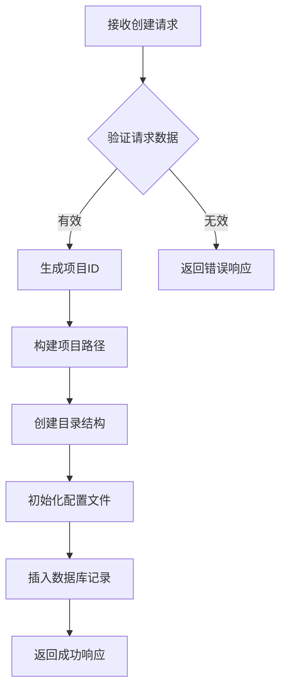
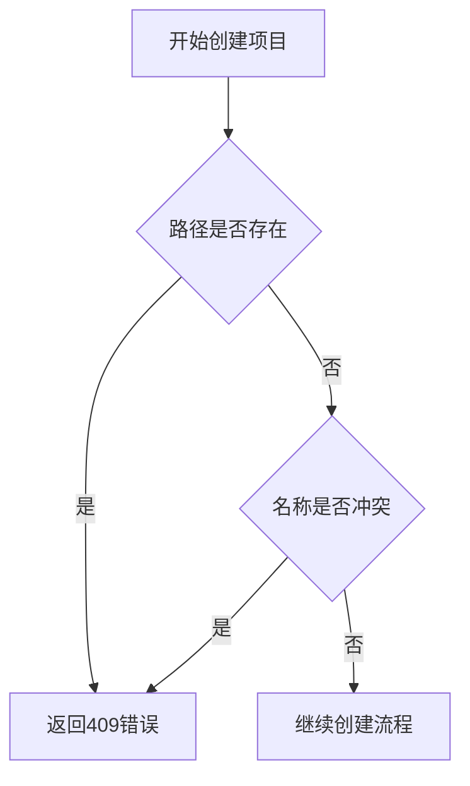
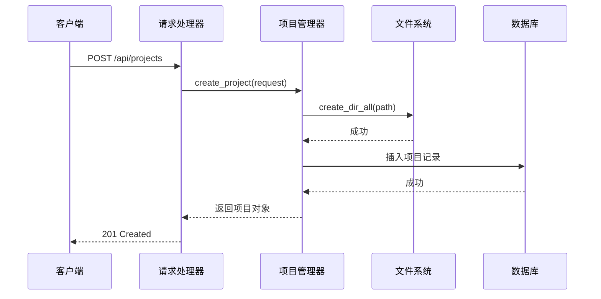

# 创建项目

<cite>
**本文档中引用的文件**  
- [project.rs](file://crates/project/src/project.rs)
- [handlers.rs](file://crates/http_server/src/handlers.rs)
- [lib.rs](file://crates/shared_types/src/lib.rs)
- [http_interface.rs](file://crates/http_server/src/http_interface.rs)
</cite>

## 目录
1. [创建项目API概述](#创建项目api概述)  
2. [请求认证机制](#请求认证机制)  
3. [请求体结构说明](#请求体结构说明)  
4. [项目创建流程详解](#项目创建流程详解)  
5. [错误处理机制](#错误处理机制)  
6. [核心方法分析](#核心方法分析)  
7. [事务一致性保障](#事务一致性保障)

## 创建项目API概述

`POST /api/projects` 端点用于在系统中创建新项目。该API接收JSON格式的请求体，包含项目的基本信息和配置选项。成功创建后返回包含项目ID、路径和元数据的响应对象。

该端点由 `create_project` 处理函数实现，该函数位于 `handlers.rs` 文件中，负责协调项目管理器执行创建操作。

**Section sources**  
- [handlers.rs](file://crates/http_server/src/handlers.rs#L51-L67)

## 请求认证机制

所有对 `POST /api/projects` 端点的请求必须在HTTP请求头中包含认证令牌。系统通过检查请求头中的认证信息来验证用户身份和权限。虽然具体实现细节未在提供的代码中展示，但根据标准实践，认证通常采用 `Authorization: Bearer <token>` 的形式。

认证成功后，系统将关联请求与特定用户，并在创建项目时记录用户上下文。

## 请求体结构说明

请求体应为 `CreateProjectRequest` 结构的JSON表示，包含以下字段：

- **name**: 项目的名称，字符串类型，必填字段
- **description**: 项目的描述信息，字符串类型，可选字段
- **template**: 指定项目模板的名称，字符串类型，可选字段
- **path**: 项目的文件系统路径，`PathBuf` 类型，可选字段

```json
{
  "name": "my-new-project",
  "description": "A sample project created via API",
  "template": "rust-web-api",
  "path": "/home/user/projects/my-new-project"
}
```

当 `path` 字段未提供时，系统将使用默认工作目录结合用户ID生成项目路径。`template` 字段可用于指定项目初始化时使用的模板配置。

**Section sources**  
- [lib.rs](file://crates/shared_types/src/lib.rs#L15-L21)
- [http_interface.rs](file://crates/http_server/src/http_interface.rs#L149-L152)

## 项目创建流程详解

项目创建过程涉及多个步骤，确保项目在文件系统和数据库中正确初始化：

1. **目录初始化**: 系统调用 `tokio::fs::create_dir_all` 创建项目目录及其所有必要的父目录，确保路径的完整性
2. **配置文件生成**: 在项目根目录下生成必要的配置文件和元数据文件
3. **数据库记录插入**: 将项目信息（包括ID、路径、创建时间等）插入到项目管理器的存储中

这些步骤在 `HttpProjectManager::create_project` 方法中实现，该方法负责协调文件系统操作和内存中项目列表的更新。



**Diagram sources**  
- [http_interface.rs](file://crates/http_server/src/http_interface.rs#L30-L50)

**Section sources**  
- [http_interface.rs](file://crates/http_server/src/http_interface.rs#L30-L50)

## 错误处理机制

系统实现了完善的错误处理机制，特别针对资源冲突情况：

- 当指定的项目路径已存在时，`create_dir_all` 操作会检测到目录冲突
- 当项目名称与其他项目冲突时，系统会在插入数据库记录前进行检查
- 这两种情况都会触发409 Conflict错误响应，告知客户端资源已存在

错误处理通过Rust的 `Result` 类型和 `anyhow` 库实现，确保所有潜在错误都被捕获并适当地转换为HTTP错误响应。



**Diagram sources**  
- [http_interface.rs](file://crates/http_server/src/http_interface.rs#L30-L50)

**Section sources**  
- [handlers.rs](file://crates/http_server/src/handlers.rs#L51-L67)

## 核心方法分析

`Project::create` 方法（在 `project.rs` 中）是项目创建的核心逻辑所在。该方法处理与底层文件系统和数据库的交互：

- 与文件系统交互：通过异步文件操作API创建目录和文件
- 与数据库交互：通过项目管理器接口插入和查询项目记录
- 事件发布：在创建过程中发布相关事件，通知系统其他组件

尽管具体实现细节在提供的代码片段中不完整，但可以推断该方法采用了模块化设计，将文件操作、数据库操作和业务逻辑分离。

**Section sources**  
- [project.rs](file://crates/project/src/project.rs#L0-L799)

## 事务一致性保障

项目创建过程通过事务机制确保数据一致性。虽然Rust代码本身不直接支持传统数据库事务，但系统通过以下方式实现类似效果：

1. **原子性操作**: 使用 `DashMap` 等线程安全的数据结构，确保项目记录的插入是原子操作
2. **顺序执行**: 关键步骤按严格顺序执行，前一步失败则中断后续操作
3. **错误回滚**: 在发生错误时，系统会尝试清理已创建的部分资源

这种设计确保了即使在并发环境下，项目创建操作也能保持数据的一致性和完整性，避免出现"部分创建"的状态。



**Diagram sources**  
- [http_interface.rs](file://crates/http_server/src/http_interface.rs#L30-L50)
- [handlers.rs](file://crates/http_server/src/handlers.rs#L51-L67)

**Section sources**  
- [http_interface.rs](file://crates/http_server/src/http_interface.rs#L30-L50)
- [handlers.rs](file://crates/http_server/src/handlers.rs#L51-L67)