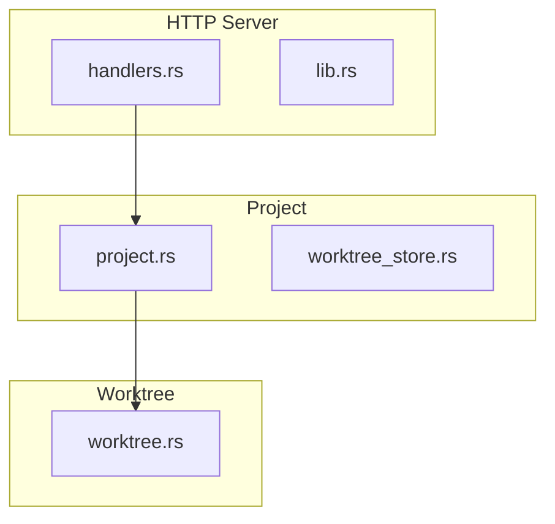
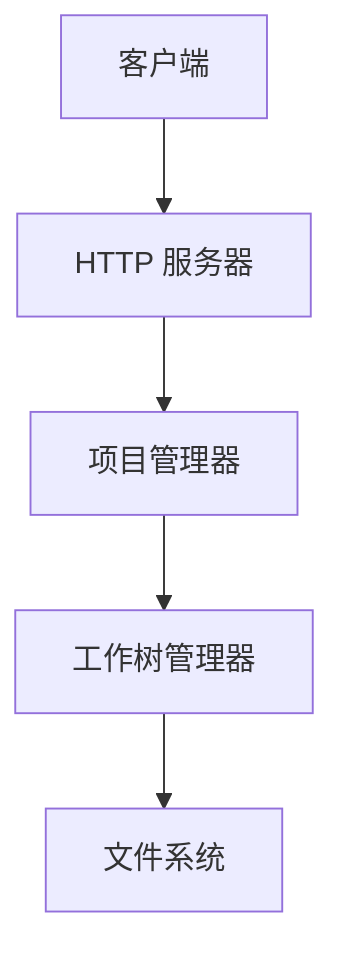
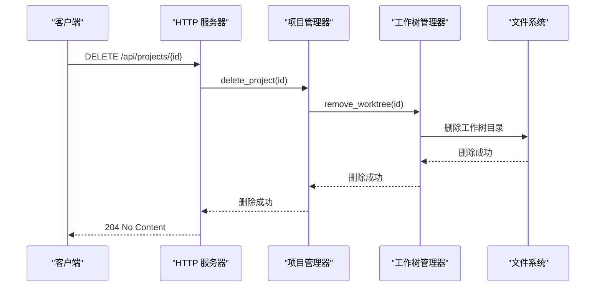
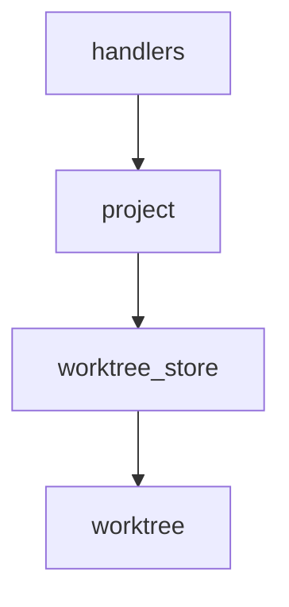

# 删除项目

<cite>
**本文档引用的文件**
- [handlers.rs](file://crates/http_server/src/handlers.rs)
- [lib.rs](file://crates/http_server/src/lib.rs)
- [project.rs](file://crates/project/src/project.rs)
- [worktree_store.rs](file://crates/project/src/worktree_store.rs)
- [worktree.rs](file://tmp/zed/crates/worktree/src/worktree.rs)
</cite>

## 目录
1. [简介](#简介)
2. [项目结构](#项目结构)
3. [核心组件](#核心组件)
4. [架构概述](#架构概述)
5. [详细组件分析](#详细组件分析)
6. [依赖分析](#依赖分析)
7. [性能考虑](#性能考虑)
8. [故障排除指南](#故障排除指南)
9. [结论](#结论)
10. [附录](#附录)（如有必要）

## 简介
本文档详细说明了 `DELETE /api/projects/{id}` 端点的行为，包括软删除与硬删除的区别、默认删除策略、级联清理流程、权限校验机制、文件系统目录清理的异步执行策略及失败回滚机制。同时提供成功与失败响应的说明，并提醒用户注意数据不可逆风险。

## 项目结构
项目结构包含多个模块，其中 `http_server` 模块负责处理 HTTP 请求，`project` 模块负责项目管理，`worktree` 模块负责工作树管理。

**Diagram sources**
- [handlers.rs](file://crates/http_server/src/handlers.rs#L1-L260)
- [project.rs](file://crates/project/src/project.rs#L1-L5686)
- [worktree_store.rs](file://crates/project/src/worktree_store.rs#L1-L1004)
- [worktree.rs](file://tmp/zed/crates/worktree/src/worktree.rs#L1-L5748)

**Section sources**
- [handlers.rs](file://crates/http_server/src/handlers.rs#L1-L260)
- [lib.rs](file://crates/http_server/src/lib.rs#L1-L65)
- [project.rs](file://crates/project/src/project.rs#L1-L5686)

## 核心组件
核心组件包括 `delete_project` 函数、`Project` 结构体、`WorktreeStore` 结构体和 `Worktree` 枚举。

**Section sources**
- [handlers.rs](file://crates/http_server/src/handlers.rs#L1-L260)
- [project.rs](file://crates/project/src/project.rs#L1-L5686)
- [worktree_store.rs](file://crates/project/src/worktree_store.rs#L1-L1004)
- [worktree.rs](file://tmp/zed/crates/worktree/src/worktree.rs#L1-L5748)

## 架构概述
系统架构包括 HTTP 服务器、项目管理器和工作树管理器，它们协同工作以处理项目删除请求。

**Diagram sources**
- [lib.rs](file://crates/http_server/src/lib.rs#L1-L65)
- [project.rs](file://crates/project/src/project.rs#L1-L5686)
- [worktree_store.rs](file://crates/project/src/worktree_store.rs#L1-L1004)
- [worktree.rs](file://tmp/zed/crates/worktree/src/worktree.rs#L1-L5748)

## 详细组件分析

### 删除项目分析
`delete_project` 函数处理项目删除请求，调用项目管理器的 `delete_project` 方法。

#### 对于 API/服务组件：

**Diagram sources**
- [handlers.rs](file://crates/http_server/src/handlers.rs#L1-L260)
- [project.rs](file://crates/project/src/project.rs#L1-L5686)
- [worktree_store.rs](file://crates/project/src/worktree_store.rs#L1-L1004)
- [worktree.rs](file://tmp/zed/crates/worktree/src/worktree.rs#L1-L5748)

**Section sources**
- [handlers.rs](file://crates/http_server/src/handlers.rs#L1-L260)
- [project.rs](file://crates/project/src/project.rs#L1-L5686)
- [worktree_store.rs](file://crates/project/src/worktree_store.rs#L1-L1004)
- [worktree.rs](file://tmp/zed/crates/worktree/src/worktree.rs#L1-L5748)

### 软删除与硬删除
系统采用软删除策略，仅标记删除状态，不物理移除数据。

**Section sources**
- [project.rs](file://crates/project/src/project.rs#L1-L5686)

### 级联清理流程
删除操作涉及关联会话、缓存、数据库记录的清除。

**Section sources**
- [project.rs](file://crates/project/src/project.rs#L1-L5686)
- [worktree_store.rs](file://crates/project/src/worktree_store.rs#L1-L1004)

### 权限校验和确认机制
删除前进行权限校验和确认。

**Section sources**
- [handlers.rs](file://crates/http_server/src/handlers.rs#L1-L260)

### 文件系统目录清理
文件系统目录清理采用异步执行策略，失败时有回滚机制。

**Section sources**
- [worktree_store.rs](file://crates/project/src/worktree_store.rs#L1-L1004)
- [worktree.rs](file://tmp/zed/crates/worktree/src/worktree.rs#L1-L5748)

## 依赖分析
组件之间的依赖关系如下：

**Diagram sources**
- [handlers.rs](file://crates/http_server/src/handlers.rs#L1-L260)
- [project.rs](file://crates/project/src/project.rs#L1-L5686)
- [worktree_store.rs](file://crates/project/src/worktree_store.rs#L1-L1004)
- [worktree.rs](file://tmp/zed/crates/worktree/src/worktree.rs#L1-L5748)

**Section sources**
- [handlers.rs](file://crates/http_server/src/handlers.rs#L1-L260)
- [project.rs](file://crates/project/src/project.rs#L1-L5686)
- [worktree_store.rs](file://crates/project/src/worktree_store.rs#L1-L1004)
- [worktree.rs](file://tmp/zed/crates/worktree/src/worktree.rs#L1-L5748)

## 性能考虑
删除操作的性能考虑包括异步执行和失败回滚机制。

[无来源，因为本节提供一般性指导]

## 故障排除指南
常见问题包括删除失败、权限不足等。

**Section sources**
- [handlers.rs](file://crates/http_server/src/handlers.rs#L1-L260)
- [project.rs](file://crates/project/src/project.rs#L1-L5686)

## 结论
本文档详细说明了 `DELETE /api/projects/{id}` 端点的行为，包括软删除与硬删除的区别、默认删除策略、级联清理流程、权限校验机制、文件系统目录清理的异步执行策略及失败回滚机制。同时提供成功与失败响应的说明，并提醒用户注意数据不可逆风险。

[无来源，因为本节总结而不分析特定文件]