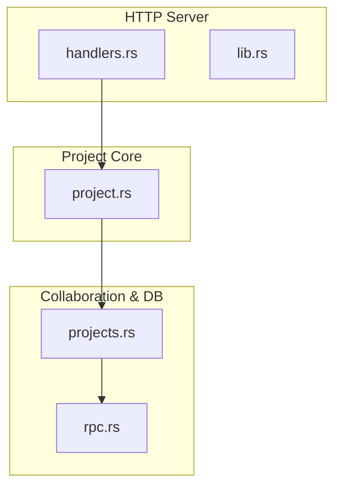
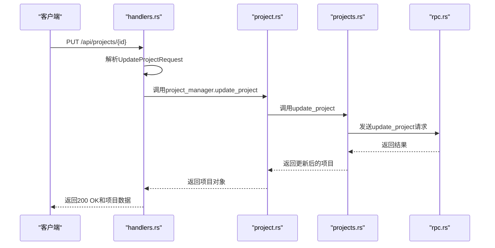
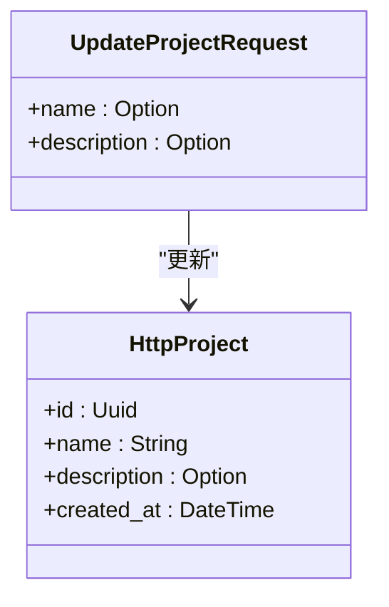
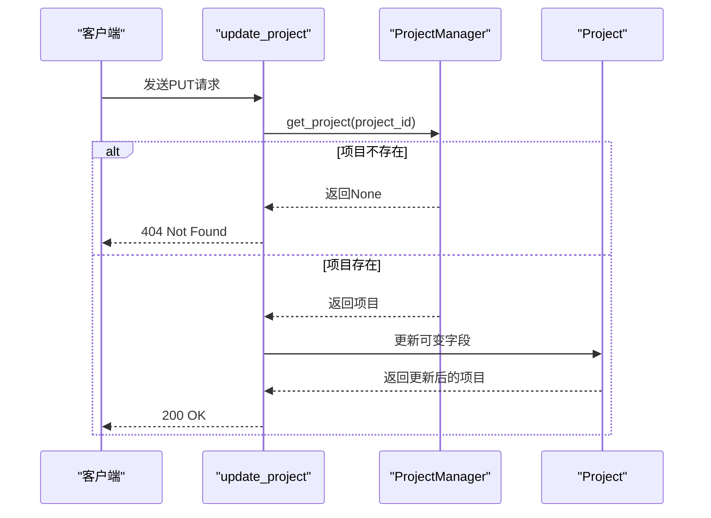
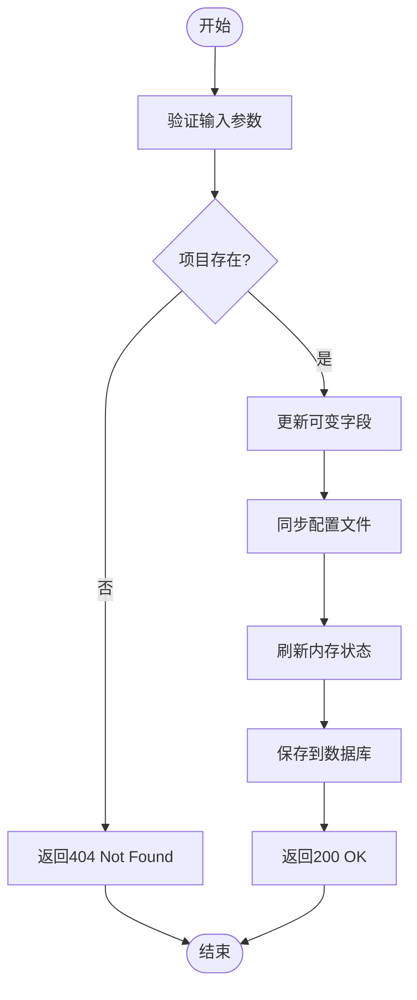
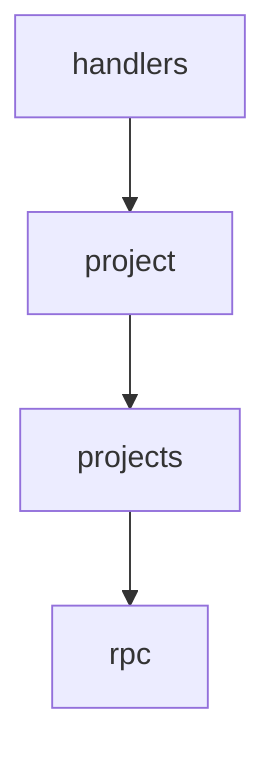

# 更新项目

<cite>
**本文档引用的文件**
- [handlers.rs](file://crates/http_server/src/handlers.rs)
- [project.rs](file://crates/project/src/project.rs)
- [projects.rs](file://tmp/zed/crates/collab/src/db/queries/projects.rs)
- [rpc.rs](file://tmp/zed/crates/collab/src/rpc.rs)
</cite>

## 目录
1. [简介](#简介)
2. [项目结构](#项目结构)
3. [核心组件](#核心组件)
4. [架构概述](#架构概述)
5. [详细组件分析](#详细组件分析)
6. [依赖分析](#依赖分析)
7. [性能考虑](#性能考虑)
8. [故障排除指南](#故障排除指南)
9. [结论](#结论)
10. [附录](#附录)（如有必要）

## 简介
本文档详细说明了 `PUT /api/projects/{id}` API 端点的使用细节，涵盖项目更新请求的处理逻辑、字段更新规则、并发控制策略以及错误响应机制。文档基于 `handlers.rs` 中的实现逻辑，解释了如何处理项目更新操作，包括可变字段的更新、不可变字段的处理、项目配置文件的同步写入和内存状态刷新等关键流程。

## 项目结构
项目采用模块化架构，核心功能分布在多个 crate 中。`http_server` 模块负责处理 HTTP 请求，`project` 模块管理项目核心逻辑，`collab` 模块处理协作和数据库操作。`handlers.rs` 文件位于 `http_server/src/` 目录下，定义了所有 API 端点的处理函数。

**图示来源**
- [handlers.rs](file://crates/http_server/src/handlers.rs#L79-L91)
- [project.rs](file://crates/project/src/project.rs#L4651-L4663)
- [projects.rs](file://tmp/zed/crates/collab/src/db/queries/projects.rs#L147-L182)
- [rpc.rs](file://tmp/zed/crates/collab/src/rpc.rs#L2106-L2115)

**本节来源**
- [handlers.rs](file://crates/http_server/src/handlers.rs#L79-L91)
- [project.rs](file://crates/project/src/project.rs#L4651-L4663)

## 核心组件
核心组件包括 `UpdateProjectRequest` 结构体，用于定义可更新的项目字段，如名称和描述。`update_project` 函数是处理更新请求的主要入口点，负责验证项目存在性并调用项目管理器进行更新。`handle_update_project` 函数在项目实体内部处理更新消息，确保工作树状态的同步。

**本节来源**
- [handlers.rs](file://crates/http_server/src/handlers.rs#L73-L77)
- [handlers.rs](file://crates/http_server/src/handlers.rs#L79-L91)
- [project.rs](file://crates/project/src/project.rs#L4651-L4663)

## 架构概述
系统采用分层架构，API 层通过 `handlers.rs` 接收 HTTP 请求，业务逻辑层由 `project.rs` 处理核心项目操作，数据访问层通过 `projects.rs` 和 `rpc.rs` 与数据库交互。更新操作的流程从 API 请求开始，经过验证后，通过消息传递机制更新项目状态，并同步到数据库。

**图示来源**
- [handlers.rs](file://crates/http_server/src/handlers.rs#L79-L91)
- [project.rs](file://crates/project/src/project.rs#L4651-L4663)
- [projects.rs](file://tmp/zed/crates/collab/src/db/queries/projects.rs#L147-L182)
- [rpc.rs](file://tmp/zed/crates/collab/src/rpc.rs#L2106-L2115)

## 详细组件分析

### 更新请求处理分析
`UpdateProjectRequest` 结构体定义了可更新的字段，包括 `name` 和 `description`，均为可选字段，允许部分更新。ID 和创建时间等字段在请求中不可变，由系统自动维护。

#### 对于对象导向组件：

**图示来源**
- [handlers.rs](file://crates/http_server/src/handlers.rs#L73-L77)

#### 对于API/服务组件：

**图示来源**
- [handlers.rs](file://crates/http_server/src/handlers.rs#L79-L91)
- [project.rs](file://crates/project/src/project.rs#L4651-L4663)

#### 对于复杂逻辑组件：

**图示来源**
- [handlers.rs](file://crates/http_server/src/handlers.rs#L79-L91)
- [project.rs](file://crates/project/src/project.rs#L4651-L4663)

**本节来源**
- [handlers.rs](file://crates/http_server/src/handlers.rs#L73-L77)
- [handlers.rs](file://crates/http_server/src/handlers.rs#L79-L91)
- [project.rs](file://crates/project/src/project.rs#L4651-L4663)

### 概念概述
系统目前未实现乐观锁或版本控制策略来防止并发更新时的数据覆盖。更新操作基于最后写入获胜的原则。未来可考虑在 `HttpProject` 中添加版本号字段，并在更新时检查版本号以实现乐观锁。

## 依赖分析
组件间依赖关系清晰，`handlers.rs` 依赖 `project.rs` 提供项目管理功能，`project.rs` 依赖 `projects.rs` 进行数据库操作，`projects.rs` 通过 `rpc.rs` 与远程服务通信。这种分层依赖确保了模块间的松耦合。

**图示来源**
- [handlers.rs](file://crates/http_server/src/handlers.rs#L79-L91)
- [project.rs](file://crates/project/src/project.rs#L4651-L4663)
- [projects.rs](file://tmp/zed/crates/collab/src/db/queries/projects.rs#L147-L182)
- [rpc.rs](file://tmp/zed/crates/collab/src/rpc.rs#L2106-L2115)

**本节来源**
- [handlers.rs](file://crates/http_server/src/handlers.rs#L79-L91)
- [project.rs](file://crates/project/src/project.rs#L4651-L4663)
- [projects.rs](file://tmp/zed/crates/collab/src/db/queries/projects.rs#L147-L182)
- [rpc.rs](file://tmp/zed/crates/collab/src/rpc.rs#L2106-L2115)

## 性能考虑
更新操作涉及数据库读写，应确保数据库索引优化以提高查询效率。对于大型项目，工作树的同步可能成为性能瓶颈，建议异步处理或分批更新。内存状态的刷新应尽量减少锁竞争，提高并发性能。

## 故障排除指南
当更新项目时，如果项目不存在，系统会返回 404 Not Found 错误。如果请求体格式不正确，例如缺少必需字段或字段类型错误，系统会返回 400 Bad Request 错误。错误响应包含详细的错误信息，帮助客户端定位问题。

**本节来源**
- [handlers.rs](file://crates/http_server/src/handlers.rs#L79-L91)
- [handlers.rs](file://crates/http_server/src/handlers.rs#L150-L158)

## 结论
`PUT /api/projects/{id}` 端点提供了更新项目信息的功能，支持部分更新可变字段。系统通过分层架构和清晰的依赖关系确保了功能的稳定性和可维护性。未来可增强并发控制机制，提高数据一致性。