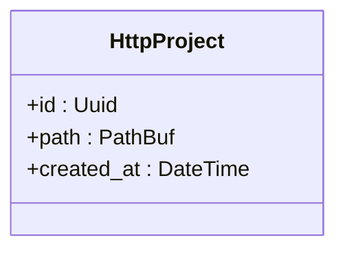
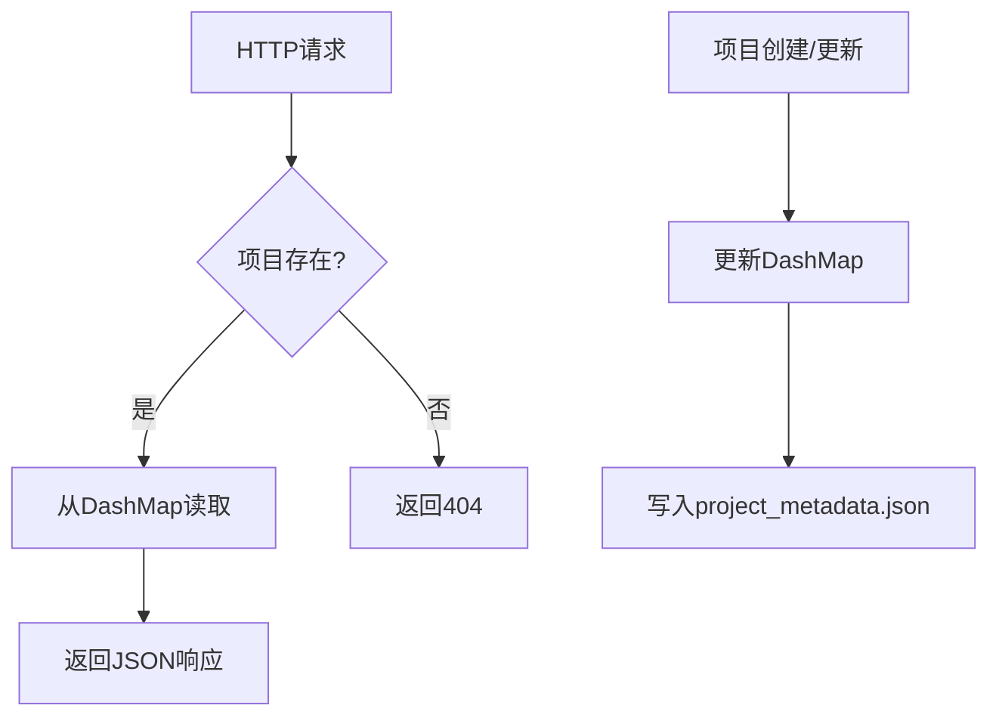

# 获取单个项目

<cite>
**本文档中引用的文件**
- [project.rs](file://crates/project/src/project.rs)
- [handlers.rs](file://crates/http_server/src/handlers.rs)
- [http_interface.rs](file://crates/http_server/src/http_interface.rs)
</cite>

## 目录
1. [简介](#简介)
2. [API端点说明](#api端点说明)
3. [路径参数{id}格式要求](#路径参数id格式要求)
4. [项目不存在时的404处理逻辑](#项目不存在时的404处理逻辑)
5. [ProjectResponse对象结构](#projectresponse对象结构)
6. [项目加载流程与状态恢复机制](#项目加载流程与状态恢复机制)
7. [缓存策略分析](#缓存策略分析)
8. [成功响应示例](#成功响应示例)
9. [错误码及其触发条件](#错误码及其触发条件)

## 简介
本文档详细说明了获取单个项目详情的API接口 `GET /api/projects/{id}` 的实现机制。该接口用于根据项目唯一标识符（UUID）获取项目元数据信息，包括项目路径、创建时间等。文档将结合 `project.rs` 中的加载流程，深入解析项目状态恢复和缓存策略，并提供完整的响应示例及错误处理逻辑。

**Section sources**
- [handlers.rs](file://crates/http_server/src/handlers.rs#L61-L71)

## API端点说明
`GET /api/projects/{id}` 是一个HTTP GET请求端点，用于获取指定ID的项目详细信息。此端点由 `http_server` 模块中的 `get_project` 函数处理，接收项目ID作为路径参数，并返回封装为 `HttpProject` 结构的JSON响应。

该端点通过依赖注入获取 `AppState` 实例，从中访问 `project_manager` 来执行实际的项目查询操作。若项目存在，则返回200 OK状态码及项目数据；若项目不存在，则返回404 Not Found。

**Section sources**
- [handlers.rs](file://crates/http_server/src/handlers.rs#L61-L71)
- [http_interface.rs](file://crates/http_server/src/http_interface.rs#L18-L24)

## 路径参数{id}格式要求
路径参数 `{id}` 必须为有效的UUID v7格式。系统使用 `uuid::Uuid` 类型进行解析和验证。在请求处理过程中，Axum框架会自动尝试将路径中的字符串转换为 `Uuid` 类型，若转换失败则返回400 Bad Request错误。

UUID作为项目唯一标识符，在项目创建时通过 `Uuid::now_v7()` 生成，确保时间有序性和全局唯一性。该ID同时用作项目存储目录的名称，便于文件系统组织与查找。

**Section sources**
- [handlers.rs](file://crates/http_server/src/handlers.rs#L61-L71)
- [http_interface.rs](file://crates/http_server/src/http_interface.rs#L18-L24)

## 项目不存在时的404处理逻辑
当请求的项目ID在 `HttpProjectManager` 的 `projects` 映射中未找到时，`get_project` 方法返回 `None`。此时，处理函数将其转换为 `Err(StatusCode::NOT_FOUND)`，从而向客户端返回HTTP 404 Not Found状态码。

这一逻辑通过 `Option::ok_or()` 方法实现：
```rust
let project = state.project_manager.get_project(project_id).await
    .ok_or(StatusCode::NOT_FOUND)?;
```
该机制确保了对无效或不存在的项目ID请求能够正确反馈资源未找到的状态，符合RESTful API设计规范。

**Section sources**
- [handlers.rs](file://crates/http_server/src/handlers.rs#L61-L71)

## ProjectResponse对象结构
`ProjectResponse` 对象在代码中以 `HttpProject` 结构体表示，包含以下字段：

| 字段名 | 类型 | 说明 |
|-------|------|------|
| `id` | `Uuid` | 项目的唯一标识符，使用UUID v7生成 |
| `path` | `PathBuf` | 项目在文件系统中的存储路径 |
| `created_at` | `chrono::DateTime<Utc>` | 项目创建的时间戳，UTC时区 |

该结构实现了 `Serialize` 和 `Deserialize` 特性，支持JSON序列化与反序列化，便于通过HTTP接口传输。



**Diagram sources**
- [http_interface.rs](file://crates/http_server/src/http_interface.rs#L18-L24)

## 项目加载流程与状态恢复机制
项目加载流程始于 `HttpProjectManager::new_with_loading()` 方法，该方法在初始化时自动调用 `load_existing_projects()` 扫描工作目录下的所有子目录。每个子目录若其名称为有效UUID，则被视为一个项目。

对于每个识别出的项目，系统会：
1. 检查是否存在 `project_metadata.json` 元数据文件
2. 若存在，则从中读取 `created_at` 时间戳
3. 若不存在，则回退使用目录的最后修改时间作为创建时间
4. 将项目信息插入 `DashMap` 缓存中

此机制确保了服务重启后能自动恢复所有现有项目的状态，无需重新创建。

**Section sources**
- [http_interface.rs](file://crates/http_server/src/http_interface.rs#L40-L95)

## 缓存策略分析
系统采用内存缓存与持久化存储相结合的策略。所有项目信息均存储在 `DashMap<Uuid, HttpProject>` 中，提供高效的并发读写访问。`DashMap` 的分片锁机制避免了全局锁竞争，适合高并发场景。

此外，每个项目在文件系统中都有对应的元数据文件 `project_metadata.json`，用于持久化存储项目信息。每次创建或更新项目时，系统都会调用 `save_project_metadata()` 将最新状态写入磁盘，确保数据可靠性。

缓存与持久化的一致性由业务逻辑保证：所有项目变更操作均同步更新内存缓存和磁盘文件。



**Diagram sources**
- [http_interface.rs](file://crates/http_server/src/http_interface.rs#L40-L95)

## 成功响应示例
```json
{
  "id": "f47ac10b-58cc-4372-a567-0e02b2c3d479",
  "path": "/Users/example/projects/f47ac10b-58cc-4372-a567-0e02b2c3d479",
  "created_at": "2023-12-01T10:00:00Z"
}
```

**Section sources**
- [http_interface.rs](file://crates/http_server/src/http_interface.rs#L18-L24)

## 错误码及其触发条件
| 错误码 | 触发条件 | 说明 |
|-------|---------|------|
| 400 Bad Request | 路径参数{id}不是有效的UUID格式 | 客户端提供的ID无法解析为UUID |
| 404 Not Found | 项目ID在系统中不存在 | 请求的项目未被创建或已被删除 |
| 500 Internal Server Error | 读取元数据文件失败或序列化异常 | 服务器内部错误，通常由文件系统问题引起 |

这些错误码通过 `Result<Json<HttpProject>, StatusCode>` 返回类型进行处理，确保客户端能够根据HTTP状态码准确判断请求结果。

**Section sources**
- [handlers.rs](file://crates/http_server/src/handlers.rs#L61-L71)
- [http_interface.rs](file://crates/http_server/src/http_interface.rs#L40-L95)