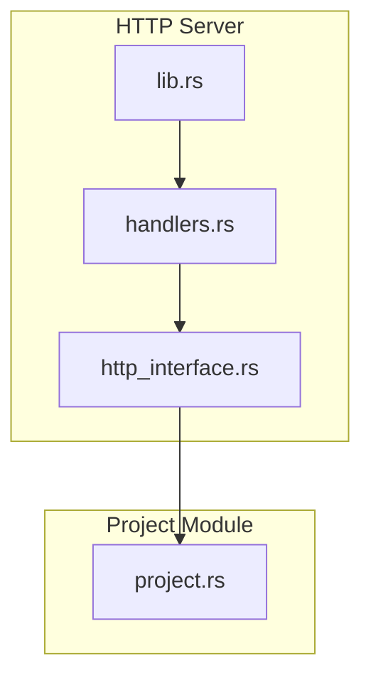
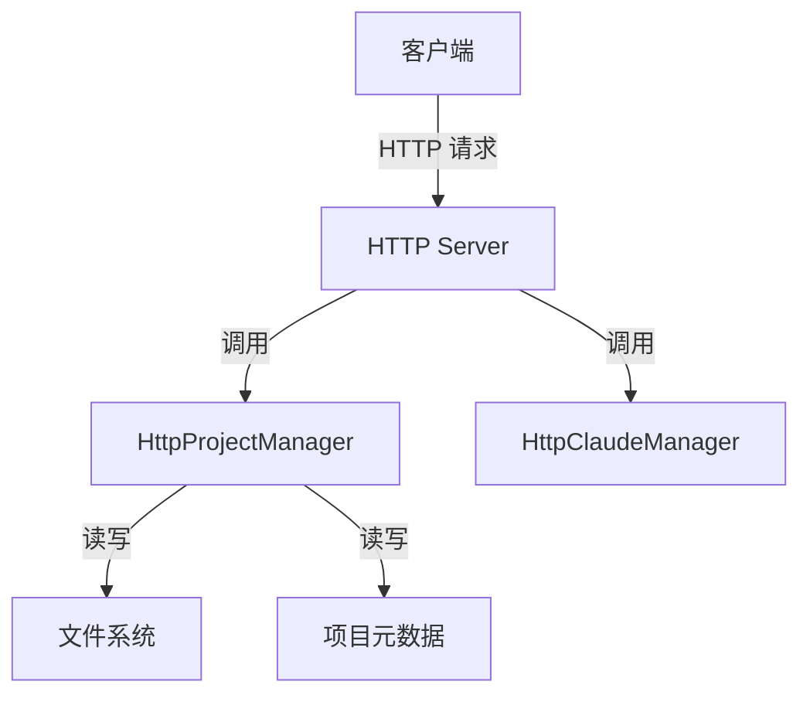
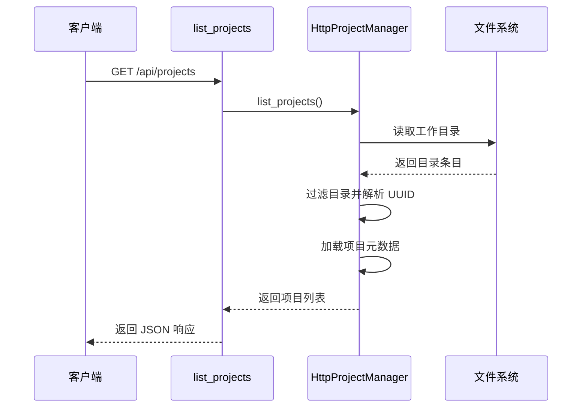
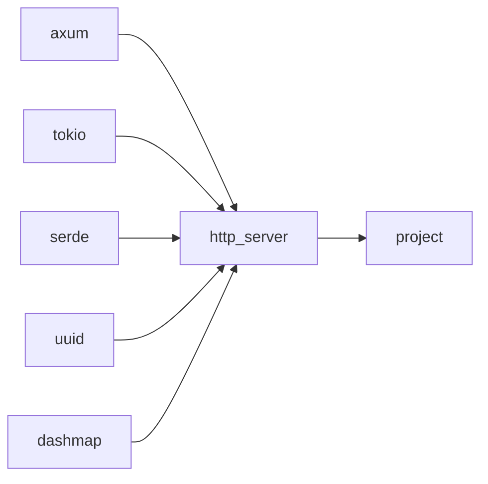

# 获取项目列表

<cite>
**本文档中引用的文件**  
- [handlers.rs](file://crates/http_server/src/handlers.rs)
- [lib.rs](file://crates/http_server/src/lib.rs)
- [http_interface.rs](file://crates/http_server/src/http_interface.rs)
- [project.rs](file://crates/project/src/project.rs)
</cite>

## 目录
1. [简介](#简介)
2. [项目结构](#项目结构)
3. [核心组件](#核心组件)
4. [架构概述](#架构概述)
5. [详细组件分析](#详细组件分析)
6. [依赖分析](#依赖分析)
7. [性能考虑](#性能考虑)
8. [故障排除指南](#故障排除指南)
9. [结论](#结论)

## 简介
本文档详细描述了 `GET /api/projects` API 端点的功能，该端点用于获取系统中所有可用项目的列表。该接口从文件系统和数据库中检索项目信息，并将其序列化为 `ProjectResponse` 对象数组返回。文档还说明了分页参数（如 `limit` 和 `offset`）的可选支持情况，以及默认按创建时间降序排序的规则。此外，结合 `project` 模块中的查询逻辑，解释了性能优化策略（如惰性加载）和潜在的 I/O 瓶颈处理方式。

## 项目结构
项目结构基于 Rust 的模块化设计，主要分为 `crates` 目录下的多个子模块。`http_server` 负责处理 HTTP 请求，`project` 模块负责项目管理，`shared_types` 提供共享类型定义。API 路由在 `lib.rs` 中定义，处理逻辑在 `handlers.rs` 中实现，项目数据结构在 `http_interface.rs` 中定义。

**图示来源**  
- [handlers.rs](file://crates/http_server/src/handlers.rs#L1-L260)
- [lib.rs](file://crates/http_server/src/lib.rs#L1-L65)
- [http_interface.rs](file://crates/http_server/src/http_interface.rs#L1-L269)
- [project.rs](file://crates/project/src/project.rs#L1-L799)

**章节来源**  
- [handlers.rs](file://crates/http_server/src/handlers.rs#L1-L260)
- [lib.rs](file://crates/http_server/src/lib.rs#L1-L65)
- [http_interface.rs](file://crates/http_server/src/http_interface.rs#L1-L269)

## 核心组件
核心组件包括 `HttpProjectManager` 用于管理项目生命周期，`HttpClaudeManager` 用于与外部服务通信，`AppState` 作为共享状态容器，`HttpProject` 作为项目数据结构。这些组件协同工作，实现项目列表的获取、创建、更新和删除功能。

**章节来源**  
- [http_interface.rs](file://crates/http_server/src/http_interface.rs#L1-L269)
- [lib.rs](file://crates/http_server/src/lib.rs#L1-L65)

## 架构概述
系统采用分层架构，前端通过 HTTP 请求与 `http_server` 交互，`http_server` 调用 `project` 模块进行实际的项目管理操作。`HttpProjectManager` 负责项目数据的持久化和检索，`HttpClaudeManager` 负责与外部 AI 服务通信。

**图示来源**  
- [http_interface.rs](file://crates/http_server/src/http_interface.rs#L1-L269)
- [handlers.rs](file://crates/http_server/src/handlers.rs#L1-L260)

## 详细组件分析

### 项目列表获取分析
`list_projects` 函数是获取项目列表的核心实现。它从 `HttpProjectManager` 中异步获取所有项目，并返回 JSON 格式的响应。该函数支持可选的查询参数，如 `search`、`page` 和 `limit`，但当前实现中未完全利用这些参数。

**图示来源**  
- [handlers.rs](file://crates/http_server/src/handlers.rs#L1-L260)
- [http_interface.rs](file://crates/http_server/src/http_interface.rs#L1-L269)

**章节来源**  
- [handlers.rs](file://crates/http_server/src/handlers.rs#L1-L260)
- [http_interface.rs](file://crates/http_server/src/http_interface.rs#L1-L269)

### 性能优化策略
`HttpProjectManager` 在初始化时异步加载现有项目，使用 `DashMap` 实现高效的并发访问。项目元数据持久化到 `project_metadata.json` 文件中，避免每次请求都扫描文件系统。对于大型项目集合，可以进一步实现分页和缓存机制以减少 I/O 开销。

**章节来源**  
- [http_interface.rs](file://crates/http_server/src/http_interface.rs#L1-L269)

## 依赖分析
系统依赖于 `axum` 作为 Web 框架，`tokio` 用于异步运行时，`serde` 用于序列化，`uuid` 用于生成唯一标识符，`dashmap` 用于并发哈希映射。这些依赖通过 `Cargo.toml` 文件管理。

**图示来源**  
- [Cargo.toml](file://Cargo.toml#L1-L10)
- [lib.rs](file://crates/http_server/src/lib.rs#L1-L65)

**章节来源**  
- [Cargo.toml](file://Cargo.toml#L1-L10)
- [lib.rs](file://crates/http_server/src/lib.rs#L1-L65)

## 性能考虑
当前实现中，`list_projects` 每次调用都会从内存中的 `DashMap` 返回项目列表，性能较高。但在项目数量庞大时，初始化加载可能成为瓶颈。建议实现惰性加载和分页支持，避免一次性加载所有项目。此外，可以引入缓存机制，减少对文件系统的频繁访问。

**章节来源**  
- [http_interface.rs](file://crates/http_server/src/http_interface.rs#L1-L269)

## 故障排除指南
常见问题包括项目无法创建（权限问题）、元数据文件损坏、UUID 解析失败等。日志记录在 `info!` 和 `warn!` 宏中，可用于调试。确保工作目录存在且可写，项目目录名必须是有效的 UUID。

**章节来源**  
- [http_interface.rs](file://crates/http_server/src/http_interface.rs#L1-L269)
- [handlers.rs](file://crates/http_server/src/handlers.rs#L1-L260)

## 结论
`GET /api/projects` 端点提供了一个高效的方式来获取系统中所有项目的列表。通过合理的架构设计和性能优化策略，系统能够快速响应请求。未来可以进一步增强分页支持和缓存机制，以应对更大规模的项目集合。