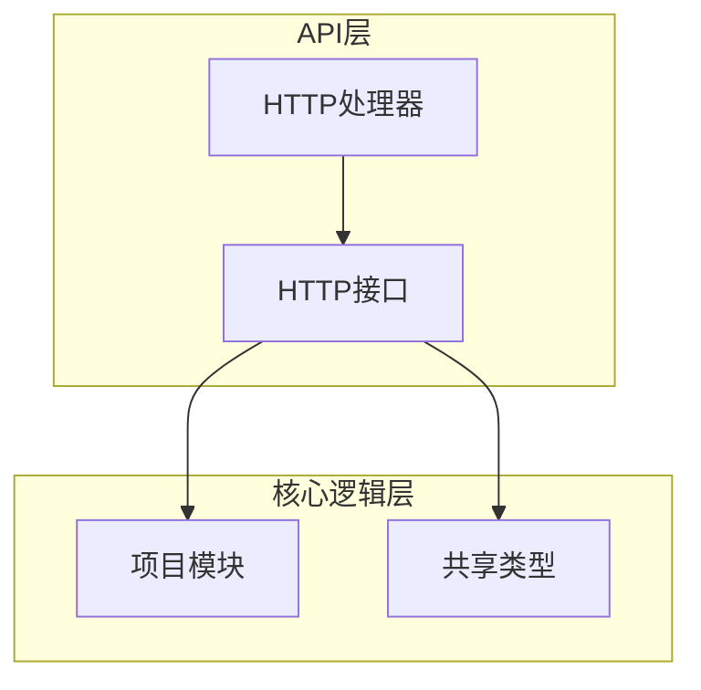
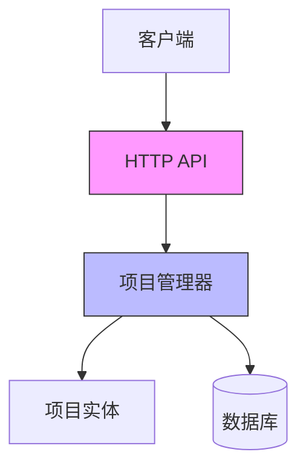
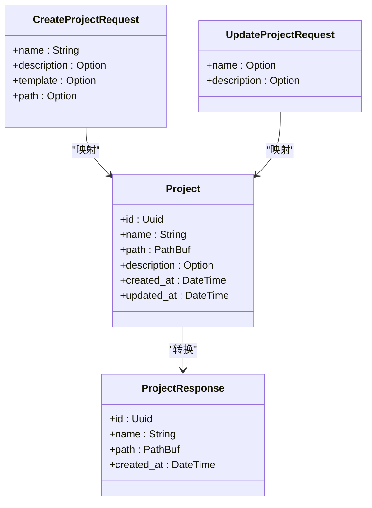
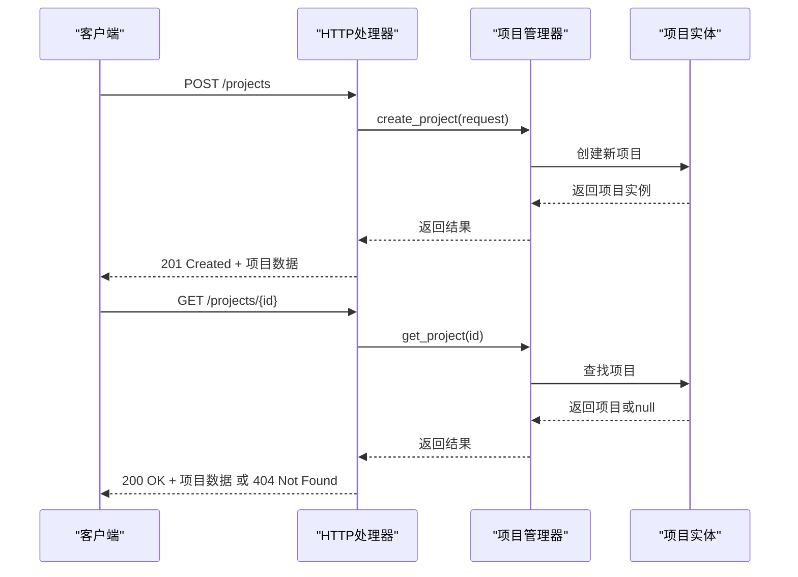
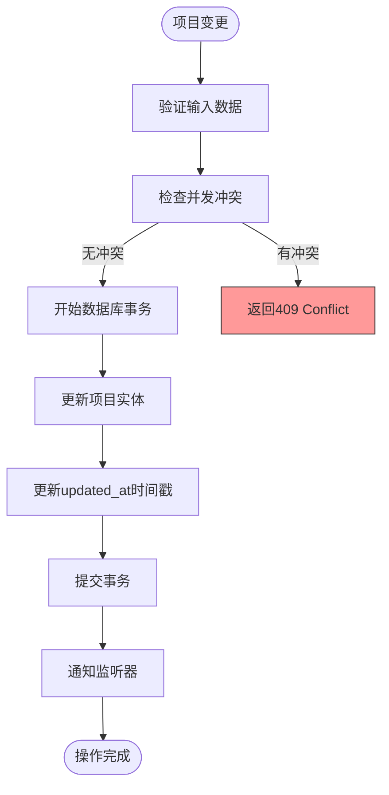
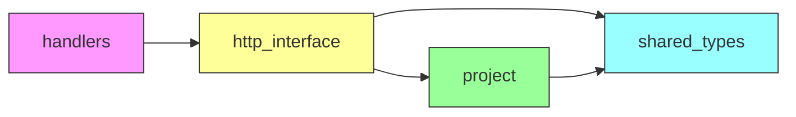

# 项目管理API

<cite>
**本文档中引用的文件**  
- [project.rs](file://crates/project/src/project.rs)
- [lib.rs](file://crates/shared_types/src/lib.rs)
- [handlers.rs](file://crates/http_server/src/handlers.rs)
- [http_interface.rs](file://crates/http_server/src/http_interface.rs)
</cite>

## 目录
1. [简介](#简介)
2. [项目结构](#项目结构)
3. [核心组件](#核心组件)
4. [架构概述](#架构概述)
5. [详细组件分析](#详细组件分析)
6. [依赖分析](#依赖分析)
7. [性能考虑](#性能考虑)
8. [故障排除指南](#故障排除指南)
9. [结论](#结论)

## 简介
本文档详细描述了rcoder项目中的项目管理API，涵盖项目创建、读取、更新和删除（CRUD）操作。文档明确了每个端点的HTTP方法、URL路径、请求头、请求体结构以及响应格式。同时解释了项目状态同步机制、并发更新处理策略和数据库事务在项目创建过程中的作用。

## 项目结构
项目管理功能分布在多个crate中，主要包括：
- `project` crate：核心项目管理逻辑
- `shared_types` crate：共享的数据结构定义
- `http_server` crate：HTTP API接口和处理逻辑



**Diagram sources**
- [handlers.rs](file://crates/http_server/src/handlers.rs#L1-L50)
- [http_interface.rs](file://crates/http_server/src/http_interface.rs#L1-L20)

**Section sources**
- [project.rs](file://crates/project/src/project.rs#L1-L100)
- [lib.rs](file://crates/shared_types/src/lib.rs#L1-L20)

## 核心组件
项目管理API的核心组件包括项目实体、请求/响应结构和HTTP处理器。这些组件协同工作以提供完整的项目生命周期管理功能。

**Section sources**
- [project.rs](file://crates/project/src/project.rs#L172-L214)
- [lib.rs](file://crates/shared_types/src/lib.rs#L5-L21)
- [handlers.rs](file://crates/http_server/src/handlers.rs#L51-L97)

## 架构概述
项目管理API采用分层架构设计，将HTTP接口与核心业务逻辑分离。API层负责处理HTTP请求和响应，而核心逻辑层负责实际的项目管理操作。



**Diagram sources**
- [handlers.rs](file://crates/http_server/src/handlers.rs#L1-L260)
- [project.rs](file://crates/project/src/project.rs#L172-L214)

## 详细组件分析

### 项目CRUD操作分析
项目管理API提供了完整的CRUD操作，每个操作都有明确的HTTP端点和数据结构。

#### API端点定义


**Diagram sources**
- [lib.rs](file://crates/shared_types/src/lib.rs#L15-L21)
- [http_interface.rs](file://crates/http_server/src/http_interface.rs#L17-L23)

#### HTTP请求流程


**Diagram sources**
- [handlers.rs](file://crates/http_server/src/handlers.rs#L51-L80)
- [http_interface.rs](file://crates/http_server/src/http_interface.rs#L11-L15)

### 项目状态同步机制
项目状态同步通过事件驱动架构实现，确保项目状态在不同组件间保持一致。



**Diagram sources**
- [project.rs](file://crates/project/src/project.rs#L172-L214)
- [handlers.rs](file://crates/http_server/src/handlers.rs#L73-L77)

**Section sources**
- [project.rs](file://crates/project/src/project.rs#L172-L214)
- [handlers.rs](file://crates/http_server/src/handlers.rs#L73-L77)

## 依赖分析
项目管理API的组件间存在明确的依赖关系，确保了功能的模块化和可维护性。



**Diagram sources**
- [Cargo.toml](file://crates/http_server/Cargo.toml#L1-L20)
- [Cargo.toml](file://crates/project/Cargo.toml#L1-L20)

**Section sources**
- [handlers.rs](file://crates/http_server/src/handlers.rs#L1-L10)
- [http_interface.rs](file://crates/http_server/src/http_interface.rs#L1-L10)

## 性能考虑
项目管理API在设计时考虑了性能因素，特别是在处理大量项目和并发请求时。

- 项目列表查询支持分页和搜索参数
- 使用异步操作避免阻塞主线程
- 缓存常用项目数据以减少数据库查询
- 批量操作优化以提高效率

## 故障排除指南
### 常见错误码
| 错误码 | 含义 | 可能原因 |
|-------|------|---------|
| 400 | Bad Request | 请求体格式错误或必填字段缺失 |
| 404 | Not Found | 请求的项目ID不存在 |
| 409 | Conflict | 并发更新冲突或项目名重复 |
| 500 | Internal Server Error | 服务器内部错误，如数据库连接失败 |

### 使用示例
使用curl创建新项目的完整示例：
```bash
curl -X POST http://localhost:8080/projects \
  -H "Content-Type: application/json" \
  -d '{
    "name": "my-new-project",
    "description": "A sample project",
    "template": "rust-web-api"
  }'
```

**Section sources**
- [handlers.rs](file://crates/http_server/src/handlers.rs#L51-L60)
- [lib.rs](file://crates/shared_types/src/lib.rs#L15-L21)

## 结论
rcoder项目管理API提供了完整的项目生命周期管理功能，具有清晰的架构设计和良好的错误处理机制。通过合理的数据结构设计和状态同步策略，确保了系统的可靠性和一致性。