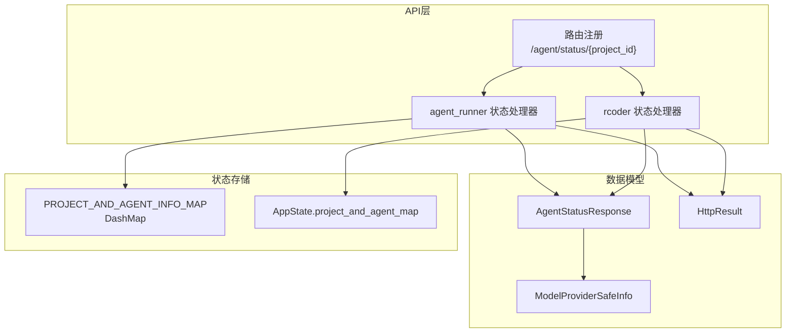
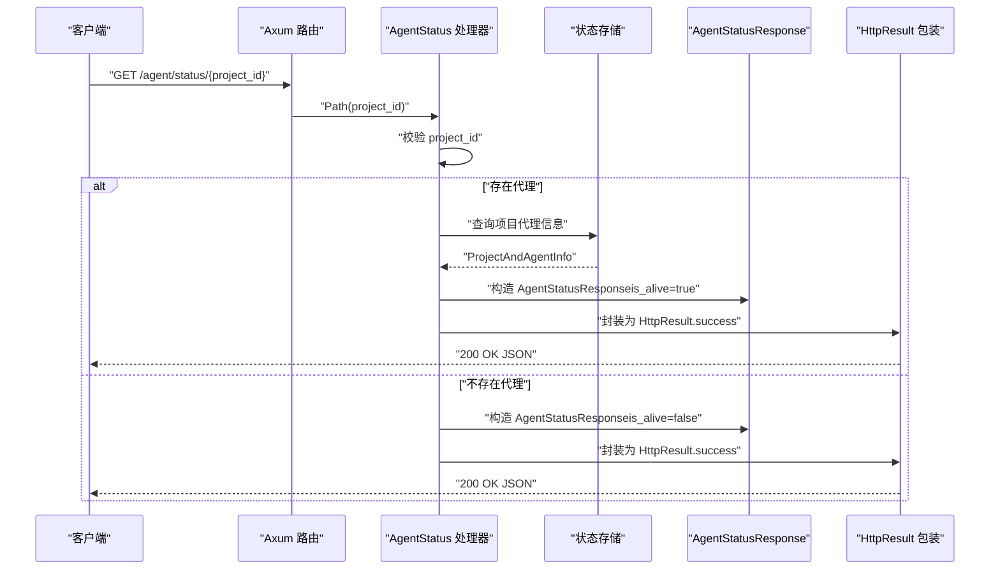
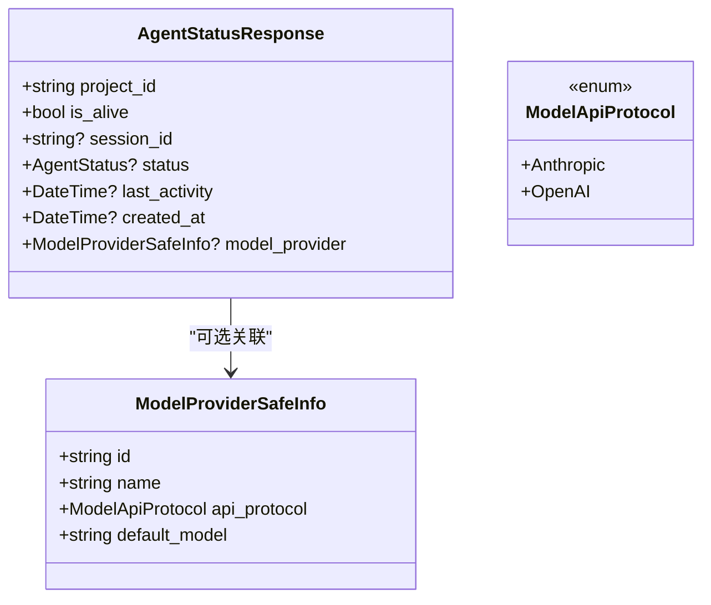
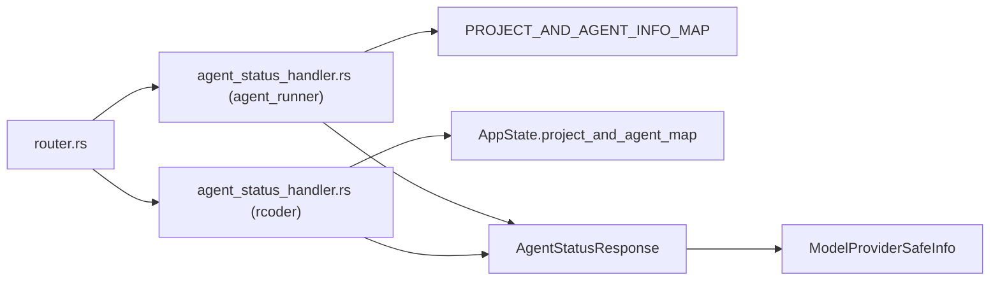

# 代理状态查询接口

<cite>
**本文引用的文件列表**
- [crates/agent_runner/src/handler/agent_status_handler.rs](file://crates/agent_runner/src/handler/agent_status_handler.rs)
- [crates/rcoder/src/handler/agent_status_handler.rs](file://crates/rcoder/src/handler/agent_status_handler.rs)
- [crates/agent_runner/src/router.rs](file://crates/agent_runner/src/router.rs)
- [crates/shared_types/src/model/agent_model.rs](file://crates/shared_types/src/model/agent_model.rs)
- [crates/shared_types/src/model/model_provider.rs](file://crates/shared_types/src/model/model_provider.rs)
- [crates/shared_types/src/model/http_result.rs](file://crates/shared_types/src/model/http_result.rs)
- [crates/agent_runner/src/proxy_agent/acp_agent.rs](file://crates/agent_runner/src/proxy_agent/acp_agent.rs)
- [crates/rcoder/src/proxy_agent/cleanup_task.rs](file://crates/rcoder/src/proxy_agent/cleanup_task.rs)
</cite>

## 目录
1. [简介](#简介)
2. [项目结构](#项目结构)
3. [核心组件](#核心组件)
4. [架构总览](#架构总览)
5. [详细组件分析](#详细组件分析)
6. [依赖关系分析](#依赖关系分析)
7. [性能考量](#性能考量)
8. [故障排查指南](#故障排查指南)
9. [结论](#结论)
10. [附录](#附录)

## 简介
本文档面向 RCoder 项目的“代理状态查询”API，聚焦 GET /agent/status/{project_id} 端点，系统性说明其 HTTP 方法、路径参数、响应格式与数据模型，并深入解释条件序列化机制（仅当代理存活时才包含详细字段）。同时提供成功响应示例（含代理运行中与未运行两种状态），并阐述该接口在客户端 UI 展示与自动化监控系统中的典型使用场景与集成方式。

## 项目结构
该接口位于两个模块中均有实现，分别服务于不同的运行形态：
- agent_runner 模块：基于 ACP 代理的实现，使用全局 DashMap 存储项目与代理信息。
- rcoder 模块：基于容器化 Agent 的实现，使用 AppState 中的项目到代理映射。

二者共享同一 AgentStatusResponse 数据模型与统一的 HTTP 包装格式。

图表来源
- [crates/agent_runner/src/router.rs](file://crates/agent_runner/src/router.rs#L40-L70)
- [crates/agent_runner/src/handler/agent_status_handler.rs](file://crates/agent_runner/src/handler/agent_status_handler.rs#L70-L122)
- [crates/rcoder/src/handler/agent_status_handler.rs](file://crates/rcoder/src/handler/agent_status_handler.rs#L72-L132)
- [crates/agent_runner/src/proxy_agent/acp_agent.rs](file://crates/agent_runner/src/proxy_agent/acp_agent.rs#L22-L25)
- [crates/shared_types/src/model/agent_model.rs](file://crates/shared_types/src/model/agent_model.rs#L70-L97)
- [crates/shared_types/src/model/model_provider.rs](file://crates/shared_types/src/model/model_provider.rs#L116-L132)
- [crates/shared_types/src/model/http_result.rs](file://crates/shared_types/src/model/http_result.rs#L24-L103)

章节来源
- [crates/agent_runner/src/router.rs](file://crates/agent_runner/src/router.rs#L40-L70)

## 核心组件
- HTTP 端点：GET /agent/status/{project_id}
- 路由注册：在 agent_runner 模块中通过路由工厂注册
- 处理器：
  - agent_runner：从全局 DashMap 读取项目代理信息
  - rcoder：从 AppState 中的项目到代理映射读取
- 数据模型：AgentStatusResponse（包含项目ID、存活标志、会话ID、状态、最后活动时间、创建时间、模型提供商安全信息）
- 条件序列化：仅当 is_alive 为 true 时，序列化 session_id、status、last_activity、created_at、model_provider
- HTTP 包装：统一返回 HttpResult<T> 结构，包含 code、message、data、tid、success 字段

章节来源
- [crates/agent_runner/src/handler/agent_status_handler.rs](file://crates/agent_runner/src/handler/agent_status_handler.rs#L70-L122)
- [crates/rcoder/src/handler/agent_status_handler.rs](file://crates/rcoder/src/handler/agent_status_handler.rs#L72-L132)
- [crates/shared_types/src/model/agent_model.rs](file://crates/shared_types/src/model/agent_model.rs#L70-L97)
- [crates/shared_types/src/model/http_result.rs](file://crates/shared_types/src/model/http_result.rs#L24-L103)

## 架构总览
下图展示从客户端到处理器、再到状态存储与响应封装的整体调用链路。

图表来源
- [crates/agent_runner/src/router.rs](file://crates/agent_runner/src/router.rs#L40-L70)
- [crates/agent_runner/src/handler/agent_status_handler.rs](file://crates/agent_runner/src/handler/agent_status_handler.rs#L70-L122)
- [crates/rcoder/src/handler/agent_status_handler.rs](file://crates/rcoder/src/handler/agent_status_handler.rs#L72-L132)
- [crates/shared_types/src/model/agent_model.rs](file://crates/shared_types/src/model/agent_model.rs#L70-L97)
- [crates/shared_types/src/model/http_result.rs](file://crates/shared_types/src/model/http_result.rs#L24-L103)

## 详细组件分析

### 端点定义与路由
- 方法：GET
- 路径：/agent/status/{project_id}
- 路由注册位置：在 agent_runner 模块的路由工厂中注册
- OpenAPI 注解：包含参数说明、响应示例与标签

章节来源
- [crates/agent_runner/src/router.rs](file://crates/agent_runner/src/router.rs#L40-L70)
- [crates/agent_runner/src/handler/agent_status_handler.rs](file://crates/agent_runner/src/handler/agent_status_handler.rs#L11-L69)

### 处理器逻辑（agent_runner）
- 输入校验：去除空白字符，若为空则返回参数错误
- 查询逻辑：从全局 DashMap 中按 project_id 获取代理信息
- 成功分支：构造完整 AgentStatusResponse（包含 session_id、status、last_activity、created_at、model_provider）
- 失败分支：构造简化 AgentStatusResponse（仅 project_id、is_alive=false）

章节来源
- [crates/agent_runner/src/handler/agent_status_handler.rs](file://crates/agent_runner/src/handler/agent_status_handler.rs#L70-L122)
- [crates/agent_runner/src/proxy_agent/acp_agent.rs](file://crates/agent_runner/src/proxy_agent/acp_agent.rs#L22-L25)

### 处理器逻辑（rcoder）
- 输入校验：同上
- 查询逻辑：从 AppState.project_and_agent_map 获取代理信息
- 成功分支：构造完整 AgentStatusResponse
- 失败分支：构造简化 AgentStatusResponse

章节来源
- [crates/rcoder/src/handler/agent_status_handler.rs](file://crates/rcoder/src/handler/agent_status_handler.rs#L72-L132)
- [crates/rcoder/src/proxy_agent/cleanup_task.rs](file://crates/rcoder/src/proxy_agent/cleanup_task.rs#L661-L680)

### 数据模型：AgentStatusResponse
- 字段说明：
  - project_id：项目ID
  - is_alive：代理是否存活
  - session_id：会话ID（仅当 is_alive 为 true 时存在）
  - status：代理服务状态（仅当 is_alive 为 true 时存在）
  - last_activity：最后活动时间（仅当 is_alive 为 true 时存在）
  - created_at：创建时间（仅当 is_alive 为 true 时存在）
  - model_provider：模型提供商安全信息（仅当 is_alive 为 true 时存在）
- 条件序列化：使用 serde 的 skip_serializing_if 仅在 Option 非空时序列化对应字段

图表来源
- [crates/shared_types/src/model/agent_model.rs](file://crates/shared_types/src/model/agent_model.rs#L70-L97)
- [crates/shared_types/src/model/model_provider.rs](file://crates/shared_types/src/model/model_provider.rs#L116-L132)

章节来源
- [crates/shared_types/src/model/agent_model.rs](file://crates/shared_types/src/model/agent_model.rs#L70-L97)
- [crates/shared_types/src/model/model_provider.rs](file://crates/shared_types/src/model/model_provider.rs#L116-L132)

### 条件序列化机制
- 仅当 is_alive 为 true 时，才会序列化 session_id、status、last_activity、created_at、model_provider
- 该机制通过 serde 的 skip_serializing_if 实现，避免在代理未运行时返回冗余字段

章节来源
- [crates/shared_types/src/model/agent_model.rs](file://crates/shared_types/src/model/agent_model.rs#L70-L97)

### HTTP 包装与响应格式
- 统一包装：HttpResult<T>，包含 code、message、data、tid、success
- 成功响应：success=true，data 为 AgentStatusResponse
- 失败响应：success=false，data=null，error 包含错误码与消息

章节来源
- [crates/shared_types/src/model/http_result.rs](file://crates/shared_types/src/model/http_result.rs#L24-L103)

### 状态存储与生命周期
- agent_runner：使用全局 DashMap 存储 ProjectAndAgentInfo，键为 project_id
- rcoder：使用 AppState.project_and_agent_map 存储代理信息
- 清理任务：在 Agent 生命周期结束时，原子性移除映射项，触发生命周期守卫 Drop，完成资源清理

章节来源
- [crates/agent_runner/src/proxy_agent/acp_agent.rs](file://crates/agent_runner/src/proxy_agent/acp_agent.rs#L22-L25)
- [crates/rcoder/src/proxy_agent/cleanup_task.rs](file://crates/rcoder/src/proxy_agent/cleanup_task.rs#L661-L680)

## 依赖关系分析
- 路由到处理器：路由注册将 GET /agent/status/{project_id} 绑定到处理器函数
- 处理器到存储：处理器从全局 DashMap 或 AppState 中查询项目代理信息
- 处理器到模型：构造 AgentStatusResponse 并通过 HttpResult 包装
- 模型到外部：AgentStatusResponse 依赖 ModelProviderSafeInfo，后者来自 ModelProviderConfig 的安全信息转换

图表来源
- [crates/agent_runner/src/router.rs](file://crates/agent_runner/src/router.rs#L40-L70)
- [crates/agent_runner/src/handler/agent_status_handler.rs](file://crates/agent_runner/src/handler/agent_status_handler.rs#L70-L122)
- [crates/rcoder/src/handler/agent_status_handler.rs](file://crates/rcoder/src/handler/agent_status_handler.rs#L72-L132)
- [crates/agent_runner/src/proxy_agent/acp_agent.rs](file://crates/agent_runner/src/proxy_agent/acp_agent.rs#L22-L25)
- [crates/shared_types/src/model/agent_model.rs](file://crates/shared_types/src/model/agent_model.rs#L70-L97)
- [crates/shared_types/src/model/model_provider.rs](file://crates/shared_types/src/model/model_provider.rs#L116-L132)

## 性能考量
- 查询复杂度：DashMap 的读取为 O(1) 平均复杂度，适合高频状态查询
- 序列化开销：条件序列化避免在代理未运行时序列化冗余字段，降低响应体积
- 并发安全：DashMap 提供无锁读取能力，减少锁竞争
- 日志与追踪：处理器记录请求与结果，便于定位问题与性能分析

## 故障排查指南
- 参数错误：当 project_id 为空时，返回 INVALID_PARAMS 错误
- 代理不存在：返回 is_alive=false 的简化响应
- 代理清理：确认清理任务是否正确移除映射项，避免脏读
- 模型提供商安全信息：确认 to_safe_info 转换是否成功，避免敏感信息泄露

章节来源
- [crates/agent_runner/src/handler/agent_status_handler.rs](file://crates/agent_runner/src/handler/agent_status_handler.rs#L75-L84)
- [crates/rcoder/src/handler/agent_status_handler.rs](file://crates/rcoder/src/handler/agent_status_handler.rs#L79-L84)
- [crates/rcoder/src/proxy_agent/cleanup_task.rs](file://crates/rcoder/src/proxy_agent/cleanup_task.rs#L661-L680)
- [crates/shared_types/src/model/model_provider.rs](file://crates/shared_types/src/model/model_provider.rs#L79-L88)

## 结论
GET /agent/status/{project_id} 接口以简洁稳定的响应模型提供了代理状态查询能力。通过条件序列化与统一的 HTTP 包装，既能满足客户端 UI 的直观展示需求，也能为自动化监控系统提供一致的数据格式。在 agent_runner 与 rcoder 两套实现中，接口语义保持一致，便于跨形态部署与迁移。

## 附录

### 接口规范摘要
- 方法：GET
- 路径：/agent/status/{project_id}
- 路径参数：
  - project_id：string，必填，项目ID
- 成功响应（200 OK）：
  - data：AgentStatusResponse
  - success：true
- 失败响应（400）：
  - error：包含错误码与消息
  - success：false

章节来源
- [crates/agent_runner/src/handler/agent_status_handler.rs](file://crates/agent_runner/src/handler/agent_status_handler.rs#L11-L69)
- [crates/rcoder/src/handler/agent_status_handler.rs](file://crates/rcoder/src/handler/agent_status_handler.rs#L13-L67)
- [crates/shared_types/src/model/http_result.rs](file://crates/shared_types/src/model/http_result.rs#L24-L103)

### 响应示例（JSON）
- 代理运行中（is_alive=true）
  - data 字段包含：project_id、is_alive、session_id、status、last_activity、created_at、model_provider
- 代理未运行（is_alive=false）
  - data 字段包含：project_id、is_alive（false），其余字段省略

章节来源
- [crates/agent_runner/src/handler/agent_status_handler.rs](file://crates/agent_runner/src/handler/agent_status_handler.rs#L21-L49)
- [crates/rcoder/src/handler/agent_status_handler.rs](file://crates/rcoder/src/handler/agent_status_handler.rs#L21-L51)

### 数据模型字段详解
- project_id：string，项目标识
- is_alive：bool，代理是否存活
- session_id：string，会话ID（仅存活时存在）
- status：枚举，代理状态（Active/Idle/Terminating，仅存活时存在）
- last_activity：时间戳，最后活动时间（仅存活时存在）
- created_at：时间戳，创建时间（仅存活时存在）
- model_provider：对象，模型提供商安全信息（仅存活时存在）

章节来源
- [crates/shared_types/src/model/agent_model.rs](file://crates/shared_types/src/model/agent_model.rs#L32-L41)
- [crates/shared_types/src/model/agent_model.rs](file://crates/shared_types/src/model/agent_model.rs#L70-L97)
- [crates/shared_types/src/model/model_provider.rs](file://crates/shared_types/src/model/model_provider.rs#L116-L132)

### 使用场景与集成建议
- 客户端 UI：
  - 轮询查询 /agent/status/{project_id}，根据 is_alive 控制按钮可用性与状态提示
  - 若 is_alive=true，显示 session_id、status、last_activity 等细节，帮助用户了解代理运行状况
- 自动化监控：
  - 以 is_alive 作为健康指标，结合 last_activity 判断代理是否处于僵尸状态
  - 将 model_provider 信息纳入监控面板，便于追踪模型提供商与默认模型
- 错误处理：
  - 对 400 参数错误进行明确提示，引导用户修正 project_id
  - 对 5xx 内部错误通过 HttpResult.error 的 code 与 message 进行统一处理

章节来源
- [crates/shared_types/src/model/http_result.rs](file://crates/shared_types/src/model/http_result.rs#L24-L103)
- [crates/agent_runner/src/handler/agent_status_handler.rs](file://crates/agent_runner/src/handler/agent_status_handler.rs#L75-L84)
- [crates/rcoder/src/handler/agent_status_handler.rs](file://crates/rcoder/src/handler/agent_status_handler.rs#L79-L84)