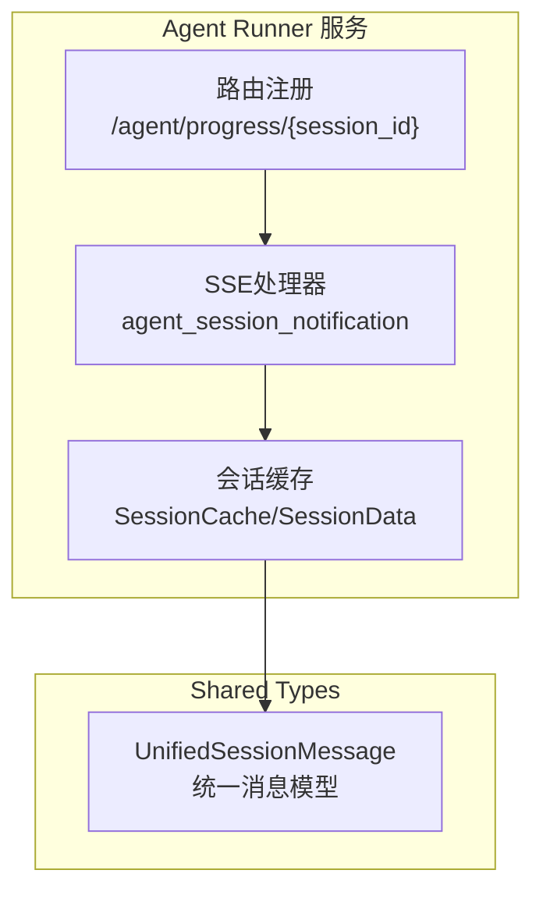
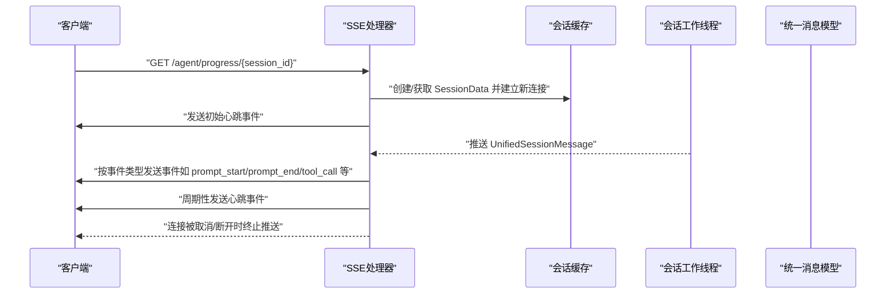
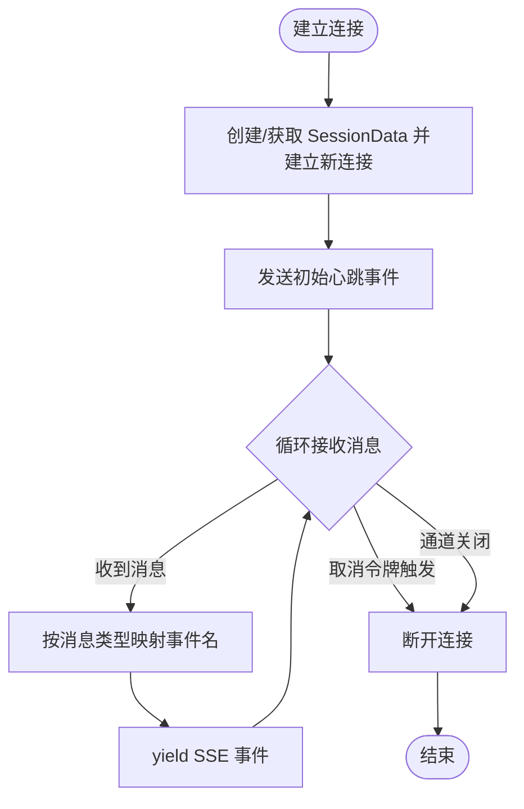
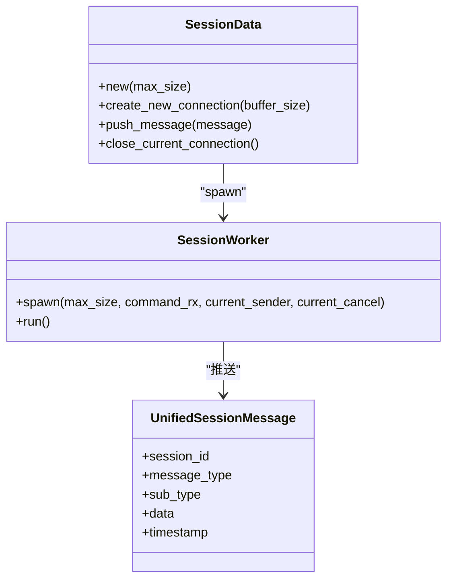
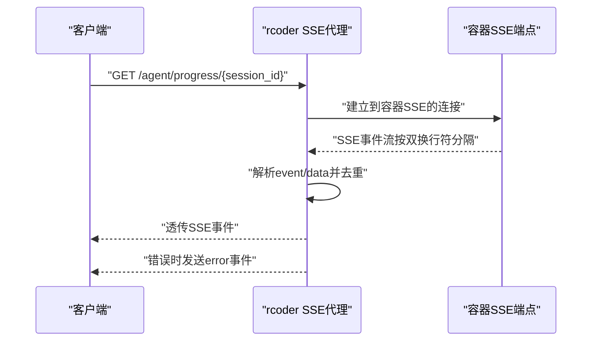
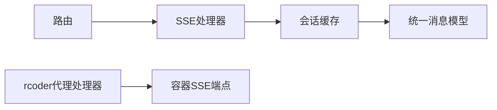

# 代理进度流接口

<cite>
**本文引用的文件**
- [crates/agent_runner/src/router.rs](file://crates/agent_runner/src/router.rs)
- [crates/agent_runner/src/handler/agent_session_notification.rs](file://crates/agent_runner/src/handler/agent_session_notification.rs)
- [crates/rcoder/src/handler/agent_session_notification.rs](file://crates/rcoder/src/handler/agent_session_notification.rs)
- [crates/shared_types/src/model/agent_session_notify.rs](file://crates/shared_types/src/model/agent_session_notify.rs)
- [crates/agent_runner/src/service/session_cache.rs](file://crates/agent_runner/src/service/session_cache.rs)
- [crates/agent_runner/src/proxy_agent/acp_agent.rs](file://crates/agent_runner/src/proxy_agent/acp_agent.rs)
- [crates/rcoder/src/handler/chat_handler.rs](file://crates/rcoder/src/handler/chat_handler.rs)
- [crates/shared_types/src/grpc/agent.rs](file://crates/shared_types/src/grpc/agent.rs)
</cite>

## 目录
1. [简介](#简介)
2. [项目结构](#项目结构)
3. [核心组件](#核心组件)
4. [架构总览](#架构总览)
5. [详细组件分析](#详细组件分析)
6. [依赖分析](#依赖分析)
7. [性能考虑](#性能考虑)
8. [故障排查指南](#故障排查指南)
9. [结论](#结论)
10. [附录](#附录)

## 简介
本文件面向 RCoder 项目的“代理进度流”接口，聚焦于 GET /agent/progress/{session_id} 的 Server-Sent Events（SSE）实现。该接口提供实时的 AI 任务执行进度更新，涵盖代码生成、文件操作等事件类型；同时说明 SSE 文本流格式、事件类型分类、客户端重连机制，以及 session_id 的生成与有效期管理策略，并给出 JavaScript 客户端示例的对接思路与最佳实践。

## 项目结构
- 该接口在两个服务中均有实现：
  - agent_runner：直接消费内部会话缓存，推送统一的 UnifiedSessionMessage。
  - rcoder：作为代理层，将外部容器的 SSE 流透传给客户端。
- 路由注册位于 agent_runner 的路由文件中，暴露 /agent/progress/{session_id}。

图表来源
- [crates/agent_runner/src/router.rs](file://crates/agent_runner/src/router.rs#L40-L52)
- [crates/agent_runner/src/handler/agent_session_notification.rs](file://crates/agent_runner/src/handler/agent_session_notification.rs#L355-L483)
- [crates/shared_types/src/model/agent_session_notify.rs](file://crates/shared_types/src/model/agent_session_notify.rs#L16-L30)

章节来源
- [crates/agent_runner/src/router.rs](file://crates/agent_runner/src/router.rs#L40-L52)

## 核心组件
- SSE 处理器：负责建立 SSE 连接、发送心跳、将消息事件化并推送。
- 会话缓存：维护每个 session_id 的消息通道与取消令牌，支持新连接覆盖旧连接。
- 统一消息模型：将不同类型的会话更新统一为 UnifiedSessionMessage，便于前端解析。
- 代理层（rcoder）：当需要透传外部容器的 SSE 时，将容器端 SSE 流透传至客户端。

章节来源
- [crates/agent_runner/src/handler/agent_session_notification.rs](file://crates/agent_runner/src/handler/agent_session_notification.rs#L355-L483)
- [crates/agent_runner/src/service/session_cache.rs](file://crates/agent_runner/src/service/session_cache.rs#L24-L103)
- [crates/shared_types/src/model/agent_session_notify.rs](file://crates/shared_types/src/model/agent_session_notify.rs#L16-L30)

## 架构总览
SSE 进度流的总体交互如下：
- 客户端发起 GET /agent/progress/{session_id} 建立 SSE 连接。
- 服务端根据 session_id 获取或创建会话数据，建立消息通道与取消令牌。
- 服务端立即发送一次心跳事件，随后周期性发送心跳，并将收到的统一消息转换为 SSE 事件推送。
- 若连接被取消（如新连接建立或用户取消），旧连接会自然断开。

图表来源
- [crates/agent_runner/src/handler/agent_session_notification.rs](file://crates/agent_runner/src/handler/agent_session_notification.rs#L355-L483)
- [crates/agent_runner/src/service/session_cache.rs](file://crates/agent_runner/src/service/session_cache.rs#L67-L103)
- [crates/shared_types/src/model/agent_session_notify.rs](file://crates/shared_types/src/model/agent_session_notify.rs#L16-L30)

## 详细组件分析

### SSE 文本流格式与事件类型
- 文本流遵循标准 SSE 格式，每条消息包含事件类型与数据两部分。
- 事件类型与 UnifiedSessionMessage 的映射关系：
  - prompt_start：会话开始
  - prompt_end：会话结束（含结束原因）
  - agent_message_chunk：Agent 文本响应片段
  - agent_thought_chunk：Agent 思考过程片段
  - tool_call：工具调用通知
  - tool_call_update：工具调用状态更新
  - available_commands_update：可用命令更新
  - current_mode_update：当前模式更新
  - heartbeat：心跳消息
- 数据体为 JSON，结构遵循 UnifiedSessionMessage，包含 session_id、message_type、sub_type、data、timestamp。

章节来源
- [crates/agent_runner/src/handler/agent_session_notification.rs](file://crates/agent_runner/src/handler/agent_session_notification.rs#L355-L483)
- [crates/shared_types/src/model/agent_session_notify.rs](file://crates/shared_types/src/model/agent_session_notify.rs#L165-L246)

### SSE 处理器（agent_runner）
- 建立新连接：为每个 session_id 创建新的 SessionData 并插入缓存，确保每次连接全新开始。
- 发送心跳：首次立即发送一次心跳事件，随后以固定间隔（如 30 秒）发送心跳。
- 事件分发：将收到的 UnifiedSessionMessage 按 message_type 与 sub_type 转换为对应的事件名并推送。
- 取消与断开：监听取消令牌与通道关闭，及时退出循环并记录日志。

图表来源
- [crates/agent_runner/src/handler/agent_session_notification.rs](file://crates/agent_runner/src/handler/agent_session_notification.rs#L355-L483)

章节来源
- [crates/agent_runner/src/handler/agent_session_notification.rs](file://crates/agent_runner/src/handler/agent_session_notification.rs#L355-L483)

### 会话缓存与连接管理
- SessionData：持有命令通道、当前发送器与取消令牌，支持创建新连接并设置当前发送器与取消令牌。
- SessionWorker：维护环形缓冲区，按需缓冲非心跳消息，并将消息实时推送到当前发送器。
- 项目-会话映射：ensure_project_session 确保同一项目仅对应一个活跃会话，必要时清理旧会话数据。
- 主动关闭：close_current_connection 主动触发取消令牌并丢弃发送器，促使接收端感知断开。

图表来源
- [crates/agent_runner/src/service/session_cache.rs](file://crates/agent_runner/src/service/session_cache.rs#L24-L103)
- [crates/agent_runner/src/service/session_cache.rs](file://crates/agent_runner/src/service/session_cache.rs#L140-L222)
- [crates/shared_types/src/model/agent_session_notify.rs](file://crates/shared_types/src/model/agent_session_notify.rs#L16-L30)

章节来源
- [crates/agent_runner/src/service/session_cache.rs](file://crates/agent_runner/src/service/session_cache.rs#L24-L103)
- [crates/agent_runner/src/service/session_cache.rs](file://crates/agent_runner/src/service/session_cache.rs#L140-L222)

### 代理层 SSE 透传（rcoder）
- 当需要代理外部容器的 SSE 时，rcoder 会根据 session_id 查找对应容器，建立到容器 SSE 端点的连接，并将容器的 SSE 流透传给客户端。
- 透传逻辑按双换行符切分事件，解析 event/data 字段，避免重复 data: 前缀，然后直接透传事件。
- 错误处理：容器连接失败或读取失败时，发送 error 事件并记录日志。

图表来源
- [crates/rcoder/src/handler/agent_session_notification.rs](file://crates/rcoder/src/handler/agent_session_notification.rs#L106-L299)
- [crates/rcoder/src/handler/agent_session_notification.rs](file://crates/rcoder/src/handler/agent_session_notification.rs#L207-L299)

章节来源
- [crates/rcoder/src/handler/agent_session_notification.rs](file://crates/rcoder/src/handler/agent_session_notification.rs#L106-L299)

### session_id 的生成与有效期管理
- 生成机制：在聊天处理流程中，当创建项目会话状态时，会为项目设置 session_id，并更新最后活动时间。项目-会话映射通过 ensure_project_session 保证唯一性。
- 有效期管理：服务端未对 session_id 设置硬性过期时间；连接断开或取消会触发清理。若需要过期控制，可在业务侧增加会话超时策略（例如定期清理长时间无活动的会话）。
- 会话切换：当同一项目的新会话建立时，旧会话数据会被清理，确保不会跨会话污染。

章节来源
- [crates/rcoder/src/handler/chat_handler.rs](file://crates/rcoder/src/handler/chat_handler.rs#L272-L302)
- [crates/agent_runner/src/proxy_agent/acp_agent.rs](file://crates/agent_runner/src/proxy_agent/acp_agent.rs#L80-L95)
- [crates/agent_runner/src/service/session_cache.rs](file://crates/agent_runner/src/service/session_cache.rs#L282-L354)

### 客户端重连机制与最佳实践
- 心跳检测：服务端会周期性发送 heartbeat 事件，前端应基于心跳判断连接是否仍活跃。
- 自动重连：建议实现指数退避的自动重连策略，避免频繁重试造成压力。
- 事件处理：根据事件类型（prompt_start/prompt_end/tool_call 等）更新 UI 状态，避免阻塞主线程。
- 错误处理：监听连接错误与 SessionPromptEnd 中的错误信息，向用户反馈并引导重试或取消。

章节来源
- [crates/agent_runner/src/handler/agent_session_notification.rs](file://crates/agent_runner/src/handler/agent_session_notification.rs#L355-L483)

### 与 gRPC 订阅接口的关系
- 项目中提供了基于 gRPC 的订阅进度流接口（subscribe_progress），可替代传统的 /agent/progress/{session_id} SSE 接口。
- 若采用 gRPC 方案，前端需使用 gRPC 客户端订阅进度流，事件类型与数据结构保持一致。

章节来源
- [crates/shared_types/src/grpc/agent.rs](file://crates/shared_types/src/grpc/agent.rs#L232-L236)

## 依赖分析
- 路由依赖：/agent/progress/{session_id} 在 agent_runner 的路由中注册。
- 处理器依赖：SSE 处理器依赖会话缓存与统一消息模型。
- 代理层依赖：rcoder 的代理处理器依赖容器映射与 SSE 透传逻辑。
- 项目-会话映射：通过 ensure_project_session 保证同一项目仅有一个活跃会话。

图表来源
- [crates/agent_runner/src/router.rs](file://crates/agent_runner/src/router.rs#L40-L52)
- [crates/agent_runner/src/handler/agent_session_notification.rs](file://crates/agent_runner/src/handler/agent_session_notification.rs#L355-L483)
- [crates/rcoder/src/handler/agent_session_notification.rs](file://crates/rcoder/src/handler/agent_session_notification.rs#L106-L299)
- [crates/shared_types/src/model/agent_session_notify.rs](file://crates/shared_types/src/model/agent_session_notify.rs#L16-L30)

章节来源
- [crates/agent_runner/src/router.rs](file://crates/agent_runner/src/router.rs#L40-L52)
- [crates/agent_runner/src/handler/agent_session_notification.rs](file://crates/agent_runner/src/handler/agent_session_notification.rs#L355-L483)
- [crates/rcoder/src/handler/agent_session_notification.rs](file://crates/rcoder/src/handler/agent_session_notification.rs#L106-L299)

## 性能考虑
- 心跳频率：默认 30 秒一次，可根据网络状况调整，避免过多心跳占用带宽。
- 缓冲策略：SessionWorker 使用环形缓冲区，非心跳消息优先缓冲，心跳消息直通，减少延迟。
- 取消与断开：通过 CancellationToken 与通道关闭快速退出，避免资源泄漏。
- 透传效率：rcoder 代理层按双换行符切分事件，避免重复解析，提高透传效率。

章节来源
- [crates/agent_runner/src/handler/agent_session_notification.rs](file://crates/agent_runner/src/handler/agent_session_notification.rs#L395-L475)
- [crates/agent_runner/src/service/session_cache.rs](file://crates/agent_runner/src/service/session_cache.rs#L173-L222)
- [crates/rcoder/src/handler/agent_session_notification.rs](file://crates/rcoder/src/handler/agent_session_notification.rs#L156-L262)

## 故障排查指南
- 404 未找到容器：当 session_id 对应的活跃容器不存在时，返回 404 并携带错误码。
- 建立 SSE 连接失败：容器 SSE 连接失败或读取失败时，发送 error 事件并记录错误。
- 连接被取消：当新连接建立或用户取消任务时，旧连接会主动断开。
- 心跳缺失：若长时间未收到 heartbeat，应触发重连流程。

章节来源
- [crates/rcoder/src/handler/agent_session_notification.rs](file://crates/rcoder/src/handler/agent_session_notification.rs#L106-L153)
- [crates/rcoder/src/handler/agent_session_notification.rs](file://crates/rcoder/src/handler/agent_session_notification.rs#L207-L259)
- [crates/agent_runner/src/handler/agent_session_notification.rs](file://crates/agent_runner/src/handler/agent_session_notification.rs#L400-L477)

## 结论
RCoder 的代理进度流接口通过 SSE 提供了稳定、低延迟的实时进度推送能力。其核心在于：
- 统一消息模型与事件类型映射，便于前端解析；
- 会话缓存与取消令牌机制，确保连接可控与资源回收；
- 代理层透传能力，满足多容器场景；
- 心跳与断开策略，保障连接健康与稳定性。

建议在前端实现自动重连与指数退避、基于事件类型的状态机更新，并结合业务侧的会话超时策略，构建健壮的实时进度体验。

## 附录

### API 定义与示例
- 端点：GET /agent/progress/{session_id}
- 内容类型：text/event-stream
- 响应：SSE 事件流，事件类型与数据体见“SSE 文本流格式与事件类型”。

章节来源
- [crates/agent_runner/src/router.rs](file://crates/agent_runner/src/router.rs#L40-L52)
- [crates/agent_runner/src/handler/agent_session_notification.rs](file://crates/agent_runner/src/handler/agent_session_notification.rs#L355-L483)

### JavaScript 客户端对接要点（概念性说明）
- 使用浏览器内置 EventSource API 建立连接，监听不同事件类型并更新 UI。
- 实现自动重连：监听 error 与 close 事件，采用指数退避策略重连。
- 心跳检测：收到 heartbeat 事件后刷新心跳计时器，超时则触发重连。
- 错误处理：监听 error 事件与 SessionPromptEnd 中的错误信息，向用户反馈并引导操作。

[本节为概念性说明，不直接分析具体源码文件]