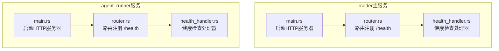
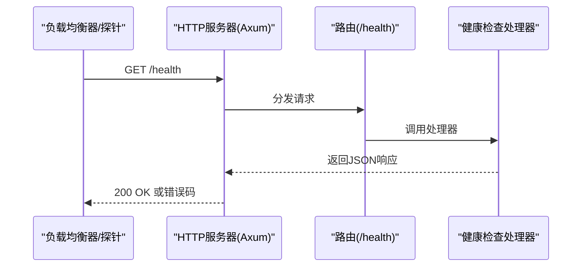
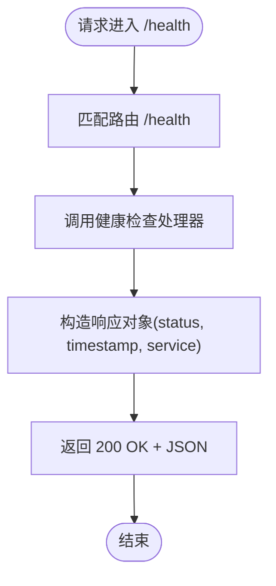
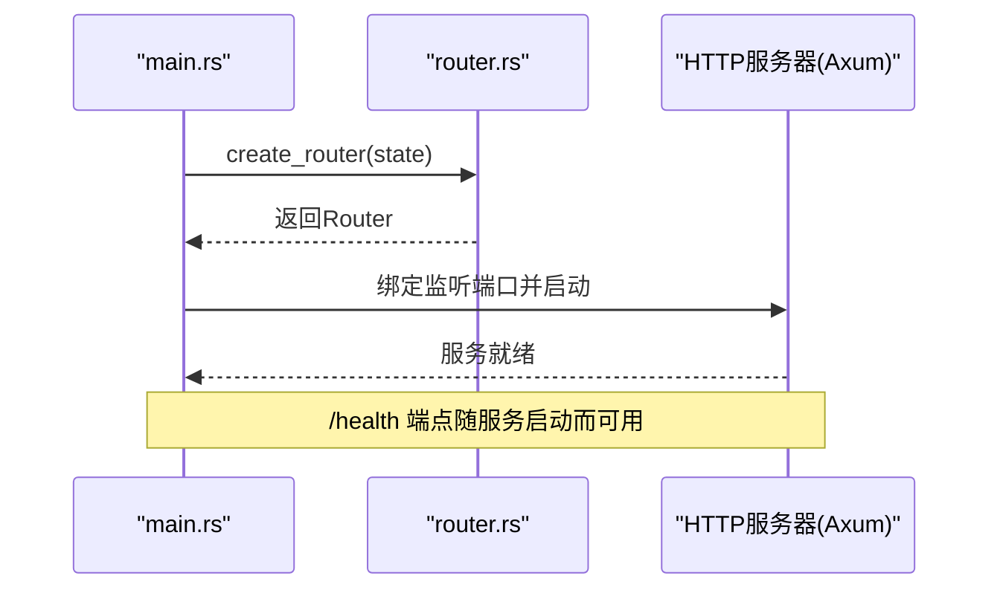
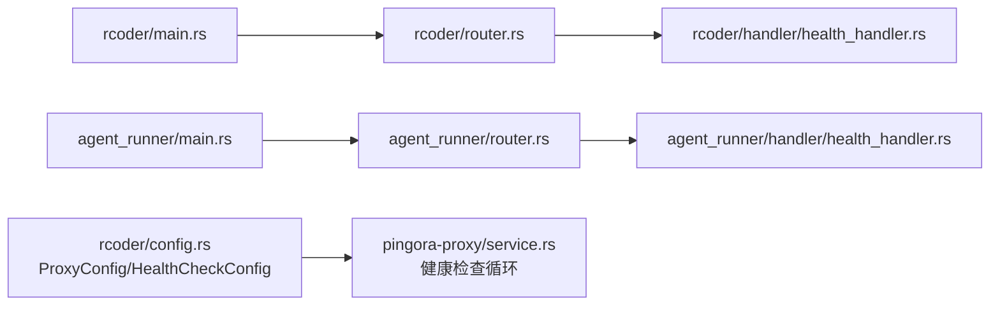

# 健康检查接口

<cite>
**本文引用的文件列表**
- [crates/rcoder/src/handler/health_handler.rs](file://crates/rcoder/src/handler/health_handler.rs)
- [crates/agent_runner/src/handler/health_handler.rs](file://crates/agent_runner/src/handler/health_handler.rs)
- [crates/rcoder/src/router.rs](file://crates/rcoder/src/router.rs)
- [crates/agent_runner/src/router.rs](file://crates/agent_runner/src/router.rs)
- [crates/rcoder/src/main.rs](file://crates/rcoder/src/main.rs)
- [crates/agent_runner/src/main.rs](file://crates/agent_runner/src/main.rs)
- [crates/rcoder/src/config.rs](file://crates/rcoder/src/config.rs)
- [crates/pingora-proxy/src/service.rs](file://crates/pingora-proxy/src/service.rs)
- [README.md](file://README.md)
- [docker/Dockerfile](file://docker/Dockerfile)
- [crates/rcoder/src/rcoder_default.yml](file://crates/rcoder/src/rcoder_default.yml)
</cite>

## 目录
1. [简介](#简介)
2. [项目结构](#项目结构)
3. [核心组件](#核心组件)
4. [架构总览](#架构总览)
5. [详细组件分析](#详细组件分析)
6. [依赖关系分析](#依赖关系分析)
7. [性能考量](#性能考量)
8. [故障排查指南](#故障排查指南)
9. [结论](#结论)
10. [附录](#附录)

## 简介
本文件面向RCoder项目的健康检查API，聚焦GET /health端点的HTTP方法、URL模式、响应格式与行为语义。文档解释该接口如何用于系统状态监控与负载均衡器健康探测，给出成功与失败场景的JSON结构说明，阐述服务启动时的验证作用，并提供在Kubernetes等容器编排系统中的集成方式、curl示例与客户端实现要点，以及性能监控与超时处理的最佳实践。

## 项目结构
- 健康检查端点在两个主要服务中均可用：
  - rcoder主服务：提供HTTP API与健康检查
  - agent_runner服务：同样提供健康检查端点
- 路由注册与OpenAPI文档由各服务的router模块负责
- 服务启动时绑定端口并启动HTTP服务器，健康检查端点即随服务启动而可用

图表来源
- [crates/rcoder/src/main.rs](file://crates/rcoder/src/main.rs#L222-L265)
- [crates/rcoder/src/router.rs](file://crates/rcoder/src/router.rs#L52-L66)
- [crates/rcoder/src/handler/health_handler.rs](file://crates/rcoder/src/handler/health_handler.rs#L1-L36)
- [crates/agent_runner/src/main.rs](file://crates/agent_runner/src/main.rs#L132-L171)
- [crates/agent_runner/src/router.rs](file://crates/agent_runner/src/router.rs#L40-L52)
- [crates/agent_runner/src/handler/health_handler.rs](file://crates/agent_runner/src/handler/health_handler.rs#L1-L36)

章节来源
- [crates/rcoder/src/main.rs](file://crates/rcoder/src/main.rs#L222-L265)
- [crates/agent_runner/src/main.rs](file://crates/agent_runner/src/main.rs#L132-L171)
- [crates/rcoder/src/router.rs](file://crates/rcoder/src/router.rs#L52-L66)
- [crates/agent_runner/src/router.rs](file://crates/agent_runner/src/router.rs#L40-L52)

## 核心组件
- 健康检查处理器
  - 路径：/health
  - 方法：GET
  - 响应：JSON对象，包含status、timestamp、service字段
- 路由注册
  - rcoder：在router.rs中将GET /health绑定到处理器
  - agent_runner：同理
- 服务启动
  - main.rs中创建Axum Router并绑定TCP监听，健康检查端点随服务启动而可用

章节来源
- [crates/rcoder/src/handler/health_handler.rs](file://crates/rcoder/src/handler/health_handler.rs#L1-L36)
- [crates/agent_runner/src/handler/health_handler.rs](file://crates/agent_runner/src/handler/health_handler.rs#L1-L36)
- [crates/rcoder/src/router.rs](file://crates/rcoder/src/router.rs#L52-L66)
- [crates/agent_runner/src/router.rs](file://crates/agent_runner/src/router.rs#L40-L52)
- [crates/rcoder/src/main.rs](file://crates/rcoder/src/main.rs#L222-L265)
- [crates/agent_runner/src/main.rs](file://crates/agent_runner/src/main.rs#L132-L171)

## 架构总览
健康检查端点作为系统健康状态的快速探测入口，既可用于内部监控，也可供外部负载均衡器/编排系统进行存活探针。在rcoder中，健康检查端点位于HTTP API层，不依赖业务逻辑，因此其可用性直接反映服务进程的启动与HTTP服务器的就绪状态。

图表来源
- [crates/rcoder/src/router.rs](file://crates/rcoder/src/router.rs#L52-L66)
- [crates/rcoder/src/handler/health_handler.rs](file://crates/rcoder/src/handler/health_handler.rs#L1-L36)
- [crates/agent_runner/src/router.rs](file://crates/agent_runner/src/router.rs#L40-L52)
- [crates/agent_runner/src/handler/health_handler.rs](file://crates/agent_runner/src/handler/health_handler.rs#L1-L36)

## 详细组件分析

### 健康检查端点定义与响应
- HTTP方法与URL模式
  - 方法：GET
  - 路径：/health
- 响应结构
  - status：字符串，表示服务健康状态
  - timestamp：UTC时间戳
  - service：服务标识
- 成功响应
  - HTTP状态码：200 OK
  - 响应体：包含上述字段的JSON对象
- 失败响应
  - 当HTTP服务器未启动或路由未注册时，可能出现非200的状态码（例如5xx）
  - 由于健康检查处理器不进行数据库或其他外部依赖的深度校验，一般不会出现500错误；若出现，通常表示服务启动异常或中间件/路由配置问题

图表来源
- [crates/rcoder/src/handler/health_handler.rs](file://crates/rcoder/src/handler/health_handler.rs#L1-L36)
- [crates/agent_runner/src/handler/health_handler.rs](file://crates/agent_runner/src/handler/health_handler.rs#L1-L36)

章节来源
- [crates/rcoder/src/handler/health_handler.rs](file://crates/rcoder/src/handler/health_handler.rs#L1-L36)
- [crates/agent_runner/src/handler/health_handler.rs](file://crates/agent_runner/src/handler/health_handler.rs#L1-L36)

### 服务启动与健康检查可用性
- rcoder主服务
  - main.rs中创建Axum Router并绑定监听端口，随后启动HTTP服务器
  - 启动日志明确打印了API端点信息，包括GET /health
- agent_runner服务
  - 同样在main.rs中绑定监听端口并启动HTTP服务器
  - 路由注册中包含GET /health

图表来源
- [crates/rcoder/src/main.rs](file://crates/rcoder/src/main.rs#L222-L265)
- [crates/rcoder/src/router.rs](file://crates/rcoder/src/router.rs#L52-L66)
- [crates/agent_runner/src/main.rs](file://crates/agent_runner/src/main.rs#L132-L171)
- [crates/agent_runner/src/router.rs](file://crates/agent_runner/src/router.rs#L40-L52)

章节来源
- [crates/rcoder/src/main.rs](file://crates/rcoder/src/main.rs#L222-L265)
- [crates/agent_runner/src/main.rs](file://crates/agent_runner/src/main.rs#L132-L171)

### 在Kubernetes等容器编排系统中的集成
- 健康检查配置
  - Dockerfile中定义了HEALTHCHECK指令，使用curl对http://localhost:PORT/health进行探测
  - 默认端口为8087（来自rcoder_default.yml中的port字段）
- 推荐配置
  - 在Kubernetes中，使用livenessProbe/readinessProbe指向同一端点
  - 建议将探针超时时间设置为小于探测周期，避免长时间阻塞导致误判
  - 若使用代理（Pingora），建议直接对代理监听端口进行探测，或在代理层暴露健康检查端点

章节来源
- [docker/Dockerfile](file://docker/Dockerfile#L296-L304)
- [crates/rcoder/src/rcoder_default.yml](file://crates/rcoder/src/rcoder_default.yml#L10-L12)

### curl命令示例与客户端实现指南
- curl示例
  - GET http://localhost:8087/health
- 客户端实现要点
  - 使用HTTP客户端库发起GET请求
  - 解析JSON响应，读取status、timestamp、service字段
  - 对于200以外的状态码，视为不健康
  - 设置合理的超时时间，避免阻塞

章节来源
- [README.md](file://README.md#L229-L242)

### 健康检查与负载均衡器健康探测
- 健康检查处理器不进行外部依赖（如数据库、代理后端）的深度校验，仅反映服务进程与HTTP服务器的就绪状态
- 负载均衡器可将其作为存活探针，结合探针超时、重试次数与周期进行综合判断
- 若需要对代理后端进行健康探测，可参考代理健康检查配置（见下一节）

章节来源
- [crates/rcoder/src/config.rs](file://crates/rcoder/src/config.rs#L52-L98)
- [crates/pingora-proxy/src/service.rs](file://crates/pingora-proxy/src/service.rs#L556-L596)

## 依赖关系分析
- 路由到处理器的依赖
  - rcoder与agent_runner分别在各自的router.rs中注册GET /health
  - 处理器在各自handler/health_handler.rs中实现
- 服务启动依赖
  - main.rs负责创建Router并启动HTTP服务器
- 代理健康检查（额外能力）
  - rcoder的ProxyConfig包含HealthCheckConfig
  - Pingora服务实现健康检查循环，定期对后端端口进行连通性探测

图表来源
- [crates/rcoder/src/main.rs](file://crates/rcoder/src/main.rs#L222-L265)
- [crates/rcoder/src/router.rs](file://crates/rcoder/src/router.rs#L52-L66)
- [crates/rcoder/src/handler/health_handler.rs](file://crates/rcoder/src/handler/health_handler.rs#L1-L36)
- [crates/agent_runner/src/main.rs](file://crates/agent_runner/src/main.rs#L132-L171)
- [crates/agent_runner/src/router.rs](file://crates/agent_runner/src/router.rs#L40-L52)
- [crates/agent_runner/src/handler/health_handler.rs](file://crates/agent_runner/src/handler/health_handler.rs#L1-L36)
- [crates/rcoder/src/config.rs](file://crates/rcoder/src/config.rs#L52-L98)
- [crates/pingora-proxy/src/service.rs](file://crates/pingora-proxy/src/service.rs#L556-L596)

章节来源
- [crates/rcoder/src/config.rs](file://crates/rcoder/src/config.rs#L52-L98)
- [crates/pingora-proxy/src/service.rs](file://crates/pingora-proxy/src/service.rs#L556-L596)

## 性能考量
- 健康检查处理器为纯内存计算，开销极低，适合高频探测
- 探测周期与超时设置建议
  - 周期：根据业务SLA设定，常见为10-30秒
  - 超时：建议小于周期，避免探针阻塞影响其他请求
- 在Kubernetes中，合理设置initialDelaySeconds、periodSeconds、timeoutSeconds与failureThreshold，避免误判
- 若使用代理（Pingora），可利用其健康检查能力对后端进行更细粒度的探测

章节来源
- [crates/rcoder/src/config.rs](file://crates/rcoder/src/config.rs#L124-L134)
- [crates/pingora-proxy/src/service.rs](file://crates/pingora-proxy/src/service.rs#L581-L591)

## 故障排查指南
- 无法访问/health
  - 检查服务是否已启动并绑定到预期端口
  - 确认防火墙与网络策略允许访问
- 响应非200
  - 查看服务日志，定位路由或中间件异常
  - 确认路由注册是否正确
- 健康检查频繁失败
  - 检查探针超时与周期设置
  - 在Kubernetes中适当增大failureThreshold，避免抖动
- 代理健康检查相关
  - 确认ProxyConfig中的health_check.enabled、interval_seconds、timeout_seconds配置
  - 检查后端端口连通性

章节来源
- [crates/rcoder/src/main.rs](file://crates/rcoder/src/main.rs#L222-L265)
- [crates/agent_runner/src/main.rs](file://crates/agent_runner/src/main.rs#L132-L171)
- [crates/rcoder/src/config.rs](file://crates/rcoder/src/config.rs#L52-L98)
- [crates/pingora-proxy/src/service.rs](file://crates/pingora-proxy/src/service.rs#L556-L596)

## 结论
GET /health端点为RCoder提供了轻量、可靠的健康状态探测入口，适用于服务启动验证与负载均衡器健康探测。其简单实现确保了低开销与高可用性。在生产环境中，建议结合探针超时、周期与重试策略，以及必要时启用代理健康检查，以获得更全面的健康状态视图。

## 附录

### API定义与示例
- 端点：GET /health
- 响应示例（成功）
  - 状态码：200 OK
  - 响应体：包含status、timestamp、service字段的JSON对象
- 响应示例（失败）
  - 状态码：非200（例如5xx）
  - 响应体：错误信息（由HTTP服务器或中间件决定）

章节来源
- [crates/rcoder/src/handler/health_handler.rs](file://crates/rcoder/src/handler/health_handler.rs#L1-L36)
- [crates/agent_runner/src/handler/health_handler.rs](file://crates/agent_runner/src/handler/health_handler.rs#L1-L36)
- [README.md](file://README.md#L229-L242)

### 集成与最佳实践
- curl示例
  - curl -X GET http://localhost:8087/health
- Kubernetes集成
  - 使用livenessProbe/readinessProbe指向同一端点
  - HEALTHCHECK已在Dockerfile中定义，可直接复用
- 超时与周期
  - 建议周期10-30秒，超时小于周期
  - failureThreshold根据稳定性需求调整

章节来源
- [README.md](file://README.md#L229-L242)
- [docker/Dockerfile](file://docker/Dockerfile#L296-L304)