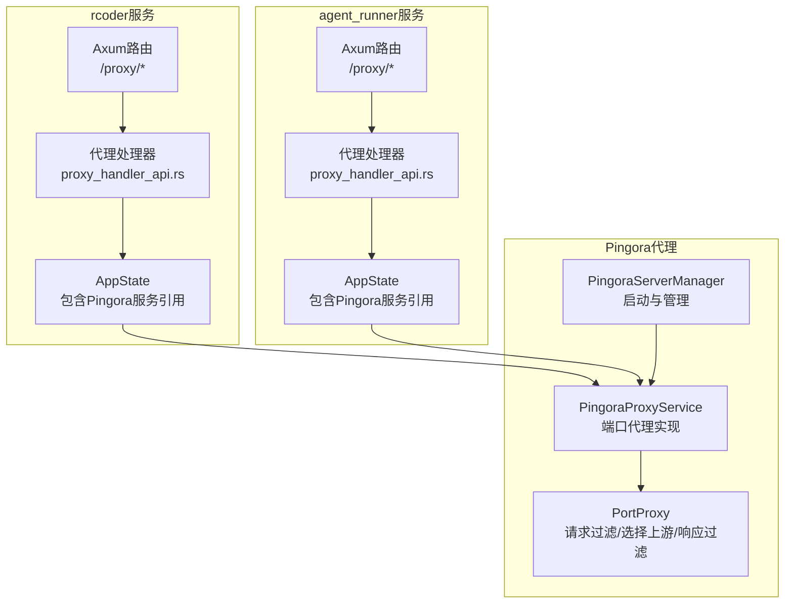
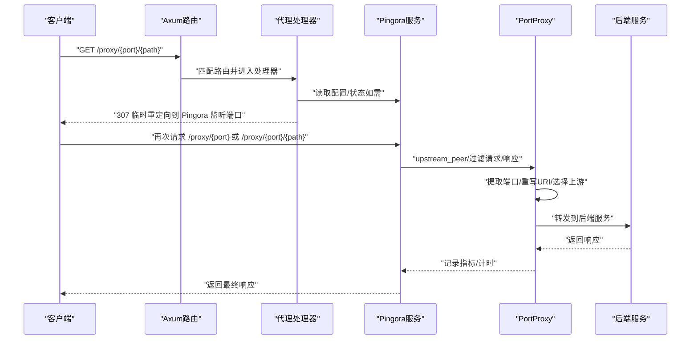
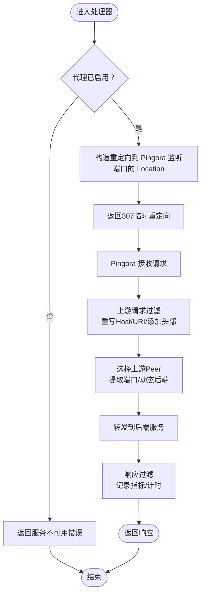
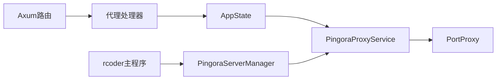

# 反向代理接口

<cite>
**本文引用的文件**
- [crates/rcoder/src/router.rs](file://crates/rcoder/src/router.rs)
- [crates/agent_runner/src/router.rs](file://crates/agent_runner/src/router.rs)
- [crates/rcoder/src/handler/proxy_handler_api.rs](file://crates/rcoder/src/handler/proxy_handler_api.rs)
- [crates/agent_runner/src/handler/proxy_handler_api.rs](file://crates/agent_runner/src/handler/proxy_handler_api.rs)
- [crates/rcoder/src/handler/proxy_api.rs](file://crates/rcoder/src/handler/proxy_api.rs)
- [crates/agent_runner/src/handler/proxy_api.rs](file://crates/agent_runner/src/handler/proxy_api.rs)
- [crates/pingora-proxy/src/lib.rs](file://crates/pingora-proxy/src/lib.rs)
- [crates/pingora-proxy/src/config.rs](file://crates/pingora-proxy/src/config.rs)
- [crates/pingora-proxy/src/service.rs](file://crates/pingora-proxy/src/service.rs)
- [crates/pingora-proxy/src/server.rs](file://crates/pingora-proxy/src/server.rs)
- [crates/pingora-proxy/src/pingora_server.rs](file://crates/pingora-proxy/src/pingora_server.rs)
- [crates/rcoder/src/main.rs](file://crates/rcoder/src/main.rs)
- [crates/rcoder/src/proxy_agent/port_manager.rs](file://crates/rcoder/src/proxy_agent/port_manager.rs)
</cite>

## 目录
1. [简介](#简介)
2. [项目结构](#项目结构)
3. [核心组件](#核心组件)
4. [架构总览](#架构总览)
5. [详细组件分析](#详细组件分析)
6. [依赖关系分析](#依赖关系分析)
7. [性能考量](#性能考量)
8. [故障排查指南](#故障排查指南)
9. [结论](#结论)
10. [附录](#附录)

## 简介
本文件面向RCoder项目的反向代理API，聚焦/proxy/{port}/{path}端点的路由机制与请求转发逻辑，说明其如何将请求代理到AI代理在特定端口上运行的服务；解释端口管理机制与请求/响应的透明转发过程；提供curl示例，展示如何通过该接口访问代理的Web界面或API；说明与Pingora反向代理组件的集成方式，以及在处理WebSocket连接时的特殊考虑。

## 项目结构
RCoder项目包含两个主要服务：
- rcoder服务：提供聊天、会话管理、代理状态查询等API，并在启动时可选择启用Pingora反向代理服务。
- agent_runner服务：同样可启用Pingora代理服务，用于代理AI代理容器对外暴露的端口。

反向代理API在两个服务中均通过Axum路由注册，核心处理逻辑位于各自的handler模块中；而真正的代理转发由Pingora库实现。

图表来源
- [crates/rcoder/src/router.rs](file://crates/rcoder/src/router.rs#L52-L83)
- [crates/agent_runner/src/router.rs](file://crates/agent_runner/src/router.rs#L67-L79)
- [crates/rcoder/src/handler/proxy_handler_api.rs](file://crates/rcoder/src/handler/proxy_handler_api.rs#L230-L332)
- [crates/agent_runner/src/handler/proxy_handler_api.rs](file://crates/agent_runner/src/handler/proxy_handler_api.rs#L230-L332)
- [crates/pingora-proxy/src/pingora_server.rs](file://crates/pingora-proxy/src/pingora_server.rs#L37-L66)
- [crates/pingora-proxy/src/service.rs](file://crates/pingora-proxy/src/service.rs#L224-L354)

章节来源
- [crates/rcoder/src/router.rs](file://crates/rcoder/src/router.rs#L52-L83)
- [crates/agent_runner/src/router.rs](file://crates/agent_runner/src/router.rs#L67-L79)

## 核心组件
- 路由注册：在rcoder与agent_runner的router中分别注册/proxy/status、/proxy/stats、/proxy/config、/proxy/{port}、/proxy/{port}/{*path}等端点。
- 代理处理器：提供状态、统计、配置查询；以及将请求重定向到Pingora监听端口的处理器。
- Pingora服务：负责实际的请求转发、负载均衡、健康检查、指标统计与上游选择。
- 配置与启动：在rcoder主程序中根据配置启动Pingora服务器管理器，并将服务引用注入到AppState，供代理处理器读取。

章节来源
- [crates/rcoder/src/router.rs](file://crates/rcoder/src/router.rs#L52-L83)
- [crates/agent_runner/src/router.rs](file://crates/agent_runner/src/router.rs#L67-L79)
- [crates/rcoder/src/handler/proxy_handler_api.rs](file://crates/rcoder/src/handler/proxy_handler_api.rs#L230-L332)
- [crates/agent_runner/src/handler/proxy_handler_api.rs](file://crates/agent_runner/src/handler/proxy_handler_api.rs#L230-L332)
- [crates/pingora-proxy/src/pingora_server.rs](file://crates/pingora-proxy/src/pingora_server.rs#L37-L66)
- [crates/rcoder/src/main.rs](file://crates/rcoder/src/main.rs#L169-L208)

## 架构总览
/proxy/{port}/{path}端点的请求流如下：
- 客户端请求到达rcoder/agent_runner的Axum路由。
- 若代理未启用，返回“服务不可用”错误。
- 若启用，处理器将请求临时重定向至Pingora监听端口的对应路径（/proxy/{port}或/ proxy/{port}/{path}），由Pingora完成实际转发。
- Pingora根据请求路径提取目标端口，动态发现后端主机，选择上游Peer，重写请求头与URI，转发到后端服务，并记录指标。

图表来源
- [crates/rcoder/src/handler/proxy_handler_api.rs](file://crates/rcoder/src/handler/proxy_handler_api.rs#L230-L332)
- [crates/pingora-proxy/src/service.rs](file://crates/pingora-proxy/src/service.rs#L246-L354)
- [crates/pingora-proxy/src/pingora_server.rs](file://crates/pingora-proxy/src/pingora_server.rs#L37-L66)

## 详细组件分析

### 路由与控制器
- rcoder与agent_runner各自在router中注册/proxy/*端点，包括状态、统计、配置查询与端口代理。
- 代理处理器对/proxy/{port}与/proxy/{port}/{*path}进行处理：若代理未启用则返回错误；否则构造临时重定向到Pingora监听端口的Location头。

章节来源
- [crates/rcoder/src/router.rs](file://crates/rcoder/src/router.rs#L52-L83)
- [crates/agent_runner/src/router.rs](file://crates/agent_runner/src/router.rs#L67-L79)
- [crates/rcoder/src/handler/proxy_handler_api.rs](file://crates/rcoder/src/handler/proxy_handler_api.rs#L230-L332)
- [crates/agent_runner/src/handler/proxy_handler_api.rs](file://crates/agent_runner/src/handler/proxy_handler_api.rs#L230-L332)

### Pingora代理实现
- PingoraProxyService：维护后端映射、负载均衡算法、健康检查、指标统计与上下文跟踪。
- PortProxy：实现ProxyHttp，负责：
  - 上游请求过滤：重写Host、添加X-Forwarded-Proto与X-Load-Balancer头；重写URI，移除/proxy/{port}前缀并保留查询参数。
  - 上游Peer选择：从请求路径提取目标端口；若端口不在后端映射中则动态添加到默认主机；选择HttpPeer。
  - 响应过滤：记录响应状态与耗时、更新指标、减少活跃连接数。

章节来源
- [crates/pingora-proxy/src/service.rs](file://crates/pingora-proxy/src/service.rs#L224-L354)
- [crates/pingora-proxy/src/service.rs](file://crates/pingora-proxy/src/service.rs#L356-L409)
- [crates/pingora-proxy/src/service.rs](file://crates/pingora-proxy/src/service.rs#L411-L596)

### 端口管理机制
- rcoder服务中的PortManager负责容器端口分配与回收，避免端口冲突，确保代理后端端口可用。
- Pingora侧通过动态后端映射实现“按需发现”，首次遇到某端口时自动将其加入后端列表。

章节来源
- [crates/rcoder/src/proxy_agent/port_manager.rs](file://crates/rcoder/src/proxy_agent/port_manager.rs#L1-L96)
- [crates/pingora-proxy/src/service.rs](file://crates/pingora-proxy/src/service.rs#L300-L333)

### WebSocket连接的特殊考虑
- Pingora库基于Cloudflare Pingora，支持HTTP/1.1与HTTP/2，理论上可处理升级为WebSocket的请求。
- 由于rcoder与agent_runner的代理处理器采用临时重定向的方式，客户端需要遵循重定向并保持连接；具体WebSocket行为取决于上游后端服务是否支持升级。
- 若上游服务不支持升级，或客户端未正确处理重定向，可能出现握手失败或连接中断。

章节来源
- [crates/pingora-proxy/src/lib.rs](file://crates/pingora-proxy/src/lib.rs#L1-L58)
- [crates/pingora-proxy/src/pingora_server.rs](file://crates/pingora-proxy/src/pingora_server.rs#L37-L66)

### 请求/响应透明转发流程

图表来源
- [crates/rcoder/src/handler/proxy_handler_api.rs](file://crates/rcoder/src/handler/proxy_handler_api.rs#L230-L332)
- [crates/pingora-proxy/src/service.rs](file://crates/pingora-proxy/src/service.rs#L246-L354)

## 依赖关系分析
- rcoder/agent_runner的路由依赖于代理处理器模块；代理处理器依赖于AppState中的Pingora服务引用。
- Pingora服务依赖于Pingora库的ProxyHttp trait实现，通过包装器将内部PortProxy暴露为Pingora服务。
- rcoder主程序在启动时根据配置创建PingoraServerManager并启动服务器，同时将服务引用注入AppState。

图表来源
- [crates/rcoder/src/router.rs](file://crates/rcoder/src/router.rs#L52-L83)
- [crates/rcoder/src/handler/proxy_handler_api.rs](file://crates/rcoder/src/handler/proxy_handler_api.rs#L230-L332)
- [crates/pingora-proxy/src/pingora_server.rs](file://crates/pingora-proxy/src/pingora_server.rs#L37-L66)
- [crates/rcoder/src/main.rs](file://crates/rcoder/src/main.rs#L169-L208)

章节来源
- [crates/rcoder/src/router.rs](file://crates/rcoder/src/router.rs#L52-L83)
- [crates/agent_runner/src/router.rs](file://crates/agent_runner/src/router.rs#L67-L79)
- [crates/rcoder/src/handler/proxy_handler_api.rs](file://crates/rcoder/src/handler/proxy_handler_api.rs#L230-L332)
- [crates/agent_runner/src/handler/proxy_handler_api.rs](file://crates/agent_runner/src/handler/proxy_handler_api.rs#L230-L332)
- [crates/pingora-proxy/src/pingora_server.rs](file://crates/pingora-proxy/src/pingora_server.rs#L37-L66)
- [crates/rcoder/src/main.rs](file://crates/rcoder/src/main.rs#L169-L208)

## 性能考量
- 负载均衡：Pingora支持轮询与一致性哈希两种算法，默认启用轮询；可根据配置切换。
- 健康检查：Pingora内置TCP健康检查，周期性探测后端连通性，支持超时与阈值配置。
- 指标统计：提供总请求数、成功率、平均响应时间、每端口统计与活跃连接数等指标，便于监控与优化。
- 动态后端：首次遇到新端口时自动加入后端映射，避免预配置开销，提升弹性。

章节来源
- [crates/pingora-proxy/src/service.rs](file://crates/pingora-proxy/src/service.rs#L509-L596)
- [crates/pingora-proxy/src/server.rs](file://crates/pingora-proxy/src/server.rs#L143-L155)
- [crates/pingora-proxy/src/config.rs](file://crates/pingora-proxy/src/config.rs#L1-L95)

## 故障排查指南
- 代理未启用：当AppState中未注入Pingora服务或配置为空时，/proxy/*接口返回“服务不可用”错误。确认rcoder主程序已按配置启动Pingora服务。
- 端口提取失败：若请求路径不符合/proxy/{port}格式，将回退到默认后端端口。检查客户端是否使用正确的路径格式。
- 后端未发现：Pingora在首次遇到端口时会动态添加默认主机；若后端主机不可达，健康检查会标记为不健康。检查后端服务状态与网络连通性。
- 重定向链路：代理处理器返回307临时重定向，客户端需跟随重定向并保持连接（尤其WebSocket场景）。

章节来源
- [crates/rcoder/src/handler/proxy_handler_api.rs](file://crates/rcoder/src/handler/proxy_handler_api.rs#L31-L114)
- [crates/agent_runner/src/handler/proxy_handler_api.rs](file://crates/agent_runner/src/handler/proxy_handler_api.rs#L31-L114)
- [crates/pingora-proxy/src/service.rs](file://crates/pingora-proxy/src/service.rs#L300-L333)

## 结论
RCoder的反向代理API通过Axum路由与Pingora代理实现解耦：路由层负责接入与状态查询，Pingora负责高性能转发与负载均衡。/proxy/{port}/{path}端点采用临时重定向到Pingora监听端口的方式，使客户端透明地访问任意端口的后端服务。结合动态后端与健康检查，系统具备良好的弹性与可观测性。

## 附录

### curl示例
以下示例展示如何通过/proxy接口访问不同后端服务（请将localhost替换为实际部署地址与端口）：
- 访问默认后端健康检查
  - curl "http://localhost:3000/proxy/8080/health"
- 访问特定端口的API
  - curl "http://localhost:3000/proxy/3000/api/users"
- 访问代理状态
  - curl "http://localhost:3000/proxy/status"
- 访问代理统计
  - curl "http://localhost:3000/proxy/stats"
- 访问代理配置
  - curl "http://localhost:3000/proxy/config"

章节来源
- [crates/rcoder/src/router.rs](file://crates/rcoder/src/router.rs#L173-L193)
- [crates/agent_runner/src/router.rs](file://crates/agent_runner/src/router.rs#L173-L193)

### 与Pingora集成要点
- 启动方式：rcoder主程序创建PingoraServerManager并启动服务器，监听配置中的listen_port。
- 服务注入：将Pingora服务引用注入AppState，代理处理器可读取配置与指标。
- 路由规则：Pingora内部处理/proxy/{port}与/proxy/{port}/{path}，移除前缀并重写URI，转发到后端。

章节来源
- [crates/rcoder/src/main.rs](file://crates/rcoder/src/main.rs#L169-L208)
- [crates/pingora-proxy/src/pingora_server.rs](file://crates/pingora-proxy/src/pingora_server.rs#L37-L66)
- [crates/pingora-proxy/src/service.rs](file://crates/pingora-proxy/src/service.rs#L246-L354)