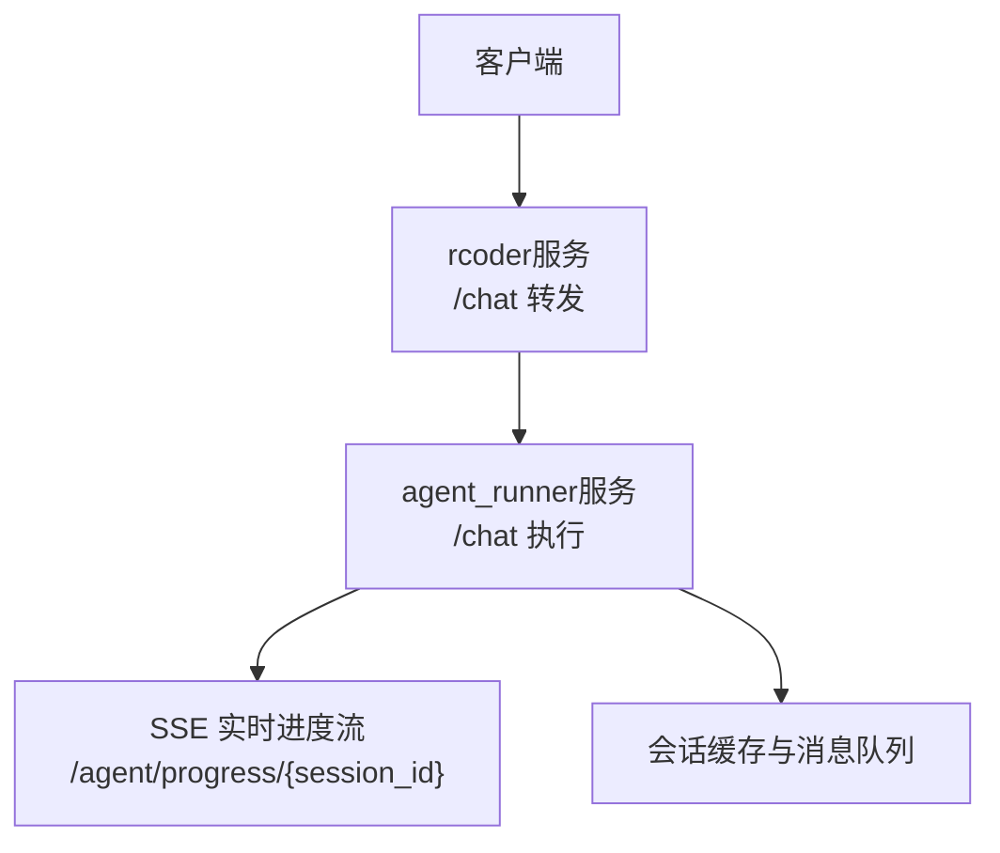
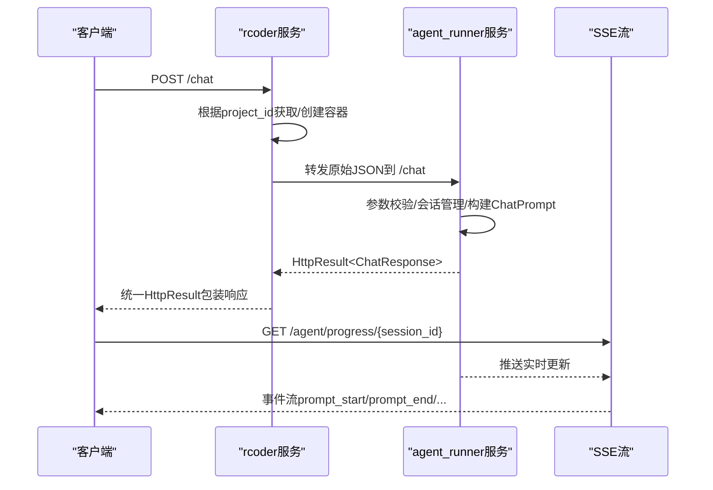
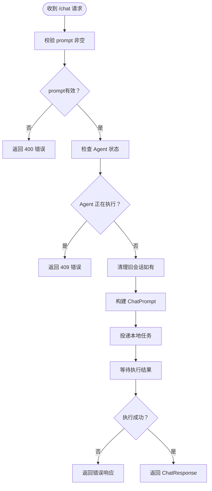
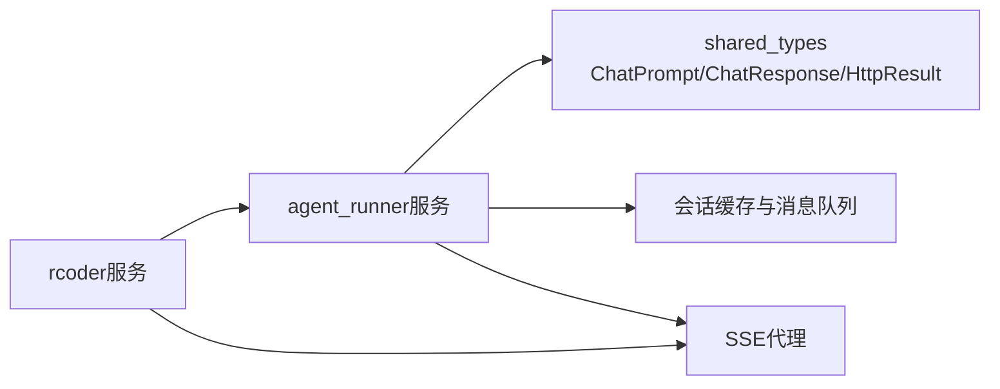

# 聊天接口

<cite>
**本文引用的文件**
- [crates/rcoder/src/handler/chat_handler.rs](file://crates/rcoder/src/handler/chat_handler.rs)
- [crates/agent_runner/src/handler/chat_handler.rs](file://crates/agent_runner/src/handler/chat_handler.rs)
- [crates/shared_types/src/model/chat_prompt.rs](file://crates/shared_types/src/model/chat_prompt.rs)
- [crates/shared_types/src/model/chat_response.rs](file://crates/shared_types/src/model/chat_response.rs)
- [crates/shared_types/src/model/http_result.rs](file://crates/shared_types/src/model/http_result.rs)
- [crates/shared_types/src/model/app_error.rs](file://crates/shared_types/src/model/app_error.rs)
- [crates/agent_runner/src/handler/agent_session_notification.rs](file://crates/agent_runner/src/handler/agent_session_notification.rs)
- [crates/rcoder/src/handler/agent_session_notification.rs](file://crates/rcoder/src/handler/agent_session_notification.rs)
- [crates/agent_runner/src/service/session_cache.rs](file://crates/agent_runner/src/service/session_cache.rs)
- [crates/rcoder/src/router.rs](file://crates/rcoder/src/router.rs)
- [crates/agent_runner/src/router.rs](file://crates/agent_runner/src/router.rs)
- [http_test.rest](file://http_test.rest)
</cite>

## 目录
1. [简介](#简介)
2. [项目结构](#项目结构)
3. [核心组件](#核心组件)
4. [架构总览](#架构总览)
5. [详细组件分析](#详细组件分析)
6. [依赖关系分析](#依赖关系分析)
7. [性能考量](#性能考量)
8. [故障排查指南](#故障排查指南)
9. [结论](#结论)
10. [附录](#附录)

## 简介
本文档面向RCoder项目的聊天API，聚焦于POST /chat端点的HTTP方法、请求头、请求体结构与响应格式；详解ChatPrompt数据模型中project_id、messages、model等字段的用途与约束；说明系统如何处理异步AI代理执行，并返回包含success、session_id和result的ChatResponse；涵盖请求验证错误（400）、服务器内部错误（500）等HTTP状态码的处理策略；提供完整的curl示例与错误码参考（如VALIDATION001、LOCAL001、INTERNAL001）；并阐述与SSE进度流的关联机制。

## 项目结构
RCoder采用双服务架构：
- rcoder服务：对外暴露统一入口，负责容器编排与请求转发，内部将请求转发至agent_runner容器服务。
- agent_runner服务：容器内AI代理执行与会话管理，负责实际的聊天处理、并发控制、SSE实时推送。

图表来源
- [crates/rcoder/src/router.rs](file://crates/rcoder/src/router.rs#L52-L84)
- [crates/agent_runner/src/router.rs](file://crates/agent_runner/src/router.rs#L41-L70)

章节来源
- [crates/rcoder/src/router.rs](file://crates/rcoder/src/router.rs#L52-L84)
- [crates/agent_runner/src/router.rs](file://crates/agent_runner/src/router.rs#L41-L70)

## 核心组件
- POST /chat端点：接收聊天请求，校验参数，转发到容器内agent_runner服务，返回统一HttpResult包装的ChatResponse。
- ChatPrompt数据模型：承载project_id、project_path、session_id、prompt、attachments、data_source_attachments、agent_type、service_type、request_id、model_provider等字段。
- ChatResponse数据模型：返回project_id、session_id、error、request_id。
- SSE进度流：通过/agent/progress/{session_id}以Server-Sent Events推送实时更新。
- 错误处理：统一HttpResult结构，包含code、message、data、tid、success字段；AppError用于Axum错误映射。

章节来源
- [crates/rcoder/src/handler/chat_handler.rs](file://crates/rcoder/src/handler/chat_handler.rs#L109-L170)
- [crates/agent_runner/src/handler/chat_handler.rs](file://crates/agent_runner/src/handler/chat_handler.rs#L174-L220)
- [crates/shared_types/src/model/chat_prompt.rs](file://crates/shared_types/src/model/chat_prompt.rs#L1-L52)
- [crates/shared_types/src/model/chat_response.rs](file://crates/shared_types/src/model/chat_response.rs#L1-L18)
- [crates/shared_types/src/model/http_result.rs](file://crates/shared_types/src/model/http_result.rs#L24-L75)
- [crates/shared_types/src/model/app_error.rs](file://crates/shared_types/src/model/app_error.rs#L1-L65)

## 架构总览
POST /chat的端到端流程如下：
- 客户端向rcoder服务发送POST /chat。
- rcoder服务根据project_id获取或创建容器，构建ProjectAndContainerInfo并缓存。
- rcoder服务将原始请求体直接转发到容器内的agent_runner服务的/chat端点。
- agent_runner服务执行聊天处理：校验参数、生成/清理会话、构建ChatPrompt并投递到本地任务通道。
- agent_runner服务返回HttpResult<ChatResponse>；rcoder服务解析并返回统一格式给客户端。
- 客户端通过/agent/progress/{session_id}建立SSE连接，接收实时进度。

图表来源
- [crates/rcoder/src/handler/chat_handler.rs](file://crates/rcoder/src/handler/chat_handler.rs#L136-L221)
- [crates/agent_runner/src/handler/chat_handler.rs](file://crates/agent_runner/src/handler/chat_handler.rs#L174-L320)
- [crates/agent_runner/src/handler/agent_session_notification.rs](file://crates/agent_runner/src/handler/agent_session_notification.rs#L355-L483)

## 详细组件分析

### HTTP端点：POST /chat
- 方法与路径：POST /chat
- 请求头：
  - Content-Type: application/json
- 请求体结构（ChatRequest）：
  - prompt: 字符串，必填（agent_runner侧进一步校验非空）
  - project_id: 字符串，可选；若未提供，rcoder会生成并回填
  - session_id: 字符串，可选；若未提供，agent_runner会创建新会话
  - attachments: 数组，可选；支持多种附件类型
  - data_source_attachments: 字符串数组，可选；用于传递外部数据源信息
  - model_provider: 模型提供商配置对象，可选
  - request_id: 字符串，可选；若未提供，agent_runner会生成
- 响应格式：统一HttpResult包装
  - 成功：HttpResult.success(data=ChatResponse)
  - 失败：HttpResult.error(code, message)
- 状态码：
  - 200：成功
  - 400：请求参数错误（如prompt为空）
  - 409：Agent正在执行任务，禁止并发请求
  - 500：服务器内部错误

章节来源
- [crates/rcoder/src/handler/chat_handler.rs](file://crates/rcoder/src/handler/chat_handler.rs#L109-L170)
- [crates/agent_runner/src/handler/chat_handler.rs](file://crates/agent_runner/src/handler/chat_handler.rs#L174-L220)
- [crates/shared_types/src/model/http_result.rs](file://crates/shared_types/src/model/http_result.rs#L24-L75)

### ChatPrompt数据模型
- 字段说明与约束：
  - project_id: 项目标识，决定工作目录./project_workspace/{project_id}
  - project_path: 项目工作目录路径
  - session_id: 可选；若未提供，agent_runner会创建新会话并返回
  - prompt: 用户输入的提示词
  - attachments: 可选附件列表
  - data_source_attachments: 可选数据源附件（JSON字符串数组）
  - agent_type: 代理类型
  - service_type: 服务类型（强制要求，"rcoder"或"agent-runner"）
  - request_id: 可选请求ID
  - model_provider: 可选模型提供商配置
- 重要约束：
  - service_type不可为空
  - 若未提供project_id，系统会生成并创建工作目录
  - 若未提供session_id，系统会创建新会话

章节来源
- [crates/shared_types/src/model/chat_prompt.rs](file://crates/shared_types/src/model/chat_prompt.rs#L1-L52)

### ChatResponse数据模型
- 字段说明：
  - project_id: 项目ID
  - session_id: 会话ID
  - error: 可选错误信息
  - request_id: 可选请求ID
- 返回内容：
  - rcoder服务会将agent_runner返回的ChatResponse封装为HttpResult.success(data=ChatResponse)再返回客户端

章节来源
- [crates/shared_types/src/model/chat_response.rs](file://crates/shared_types/src/model/chat_response.rs#L1-L18)
- [crates/agent_runner/src/handler/chat_handler.rs](file://crates/agent_runner/src/handler/chat_handler.rs#L290-L320)
- [crates/rcoder/src/handler/chat_handler.rs](file://crates/rcoder/src/handler/chat_handler.rs#L390-L430)

### 异步AI代理执行与SSE进度流
- 并发控制：agent_runner在收到请求时检查Agent状态，若Agent处于Active则拒绝并发请求，返回409错误。
- 会话管理：若显式提供了session_id，则移除该session；否则清理该项目下所有旧session，确保全新开始。
- 本地任务投递：构建ChatPrompt并投递到本地任务通道，等待执行结果。
- SSE推送：agent_runner通过/agent/progress/{session_id}以SSE推送实时事件，如prompt_start、prompt_end、agent消息分块、工具调用等。
- rcoder服务的SSE代理：rcoder服务也提供SSE代理，将容器内的SSE流透传给客户端。

图表来源
- [crates/agent_runner/src/handler/chat_handler.rs](file://crates/agent_runner/src/handler/chat_handler.rs#L174-L320)

章节来源
- [crates/agent_runner/src/handler/chat_handler.rs](file://crates/agent_runner/src/handler/chat_handler.rs#L174-L320)
- [crates/agent_runner/src/handler/agent_session_notification.rs](file://crates/agent_runner/src/handler/agent_session_notification.rs#L355-L483)
- [crates/rcoder/src/handler/agent_session_notification.rs](file://crates/rcoder/src/handler/agent_session_notification.rs#L207-L299)
- [crates/agent_runner/src/service/session_cache.rs](file://crates/agent_runner/src/service/session_cache.rs#L197-L257)

### 错误码与HTTP状态码
- 400 请求参数错误
  - 示例：prompt为空
  - 错误码示例：VALIDATION001
- 409 并发冲突
  - Agent正在执行任务，禁止并发请求
  - 错误码示例：1010
- 500 服务器内部错误
  - rcoder服务转发失败或解析失败
  - 错误码示例：INTERNAL001
- 本地执行失败
  - 本地任务通道发送失败
  - 错误码示例：LOCAL001

章节来源
- [crates/agent_runner/src/handler/chat_handler.rs](file://crates/agent_runner/src/handler/chat_handler.rs#L130-L168)
- [crates/agent_runner/src/handler/chat_handler.rs](file://crates/agent_runner/src/handler/chat_handler.rs#L311-L318)
- [crates/rcoder/src/handler/chat_handler.rs](file://crates/rcoder/src/handler/chat_handler.rs#L90-L107)
- [crates/shared_types/src/model/http_result.rs](file://crates/shared_types/src/model/http_result.rs#L24-L75)

### curl示例
- 发送聊天请求并获取会话ID
  - curl -X POST http://localhost:8087/chat -H "Content-Type: application/json" -d '{"prompt":"请帮我写一个 Rust 的 Hello World 程序","agent_type":"codex"}'
- 建立SSE进度流
  - curl -N -H "Accept: text/event-stream" http://localhost:3000/agent/progress/{session_id}
- 取消会话（可选）
  - curl -X POST http://localhost:3000/agent/session/cancel?project_id={project_id}&session_id={session_id}

章节来源
- [http_test.rest](file://http_test.rest#L1-L109)

## 依赖关系分析
- rcoder服务依赖agent_runner服务进行实际AI代理执行；通过容器URL直连转发。
- agent_runner服务依赖会话缓存与消息队列，保证SSE推送的可靠与有序。
- 共享类型（shared_types）定义了ChatPrompt、ChatResponse、HttpResult等跨服务通用模型。

图表来源
- [crates/rcoder/src/handler/chat_handler.rs](file://crates/rcoder/src/handler/chat_handler.rs#L323-L431)
- [crates/agent_runner/src/handler/chat_handler.rs](file://crates/agent_runner/src/handler/chat_handler.rs#L260-L320)
- [crates/shared_types/src/model/chat_prompt.rs](file://crates/shared_types/src/model/chat_prompt.rs#L1-L52)
- [crates/shared_types/src/model/chat_response.rs](file://crates/shared_types/src/model/chat_response.rs#L1-L18)
- [crates/agent_runner/src/service/session_cache.rs](file://crates/agent_runner/src/service/session_cache.rs#L197-L257)

## 性能考量
- 容器编排与状态缓存：rcoder服务使用DashMap缓存ProjectAndContainerInfo，降低重复创建成本。
- SSE推送：agent_runner使用SessionData与mpsc通道，避免阻塞主线程；SSE代理层透传事件，减少额外编码开销。
- 并发限制：通过Agent状态检查避免并发请求导致的资源竞争与性能抖动。
- 日志与追踪：HttpResult包含tid（trace_id），便于链路追踪与问题定位。

## 故障排查指南
- 400错误（参数无效）
  - 检查请求体中prompt是否为空
  - 检查service_type是否正确设置
- 409错误（Agent正在执行任务）
  - 等待当前任务完成后重试
  - 或者使用/agent/session/cancel取消当前任务
- 500错误（服务器内部错误）
  - rcoder服务转发失败或解析失败
  - 检查容器服务日志与网络连通性
- LOCAL001（本地执行失败）
  - 本地任务通道发送失败
  - 检查agent_runner服务状态与资源占用

章节来源
- [crates/agent_runner/src/handler/chat_handler.rs](file://crates/agent_runner/src/handler/chat_handler.rs#L130-L168)
- [crates/agent_runner/src/handler/chat_handler.rs](file://crates/agent_runner/src/handler/chat_handler.rs#L311-L318)
- [crates/rcoder/src/handler/chat_handler.rs](file://crates/rcoder/src/handler/chat_handler.rs#L323-L431)

## 结论
RCoder的聊天API通过rcoder服务与agent_runner服务的协同，实现了从请求接入、容器编排、AI代理执行到SSE实时进度推送的完整链路。统一的HttpResult与严格的参数校验、并发控制保障了系统的稳定性与可观测性。开发者可通过curl快速验证接口，并结合SSE流实现实时反馈。

## 附录

### API定义摘要
- POST /chat
  - 请求体：ChatRequest
  - 成功响应：HttpResult.success(ChatResponse)
  - 失败响应：HttpResult.error(code, message)
  - 状态码：200、400、409、500
- GET /agent/progress/{session_id}
  - 响应：SSE事件流（prompt_start、prompt_end、agent消息分块、工具调用等）

章节来源
- [crates/rcoder/src/router.rs](file://crates/rcoder/src/router.rs#L52-L84)
- [crates/agent_runner/src/router.rs](file://crates/agent_runner/src/router.rs#L41-L70)
- [crates/agent_runner/src/handler/agent_session_notification.rs](file://crates/agent_runner/src/handler/agent_session_notification.rs#L355-L483)