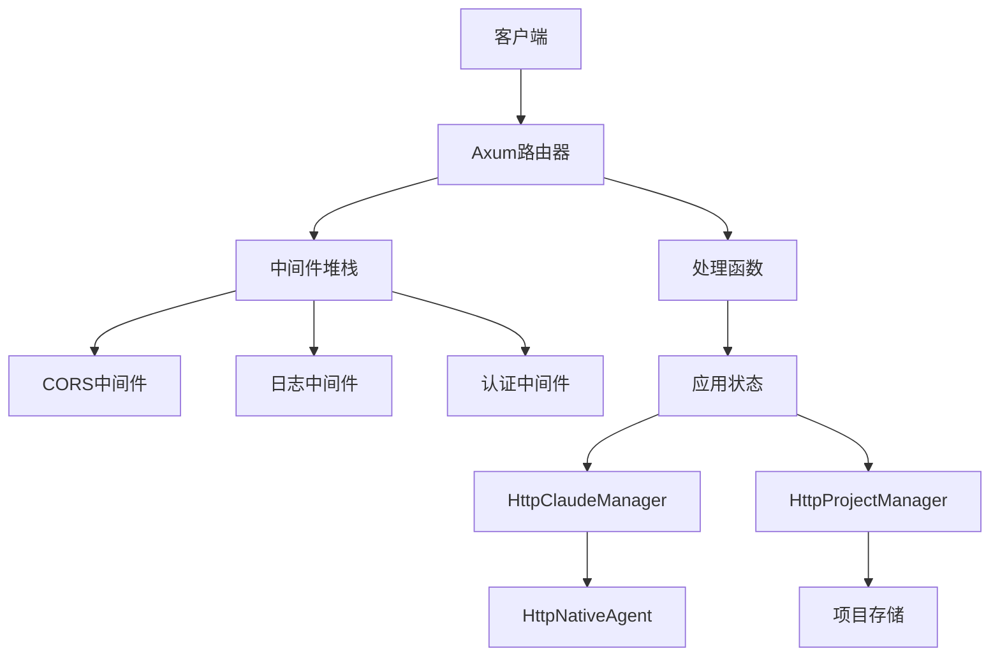
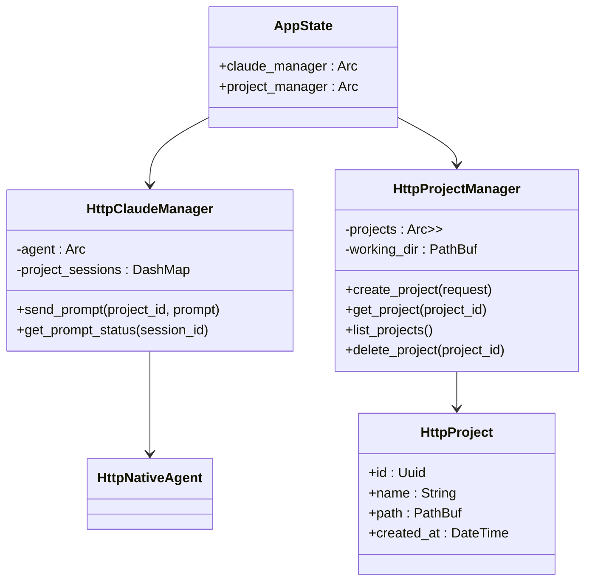
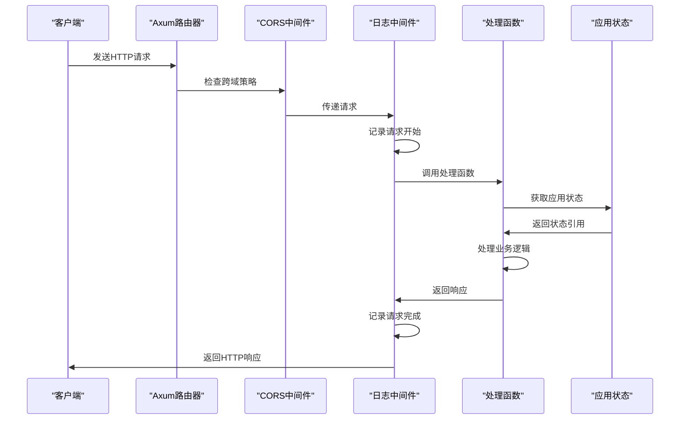
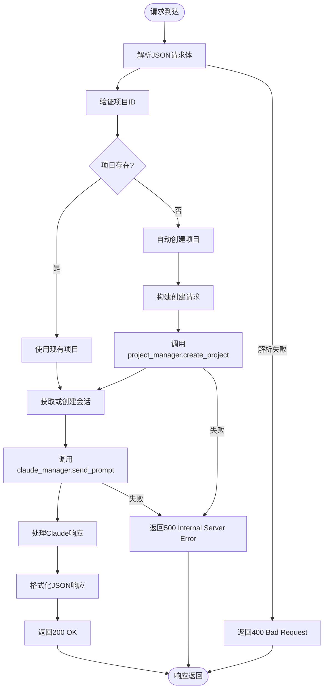
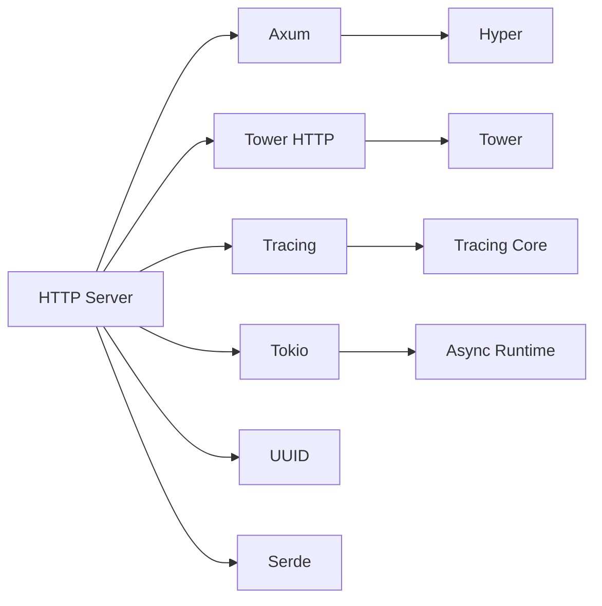

# HTTP服务架构

<cite>
**本文档引用的文件**
- [lib.rs](file://crates/http_server/src/lib.rs)
- [handlers.rs](file://crates/http_server/src/handlers.rs)
- [middleware.rs](file://crates/http_server/src/middleware.rs)
- [http_interface.rs](file://crates/http_server/src/http_interface.rs)
- [http_agent.rs](file://crates/http_server/src/http_agent.rs)
</cite>

## 目录
1. [简介](#简介)
2. [项目结构](#项目结构)
3. [核心组件](#核心组件)
4. [架构概览](#架构概览)
5. [详细组件分析](#详细组件分析)
6. [依赖分析](#依赖分析)
7. [性能考量](#性能考量)
8. [故障排除指南](#故障排除指南)
9. [结论](#结论)

## 简介
本文档详细描述了rcoder项目中基于Axum框架实现的HTTP服务架构。重点分析了`AppState`结构体如何通过`Arc`封装`claude_manager`和`project_manager`实现跨请求的状态共享与依赖注入机制。文档还深入探讨了路由注册、中间件堆栈（如CORS、日志、认证）的工作流程，并结合具体端点说明请求处理生命周期。此外，文档分析了异步处理模型下Tokio运行时的调度优势，并讨论了连接池配置与性能调优策略。

## 项目结构
HTTP服务模块位于`crates/http_server`目录下，采用Rust的模块化设计，主要包含以下核心文件：
- `lib.rs`：定义应用状态、创建路由和启动服务器
- `handlers.rs`：实现所有HTTP请求处理函数
- `middleware.rs`：定义日志、认证等中间件
- `http_interface.rs`：提供HTTP友好的业务逻辑封装
- `http_agent.rs`：管理与Agent的会话和连接

该结构遵循清晰的职责分离原则，便于维护和扩展。

**Section sources**
- [lib.rs](file://crates/http_server/src/lib.rs#L1-L65)
- [handlers.rs](file://crates/http_server/src/handlers.rs#L1-L260)
- [middleware.rs](file://crates/http_server/src/middleware.rs#L1-L49)

## 核心组件

`AppState`结构体是整个HTTP服务的核心，通过`Arc`（原子引用计数）封装`claude_manager`和`project_manager`，实现了跨请求的共享状态管理。这种设计确保了在多线程环境下对共享资源的安全访问，同时避免了数据竞争。

`HttpClaudeManager`负责管理与Claude Code的交互，通过`project_sessions`映射维护项目与会话之间的关联。`HttpProjectManager`则负责项目生命周期管理，使用`RwLock`保护内部的`HashMap`，允许多个读取者同时访问，但在写入时独占访问权。

**Section sources**
- [lib.rs](file://crates/http_server/src/lib.rs#L22-L25)
- [http_interface.rs](file://crates/http_server/src/http_interface.rs#L11-L15)
- [http_interface.rs](file://crates/http_server/src/http_interface.rs#L65-L69)

## 架构概览

**Diagram sources**
- [lib.rs](file://crates/http_server/src/lib.rs#L1-L65)
- [middleware.rs](file://crates/http_server/src/middleware.rs#L1-L49)

## 详细组件分析

### 状态管理分析

`AppState`结构体通过`Arc`实现跨请求的状态共享。`Arc`确保了引用计数的原子性，使得多个请求可以安全地共享对`claude_manager`和`project_manager`的只读引用。当应用创建时，这些管理器被封装在`Arc`中并注入到路由状态中，供所有处理函数使用。

**Diagram sources**
- [lib.rs](file://crates/http_server/src/lib.rs#L22-L25)
- [http_interface.rs](file://crates/http_server/src/http_interface.rs#L11-L15)
- [http_interface.rs](file://crates/http_server/src/http_interface.rs#L65-L69)

### 路由与中间件分析

Axum框架的路由系统通过`Router::new()`构建，并使用`.route()`方法注册端点。每个端点绑定到特定的HTTP方法和路径，并关联相应的处理函数。中间件堆栈通过`.layer()`方法添加，形成处理请求的管道。

CORS中间件通过`CorsLayer::permissive()`启用，允许所有跨域请求。日志中间件使用`TraceLayer`记录请求的开始、结束和失败情况，便于调试和监控。

**Diagram sources**
- [lib.rs](file://crates/http_server/src/lib.rs#L1-L65)
- [middleware.rs](file://crates/http_server/src/middleware.rs#L1-L49)

### 请求处理生命周期分析

请求处理生命周期从客户端发起请求开始，经过中间件处理，最终到达相应的处理函数。以`send_prompt`为例，处理流程如下：
1. 解析请求体中的JSON数据
2. 验证项目ID或自动创建项目
3. 通过`claude_manager`发送提示
4. 返回处理结果或错误响应

错误处理通过`Result<Json<T>, StatusCode>`类型实现，确保异常情况能返回适当的HTTP状态码。

**Diagram sources**
- [handlers.rs](file://crates/http_server/src/handlers.rs#L1-L260)
- [http_interface.rs](file://crates/http_server/src/http_interface.rs#L11-L179)

## 依赖分析

HTTP服务模块依赖于多个内部和外部组件：
- Axum：Web框架，提供路由、提取器和中间件支持
- Tower HTTP：提供CORS、日志等中间件
- Tracing：日志和跟踪系统
- Tokio：异步运行时
- UUID：唯一标识符生成
- Serde：序列化和反序列化

这些依赖通过Cargo.toml文件管理，确保版本兼容性和构建稳定性。

**Diagram sources**
- [lib.rs](file://crates/http_server/src/lib.rs#L1-L65)
- [Cargo.toml](file://crates/http_server/Cargo.toml#L1-L20)

## 性能考量

基于Tokio的异步运行时为HTTP服务提供了高效的调度能力。每个请求在轻量级任务中处理，避免了线程创建的开销。`Arc`和`RwLock`的组合使用确保了共享状态的高效访问，读操作无需阻塞。

对于性能调优，建议：
1. 调整Tokio运行时的工作线程数以匹配CPU核心数
2. 监控`DashMap`和`RwLock`的争用情况
3. 优化数据库查询（如果引入持久化存储）
4. 实现适当的缓存策略
5. 使用连接池管理外部服务连接

异步模型的优势在于能够处理大量并发连接而不会耗尽系统资源，特别适合I/O密集型的Web服务。

**Section sources**
- [lib.rs](file://crates/http_server/src/lib.rs#L1-L65)
- [http_interface.rs](file://crates/http_server/src/http_interface.rs#L11-L179)

## 故障排除指南

常见问题及解决方案：
- **500内部服务器错误**：检查日志中的错误信息，通常是业务逻辑异常
- **404未找到**：验证请求路径和HTTP方法是否正确
- **400错误请求**：检查JSON请求体格式是否符合预期
- **会话超时**：`HttpClaudeManager`应实现会话清理机制
- **性能下降**：监控Tokio任务队列和锁争用情况

日志系统通过`tracing`提供详细的请求跟踪，有助于快速定位问题根源。

**Section sources**
- [handlers.rs](file://crates/http_server/src/handlers.rs#L1-L260)
- [middleware.rs](file://crates/http_server/src/middleware.rs#L1-L49)

## 结论

rcoder的HTTP服务架构基于Axum框架构建，采用了现代化的Rust异步编程模式。通过`Arc`封装共享状态，实现了高效的安全并发访问。路由系统清晰，中间件堆栈完整，处理函数职责明确。异步运行时提供了卓越的性能表现，适合高并发场景。未来可进一步完善认证机制、引入持久化存储，并优化资源管理策略。