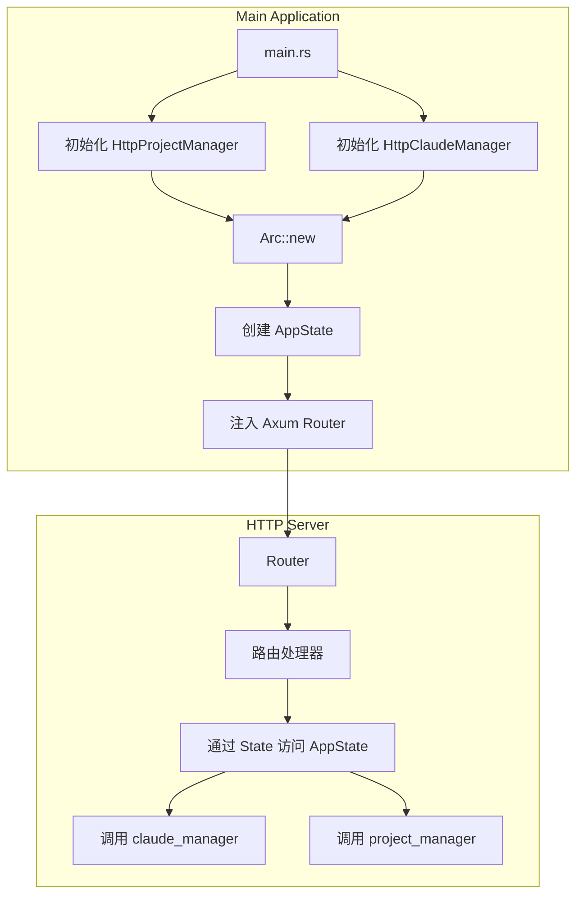
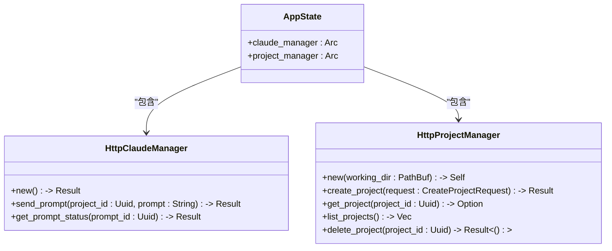
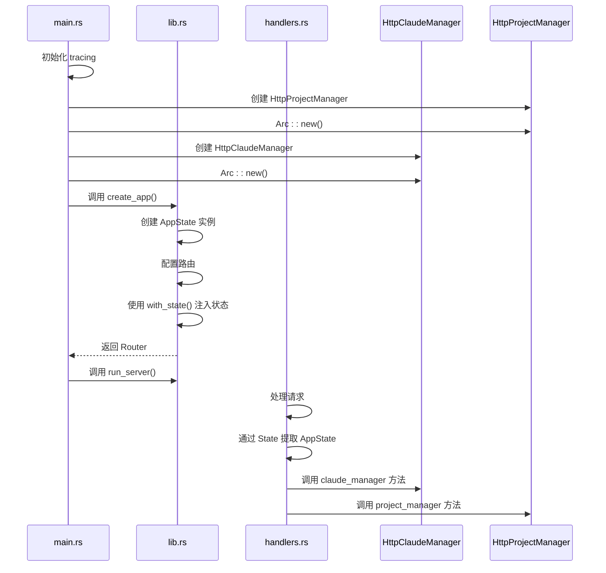
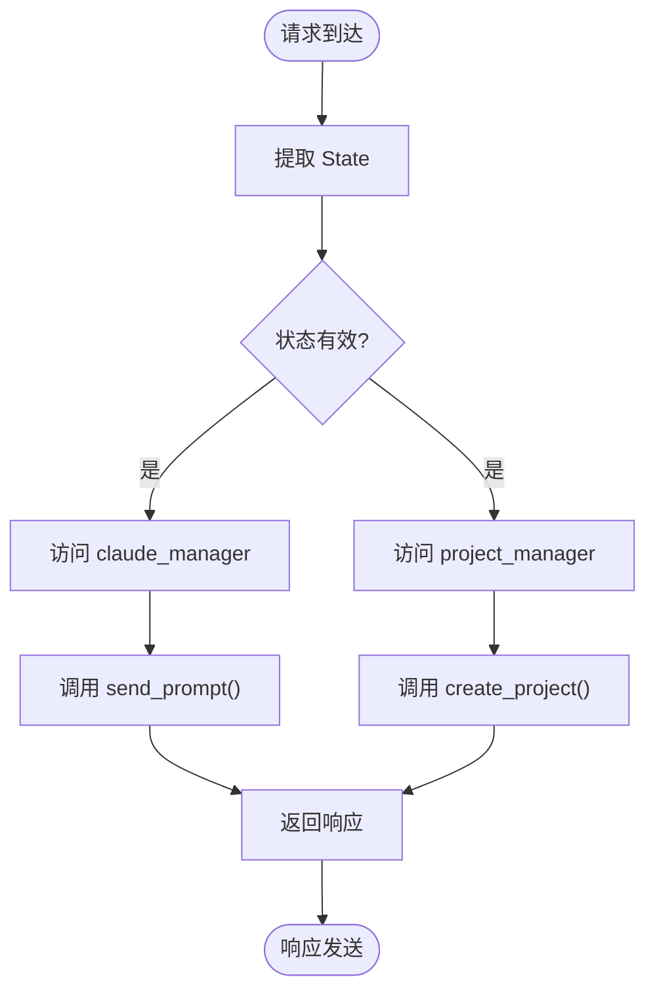
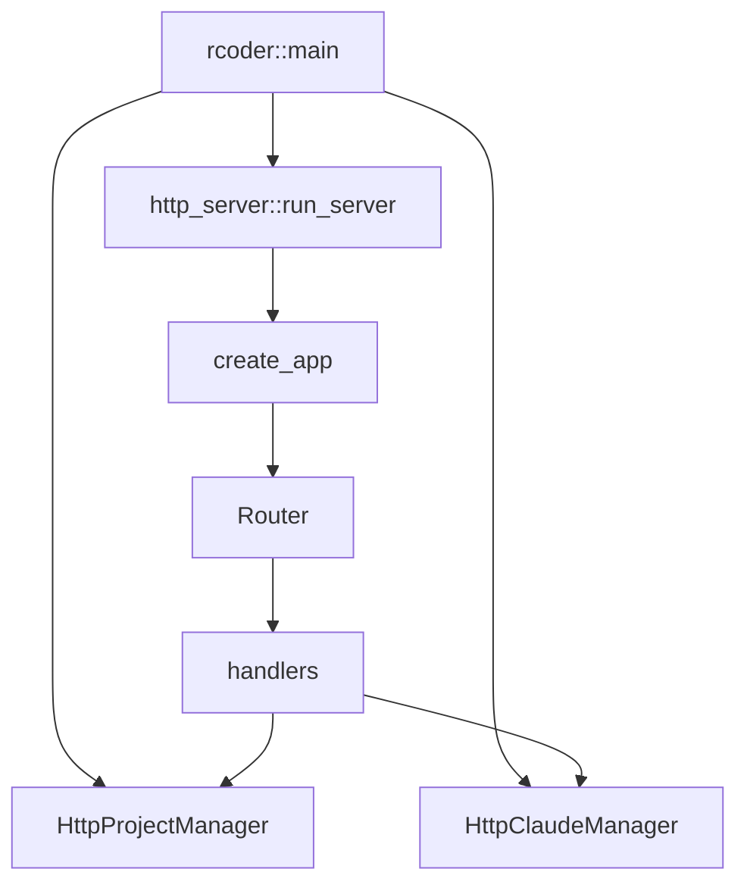

# 状态管理与依赖注入

<cite>
**本文档引用的文件**   
- [main.rs](file://crates/rcoder/src/main.rs)
- [lib.rs](file://crates/http_server/src/lib.rs)
- [handlers.rs](file://crates/http_server/src/handlers.rs)
</cite>

## 目录
1. [简介](#简介)
2. [项目结构](#项目结构)
3. [核心组件](#核心组件)
4. [架构概述](#架构概述)
5. [详细组件分析](#详细组件分析)
6. [依赖分析](#依赖分析)
7. [性能考虑](#性能考虑)
8. [故障排除指南](#故障排除指南)
9. [结论](#结论)

## 简介
本文档全面阐述了 `rcoder` 项目中通过 `AppState` 结构体实现的全局状态管理机制。重点分析了如何利用 `Arc` 智能指针封装 `HttpClaudeManager` 和 `HttpProjectManager` 实例，确保跨请求的线程安全共享。同时，文档详细说明了该状态在 Axum 应用中的注入方式、初始化时机、资源生命周期管理以及其在提升测试可维护性方面的优势。

## 项目结构
`rcoder` 项目采用模块化设计，主要功能分散在多个 crate 中。核心服务逻辑位于 `http_server` crate，而主程序入口在 `rcoder` crate。状态管理机制贯穿于这两个核心模块之间，通过共享状态实现跨组件通信。

**Section sources**
- [main.rs](file://crates/rcoder/src/main.rs#L1-L47)
- [lib.rs](file://crates/http_server/src/lib.rs#L1-L64)

## 核心组件
`AppState` 是整个系统状态管理的核心结构体，它封装了对 `HttpClaudeManager` 和 `HttpProjectManager` 的线程安全引用。这两个管理器分别负责与 Claude AI 服务的交互和本地项目资源的管理。通过将这些服务实例集中管理，系统实现了业务逻辑与基础设施的解耦。

**Section sources**
- [lib.rs](file://crates/http_server/src/lib.rs#L22-L25)
- [main.rs](file://crates/rcoder/src/main.rs#L10-L11)

## 架构概述
系统采用典型的分层架构，主程序初始化服务实例后，将其封装为共享状态注入到 Axum 路由系统中。所有请求处理器都能通过 `State` 提取器安全地访问这些共享资源，实现了全局状态的一致性和线程安全性。

**Diagram sources**
- [main.rs](file://crates/rcoder/src/main.rs#L25-L40)
- [lib.rs](file://crates/http_server/src/lib.rs#L35-L45)

## 详细组件分析

### AppState 结构体分析
`AppState` 结构体是全局状态管理的载体，其设计体现了 Rust 的所有权和并发安全理念。

**Diagram sources**
- [lib.rs](file://crates/http_server/src/lib.rs#L22-L25)
- [handlers.rs](file://crates/http_server/src/handlers.rs#L15-L16)

#### 状态注入机制
在 Axum 框架中，`AppState` 通过 `with_state()` 方法注入到路由系统中，使得所有处理器都能安全访问共享状态。

**Diagram sources**
- [main.rs](file://crates/rcoder/src/main.rs#L25-L40)
- [lib.rs](file://crates/http_server/src/lib.rs#L35-L50)
- [handlers.rs](file://crates/http_server/src/handlers.rs#L35-L36)

#### 线程安全分析
`Arc`（Atomically Reference Counted）智能指针的使用确保了跨线程共享的安全性。每个处理器获取的都是对管理器实例的引用计数指针，避免了数据竞争。

**Diagram sources**
- [lib.rs](file://crates/http_server/src/lib.rs#L22-L25)
- [handlers.rs](file://crates/http_server/src/handlers.rs#L35-L80)

**Section sources**
- [lib.rs](file://crates/http_server/src/lib.rs#L22-L64)
- [handlers.rs](file://crates/http_server/src/handlers.rs#L35-L259)

## 依赖分析
系统依赖关系清晰，主程序负责初始化和启动，HTTP 服务器负责请求处理，各管理器负责具体业务逻辑。这种分层依赖关系提高了代码的可维护性和可测试性。

**Diagram sources**
- [main.rs](file://crates/rcoder/src/main.rs#L1-L47)
- [lib.rs](file://crates/http_server/src/lib.rs#L1-L64)

**Section sources**
- [main.rs](file://crates/rcoder/src/main.rs#L1-L47)
- [lib.rs](file://crates/http_server/src/lib.rs#L1-L64)

## 性能考虑
使用 `Arc` 进行状态共享避免了频繁的资源创建和销毁，提高了系统性能。同时，由于管理器实例在应用生命周期内保持不变，减少了内存分配开销。

## 故障排除指南
当遇到状态访问问题时，应检查：
1. 确认 `AppState` 是否正确注入到路由系统中
2. 验证 `Arc` 包装的实例是否在多线程环境下正确共享
3. 检查资源初始化顺序是否正确

**Section sources**
- [lib.rs](file://crates/http_server/src/lib.rs#L35-L50)
- [main.rs](file://crates/rcoder/src/main.rs#L25-L40)

## 结论
`rcoder` 项目通过 `AppState` 结构体实现了优雅的全局状态管理。利用 `Arc` 智能指针和 Axum 的状态注入机制，系统在保证线程安全的同时，实现了业务逻辑与服务实例的解耦。这种设计不仅提高了代码的可维护性，也为单元测试提供了便利，是 Rust 异步 Web 应用中的优秀实践范例。