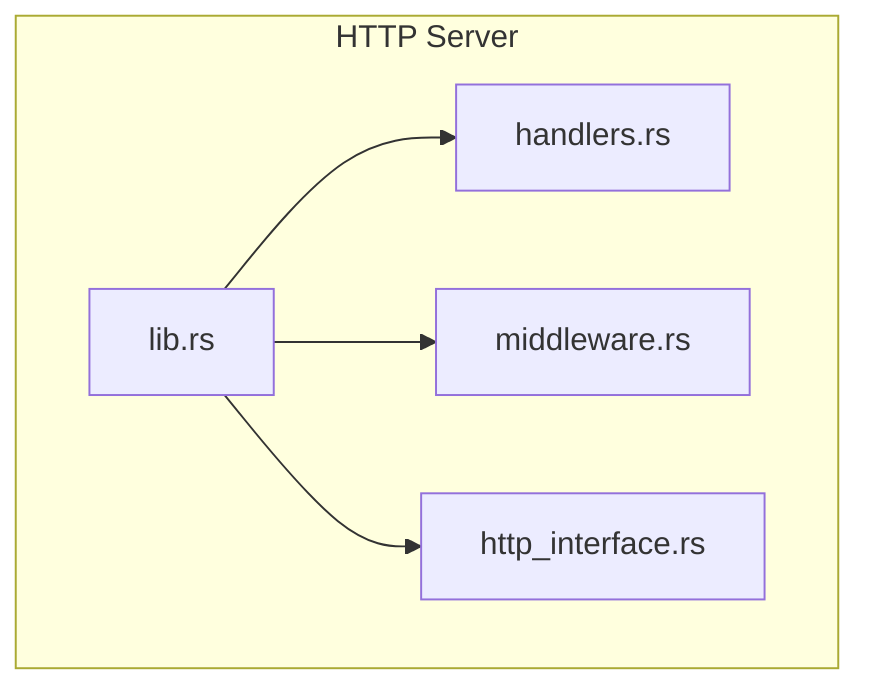
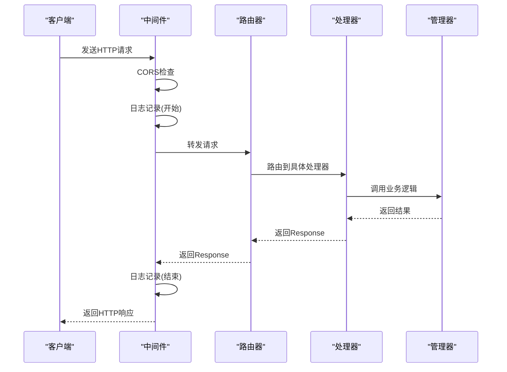
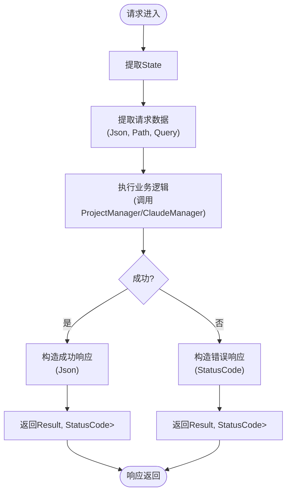
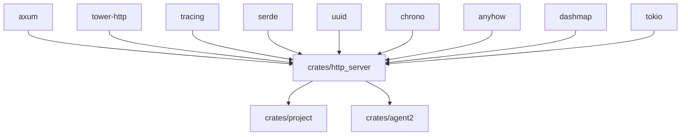

# 请求处理流程

<cite>
**本文档中引用的文件**  
- [handlers.rs](file://crates/http_server/src/handlers.rs)
- [middleware.rs](file://crates/http_server/src/middleware.rs)
- [lib.rs](file://crates/http_server/src/lib.rs)
- [http_interface.rs](file://crates/http_server/src/http_interface.rs)
</cite>

## 目录
1. [简介](#简介)
2. [项目结构](#项目结构)
3. [核心组件](#核心组件)
4. [架构概览](#架构概览)
5. [详细组件分析](#详细组件分析)
6. [依赖分析](#依赖分析)
7. [性能考虑](#性能考虑)
8. [故障排除指南](#故障排除指南)
9. [结论](#结论)

## 简介
本文档深入解析 `rcoder` 项目中 HTTP 请求的完整处理生命周期。从客户端请求进入开始，描述中间件堆栈（如 CORS、日志记录）如何预处理请求，随后进入具体 handler 进行业务逻辑调度。重点分析 `handlers.rs` 中各端点函数如何解析 JSON 请求体、执行异步操作并构造响应，包括成功与错误情况的返回格式。结合实际代码示例说明 Extractor 的使用模式，如 `Json<T>`、`Path<T>` 等类型的安全解包机制。讨论错误传播策略、状态码映射规则及自定义响应结构的设计考量。

## 项目结构
`rcoder` 项目采用模块化设计，其核心 HTTP 服务位于 `crates/http_server` 模块中。该模块包含处理请求的 `handlers.rs`、定义中间件的 `middleware.rs`、构建路由的 `lib.rs` 以及定义数据接口的 `http_interface.rs`。`AppState` 结构体作为共享状态，贯穿于整个请求处理流程。



**图示来源**
- [lib.rs](file://crates/http_server/src/lib.rs#L1-L65)
- [handlers.rs](file://crates/http_server/src/handlers.rs#L1-L260)
- [middleware.rs](file://crates/http_server/src/middleware.rs#L1-L49)
- [http_interface.rs](file://crates/http_server/src/http_interface.rs#L1-L284)

**本节来源**
- [lib.rs](file://crates/http_server/src/lib.rs#L1-L65)
- [handlers.rs](file://crates/http_server/src/handlers.rs#L1-L260)
- [middleware.rs](file://crates/http_server/src/middleware.rs#L1-L49)
- [http_interface.rs](file://crates/http_server/src/http_interface.rs#L1-L284)

## 核心组件
`rcoder` 的 HTTP 处理流程围绕 `axum` 框架构建，核心组件包括 `AppState`、`handlers`、`middleware` 和 `http_interface`。`AppState` 封装了 `HttpClaudeManager` 和 `HttpProjectManager`，为所有 handler 提供共享状态。`handlers` 模块定义了所有端点的业务逻辑，而 `middleware` 模块则负责请求的预处理和日志记录。

**本节来源**
- [lib.rs](file://crates/http_server/src/lib.rs#L22-L25)
- [handlers.rs](file://crates/http_server/src/handlers.rs#L1-L260)
- [http_interface.rs](file://crates/http_server/src/http_interface.rs#L1-L284)

## 架构概览
`rcoder` 的 HTTP 服务架构遵循典型的 Rust Web 服务模式。请求首先经过中间件层，进行 CORS 处理和日志记录。随后，请求被路由到相应的 handler 函数。handler 函数通过 `State` 提取器访问共享的 `AppState`，并利用 `Json`、`Path` 等提取器解析请求数据。业务逻辑处理完成后，handler 返回 `Result<Json<T>, StatusCode>`，由框架自动转换为 HTTP 响应。



**图示来源**
- [lib.rs](file://crates/http_server/src/lib.rs#L27-L47)
- [middleware.rs](file://crates/http_server/src/middleware.rs#L9-L28)
- [handlers.rs](file://crates/http_server/src/handlers.rs#L1-L260)

## 详细组件分析

### 请求处理分析
`rcoder` 的请求处理流程始于 `create_app` 函数，该函数构建了 `axum::Router` 并注册了所有路由。每个路由都关联一个 handler 函数，这些函数定义在 `handlers.rs` 文件中。

#### Handler 函数分析


**图示来源**
- [handlers.rs](file://crates/http_server/src/handlers.rs#L1-L260)
- [http_interface.rs](file://crates/http_server/src/http_interface.rs#L1-L284)

#### Extractor 使用模式
`rcoder` 广泛使用 `axum` 的 Extractor 特性来安全地解析请求。`State` 提取器用于访问共享的应用状态 `AppState`。`Json<T>` 提取器用于解析 JSON 请求体，它会自动反序列化并处理解析错误。`Path<T>` 提取器用于从 URL 路径中提取参数，如 `project_id`。`Query` 提取器用于解析查询字符串参数。

**本节来源**
- [handlers.rs](file://crates/http_server/src/handlers.rs#L1-L260)
- [lib.rs](file://crates/http_server/src/lib.rs#L27-L47)

### 错误处理分析
`rcoder` 的错误处理策略主要体现在 handler 函数的返回类型 `Result<Json<T>, StatusCode>` 上。当业务逻辑成功时，返回 `Ok(Json(response))`；当发生错误时，返回 `Err(StatusCode)`。错误码的映射规则如下：`NOT_FOUND` (404) 用于资源不存在，`INTERNAL_SERVER_ERROR` (500) 用于内部服务错误。`map_err` 方法被广泛用于将底层错误转换为合适的 HTTP 状态码。

```mermaid
classDiagram
class ErrorResponse {
+error : String
+message : String
+timestamp : DateTime<Utc>
+new(error : String, message : String) ErrorResponse
}
class StatusCode {
+OK : 200
+NOT_FOUND : 404
+INTERNAL_SERVER_ERROR : 500
+NO_CONTENT : 204
}
class Result~Json~T~~, StatusCode~ {
+Ok(Json~T~)
+Err(StatusCode)
}
Result~Json~T~~, StatusCode~ --> ErrorResponse : "on Err"
Result~Json~T~~, StatusCode~ --> Json~T~ : "on Ok"
```

**图示来源**
- [handlers.rs](file://crates/http_server/src/handlers.rs#L250-L259)
- [handlers.rs](file://crates/http_server/src/handlers.rs#L1-L260)

**本节来源**
- [handlers.rs](file://crates/http_server/src/handlers.rs#L1-L260)

## 依赖分析
`rcoder` 的 HTTP 服务依赖于 `axum`、`tower-http`、`tracing` 等外部库。`axum` 提供了 Web 框架的核心功能，`tower-http` 提供了 CORS 和日志中间件，`tracing` 用于日志记录。内部模块之间通过 `pub` 关键字和 `mod` 声明建立依赖关系。



**图示来源**
- [Cargo.toml](file://Cargo.toml#L1-L10)
- [lib.rs](file://crates/http_server/src/lib.rs#L1-L65)

**本节来源**
- [Cargo.toml](file://Cargo.toml#L1-L10)
- [lib.rs](file://crates/http_server/src/lib.rs#L1-L65)

## 性能考虑
`rcoder` 的设计考虑了性能因素。`HttpProjectManager` 使用 `DashMap` 来实现高效的并发访问。`HttpClaudeManager` 使用 `RwLock<HashMap>` 来管理会话映射，确保读操作的高性能。异步操作（如文件系统 I/O）均使用 `tokio::fs`，避免阻塞主线程。

## 故障排除指南
常见问题包括项目创建失败、提示处理失败等。检查日志是首要步骤，`tracing_middleware` 会记录每个请求的开始、结束和失败信息。对于 `INTERNAL_SERVER_ERROR`，应检查 `error!` 日志以获取详细错误信息。对于 `NOT_FOUND` 错误，应确认请求的资源 ID 是否正确。

**本节来源**
- [middleware.rs](file://crates/http_server/src/middleware.rs#L9-L28)
- [handlers.rs](file://crates/http_server/src/handlers.rs#L1-L260)

## 结论
`rcoder` 的 HTTP 请求处理流程清晰、模块化且高效。通过 `axum` 框架的强大功能，实现了从请求接收、中间件处理、业务逻辑执行到响应返回的完整闭环。其设计充分考虑了可维护性、可扩展性和性能，为后续功能开发奠定了坚实的基础。