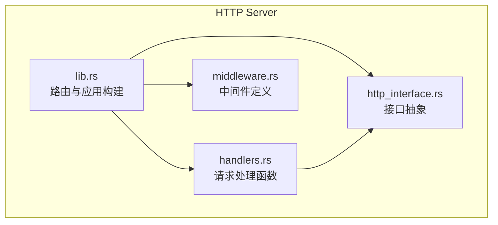
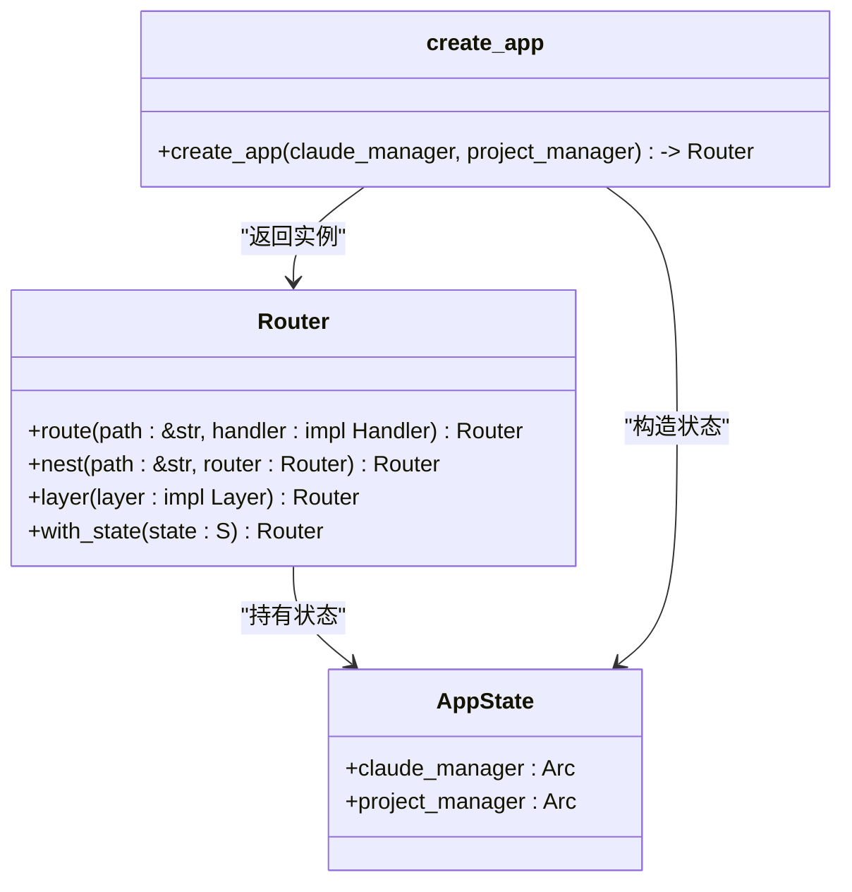
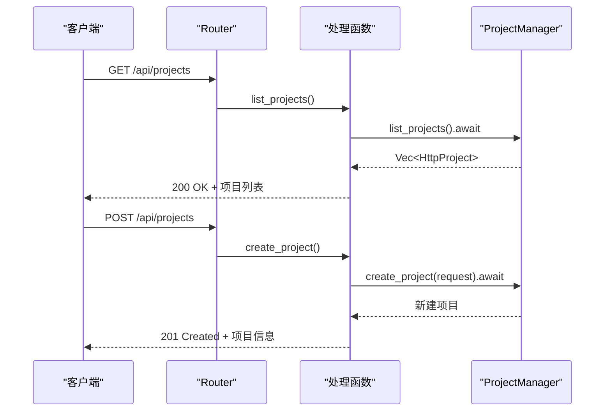
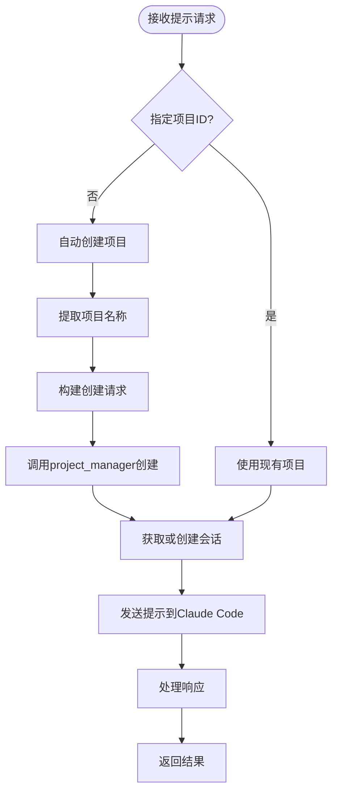
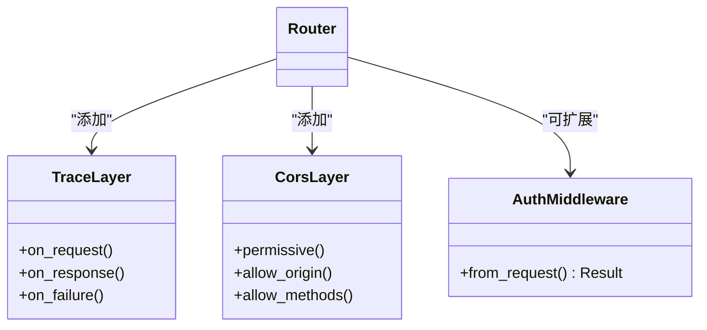
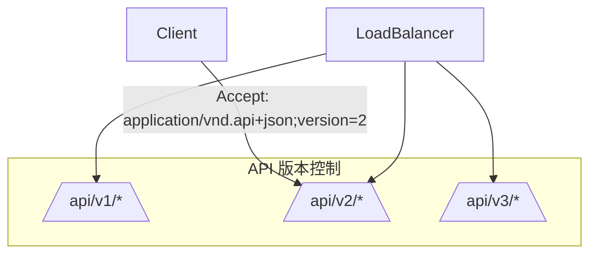

# 路由配置

<cite>
**本文档中引用的文件**  
- [lib.rs](file://crates/http_server/src/lib.rs)
- [handlers.rs](file://crates/http_server/src/handlers.rs)
- [middleware.rs](file://crates/http_server/src/middleware.rs)
- [http_interface.rs](file://crates/http_server/src/http_interface.rs)
</cite>

## 目录
1. [引言](#引言)
2. [项目结构与核心模块](#项目结构与核心模块)
3. [路由注册机制详解](#路由注册机制详解)
4. [核心路由功能分析](#核心路由功能分析)
5. [嵌套路由与中间件应用](#嵌套路由与中间件应用)
6. [HTTP方法绑定与参数处理](#http方法绑定与参数处理)
7. [模块化扩展与API版本控制支持](#模块化扩展与api版本控制支持)
8. [总结](#总结)

## 引言

rcoder项目基于Axum框架构建了现代化的异步Web服务，其路由系统是整个后端服务的核心组成部分。本文档详细说明rcoder中基于Axum框架的路由注册机制，涵盖API端点路径与处理函数的映射关系、嵌套路由、中间件集成、参数提取与验证等关键技术细节。通过分析`lib.rs`中的服务启动逻辑和`handlers.rs`中的具体实现，全面展示系统如何支持项目管理、会话创建、提示处理等核心功能。

## 项目结构与核心模块

rcoder采用模块化架构设计，HTTP服务主要位于`crates/http_server`目录下，包含以下核心组件：



**Diagram sources**  
- [lib.rs](file://crates/http_server/src/lib.rs#L1-L65)
- [handlers.rs](file://crates/http_server/src/handlers.rs#L1-L260)
- [middleware.rs](file://crates/http_server/src/middleware.rs#L1-L49)
- [http_interface.rs](file://crates/http_server/src/http_interface.rs)

**Section sources**  
- [lib.rs](file://crates/http_server/src/lib.rs#L1-L65)
- [handlers.rs](file://crates/http_server/src/handlers.rs#L1-L260)

## 路由注册机制详解

rcoder使用Axum框架的`Router`结构体来定义API端点路径与处理函数之间的映射关系。路由注册的核心逻辑位于`lib.rs`文件中的`create_app`函数。



**Diagram sources**  
- [lib.rs](file://crates/http_server/src/lib.rs#L27-L47)

**Section sources**  
- [lib.rs](file://crates/http_server/src/lib.rs#L27-L47)

### 路由构建流程

1. **状态初始化**：创建`AppState`结构体，封装`HttpClaudeManager`和`HttpProjectManager`两个核心服务实例
2. **路由链式构建**：使用`Router::new()`创建根路由器，并通过`.route()`方法链式注册各个API端点
3. **中间件注入**：通过`.layer()`方法添加CORS跨域支持和请求追踪中间件
4. **状态绑定**：使用`.with_state()`将应用状态注入到路由中，供所有处理函数访问

### 核心路由映射

系统通过`.route()`方法将HTTP路径与处理函数进行绑定，支持多种HTTP方法的组合注册：

- `GET /api/health` → `health_check`
- `GET/POST /api/projects` → `list_projects`/`create_project`
- `GET/PUT/DELETE /api/projects/:id` → `get_project`/`update_project`/`delete_project`
- `POST /api/prompts` → `send_prompt`
- `GET /api/prompts/:prompt_id` → `get_prompt_status`

## 核心路由功能分析

### 项目管理路由

项目管理功能通过`/api/projects`系列路由实现，支持项目的增删改查操作。



**Diagram sources**  
- [lib.rs](file://crates/http_server/src/lib.rs#L30-L32)
- [handlers.rs](file://crates/http_server/src/handlers.rs#L35-L59)
- [http_interface.rs](file://crates/http_server/src/http_interface.rs#L32-L58)

#### 路径参数处理

对于需要项目ID的操作，系统使用路径参数`:id`来捕获UUID标识符：

```rust
.route("/api/projects/:id", get(get_project).put(update_project).delete(delete_project))
```

在处理函数中通过`Path(project_id): Path<Uuid>`提取参数：

```rust
pub async fn get_project(
    State(state): State<AppState>,
    Path(project_id): Path<Uuid>,
) -> Result<Json<HttpProject>, StatusCode>
```

### 提示处理路由

提示处理功能是系统的核心交互接口，支持通过自然语言提示生成代码。



**Diagram sources**  
- [lib.rs](file://crates/http_server/src/lib.rs#L35-L36)
- [handlers.rs](file://crates/http_server/src/handlers.rs#L134-L173)
- [http_interface.rs](file://crates/http_server/src/http_interface.rs#L80-L110)

#### 智能项目创建

当请求未指定项目ID时，系统会根据提示内容自动创建项目：

1. 调用`extract_project_name_from_prompt`函数从提示中提取项目名称
2. 构建`CreateProjectRequest`请求对象
3. 调用`project_manager.create_project`创建新项目
4. 使用新项目的ID进行后续处理

## 嵌套路由与中间件应用

### 中间件机制

系统实现了基于Axum的中间件机制，主要包含两类中间件：



**Diagram sources**  
- [lib.rs](file://crates/http_server/src/lib.rs#L45-L46)
- [middleware.rs](file://crates/http_server/src/middleware.rs#L10-L28)

#### CORS中间件

通过`CorsLayer::permissive()`启用宽松的跨域资源共享策略，允许来自任何源的请求：

```rust
.layer(CorsLayer::permissive())
```

#### 请求追踪中间件

集成`tower_http::trace::TraceLayer`提供详细的请求日志记录：

```rust
.layer(tower_http::trace::TraceLayer::new_for_http())
```

该中间件会在请求开始、结束和失败时输出调试信息，便于监控和问题排查。

### 作用域路由设计

虽然当前实现中未使用嵌套路由（`nest`），但系统架构支持模块化扩展。通过`Router::nest()`方法可以将相关路由组织到公共前缀下：

```rust
// 示例：未来可扩展的版本化API
Router::new()
    .nest("/api/v1", api_v1_routes())
    .nest("/api/v2", api_v2_routes())
```

这种设计模式为未来的API版本控制提供了良好的基础。

## HTTP方法绑定与参数处理

### 多方法路由注册

Axum支持在同一路径上注册多个HTTP方法，通过链式调用实现：

```rust
.route("/api/projects", get(list_projects).post(create_project))
```

这种方式简洁地定义了资源集合的标准RESTful接口。

### 查询参数提取

系统支持从查询字符串中提取参数，如项目列表接口中的分页和搜索参数：

```rust
pub async fn list_projects(
    State(state): State<AppState>,
    Query(params): Query<ListProjectsQuery>,
) -> Result<Json<Vec<HttpProject>>, StatusCode>
```

对应的查询结构体定义：

```rust
#[derive(Deserialize)]
pub struct ListProjectsQuery {
    pub search: Option<String>,
    pub page: Option<u32>,
    pub limit: Option<u32>,
}
```

### 请求体反序列化

对于POST请求，系统使用`Json<T>`提取器自动反序列化请求体：

```rust
pub async fn create_project(
    State(state): State<AppState>,
    Json(request): Json<CreateProjectRequest>,
) -> Result<Json<HttpProject>, StatusCode>
```

请求体数据结构通过`serde::Deserialize`派生实现自动解析。

### 错误处理与验证

系统采用Result类型进行错误处理，结合`map_err`方法将内部错误转换为适当的HTTP状态码：

```rust
let project = state.project_manager.get_project(project_id).await
    .ok_or(StatusCode::NOT_FOUND)?;
```

对于创建操作的错误处理：

```rust
.map_err(|e| {
    error!("Failed to create project: {}", e);
    StatusCode::INTERNAL_SERVER_ERROR
})?;
```

## 模块化扩展与API版本控制支持

### 模块化设计优势

当前路由系统的设计具有良好的模块化特性：

1. **关注点分离**：路由定义、处理函数、业务逻辑分别位于不同模块
2. **可复用性**：中间件和状态管理机制可跨路由复用
3. **可测试性**：处理函数独立于路由系统，便于单元测试

### API版本控制潜力

尽管当前API未实现版本控制，但架构设计为未来扩展提供了支持：



**Diagram sources**  
- [lib.rs](file://crates/http_server/src/lib.rs#L27-L47)

通过以下方式可实现API版本控制：

1. **路径版本化**：使用`/api/v1/`、`/api/v2/`等路径前缀
2. **内容协商**：通过Accept头指定API版本
3. **独立路由模块**：为每个版本创建独立的路由模块

### 扩展建议

1. **引入嵌套路由**：将相关功能分组到子路由中
2. **增强认证机制**：完善`AuthMiddleware`实现JWT验证
3. **添加请求验证**：使用`axum::extract::Extension`进行输入验证
4. **实现API文档**：集成Swagger/OpenAPI支持

## 总结

rcoder基于Axum框架构建了高效、清晰的路由系统，通过`Router`结构体实现了API端点与处理函数的精确映射。系统支持项目管理、提示处理等核心功能，采用模块化设计便于维护和扩展。路由机制充分利用了Axum的特性，包括链式路由注册、多方法绑定、参数提取、中间件集成等。虽然当前实现较为基础，但其架构设计为未来的功能扩展和API版本控制提供了良好的基础。通过进一步完善嵌套路由、认证授权和API文档等功能，可以构建更加健壮和专业的Web服务接口。