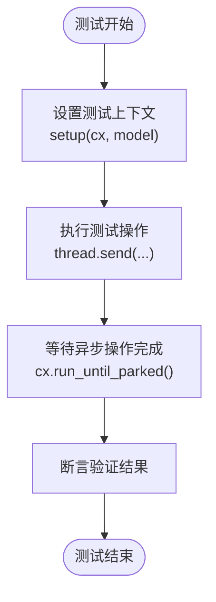
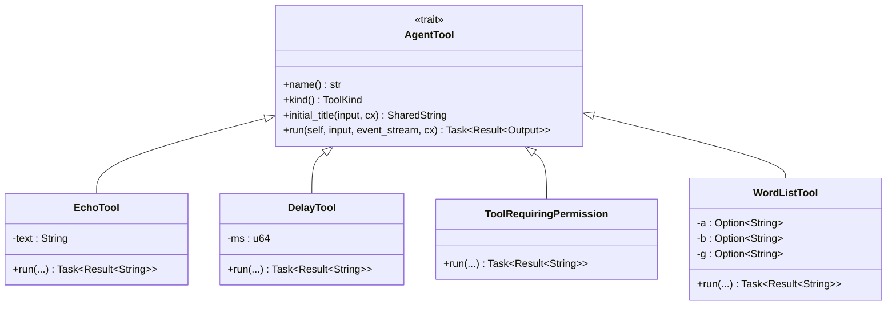
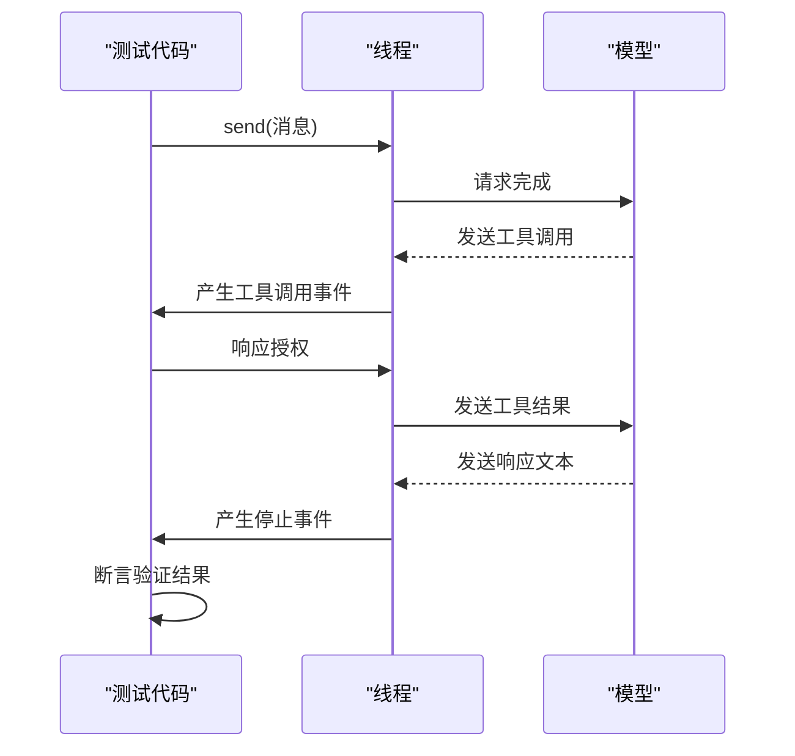

# 单元测试

<cite>
**本文档中引用的文件**  
- [mod.rs](file://crates/agent2/src/tests/mod.rs)
- [test_tools.rs](file://crates/agent2/src/tests/test_tools.rs)
</cite>

## 目录
1. [简介](#简介)
2. [测试框架结构](#测试框架结构)
3. [测试用例组织方式](#测试用例组织方式)
4. [工具模拟与验证逻辑](#工具模拟与验证逻辑)
5. #[cfg(test)]属性与测试模块隔离](#cfgtest属性与测试模块隔离)
6. [高覆盖率单元测试实践](#高覆盖率单元测试实践)
7. [测试断言与自定义宏](#测试断言与自定义宏)
8. [Mock对象与方法调用序列验证](#mock对象与方法调用序列验证)
9. [结论](#结论)

## 简介
本文档深入解析`agent2`模块中的单元测试实现，重点分析`mod.rs`中定义的测试框架结构和测试用例组织方式，以及`test_tools.rs`中针对各类工具的模拟与验证逻辑。通过具体代码实例，展示如何利用Rust的测试特性进行高效、可靠的单元测试。

## 测试框架结构

`agent2`模块的单元测试框架基于`gpui::TestAppContext`构建，提供了一个完整的异步测试环境。测试通过`setup`函数初始化测试上下文，创建必要的依赖项，如语言模型、线程、项目上下文和文件系统等。

测试框架利用`FakeLanguageModel`来模拟语言模型的行为，允许测试代码精确控制模型的响应，包括发送文本片段、工具调用和完成事件。这种模拟方式使得测试可以覆盖各种场景，包括正常流程、错误路径和边界条件。

**Section sources**
- [mod.rs](file://crates/agent2/src/tests/mod.rs#L2323-L2350)

## 测试用例组织方式

测试用例使用`#[gpui::test]`宏进行标记，支持异步测试。每个测试函数通常遵循"设置-执行-断言"模式。测试用例按功能进行组织，例如`test_echo`、`test_thinking`、`test_system_prompt`等，每个测试专注于验证特定的功能点。

测试用例之间通过`cx.run_until_parked()`确保异步操作完成，然后进行断言验证。这种组织方式使得测试逻辑清晰，易于理解和维护。

**Diagram sources**
- [mod.rs](file://crates/agent2/src/tests/mod.rs#L2323-L2350)
- [mod.rs](file://crates/agent2/src/tests/mod.rs#L20-L30)

**Section sources**
- [mod.rs](file://crates/agent2/src/tests/mod.rs#L20-L30)
- [mod.rs](file://crates/agent2/src/tests/mod.rs#L2323-L2350)

## 工具模拟与验证逻辑

`test_tools.rs`文件定义了多个用于测试的工具实现，包括`EchoTool`、`DelayTool`、`ToolRequiringPermission`等。这些工具实现了`AgentTool` trait，提供了`name`、`kind`、`initial_title`和`run`等方法。

测试工具的模拟逻辑通过返回预定义的结果来实现。例如，`EchoTool`简单地返回输入的文本，而`DelayTool`则使用定时器模拟延迟操作。`ToolRequiringPermission`工具则通过`authorize`方法模拟权限请求流程。

**Diagram sources**
- [test_tools.rs](file://crates/agent2/src/tests/test_tools.rs#L15-L221)

**Section sources**
- [test_tools.rs](file://crates/agent2/src/tests/test_tools.rs#L15-L221)

## #[cfg(test)]属性与测试模块隔离

`agent2`模块使用`#[cfg(test)]`属性来隔离测试代码，确保测试相关的代码不会包含在生产构建中。测试模块通过`mod test_tools;`导入测试工具，实现了测试代码与生产代码的分离。

这种隔离方式不仅减少了生产代码的体积，还避免了测试代码对生产环境的潜在影响。同时，它允许测试代码使用一些仅在测试环境中可用的依赖项和功能。

**Section sources**
- [mod.rs](file://crates/agent2/src/tests/mod.rs#L15-L20)

## 高覆盖率单元测试实践

`agent2`模块的单元测试实践注重高覆盖率，包括异步函数测试、错误路径覆盖和边界条件验证。测试用例通过模拟各种输入和环境条件，确保代码在不同场景下的正确性。

例如，`test_tool_authorization`测试验证了工具调用授权流程，包括批准、拒绝和始终允许等不同选项。`test_resume_after_tool_use_limit`测试则验证了在达到工具使用限制后恢复操作的正确性。

**Diagram sources**
- [mod.rs](file://crates/agent2/src/tests/mod.rs#L200-L250)
- [mod.rs](file://crates/agent2/src/tests/mod.rs#L500-L550)

**Section sources**
- [mod.rs](file://crates/agent2/src/tests/mod.rs#L200-L250)
- [mod.rs](file://crates/agent2/src/tests/mod.rs#L500-L550)

## 测试断言与自定义宏

测试断言使用标准的`assert_eq!`宏进行值比较，同时结合`pretty_assertions`库提供更友好的错误输出。对于复杂的断言逻辑，测试代码定义了辅助函数，如`stop_events`，用于过滤和提取特定类型的事件。

自定义断言宏的使用场景在当前代码中未直接体现，但通过辅助函数实现了类似的抽象和复用。这种方式提高了测试代码的可读性和可维护性。

**Section sources**
- [mod.rs](file://crates/agent2/src/tests/mod.rs#L2290-L2299)

## Mock对象与方法调用序列验证

`agent2`模块的测试通过`FakeLanguageModel`等mock对象验证内部方法调用序列。测试代码可以检查模型接收到的请求消息序列，包括用户消息、助手消息和工具结果消息。

例如，`test_prompt_caching`测试验证了提示缓存机制，通过检查模型接收到的消息序列中`cache`标志的正确性。`test_tool_authorization`测试则验证了工具调用授权流程中的消息序列。

**Section sources**
- [mod.rs](file://crates/agent2/src/tests/mod.rs#L350-L400)
- [mod.rs](file://crates/agent2/src/tests/mod.rs#L600-L650)

## 结论
`agent2`模块的单元测试实现展示了Rust中高效、可靠的测试实践。通过合理的测试框架设计、清晰的测试用例组织、完善的工具模拟和全面的覆盖率验证，确保了代码的质量和稳定性。这些实践为其他模块的测试提供了有价值的参考。