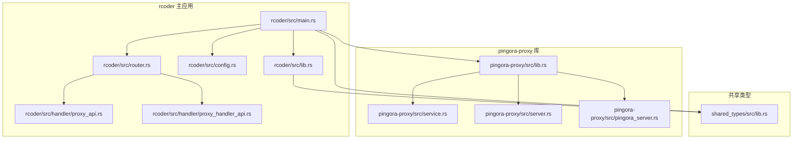
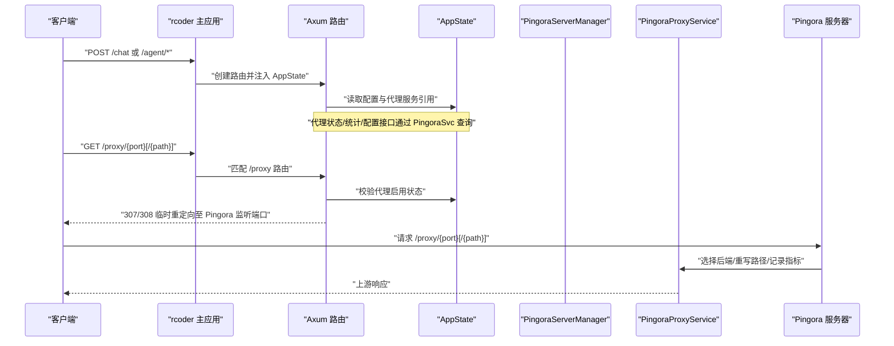
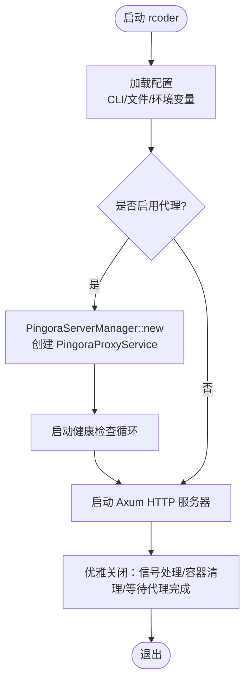
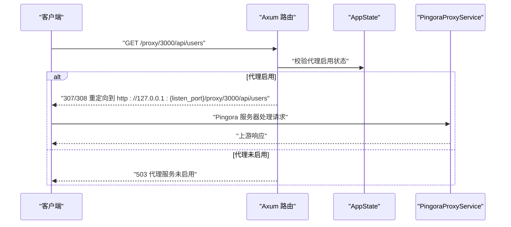
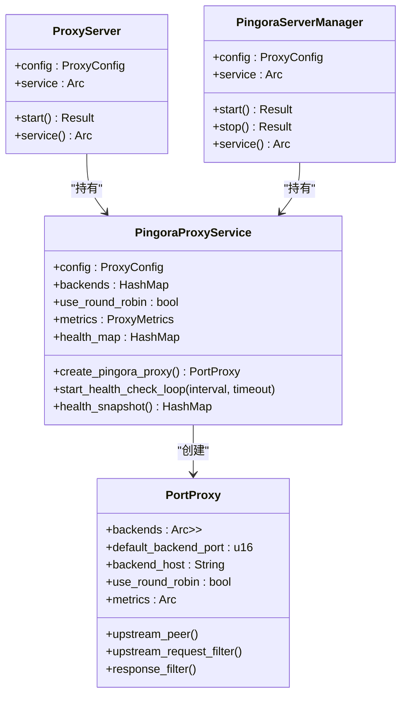
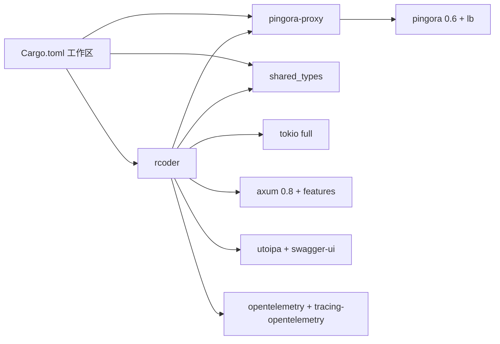
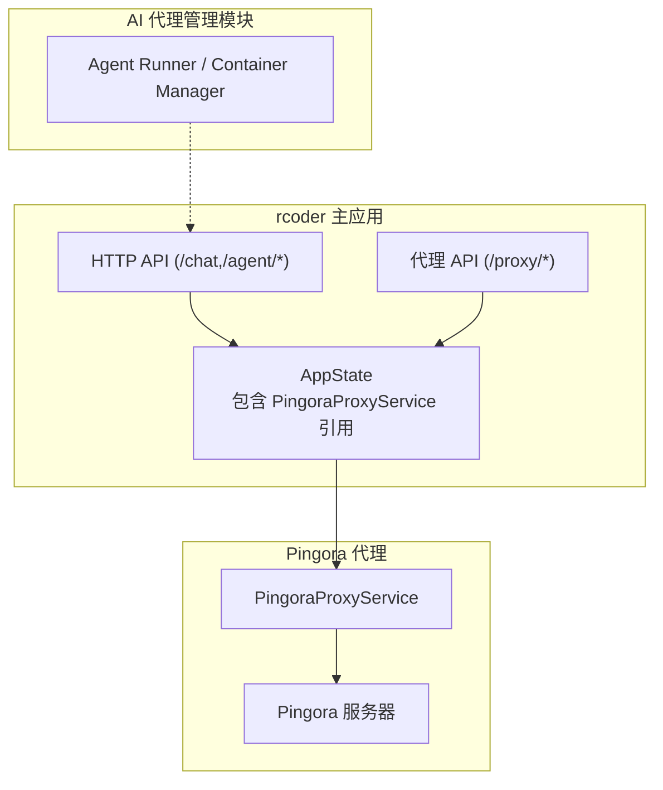

# 与主应用集成

<cite>
**本文引用的文件**
- [crates/rcoder/src/lib.rs](file://crates/rcoder/src/lib.rs)
- [crates/rcoder/src/main.rs](file://crates/rcoder/src/main.rs)
- [crates/rcoder/src/config.rs](file://crates/rcoder/src/config.rs)
- [crates/rcoder/src/router.rs](file://crates/rcoder/src/router.rs)
- [crates/rcoder/src/handler/proxy_api.rs](file://crates/rcoder/src/handler/proxy_api.rs)
- [crates/rcoder/src/handler/proxy_handler_api.rs](file://crates/rcoder/src/handler/proxy_handler_api.rs)
- [crates/pingora-proxy/src/lib.rs](file://crates/pingora-proxy/src/lib.rs)
- [crates/pingora-proxy/src/server.rs](file://crates/pingora-proxy/src/server.rs)
- [crates/pingora-proxy/src/service.rs](file://crates/pingora-proxy/src/service.rs)
- [crates/pingora-proxy/src/pingora_server.rs](file://crates/pingora-proxy/src/pingora_server.rs)
- [crates/shared_types/src/lib.rs](file://crates/shared_types/src/lib.rs)
- [Cargo.toml](file://Cargo.toml)
</cite>

## 目录
1. [引言](#引言)
2. [项目结构](#项目结构)
3. [核心组件](#核心组件)
4. [架构总览](#架构总览)
5. [详细组件分析](#详细组件分析)
6. [依赖关系分析](#依赖关系分析)
7. [性能考量](#性能考量)
8. [故障排查指南](#故障排查指南)
9. [结论](#结论)
10. [附录](#附录)

## 引言
本文件面向 rcoder 主应用与 pingora-proxy 的集成场景，系统化阐述 rcoder 如何通过依赖注入的方式整合 pingora-proxy，涵盖模块初始化、服务注册与运行时协调机制；同时说明 lib.rs 中公开 API 的职责边界与在主应用中的调用方式；并分析异步任务通信、错误传播与资源管理策略。最后给出系统上下文图，展示代理服务与 HTTP API、AI 代理管理模块之间的交互关系。

## 项目结构
rcoder 作为主应用，通过 Cargo 工作区组织各子 crate。其中：
- rcoder：主应用入口、HTTP 路由与处理器、配置加载、代理服务集成点
- pingora-proxy：基于 Cloudflare Pingora 的高性能反向代理库
- shared_types：跨模块共享的数据模型与 gRPC 类型
- agent_runner、docker_manager、acp_adapter、claude-code-agent、codex-acp-agent：AI 代理与容器管理相关模块

图表来源
- [crates/rcoder/src/main.rs](file://crates/rcoder/src/main.rs#L1-L272)
- [crates/rcoder/src/lib.rs](file://crates/rcoder/src/lib.rs#L1-L24)
- [crates/rcoder/src/config.rs](file://crates/rcoder/src/config.rs#L1-L120)
- [crates/rcoder/src/router.rs](file://crates/rcoder/src/router.rs#L1-L84)
- [crates/rcoder/src/handler/proxy_api.rs](file://crates/rcoder/src/handler/proxy_api.rs#L1-L195)
- [crates/rcoder/src/handler/proxy_handler_api.rs](file://crates/rcoder/src/handler/proxy_handler_api.rs#L1-L120)
- [crates/pingora-proxy/src/lib.rs](file://crates/pingora-proxy/src/lib.rs#L60-L120)
- [crates/pingora-proxy/src/service.rs](file://crates/pingora-proxy/src/service.rs#L411-L596)
- [crates/pingora-proxy/src/server.rs](file://crates/pingora-proxy/src/server.rs#L1-L155)
- [crates/pingora-proxy/src/pingora_server.rs](file://crates/pingora-proxy/src/pingora_server.rs#L1-L106)
- [crates/shared_types/src/lib.rs](file://crates/shared_types/src/lib.rs#L1-L71)

章节来源
- [Cargo.toml](file://Cargo.toml#L1-L205)

## 核心组件
- rcoder 主应用
  - 配置加载与 CLI 参数解析
  - HTTP 服务器启动与优雅关闭
  - 代理服务启动与运行时协调
  - 应用状态 AppState 注入到路由
- pingora-proxy 库
  - 代理服务 PingoraProxyService 与端口代理 PortProxy
  - 服务器管理 PingoraServerManager 与 PingoraServerRunner
  - 健康检查与指标采集
- 共享类型 shared_types
  - 统一的 Agent/Chat/Session 等数据模型
  - 多镜像配置与服务类型定义

章节来源
- [crates/rcoder/src/main.rs](file://crates/rcoder/src/main.rs#L1-L272)
- [crates/pingora-proxy/src/lib.rs](file://crates/pingora-proxy/src/lib.rs#L60-L120)
- [crates/pingora-proxy/src/service.rs](file://crates/pingora-proxy/src/service.rs#L411-L596)
- [crates/shared_types/src/lib.rs](file://crates/shared_types/src/lib.rs#L1-L71)

## 架构总览
rcoder 主应用通过依赖注入的方式将 Pingora 代理服务注入到 AppState 中，随后在路由层提供代理状态、统计与配置查询接口；同时在主 HTTP 服务器上提供 /proxy 路由的重定向能力，最终由 Pingora 独立进程完成真正的代理转发。

图表来源
- [crates/rcoder/src/main.rs](file://crates/rcoder/src/main.rs#L169-L209)
- [crates/rcoder/src/router.rs](file://crates/rcoder/src/router.rs#L52-L84)
- [crates/rcoder/src/handler/proxy_handler_api.rs](file://crates/rcoder/src/handler/proxy_handler_api.rs#L230-L332)
- [crates/pingora-proxy/src/pingora_server.rs](file://crates/pingora-proxy/src/pingora_server.rs#L37-L91)
- [crates/pingora-proxy/src/service.rs](file://crates/pingora-proxy/src/service.rs#L246-L354)

## 详细组件分析

### rcoder 主应用初始化与依赖注入
- 配置加载
  - 优先从配置文件加载，支持命令行参数与环境变量覆盖
  - 代理配置可按需启用，包含监听端口、默认后端端口、后端主机与健康检查
- 代理服务启动
  - 通过 PingoraServerManager.new 创建服务实例并启动
  - 将 PingoraProxyService 的 Arc 引用注入 AppState，供路由查询状态/统计/配置
  - 启动健康检查循环（若启用）
- HTTP 服务器
  - 绑定主服务端口，注册 API 路由与 Swagger UI
  - 优雅关闭：捕获信号，清理容器，等待代理服务完成

图表来源
- [crates/rcoder/src/main.rs](file://crates/rcoder/src/main.rs#L169-L265)
- [crates/rcoder/src/config.rs](file://crates/rcoder/src/config.rs#L253-L332)
- [crates/pingora-proxy/src/server.rs](file://crates/pingora-proxy/src/server.rs#L1-L109)
- [crates/pingora-proxy/src/pingora_server.rs](file://crates/pingora-proxy/src/pingora_server.rs#L37-L91)

章节来源
- [crates/rcoder/src/main.rs](file://crates/rcoder/src/main.rs#L1-L272)
- [crates/rcoder/src/config.rs](file://crates/rcoder/src/config.rs#L1-L120)

### rcoder 路由与代理 API
- 路由组织
  - API 路由：/health、/chat、/agent/* 等
  - 代理 API 路由：/proxy/status、/proxy/stats、/proxy/config、/proxy、/proxy/{port}、/proxy/{port}/{*path}
- 代理状态/统计/配置
  - 通过 AppState.pingora_service 查询 PingoraProxyService 的状态、指标与配置
  - 返回结构体定义于 proxy_api.rs，配合 OpenAPI 文档
- 代理重定向
  - /proxy/{port} 与 /proxy/{port}/{*path} 返回 307/308 临时重定向到 Pingora 监听端口
  - 保持路径与查询参数，最终由 Pingora 服务器完成代理

图表来源
- [crates/rcoder/src/router.rs](file://crates/rcoder/src/router.rs#L52-L84)
- [crates/rcoder/src/handler/proxy_handler_api.rs](file://crates/rcoder/src/handler/proxy_handler_api.rs#L230-L332)
- [crates/rcoder/src/handler/proxy_api.rs](file://crates/rcoder/src/handler/proxy_api.rs#L1-L195)

章节来源
- [crates/rcoder/src/router.rs](file://crates/rcoder/src/router.rs#L1-L217)
- [crates/rcoder/src/handler/proxy_handler_api.rs](file://crates/rcoder/src/handler/proxy_handler_api.rs#L1-L434)
- [crates/rcoder/src/handler/proxy_api.rs](file://crates/rcoder/src/handler/proxy_api.rs#L1-L195)

### pingora-proxy 服务与服务器管理
- PingoraProxyService
  - 维护后端映射、负载均衡算法、健康检查与指标
  - 提供 create_pingora_proxy 创建 PortProxy 实例
  - 提供健康检查循环与快照查询
- ProxyServer/PingoraServerManager
  - ProxyServer 提供便捷的 start 与配置访问
  - PingoraServerManager 封装 Pingora 服务器启动、监听与优雅关闭
  - 通过 ProxyServiceWrapper 实现 Pingora 的 ProxyHttp trait

图表来源
- [crates/pingora-proxy/src/service.rs](file://crates/pingora-proxy/src/service.rs#L411-L596)
- [crates/pingora-proxy/src/server.rs](file://crates/pingora-proxy/src/server.rs#L1-L155)
- [crates/pingora-proxy/src/pingora_server.rs](file://crates/pingora-proxy/src/pingora_server.rs#L1-L106)

章节来源
- [crates/pingora-proxy/src/service.rs](file://crates/pingora-proxy/src/service.rs#L1-L738)
- [crates/pingora-proxy/src/server.rs](file://crates/pingora-proxy/src/server.rs#L1-L372)
- [crates/pingora-proxy/src/pingora_server.rs](file://crates/pingora-proxy/src/pingora_server.rs#L1-L182)

### lib.rs 公共 API 与主应用调用方式
- rcoder/src/lib.rs
  - 重新导出 rcoder 的公共模块与 shared_types 类型
  - 使主应用与外部模块可直接使用统一的类型与代理模块入口
- 主应用调用方式
  - 在 rcoder/src/main.rs 中通过 use rcoder::* 导入 re-export 的类型
  - 通过 use pingora_proxy::{PingoraServerManager, ProxyConfig} 使用代理库
  - 将 PingoraProxyService 的 Arc 引用注入 AppState，供路由层使用

章节来源
- [crates/rcoder/src/lib.rs](file://crates/rcoder/src/lib.rs#L1-L24)
- [crates/rcoder/src/main.rs](file://crates/rcoder/src/main.rs#L19-L26)

### 异步任务通信、错误传播与资源管理
- 异步任务通信
  - 代理服务器以独立 Tokio 任务运行，PingoraServerManager 通过 oneshot 通道接收关闭信号
  - rcoder 主应用通过广播通道接收 Ctrl+C/SIGTERM，触发优雅关闭
- 错误传播
  - 代理库定义 ProxyError，统一包装配置、网络、后端、端口提取与请求处理错误
  - rcoder 主应用在代理启动失败时记录错误并终止
- 资源管理
  - 代理服务指标与健康状态采用原子计数与读写锁保护，避免竞争
  - 优雅关闭阶段清理容器与等待代理任务完成，确保资源释放

章节来源
- [crates/rcoder/src/main.rs](file://crates/rcoder/src/main.rs#L353-L451)
- [crates/pingora-proxy/src/pingora_server.rs](file://crates/pingora-proxy/src/pingora_server.rs#L67-L91)
- [crates/pingora-proxy/src/lib.rs](file://crates/pingora-proxy/src/lib.rs#L164-L191)

## 依赖关系分析
- 工作区成员
  - rcoder、agent_runner、shared_types、docker_manager、acp_adapter、claude-code-agent、codex-acp-agent、pingora-proxy
- 关键依赖
  - pingora = { version = "0.6", features = ["lb"] }：启用负载均衡特性
  - tokio = { version = "1.48", features = ["full"] }：异步运行时
  - axum = { version = "0.8", features = ["http2", "query", "tracing", "ws"] }：HTTP 服务器
  - utoipa/utoipa-swagger-ui：OpenAPI 文档
  - opentelemetry/tracing-opentelemetry：遥测与链路追踪

图表来源
- [Cargo.toml](file://Cargo.toml#L1-L205)

章节来源
- [Cargo.toml](file://Cargo.toml#L1-L205)

## 性能考量
- 负载均衡与健康检查
  - 默认使用轮询算法，可切换为一致性哈希（Ketama）；健康检查周期与超时可配置
- 指标采集
  - 统计总请求数、成功率、平均响应时间、按端口聚合指标与活跃连接数
- I/O 与并发
  - Pingora 基于异步 I/O，支持 HTTP/1.1 与 HTTP/2；rcoder 主应用使用 Tokio 全特性
- 路由与重定向
  - /proxy 路由返回 307/308 重定向，避免在主应用中做实际代理转发，降低主应用压力

章节来源
- [crates/pingora-proxy/src/service.rs](file://crates/pingora-proxy/src/service.rs#L581-L596)
- [crates/pingora-proxy/src/server.rs](file://crates/pingora-proxy/src/server.rs#L143-L155)
- [crates/rcoder/src/handler/proxy_handler_api.rs](file://crates/rcoder/src/handler/proxy_handler_api.rs#L230-L332)

## 故障排查指南
- 代理服务未启用
  - 现象：/proxy/* 接口返回 503
  - 排查：确认配置中 proxy_config 是否启用；检查 rcoder 启动日志中代理启动信息
- 代理启动失败
  - 现象：启动时报错并终止
  - 排查：查看 rcoder 启动日志中的错误信息；检查端口占用与网络连通性
- 健康检查异常
  - 现象：后端健康状态不稳定
  - 排查：调整健康检查间隔与超时；确认后端服务可达；查看健康快照
- 优雅关闭问题
  - 现象：SIGINT/SIGTERM 后资源未完全释放
  - 排查：确认广播通道信号是否正确接收；检查容器清理逻辑与代理服务等待

章节来源
- [crates/rcoder/src/main.rs](file://crates/rcoder/src/main.rs#L353-L451)
- [crates/pingora-proxy/src/pingora_server.rs](file://crates/pingora-proxy/src/pingora_server.rs#L37-L91)
- [crates/pingora-proxy/src/service.rs](file://crates/pingora-proxy/src/service.rs#L581-L596)

## 结论
rcoder 通过依赖注入将 pingora-proxy 的 PingoraProxyService 注入到 AppState，实现了代理服务与主应用的解耦。rcoder 主应用负责配置加载、HTTP 服务器与优雅关闭，而代理的实际转发由 Pingora 独立服务器完成。该设计具备良好的扩展性与可观测性，支持动态后端、健康检查与指标统计，满足多服务场景下的统一代理需求。

## 附录
- 系统上下文图（代理服务与 HTTP API、AI 代理管理模块的交互）
  - rcoder 主应用提供 /chat、/agent/* 等接口，AI 代理管理模块负责会话与任务生命周期
  - /proxy/* 接口用于代理到任意端口的后端服务，最终由 Pingora 服务器完成转发
  - 代理状态、统计与配置接口通过 AppState.pingora_service 查询

图表来源
- [crates/rcoder/src/router.rs](file://crates/rcoder/src/router.rs#L52-L84)
- [crates/rcoder/src/handler/proxy_handler_api.rs](file://crates/rcoder/src/handler/proxy_handler_api.rs#L1-L120)
- [crates/pingora-proxy/src/service.rs](file://crates/pingora-proxy/src/service.rs#L411-L596)