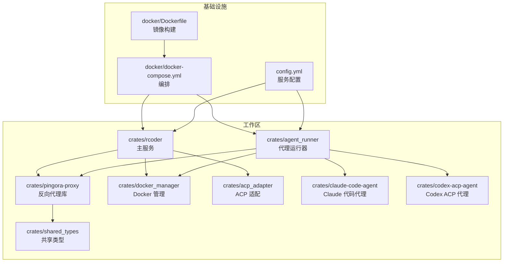
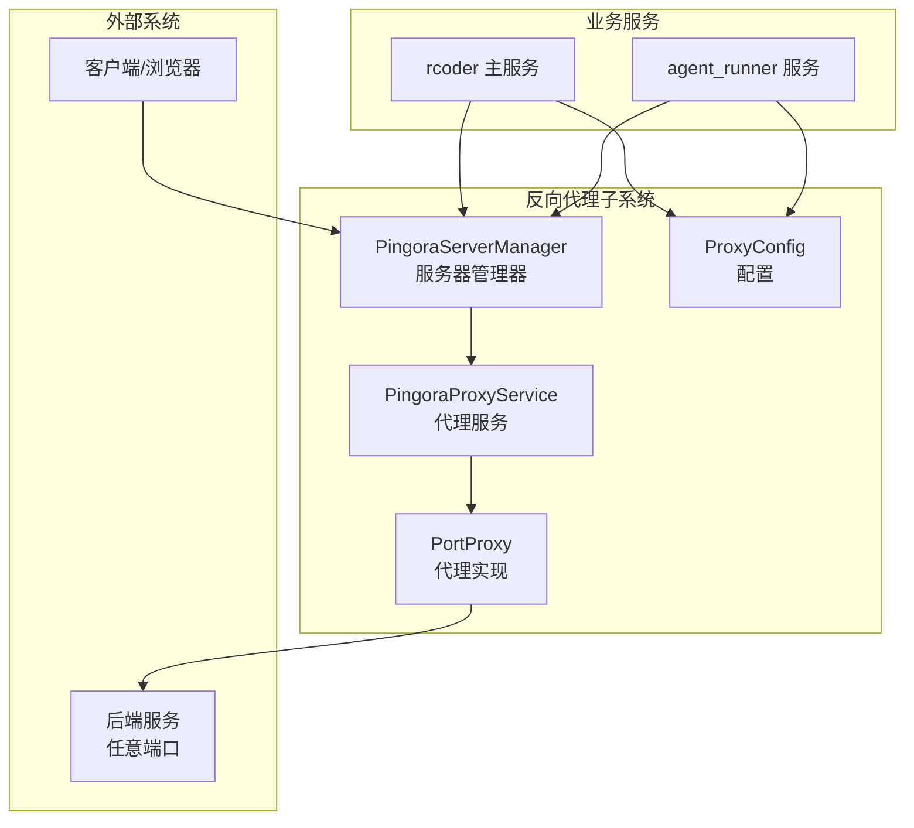
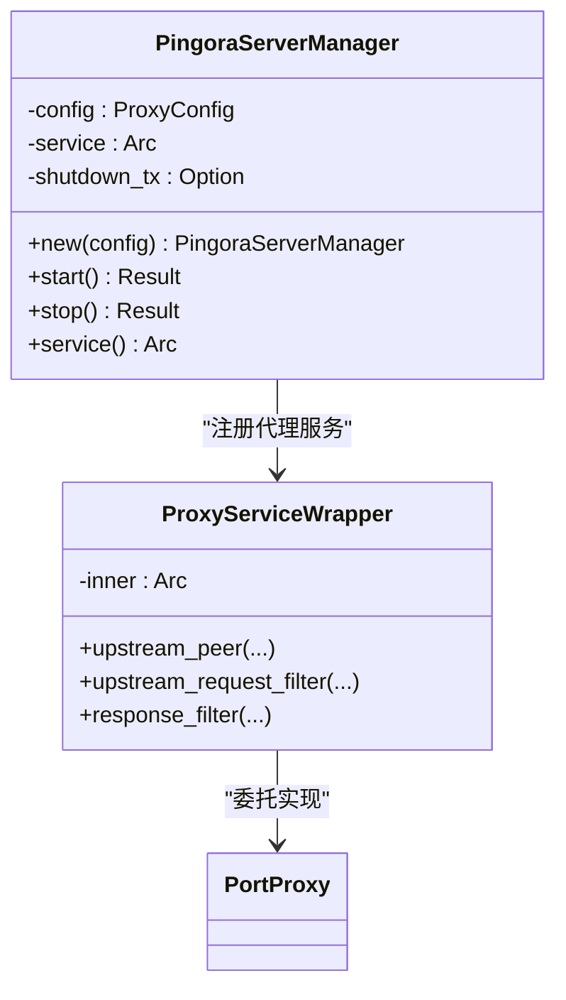
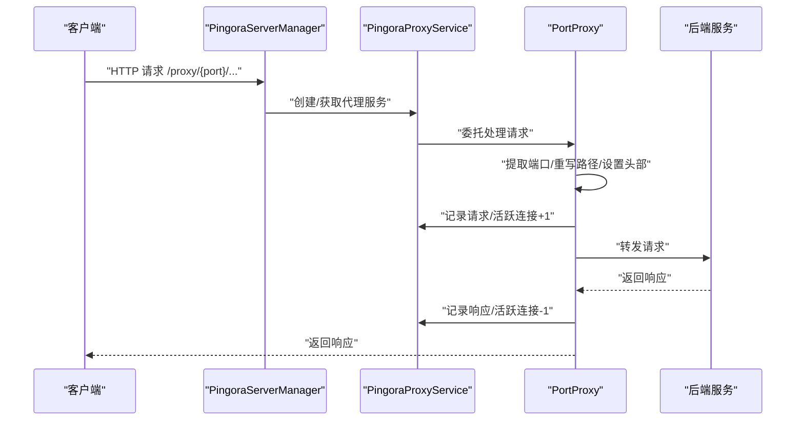
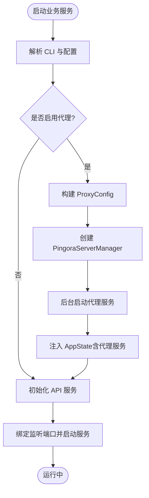
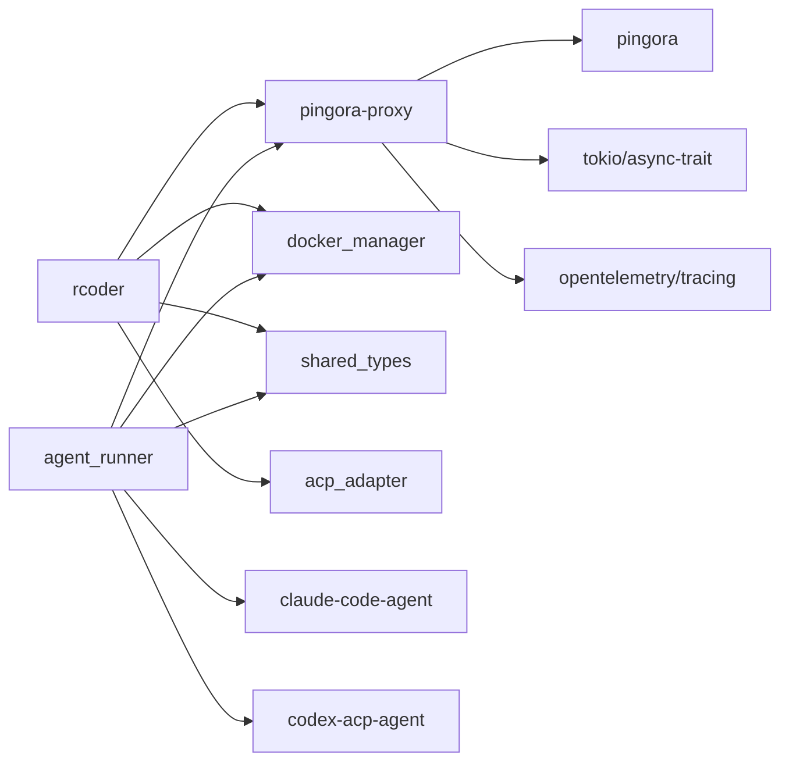
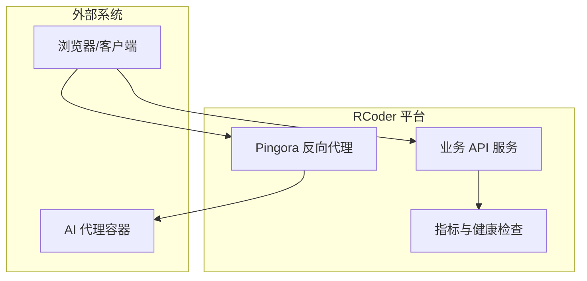

# 反向代理服务

<cite>
**本文引用的文件**
- [crates/pingora-proxy/src/lib.rs](file://crates/pingora-proxy/src/lib.rs)
- [crates/pingora-proxy/src/server.rs](file://crates/pingora-proxy/src/server.rs)
- [crates/pingora-proxy/src/service.rs](file://crates/pingora-proxy/src/service.rs)
- [crates/pingora-proxy/src/config.rs](file://crates/pingora-proxy/src/config.rs)
- [crates/pingora-proxy/src/pingora_server.rs](file://crates/pingora-proxy/src/pingora_server.rs)
- [crates/agent_runner/src/main.rs](file://crates/agent_runner/src/main.rs)
- [crates/rcoder/src/main.rs](file://crates/rcoder/src/main.rs)
- [crates/agent_runner/src/router.rs](file://crates/agent_runner/src/router.rs)
- [crates/rcoder/src/router.rs](file://crates/rcoder/src/router.rs)
- [Cargo.toml](file://Cargo.toml)
- [docker/Dockerfile](file://docker/Dockerfile)
- [docker/docker-compose.yml](file://docker/docker-compose.yml)
- [config.yml](file://config.yml)
</cite>

## 目录
1. [简介](#简介)
2. [项目结构](#项目结构)
3. [核心组件](#核心组件)
4. [架构总览](#架构总览)
5. [详细组件分析](#详细组件分析)
6. [依赖关系分析](#依赖关系分析)
7. [性能考量](#性能考量)
8. [故障排查指南](#故障排查指南)
9. [结论](#结论)
10. [附录](#附录)

## 简介
本文件面向“反向代理服务”的架构文档，聚焦于基于 Cloudflare Pingora 的高性能反向代理子系统，涵盖其高阶设计、架构模式、系统边界、组件交互、数据流与集成模式。文档解释技术决策、权衡与约束，并给出基础设施要求、可扩展性考虑、部署拓扑、安全与监控、灾难恢复等横切关注点。目标读者既包括工程实践者，也包括对系统架构感兴趣的非技术读者。

## 项目结构
该仓库采用多 Crate 的工作区组织，反向代理能力主要集中在 crates/pingora-proxy 中，而业务服务（如 rcoder、agent_runner）在启动时可按需启用 Pingora 代理服务，并通过统一的路由对外暴露代理状态与统计信息。

图表来源
- [Cargo.toml](file://Cargo.toml#L1-L205)
- [docker/Dockerfile](file://docker/Dockerfile#L1-L305)
- [docker/docker-compose.yml](file://docker/docker-compose.yml#L1-L37)
- [config.yml](file://config.yml#L1-L161)

章节来源
- [Cargo.toml](file://Cargo.toml#L1-L205)
- [docker/docker-compose.yml](file://docker/docker-compose.yml#L1-L37)
- [docker/Dockerfile](file://docker/Dockerfile#L1-L305)
- [config.yml](file://config.yml#L1-L161)

## 核心组件
- Pingora 代理库（crates/pingora-proxy）
  - 提供基于 Cloudflare Pingora 的高性能反向代理能力，支持路径与查询参数两种端口提取方式、动态后端管理、负载均衡、健康检查与指标统计。
- Pingora 服务器管理器（PingoraServerManager）
  - 负责启动/停止 Pingora 服务器，绑定监听端口，注入代理服务，处理优雅关闭。
- 代理服务与代理实现（PingoraProxyService / PortProxy）
  - 实现 Pingora 的 ProxyHttp trait，负责上游请求过滤、路径重写、端口提取、后端选择、响应过滤与指标统计。
- 配置模块（ProxyConfig）
  - 定义监听端口、默认后端端口、后端主机、端口参数名、配置文件路径与日志开关等。
- 业务服务（rcoder / agent_runner）
  - 在启动时根据配置决定是否启用 Pingora 代理服务；通过统一路由暴露代理状态、统计与配置查询接口；并提供健康检查与优雅关闭。

章节来源
- [crates/pingora-proxy/src/lib.rs](file://crates/pingora-proxy/src/lib.rs#L1-L250)
- [crates/pingora-proxy/src/server.rs](file://crates/pingora-proxy/src/server.rs#L1-L372)
- [crates/pingora-proxy/src/service.rs](file://crates/pingora-proxy/src/service.rs#L1-L738)
- [crates/pingora-proxy/src/config.rs](file://crates/pingora-proxy/src/config.rs#L1-L95)
- [crates/pingora-proxy/src/pingora_server.rs](file://crates/pingora-proxy/src/pingora_server.rs#L1-L182)
- [crates/agent_runner/src/main.rs](file://crates/agent_runner/src/main.rs#L1-L232)
- [crates/rcoder/src/main.rs](file://crates/rcoder/src/main.rs#L1-L451)
- [crates/agent_runner/src/router.rs](file://crates/agent_runner/src/router.rs#L1-L200)
- [crates/rcoder/src/router.rs](file://crates/rcoder/src/router.rs#L1-L217)

## 架构总览
反向代理服务采用“库+管理器+业务服务”的分层架构：
- 库层：提供代理能力与指标统计，支持动态后端与健康检查。
- 管理器层：封装 Pingora 服务器生命周期，负责监听、服务注册与优雅关闭。
- 业务层：在 rcoder/agent_runner 中按需启用代理服务，提供统一的代理 API 与健康检查。

图表来源
- [crates/pingora-proxy/src/pingora_server.rs](file://crates/pingora-proxy/src/pingora_server.rs#L1-L182)
- [crates/pingora-proxy/src/service.rs](file://crates/pingora-proxy/src/service.rs#L1-L738)
- [crates/pingora-proxy/src/config.rs](file://crates/pingora-proxy/src/config.rs#L1-L95)
- [crates/agent_runner/src/main.rs](file://crates/agent_runner/src/main.rs#L1-L232)
- [crates/rcoder/src/main.rs](file://crates/rcoder/src/main.rs#L1-L451)

## 详细组件分析

### 组件一：Pingora 服务器管理器（PingoraServerManager）
- 职责
  - 创建并启动 Pingora 服务器，绑定监听端口，注入代理服务。
  - 提供优雅关闭机制，通过 oneshot 通道接收关闭信号并终止服务器。
- 关键行为
  - 通过 Server::new 与 bootstrap 初始化服务器。
  - 使用 http_proxy_service 注册代理服务，add_tcp 绑定监听地址。
  - 通过 ProxyServiceWrapper 实现 Pingora 的 ProxyHttp trait，委托给 PortProxy。
- 与业务服务集成
  - rcoder/agent_runner 在启动时创建 PingoraServerManager 并在后台任务中运行，同时将服务引用注入 AppState，用于读取代理指标。

图表来源
- [crates/pingora-proxy/src/pingora_server.rs](file://crates/pingora-proxy/src/pingora_server.rs#L1-L182)
- [crates/pingora-proxy/src/service.rs](file://crates/pingora-proxy/src/service.rs#L1-L738)

章节来源
- [crates/pingora-proxy/src/pingora_server.rs](file://crates/pingora-proxy/src/pingora_server.rs#L1-L182)
- [crates/agent_runner/src/main.rs](file://crates/agent_runner/src/main.rs#L1-L232)
- [crates/rcoder/src/main.rs](file://crates/rcoder/src/main.rs#L1-L451)

### 组件二：代理服务与代理实现（PingoraProxyService / PortProxy）
- 职责
  - PingoraProxyService：维护后端映射、负载均衡算法、指标与健康状态缓存；提供后端增删查、健康检查循环与指标快照。
  - PortProxy：实现 Pingora 的 ProxyHttp trait，完成请求过滤、路径重写、端口提取、后端选择与响应过滤。
- 数据流
  - 请求进入：从请求头提取端口（路径优先，其次查询参数），若端口不在映射中则动态添加默认主机。
  - 上游请求：重写 Host 与 X-Forwarded-Proto，移除 /proxy/{port} 前缀，保留查询参数。
  - 上游响应：记录指标（总请求数、成功率、平均响应时间、每端口统计、活跃连接数）。
- 指标与健康检查
  - 指标：原子计数器与每端口快照；健康检查：基于 TCP 连接超时的周期性检查，支持轮询与一致性哈希（Ketama）负载均衡。

图表来源
- [crates/pingora-proxy/src/pingora_server.rs](file://crates/pingora-proxy/src/pingora_server.rs#L1-L182)
- [crates/pingora-proxy/src/service.rs](file://crates/pingora-proxy/src/service.rs#L1-L738)

章节来源
- [crates/pingora-proxy/src/service.rs](file://crates/pingora-proxy/src/service.rs#L1-L738)

### 组件三：配置与启动（ProxyConfig、业务服务 main）
- ProxyConfig
  - 定义监听端口、默认后端端口、后端主机、端口参数名、配置文件路径与日志开关；提供默认值与校验。
- 业务服务启动流程
  - 解析 CLI 与配置文件，按需创建 PingoraServerManager 并启动后台任务。
  - 将 Pingora 服务引用注入 AppState，以便路由层读取代理状态与统计。
  - 提供健康检查端点与优雅关闭信号处理。

图表来源
- [crates/pingora-proxy/src/config.rs](file://crates/pingora-proxy/src/config.rs#L1-L95)
- [crates/agent_runner/src/main.rs](file://crates/agent_runner/src/main.rs#L1-L232)
- [crates/rcoder/src/main.rs](file://crates/rcoder/src/main.rs#L1-L451)

章节来源
- [crates/pingora-proxy/src/config.rs](file://crates/pingora-proxy/src/config.rs#L1-L95)
- [crates/agent_runner/src/main.rs](file://crates/agent_runner/src/main.rs#L1-L232)
- [crates/rcoder/src/main.rs](file://crates/rcoder/src/main.rs#L1-L451)

### 组件四：路由与代理 API（rcoder/agent_runner 路由）
- 路由组织
  - 系统路由：/health、聊天与代理会话管理等。
  - 代理 API：/proxy/status、/proxy/stats、/proxy/config、/proxy/{port}、/proxy/{port}/{*path} 等。
- 与代理服务的协作
  - 路由层通过 AppState 获取 PingoraProxyService，读取健康状态、统计快照与配置信息，用于对外展示。

章节来源
- [crates/agent_runner/src/router.rs](file://crates/agent_runner/src/router.rs#L1-L200)
- [crates/rcoder/src/router.rs](file://crates/rcoder/src/router.rs#L1-L217)

## 依赖关系分析
- 语言与运行时
  - Rust 2024 edition，Tokio 异步运行时，Axum HTTP 服务器，Pingora 负载均衡特性。
- 外部依赖
  - Cloudflare Pingora（lb 特性）、OpenTelemetry（遥测）、Tracing（日志与链路传播）。
- 工作区依赖
  - shared_types 提供共享模型与 gRPC 类型；docker_manager 提供容器管理能力；acp_adapter/claude-code-agent/codex-acp-agent 提供代理生态集成。

图表来源
- [Cargo.toml](file://Cargo.toml#L1-L205)

章节来源
- [Cargo.toml](file://Cargo.toml#L1-L205)

## 性能考量
- 异步 I/O 与事件循环
  - 基于 Tokio 与 Pingora 的异步事件驱动，避免阻塞，提升吞吐。
- 负载均衡与健康检查
  - 支持轮询与一致性哈希（Ketama）；内置 TCP 健康检查，周期性探测后端可用性。
- 指标与可观测性
  - 原子计数器与每端口快照，支持平均响应时间、成功率、活跃连接数等关键指标。
- 路径重写与头部处理
  - 在上游请求过滤阶段重写 Host 与 X-Forwarded-Proto，减少后端复杂度。
- 可扩展性
  - 动态后端管理：按需添加/删除后端，无需重启；支持多端口并行代理。

[本节为通用性能讨论，不直接分析具体文件]

## 故障排查指南
- 启动与健康检查
  - 业务服务提供 /health 健康检查端点；Pingora 代理服务可通过 /proxy/status 与 /proxy/stats 查询状态与统计。
- 日志与遥测
  - 业务服务初始化 Tracing 与 OpenTelemetry，支持 trace_id 传播；日志按天滚动，便于定位问题。
- Docker 环境问题
  - rcoder 在启动时进行宿主机路径解析与 Docker 管理器初始化，若失败会输出详细帮助信息与排障步骤。
- 代理端口提取失败
  - 当请求未携带端口参数或路径不匹配时，将回退到默认后端端口；可在 /proxy/config 查看配置。

章节来源
- [crates/agent_runner/src/main.rs](file://crates/agent_runner/src/main.rs#L1-L232)
- [crates/rcoder/src/main.rs](file://crates/rcoder/src/main.rs#L1-L451)
- [crates/agent_runner/src/router.rs](file://crates/agent_runner/src/router.rs#L1-L200)
- [crates/rcoder/src/router.rs](file://crates/rcoder/src/router.rs#L1-L217)

## 结论
该反向代理服务以 Pingora 为核心，结合动态后端管理、负载均衡与健康检查，提供了高性能、可观测且易于扩展的端口代理能力。业务服务通过统一路由与 AppState 注入，实现了代理状态与统计的可视化与可控性。配合 Docker 编排与日志/遥测体系，满足生产环境的安全、可运维与可扩展需求。

[本节为总结性内容，不直接分析具体文件]

## 附录

### 系统上下文图（概念性）

[本图为概念性示意，不对应具体代码文件]

### 部署拓扑与基础设施要求
- 容器化
  - 使用 docker-compose 编排，挂载 Docker socket 以支持宿主机路径解析与容器管理。
  - 端口映射：业务服务端口与代理服务端口可分离，默认分别为 8087/8088。
- 镜像与健康检查
  - Dockerfile 提供增强调试镜像，包含性能分析工具与健康检查指令。
- 配置
  - config.yml 定义代理监听端口、默认后端端口、后端主机、端口参数名与健康检查参数。

章节来源
- [docker/docker-compose.yml](file://docker/docker-compose.yml#L1-L37)
- [docker/Dockerfile](file://docker/Dockerfile#L1-L305)
- [config.yml](file://config.yml#L1-L161)

### 安全性、监控与灾难恢复
- 安全性
  - 代理在上游请求过滤阶段重写 Host 与 X-Forwarded-Proto，便于后端识别真实来源。
  - 通过健康检查与负载均衡降低单点风险。
- 监控
  - 指标：总请求数、成功/失败数、平均响应时间、每端口统计、活跃连接数。
  - 健康检查：周期性 TCP 探测，支持阈值配置。
- 灾难恢复
  - 业务服务支持优雅关闭，清理动态容器与资源；代理服务支持优雅停止。

章节来源
- [crates/pingora-proxy/src/service.rs](file://crates/pingora-proxy/src/service.rs#L1-L738)
- [crates/agent_runner/src/main.rs](file://crates/agent_runner/src/main.rs#L1-L232)
- [crates/rcoder/src/main.rs](file://crates/rcoder/src/main.rs#L1-L451)