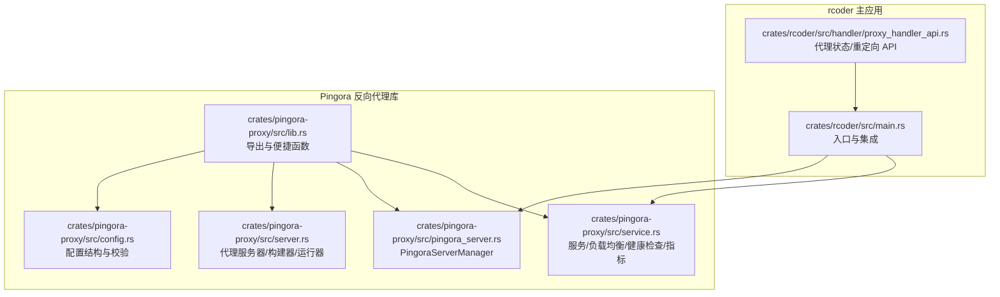
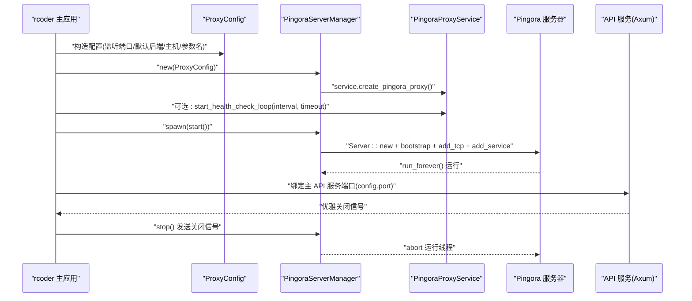
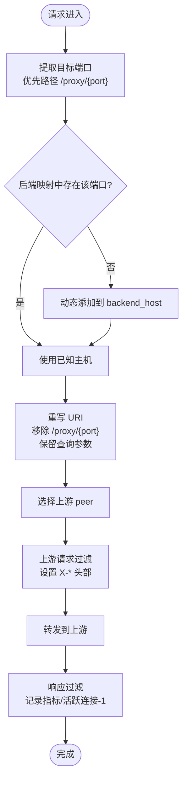
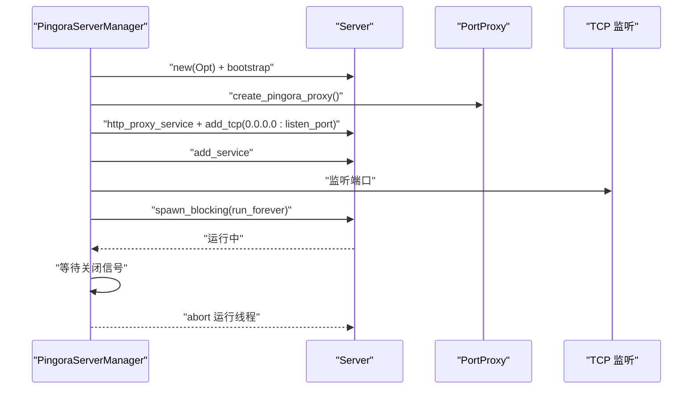
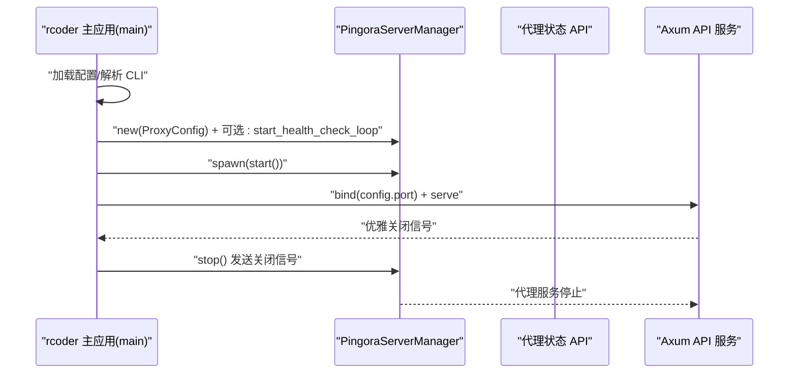
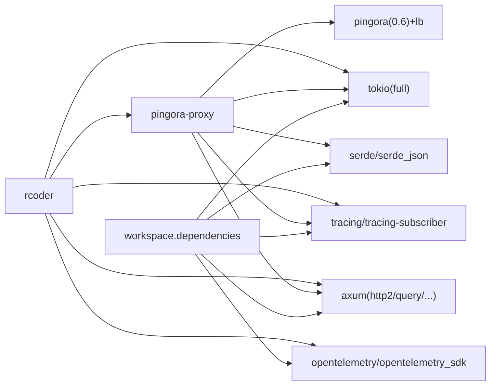

# 启用与启动

<cite>
**本文引用的文件**
- [crates/pingora-proxy/src/lib.rs](file://crates/pingora-proxy/src/lib.rs)
- [crates/pingora-proxy/src/config.rs](file://crates/pingora-proxy/src/config.rs)
- [crates/pingora-proxy/src/server.rs](file://crates/pingora-proxy/src/server.rs)
- [crates/pingora-proxy/src/pingora_server.rs](file://crates/pingora-proxy/src/pingora_server.rs)
- [crates/pingora-proxy/src/service.rs](file://crates/pingora-proxy/src/service.rs)
- [crates/rcoder/src/main.rs](file://crates/rcoder/src/main.rs)
- [crates/rcoder/src/handler/proxy_handler_api.rs](file://crates/rcoder/src/handler/proxy_handler_api.rs)
- [Cargo.toml](file://Cargo.toml)
- [crates/pingora-proxy/Cargo.toml](file://crates/pingora-proxy/Cargo.toml)
- [crates/rcoder/Cargo.toml](file://crates/rcoder/Cargo.toml)
</cite>

## 目录
1. [简介](#简介)
2. [项目结构](#项目结构)
3. [核心组件](#核心组件)
4. [架构总览](#架构总览)
5. [详细组件分析](#详细组件分析)
6. [依赖分析](#依赖分析)
7. [性能考虑](#性能考虑)
8. [故障排查指南](#故障排查指南)
9. [结论](#结论)

## 简介
本文面向希望在 rcoder 主应用中启用并启动 Pingora 反向代理服务的开发者，系统讲解如何通过 rcoder 主应用初始化 Pingora 代理服务，覆盖服务启动流程、异步运行时配置、监听端口设置、与主应用的集成方式、服务生命周期管理、错误处理策略以及启动时的健康检查机制。文末提供常见启动失败场景的排查建议，帮助快速定位问题。

## 项目结构
rcoder 采用多 crate 工作区组织，其中与反向代理直接相关的核心模块位于：
- crates/pingora-proxy：提供 Pingora 反向代理能力（配置、服务、服务器管理、运行器等）
- crates/rcoder：主应用，负责加载配置、启动代理服务、与 API 服务协同

图表来源
- [crates/rcoder/src/main.rs](file://crates/rcoder/src/main.rs#L179-L214)
- [crates/pingora-proxy/src/lib.rs](file://crates/pingora-proxy/src/lib.rs#L60-L70)
- [crates/pingora-proxy/src/config.rs](file://crates/pingora-proxy/src/config.rs#L1-L95)
- [crates/pingora-proxy/src/server.rs](file://crates/pingora-proxy/src/server.rs#L1-L156)
- [crates/pingora-proxy/src/pingora_server.rs](file://crates/pingora-proxy/src/pingora_server.rs#L1-L106)
- [crates/pingora-proxy/src/service.rs](file://crates/pingora-proxy/src/service.rs#L411-L596)

章节来源
- [Cargo.toml](file://Cargo.toml#L1-L205)
- [crates/pingora-proxy/Cargo.toml](file://crates/pingora-proxy/Cargo.toml#L1-L30)
- [crates/rcoder/Cargo.toml](file://crates/rcoder/Cargo.toml#L1-L91)

## 核心组件
- 配置（ProxyConfig）：定义监听端口、默认后端端口、后端主机、端口参数名、配置文件路径、详细日志开关等；提供 validate 校验。
- 代理服务（PingoraProxyService/PortProxy）：负责端口提取、路径重写、上游 peer 选择、请求/响应过滤、指标统计、健康检查。
- 服务器管理（ProxyServer/PingoraServerManager）：提供便捷启动、预检、构建器、运行器；PingoraServerManager 通过 Pingora 库启动 TCP 监听并运行服务器。
- 主应用集成：rcoder 主应用在启动时根据配置决定是否启用代理服务，创建 PingoraServerManager 并在后台任务中启动，同时可选地启动健康检查循环。

章节来源
- [crates/pingora-proxy/src/config.rs](file://crates/pingora-proxy/src/config.rs#L1-L95)
- [crates/pingora-proxy/src/service.rs](file://crates/pingora-proxy/src/service.rs#L223-L596)
- [crates/pingora-proxy/src/server.rs](file://crates/pingora-proxy/src/server.rs#L1-L156)
- [crates/pingora-proxy/src/pingora_server.rs](file://crates/pingora-proxy/src/pingora_server.rs#L1-L106)
- [crates/rcoder/src/main.rs](file://crates/rcoder/src/main.rs#L179-L214)

## 架构总览
rcoder 主应用在启动阶段根据配置决定是否启用 Pingora 代理服务。若启用，主应用：
- 构造 ProxyConfig
- 创建 PingoraServerManager
- 可选：启动健康检查循环（周期性探测后端连通性）
- 在 tokio::spawn 后台任务中启动 Pingora 服务器
- 将 Pingora 服务引用注入 AppState，供 API 层使用

图表来源
- [crates/rcoder/src/main.rs](file://crates/rcoder/src/main.rs#L179-L214)
- [crates/pingora-proxy/src/pingora_server.rs](file://crates/pingora-proxy/src/pingora_server.rs#L37-L91)
- [crates/pingora-proxy/src/service.rs](file://crates/pingora-proxy/src/service.rs#L581-L596)

## 详细组件分析

### 配置与校验（ProxyConfig）
- 字段含义与默认值：监听端口、默认后端端口、后端主机、端口参数名、配置文件路径、详细日志开关。
- 校验规则：监听端口/默认后端端口必须大于 0；后端主机与端口参数名不能为空。
- 便捷方法：with_listen_port、with_backend_host、with_port_param 等。

章节来源
- [crates/pingora-proxy/src/config.rs](file://crates/pingora-proxy/src/config.rs#L1-L95)

### 代理服务与负载均衡（PingoraProxyService/PortProxy）
- 端口提取与路径重写：
  - 优先从路径 /proxy/{port}/... 提取端口；否则使用默认后端端口。
  - 重写请求 URI，移除 /proxy/{port} 前缀并保留查询参数。
- 上游 peer 选择：动态将未显式注册的端口加入后端映射，默认指向 backend_host。
- 请求/响应过滤：修改 Host/X-Forwarded-Proto/X-Port-Proxy/X-Load-Balancer 等头部；记录指标（总请求数、成功率、响应时间、每端口统计、活跃连接数）。
- 负载均衡：支持轮询与一致性哈希（Ketama）两种算法，可通过 with_load_balancing 切换。
- 健康检查：提供 start_health_check_loop 周期性探测，使用 TcpStream 连接测试；支持 timeout 控制；维护每个端口的健康状态快照。
- 后端管理：add_backend/remove_backend/list_backends/has_backend/backend_count 等。

图表来源
- [crates/pingora-proxy/src/service.rs](file://crates/pingora-proxy/src/service.rs#L246-L354)
- [crates/pingora-proxy/src/service.rs](file://crates/pingora-proxy/src/service.rs#L356-L409)
- [crates/pingora-proxy/src/service.rs](file://crates/pingora-proxy/src/service.rs#L581-L596)

章节来源
- [crates/pingora-proxy/src/service.rs](file://crates/pingora-proxy/src/service.rs#L223-L596)

### 服务器管理与启动（PingoraServerManager）
- 启动流程：
  - 创建 Opt::default()，构建 Server 并 bootstrap。
  - 从服务创建 PortProxy，包装为 ProxyHttp 实现，创建 http_proxy_service 并 add_tcp 监听 0.0.0.0:listen_port。
  - 将服务加入 Server，创建 oneshot 关闭通道。
  - spawn_blocking 运行 run_forever；tokio::select 等待关闭信号或运行结束。
- 停止：向 oneshot 发送关闭信号，主线程 abort 运行线程。
- 便捷函数：start_pingora_proxy 快速启动。

图表来源
- [crates/pingora-proxy/src/pingora_server.rs](file://crates/pingora-proxy/src/pingora_server.rs#L37-L91)

章节来源
- [crates/pingora-proxy/src/pingora_server.rs](file://crates/pingora-proxy/src/pingora_server.rs#L1-L106)

### 代理服务器与构建器（ProxyServer/PingoraServerRunner）
- ProxyServer.new/with_*：构造服务实例，提供预启动检查、配置访问、负载均衡切换等。
- ProxyServerBuilder：链式配置监听端口、默认后端端口、后端主机、端口参数名、配置文件、详细日志、负载均衡算法。
- PingoraServerRunner：直接获取 PortProxy 实例，便于更细粒度控制。

章节来源
- [crates/pingora-proxy/src/server.rs](file://crates/pingora-proxy/src/server.rs#L1-L156)
- [crates/pingora-proxy/src/server.rs](file://crates/pingora-proxy/src/server.rs#L157-L266)

### 主应用集成与启动流程（rcoder）
- 启动阶段：
  - 解析 CLI 与配置，决定是否启用代理服务。
  - 构造 ProxyConfig（来自应用配置），创建 PingoraServerManager。
  - 可选：根据配置启动健康检查循环（interval_seconds、timeout_seconds）。
  - spawn 后台任务执行 manager.start()。
  - 绑定主 API 服务端口（config.port），支持优雅关闭。
- 优雅关闭：接收 Ctrl+C/SIGINT/SIGTERM，触发清理任务与代理服务停止。
- 代理状态 API：提供 /proxy/status 与重定向到 /proxy/{port}/... 的辅助接口，便于调试与文档展示。

图表来源
- [crates/rcoder/src/main.rs](file://crates/rcoder/src/main.rs#L179-L214)
- [crates/rcoder/src/main.rs](file://crates/rcoder/src/main.rs#L210-L272)
- [crates/rcoder/src/handler/proxy_handler_api.rs](file://crates/rcoder/src/handler/proxy_handler_api.rs#L1-L350)

章节来源
- [crates/rcoder/src/main.rs](file://crates/rcoder/src/main.rs#L179-L214)
- [crates/rcoder/src/main.rs](file://crates/rcoder/src/main.rs#L210-L272)
- [crates/rcoder/src/handler/proxy_handler_api.rs](file://crates/rcoder/src/handler/proxy_handler_api.rs#L1-L350)

## 依赖分析
- 工作区依赖统一来源于 workspace.dependencies，主应用与库共享 tokio、axum、tracing、serde 等生态。
- pingora-proxy 依赖 pingora 生态（pingora-core/pingora-http/pingora-proxy/pingora-load-balancing），并使用 tokio/async-trait/anyhow/tracing/structopt。
- rcoder 依赖 pingora-proxy 作为子模块，同时集成 OpenTelemetry、Swagger 文档、Docker 管理等。

图表来源
- [Cargo.toml](file://Cargo.toml#L35-L205)
- [crates/pingora-proxy/Cargo.toml](file://crates/pingora-proxy/Cargo.toml#L1-L30)
- [crates/rcoder/Cargo.toml](file://crates/rcoder/Cargo.toml#L1-L91)

章节来源
- [Cargo.toml](file://Cargo.toml#L35-L205)
- [crates/pingora-proxy/Cargo.toml](file://crates/pingora-proxy/Cargo.toml#L1-L30)
- [crates/rcoder/Cargo.toml](file://crates/rcoder/Cargo.toml#L1-L91)

## 性能考虑
- 异步运行时：统一使用 tokio::main，启用 full 特性，支持 spawn/spawn_blocking/select 等高并发场景。
- 负载均衡：默认轮询算法，可在服务层 with_load_balancing 切换为一致性哈希；Pingora 生态内置健康检查，降低故障上游流量。
- 指标与可观测：内置活跃连接、每端口统计、平均响应时间等指标，便于性能分析与告警。
- I/O 与阻塞：Pingora 服务器运行在 spawn_blocking 的阻塞线程中，避免阻塞主异步运行时；Tokio select 等待关闭信号，保证优雅退出。

[本节为通用指导，无需列出具体文件来源]

## 故障排查指南
- 启动失败（端口占用/权限不足）
  - 现象：Pingora 服务器无法绑定监听端口。
  - 排查：确认 listen_port 未被占用；检查防火墙/SELinux；确认以足够权限运行。
  - 参考：PingoraServerManager 在启动时会打印监听地址与路由规则。
  
  章节来源
  - [crates/pingora-proxy/src/pingora_server.rs](file://crates/pingora-proxy/src/pingora_server.rs#L37-L66)

- 配置校验失败
  - 现象：启动前预检或启动时报错“监听端口不能为 0”、“默认后端端口不能为 0”、“后端主机地址不能为空”、“端口参数名不能为空”。
  - 排查：修正 ProxyConfig 字段；使用 with_listen_port/with_backend_host/with_port_param 等便捷方法。
  
  章节来源
  - [crates/pingora-proxy/src/config.rs](file://crates/pingora-proxy/src/config.rs#L48-L68)
  - [crates/pingora-proxy/src/server.rs](file://crates/pingora-proxy/src/server.rs#L94-L108)

- 代理请求失败（后端不可达）
  - 现象：请求 /proxy/{port}/... 无法到达后端。
  - 排查：确认 backend_host 与 port_param 正确；检查健康检查是否开启并生效；查看每端口统计与活跃连接数；必要时手动 add_backend 注册。
  
  章节来源
  - [crates/pingora-proxy/src/service.rs](file://crates/pingora-proxy/src/service.rs#L444-L476)
  - [crates/pingora-proxy/src/service.rs](file://crates/pingora-proxy/src/service.rs#L581-L596)

- 优雅关闭异常
  - 现象：收到关闭信号后代理服务未及时停止。
  - 排查：确认主应用已发送广播信号；检查 PingoraServerManager.stop 是否被调用；观察日志中“收到关闭信号/服务器异常结束”的提示。
  
  章节来源
  - [crates/rcoder/src/main.rs](file://crates/rcoder/src/main.rs#L210-L272)
  - [crates/pingora-proxy/src/pingora_server.rs](file://crates/pingora-proxy/src/pingora_server.rs#L77-L91)

- 健康检查未生效
  - 现象：健康检查未更新或状态异常。
  - 排查：确认已调用 start_health_check_loop；检查 interval_seconds 与 timeout_seconds 设置；查看 health_snapshot 快照。
  
  章节来源
  - [crates/rcoder/src/main.rs](file://crates/rcoder/src/main.rs#L191-L196)
  - [crates/pingora-proxy/src/service.rs](file://crates/pingora-proxy/src/service.rs#L581-L596)

## 结论
通过 rcoder 主应用与 pingora-proxy 库的协作，可以在同一进程内启用高性能的 Pingora 反向代理服务。启动流程清晰：先构造配置，再创建管理器，可选启动健康检查，随后在后台任务中启动服务器。主应用负责优雅关闭与 API 服务绑定，代理服务负责端口路由、路径重写、负载均衡与健康检查。遵循本文的配置要点、启动流程与故障排查建议，可稳定启用并维护代理服务。