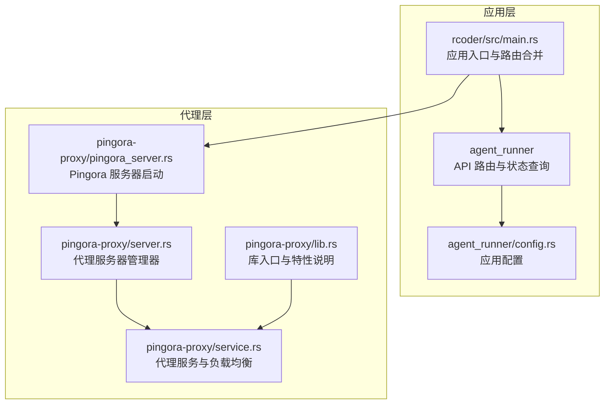
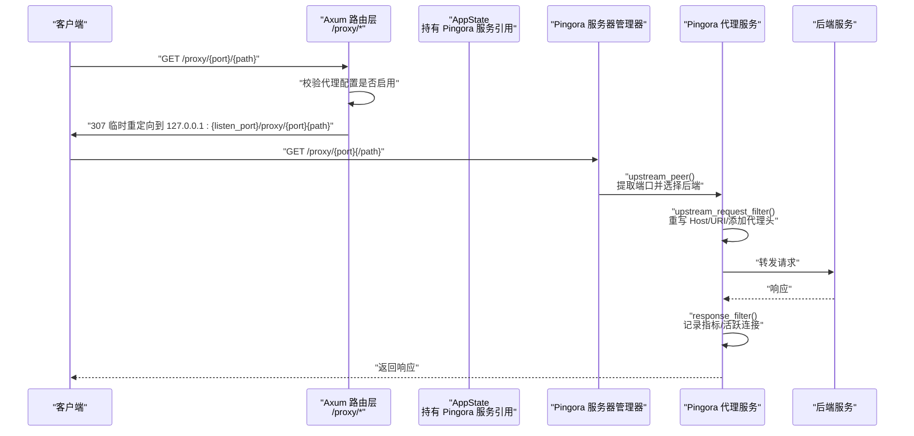
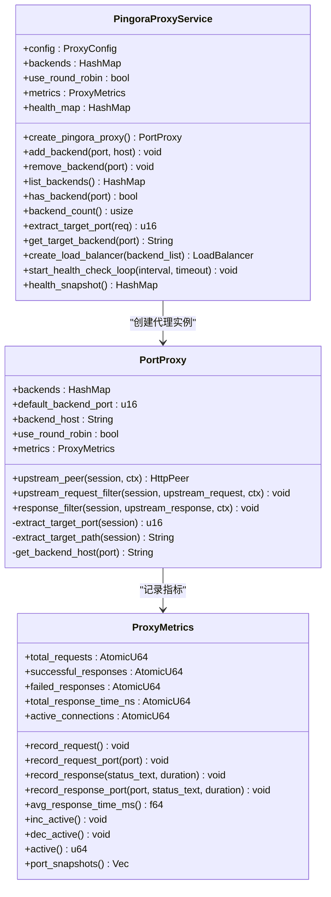
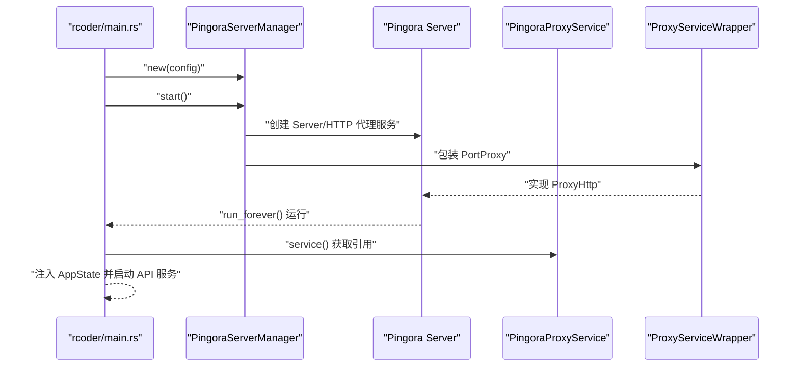
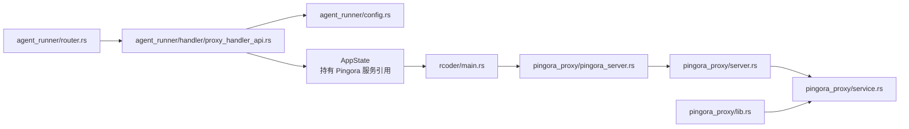

# 请求处理与路由

<cite>
**本文引用的文件**
- [crates/agent_runner/src/handler/proxy_handler_api.rs](file://crates/agent_runner/src/handler/proxy_handler_api.rs)
- [crates/agent_runner/src/router.rs](file://crates/agent_runner/src/router.rs)
- [crates/agent_runner/src/handler/proxy_api.rs](file://crates/agent_runner/src/handler/proxy_api.rs)
- [crates/agent_runner/src/config.rs](file://crates/agent_runner/src/config.rs)
- [crates/pingora-proxy/src/lib.rs](file://crates/pingora-proxy/src/lib.rs)
- [crates/pingora-proxy/src/service.rs](file://crates/pingora-proxy/src/service.rs)
- [crates/pingora-proxy/src/server.rs](file://crates/pingora-proxy/src/server.rs)
- [crates/pingora-proxy/src/pingora_server.rs](file://crates/pingora-proxy/src/pingora_server.rs)
- [crates/rcoder/src/main.rs](file://crates/rcoder/src/main.rs)
</cite>

## 目录
1. [简介](#简介)
2. [项目结构](#项目结构)
3. [核心组件](#核心组件)
4. [架构总览](#架构总览)
5. [详细组件分析](#详细组件分析)
6. [依赖关系分析](#依赖关系分析)
7. [性能考量](#性能考量)
8. [故障排查指南](#故障排查指南)
9. [结论](#结论)
10. [附录](#附录)

## 简介
本文件围绕基于 Pingora 的反向代理请求处理与路由机制展开，重点解析：
- 基于 Axum 的 API 路由与重定向逻辑
- `/proxy/{port}/{path}` 路由规则的实现原理
- 动态端口映射、请求头传递、超时控制与健康检查
- 负载均衡策略（轮询与一致性哈希）
- 从 Axum 路由到 Pingora 服务的请求转发链路
- 实际请求示例与调试技巧

## 项目结构
该仓库采用多 crate 组织，其中与反向代理直接相关的核心模块如下：
- agent_runner：提供 API 层（Axum 路由、状态查询、统计信息），并持有 Pingora 服务引用以读取指标
- pingora-proxy：提供 Pingora 代理服务、负载均衡、健康检查与请求过滤
- rcoder：应用入口，负责启动 Pingora 服务器管理器、注入 AppState、合并路由



图表来源
- [crates/agent_runner/src/router.rs](file://crates/agent_runner/src/router.rs#L41-L70)
- [crates/agent_runner/src/config.rs](file://crates/agent_runner/src/config.rs#L38-L110)
- [crates/rcoder/src/main.rs](file://crates/rcoder/src/main.rs#L170-L265)
- [crates/pingora-proxy/src/lib.rs](file://crates/pingora-proxy/src/lib.rs#L60-L120)
- [crates/pingora-proxy/src/server.rs](file://crates/pingora-proxy/src/server.rs#L1-L100)
- [crates/pingora-proxy/src/service.rs](file://crates/pingora-proxy/src/service.rs#L223-L355)
- [crates/pingora-proxy/src/pingora_server.rs](file://crates/pingora-proxy/src/pingora_server.rs#L37-L106)

章节来源
- [crates/agent_runner/src/router.rs](file://crates/agent_runner/src/router.rs#L41-L70)
- [crates/agent_runner/src/config.rs](file://crates/agent_runner/src/config.rs#L38-L110)
- [crates/rcoder/src/main.rs](file://crates/rcoder/src/main.rs#L170-L265)

## 核心组件
- Axum 路由与代理 API
  - 提供 `/proxy/status`、`/proxy/stats`、`/proxy/config` 等状态查询接口
  - 提供 `/proxy/{port}` 与 `/proxy/{port}/{*path}` 的重定向逻辑，将请求转发至 Pingora 监听端口
- Pingora 代理服务
  - 路径解析：从 `/proxy/{port}` 前缀提取目标端口，剥离前缀得到目标路径
  - 动态后端：若端口未在映射中，自动添加默认主机映射
  - 请求过滤：重写 Host、添加 X-Forwarded-Proto、X-Port-Proxy、X-Load-Balancer 等头部
  - 响应过滤：记录指标、计算平均响应时间、维护活跃连接数
  - 负载均衡：支持轮询与一致性哈希（Ketama），并内置健康检查
- 应用入口与状态注入
  - 启动 Pingora 服务器管理器，提取服务引用注入 AppState，供 API 查询使用

章节来源
- [crates/agent_runner/src/handler/proxy_handler_api.rs](file://crates/agent_runner/src/handler/proxy_handler_api.rs#L230-L332)
- [crates/agent_runner/src/handler/proxy_api.rs](file://crates/agent_runner/src/handler/proxy_api.rs#L1-L195)
- [crates/pingora-proxy/src/service.rs](file://crates/pingora-proxy/src/service.rs#L252-L355)
- [crates/pingora-proxy/src/server.rs](file://crates/pingora-proxy/src/server.rs#L1-L100)
- [crates/rcoder/src/main.rs](file://crates/rcoder/src/main.rs#L170-L265)

## 架构总览
下图展示了从客户端请求到 Pingora 代理再到后端服务的整体链路，以及 API 层对代理状态与统计的读取。



图表来源
- [crates/agent_runner/src/handler/proxy_handler_api.rs](file://crates/agent_runner/src/handler/proxy_handler_api.rs#L230-L332)
- [crates/pingora-proxy/src/pingora_server.rs](file://crates/pingora-proxy/src/pingora_server.rs#L37-L106)
- [crates/pingora-proxy/src/service.rs](file://crates/pingora-proxy/src/service.rs#L252-L355)

## 详细组件分析

### Axum 路由与代理 API
- 路由注册
  - API 路由与代理 API 路由分别注册，最终合并到一个 Router
  - 代理 API 路由包括状态、统计、配置查询，以及 `/proxy/{port}` 与 `/proxy/{port}/{*path}` 的重定向
- 重定向逻辑
  - `/proxy/{port}`：构造 Location 为 `http://127.0.0.1:{listen_port}/proxy/{port}`
  - `/proxy/{port}/{*path}`：保持路径，构造 Location 为 `http://127.0.0.1:{listen_port}/proxy/{port}{path}`
- 状态查询与统计
  - `/proxy/status`：读取 Pingora 服务配置、后端映射与健康快照
  - `/proxy/stats`：读取总请求数、成功率、平均响应时间、按端口统计
  - `/proxy/config`：读取监听端口、默认后端、负载均衡算法与健康检查配置

```mermaid
flowchart TD
Start(["进入代理 API"]) --> CheckCfg["检查代理配置是否启用"]
CheckCfg --> |未启用| Return503["返回 503 错误"]
CheckCfg --> |已启用| RouteType{"请求路径类型？"}
RouteType --> |/proxy/{port}| BuildLoc1["构造 Location: 127.0.0.1:{listen_port}/proxy/{port}"]
RouteType --> |/proxy/{port}/{*path}| BuildLoc2["构造 Location: 127.0.0.1:{listen_port}/proxy/{port}{path}"]
BuildLoc1 --> Redirect["307 临时重定向"]
BuildLoc2 --> Redirect
Redirect --> End(["完成"])
Return503 --> End
```

图表来源
- [crates/agent_runner/src/handler/proxy_handler_api.rs](file://crates/agent_runner/src/handler/proxy_handler_api.rs#L230-L332)

章节来源
- [crates/agent_runner/src/router.rs](file://crates/agent_runner/src/router.rs#L41-L70)
- [crates/agent_runner/src/handler/proxy_handler_api.rs](file://crates/agent_runner/src/handler/proxy_handler_api.rs#L230-L332)
- [crates/agent_runner/src/handler/proxy_api.rs](file://crates/agent_runner/src/handler/proxy_api.rs#L1-L195)

### Pingora 代理服务与负载均衡
- 端口提取与路径重写
  - 从请求 URI 中提取端口：优先解析 `/proxy/{port}` 前缀；若不存在则回退到默认端口
  - 重写请求 URI：移除 `/proxy/{port}` 前缀，保留查询参数
  - 重写 Host 为 127.0.0.1，并添加 X-Forwarded-Proto、X-Port-Proxy、X-Load-Balancer 等头部
- 动态后端管理
  - 若目标端口不在映射中，自动添加默认主机映射
  - 支持添加/移除后端、列出后端、检查后端存在性、统计后端数量
- 指标与健康检查
  - 维护总请求数、成功/失败计数、平均响应时间、每端口统计
  - 维护活跃连接数，原子递增/递减
  - 健康检查：基于 TCP 连接超时检测，周期性更新健康状态快照
- 负载均衡
  - 支持轮询与一致性哈希（Ketama），可通过配置切换
  - 内置健康检查，可配置检查频率、超时与阈值



图表来源
- [crates/pingora-proxy/src/service.rs](file://crates/pingora-proxy/src/service.rs#L223-L355)
- [crates/pingora-proxy/src/service.rs](file://crates/pingora-proxy/src/service.rs#L509-L596)

章节来源
- [crates/pingora-proxy/src/service.rs](file://crates/pingora-proxy/src/service.rs#L252-L355)
- [crates/pingora-proxy/src/service.rs](file://crates/pingora-proxy/src/service.rs#L509-L596)

### Pingora 服务器启动与运行
- 服务器管理器
  - 创建 Opt、Server、HTTP 代理服务，绑定 TCP 监听端口
  - 通过 ProxyServiceWrapper 将 PortProxy 实现适配为 Pingora 的 ProxyHttp
  - 提供启动/停止与服务引用获取能力
- 应用入口集成
  - rcoder 在启动时创建 PingoraServerManager，提取服务引用注入 AppState
  - 启动健康检查循环（按配置）
  - 合并 API 路由与 Swagger UI



图表来源
- [crates/rcoder/src/main.rs](file://crates/rcoder/src/main.rs#L170-L265)
- [crates/pingora-proxy/src/pingora_server.rs](file://crates/pingora-proxy/src/pingora_server.rs#L37-L106)
- [crates/pingora-proxy/src/server.rs](file://crates/pingora-proxy/src/server.rs#L1-L100)

章节来源
- [crates/rcoder/src/main.rs](file://crates/rcoder/src/main.rs#L170-L265)
- [crates/pingora-proxy/src/pingora_server.rs](file://crates/pingora-proxy/src/pingora_server.rs#L37-L106)
- [crates/pingora-proxy/src/server.rs](file://crates/pingora-proxy/src/server.rs#L1-L100)

## 依赖关系分析
- 组件耦合
  - agent_runner 的路由层依赖 AppState 中的 Pingora 服务引用，用于读取状态与统计
  - rcoder 的 main.rs 负责创建 PingoraServerManager 并注入 AppState
  - pingora-proxy 的 service.rs 与 pingora_server.rs 分别承担服务实现与服务器启动职责
- 外部依赖
  - Pingora 库提供高性能代理、负载均衡与健康检查
  - Axum 提供路由与 HTTP 处理
  - Tokio 提供异步运行时与任务管理



图表来源
- [crates/agent_runner/src/router.rs](file://crates/agent_runner/src/router.rs#L41-L70)
- [crates/agent_runner/src/handler/proxy_handler_api.rs](file://crates/agent_runner/src/handler/proxy_handler_api.rs#L230-L332)
- [crates/agent_runner/src/config.rs](file://crates/agent_runner/src/config.rs#L38-L110)
- [crates/rcoder/src/main.rs](file://crates/rcoder/src/main.rs#L170-L265)
- [crates/pingora-proxy/src/pingora_server.rs](file://crates/pingora-proxy/src/pingora_server.rs#L37-L106)
- [crates/pingora-proxy/src/server.rs](file://crates/pingora-proxy/src/server.rs#L1-L100)
- [crates/pingora-proxy/src/service.rs](file://crates/pingora-proxy/src/service.rs#L223-L355)
- [crates/pingora-proxy/src/lib.rs](file://crates/pingora-proxy/src/lib.rs#L60-L120)

章节来源
- [crates/agent_runner/src/router.rs](file://crates/agent_runner/src/router.rs#L41-L70)
- [crates/agent_runner/src/handler/proxy_handler_api.rs](file://crates/agent_runner/src/handler/proxy_handler_api.rs#L230-L332)
- [crates/agent_runner/src/config.rs](file://crates/agent_runner/src/config.rs#L38-L110)
- [crates/rcoder/src/main.rs](file://crates/rcoder/src/main.rs#L170-L265)
- [crates/pingora-proxy/src/pingora_server.rs](file://crates/pingora-proxy/src/pingora_server.rs#L37-L106)
- [crates/pingora-proxy/src/server.rs](file://crates/pingora-proxy/src/server.rs#L1-L100)
- [crates/pingora-proxy/src/service.rs](file://crates/pingora-proxy/src/service.rs#L223-L355)
- [crates/pingora-proxy/src/lib.rs](file://crates/pingora-proxy/src/lib.rs#L60-L120)

## 性能考量
- 路由与重定向
  - 代理 API 层采用 307 重定向，避免在 API 服务中直接发起网络请求，降低延迟与资源占用
- 负载均衡与健康检查
  - 轮询与一致性哈希两种策略可按需切换；健康检查周期与超时可配置，平衡准确性与开销
- 指标与可观测性
  - 提供总请求数、成功率、平均响应时间、每端口统计与活跃连接数，便于性能分析与容量规划
- 异步与并发
  - 基于 Tokio 的异步 I/O，Pingora 代理服务在高并发场景下具备良好吞吐能力

[本节为通用性能讨论，不直接分析具体文件]

## 故障排查指南
- 代理未启用
  - 现象：调用 `/proxy/status`、`/proxy/stats`、`/proxy/config` 返回 503
  - 排查：确认应用配置中启用了代理，且 Pingora 服务器已启动
- 端口提取失败
  - 现象：请求未命中预期后端
  - 排查：检查请求路径是否符合 `/proxy/{port}` 格式；确认端口参数是否有效
- 后端未发现
  - 现象：动态添加后端后仍报“未找到后端”
  - 排查：确认端口已被加入映射；检查默认主机配置与健康检查状态
- 超时与连接问题
  - 现象：健康检查超时或连接失败
  - 排查：调整健康检查超时与间隔；检查后端服务监听端口与防火墙策略
- 请求头与路径问题
  - 现象：后端服务无法识别 Host 或路径被错误重写
  - 排查：确认上游请求过滤已正确重写 Host 与 URI；检查查询参数是否保留

章节来源
- [crates/agent_runner/src/handler/proxy_handler_api.rs](file://crates/agent_runner/src/handler/proxy_handler_api.rs#L31-L174)
- [crates/pingora-proxy/src/service.rs](file://crates/pingora-proxy/src/service.rs#L252-L355)
- [crates/pingora-proxy/src/service.rs](file://crates/pingora-proxy/src/service.rs#L556-L596)

## 结论
该系统通过 Axum 的轻量 API 层与 Pingora 的高性能代理服务实现了灵活、可扩展的反向代理能力。其核心优势包括：
- 清晰的路由与重定向机制，简化了 API 层与代理层的职责分离
- 动态端口映射与请求头传递，保证了透明代理与可观测性
- 可配置的负载均衡与健康检查，满足生产环境的稳定性需求
- 丰富的指标与状态查询接口，便于运维与性能优化

[本节为总结性内容，不直接分析具体文件]

## 附录

### 实际请求示例
- 查询代理状态
  - 请求：GET /proxy/status
  - 作用：返回代理服务状态、监听端口、默认后端、后端列表与负载均衡配置
- 查询代理统计
  - 请求：GET /proxy/stats
  - 作用：返回总请求数、成功率、平均响应时间、按端口统计与活跃连接数
- 查询代理配置
  - 请求：GET /proxy/config
  - 作用：返回监听端口、默认后端、负载均衡算法与健康检查配置
- 代理到指定端口（无路径）
  - 请求：GET /proxy/{port}
  - 作用：307 重定向到 127.0.0.1:{listen_port}/proxy/{port}
- 代理到指定端口与路径
  - 请求：GET /proxy/{port}/{*path}
  - 作用：307 重定向到 127.0.0.1:{listen_port}/proxy/{port}{path}

章节来源
- [crates/agent_runner/src/handler/proxy_handler_api.rs](file://crates/agent_runner/src/handler/proxy_handler_api.rs#L230-L332)
- [crates/agent_runner/src/handler/proxy_api.rs](file://crates/agent_runner/src/handler/proxy_api.rs#L1-L195)

### 调试技巧
- 启用健康检查
  - 在配置中开启健康检查，并设置合理的间隔与超时，观察健康状态快照
- 观察指标
  - 通过 `/proxy/stats` 与 `/proxy/status` 持续监控请求量、成功率与平均响应时间
- 路径与端口验证
  - 使用 curl 验证重定向行为与端口提取逻辑，确保路径前缀被正确剥离
- 日志与追踪
  - 关注 Pingora 与应用层日志，定位请求过滤与响应过滤阶段的问题

章节来源
- [crates/rcoder/src/main.rs](file://crates/rcoder/src/main.rs#L170-L265)
- [crates/pingora-proxy/src/service.rs](file://crates/pingora-proxy/src/service.rs#L556-L596)