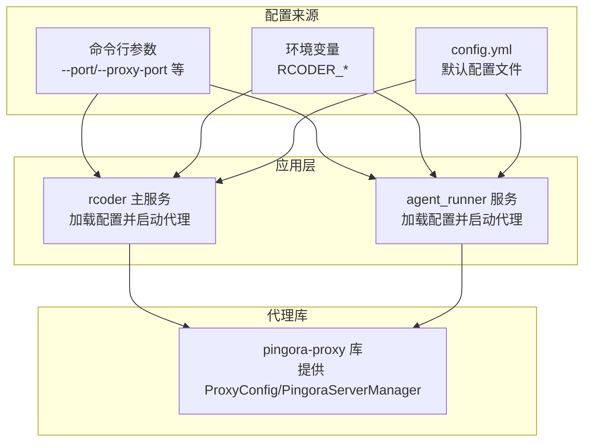
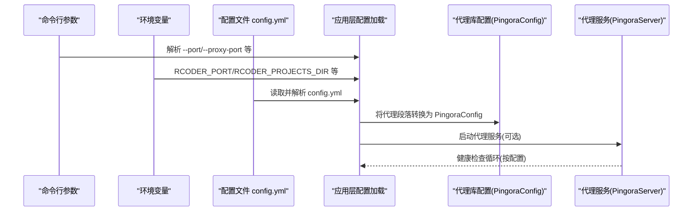
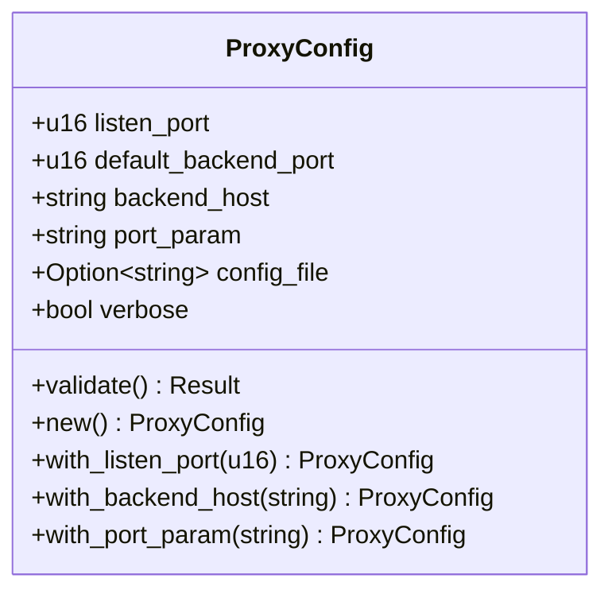
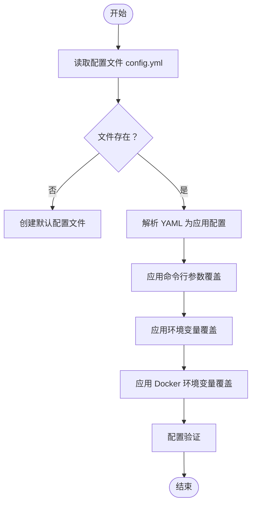
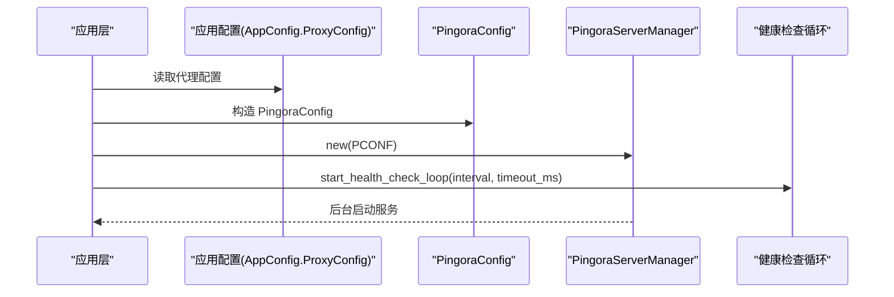
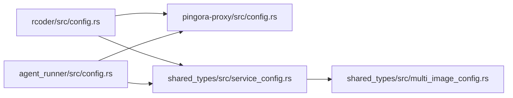

# 配置选项

<cite>
**本文引用的文件**
- [config.yml](file://config.yml)
- [crates/pingora-proxy/src/config.rs](file://crates/pingora-proxy/src/config.rs)
- [crates/pingora-proxy/src/lib.rs](file://crates/pingora-proxy/src/lib.rs)
- [crates/rcoder/src/config.rs](file://crates/rcoder/src/config.rs)
- [crates/rcoder/src/main.rs](file://crates/rcoder/src/main.rs)
- [crates/agent_runner/src/config.rs](file://crates/agent_runner/src/config.rs)
- [crates/agent_runner/src/main.rs](file://crates/agent_runner/src/main.rs)
- [crates/shared_types/src/service_config.rs](file://crates/shared_types/src/service_config.rs)
- [crates/shared_types/src/multi_image_config.rs](file://crates/shared_types/src/multi_image_config.rs)
- [crates/rcoder/src/rcoder_default.yml](file://crates/rcoder/src/rcoder_default.yml)
</cite>

## 目录
1. [简介](#简介)
2. [项目结构与配置来源](#项目结构与配置来源)
3. [核心配置组件](#核心配置组件)
4. [架构总览](#架构总览)
5. [详细组件分析](#详细组件分析)
6. [依赖关系分析](#依赖关系分析)
7. [性能考量](#性能考量)
8. [故障排查指南](#故障排查指南)
9. [结论](#结论)
10. [附录](#附录)

## 简介
本文件面向反向代理服务的配置系统，聚焦于 PingoraConfig 结构体及其在代理服务中的作用，系统性说明监听地址、超时设置、缓冲区大小、TLS 配置等参数的含义与影响；阐述“命令行 > 环境变量 > 配置文件”的优先级链在代理服务中的具体实现；结合 config.yml 示例解释如何定制化代理行为以适配不同部署环境；并提供性能调优建议与安全配置最佳实践。

## 项目结构与配置来源
- 代理库提供 PingoraConfig 结构体与启动能力，负责解析命令行参数、配置文件与运行时环境变量，形成最终的代理配置。
- 应用层（rcoder/agent_runner）在启动时加载配置，若启用代理，则将应用配置中的代理段落转换为 PingoraConfig 并启动 Pingora 服务。
- 配置文件 config.yml 作为应用层的默认配置来源，包含代理、Docker 等多类配置项。

图表来源
- [crates/rcoder/src/main.rs](file://crates/rcoder/src/main.rs#L169-L208)
- [crates/agent_runner/src/main.rs](file://crates/agent_runner/src/main.rs#L80-L118)
- [crates/pingora-proxy/src/lib.rs](file://crates/pingora-proxy/src/lib.rs#L66-L70)
- [crates/rcoder/src/config.rs](file://crates/rcoder/src/config.rs#L253-L332)

章节来源
- [crates/rcoder/src/main.rs](file://crates/rcoder/src/main.rs#L169-L208)
- [crates/agent_runner/src/main.rs](file://crates/agent_runner/src/main.rs#L80-L118)
- [crates/pingora-proxy/src/lib.rs](file://crates/pingora-proxy/src/lib.rs#L66-L70)

## 核心配置组件
本节围绕 PingoraConfig 结构体展开，说明其在代理服务中的关键参数及默认值来源。

- 监听端口
  - 字段：listen_port
  - 作用：代理服务对外监听的 TCP 端口
  - 默认值：来自代理库默认常量（8080），应用层也可通过命令行或配置文件覆盖
  - 参考路径：
    - [crates/pingora-proxy/src/lib.rs](file://crates/pingora-proxy/src/lib.rs#L71-L76)
    - [crates/pingora-proxy/src/config.rs](file://crates/pingora-proxy/src/config.rs#L11-L12)
    - [crates/rcoder/src/config.rs](file://crates/rcoder/src/config.rs#L115-L120)

- 默认后端端口
  - 字段：default_backend_port
  - 作用：当请求未携带端口参数时，代理默认转发到的后端端口
  - 默认值：来自代理库默认常量（3000），应用层可通过命令行或配置文件覆盖
  - 参考路径：
    - [crates/pingora-proxy/src/lib.rs](file://crates/pingora-proxy/src/lib.rs#L71-L76)
    - [crates/pingora-proxy/src/config.rs](file://crates/pingora-proxy/src/config.rs#L15-L16)
    - [crates/rcoder/src/config.rs](file://crates/rcoder/src/config.rs#L115-L120)

- 后端主机地址
  - 字段：backend_host
  - 作用：代理转发的目标主机地址（通常为 127.0.0.1）
  - 默认值：来自代理库默认常量（127.0.0.1）
  - 参考路径：
    - [crates/pingora-proxy/src/lib.rs](file://crates/pingora-proxy/src/lib.rs#L71-L76)
    - [crates/pingora-proxy/src/config.rs](file://crates/pingora-proxy/src/config.rs#L19-L20)

- URL 端口参数名
  - 字段：port_param
  - 作用：从查询参数中提取目标端口的参数名，默认为 "port"
  - 默认值：来自代理库默认常量（"port"）
  - 参考路径：
    - [crates/pingora-proxy/src/lib.rs](file://crates/pingora-proxy/src/lib.rs#L71-L76)
    - [crates/pingora-proxy/src/config.rs](file://crates/pingora-proxy/src/config.rs#L23-L24)

- 配置文件路径
  - 字段：config_file
  - 作用：指向代理库的配置文件路径（如需启用配置文件支持）
  - 参考路径：
    - [crates/pingora-proxy/src/config.rs](file://crates/pingora-proxy/src/config.rs#L27-L29)

- 详细日志开关
  - 字段：verbose
  - 作用：启用更详细的日志输出
  - 参考路径：
    - [crates/pingora-proxy/src/config.rs](file://crates/pingora-proxy/src/config.rs#L31-L33)

- 健康检查配置（应用层代理段落）
  - 字段：health_check.enabled/interval_seconds/timeout_seconds/healthy_threshold/unhealthy_threshold
  - 作用：控制代理服务对后端健康检查的启用、周期、超时与阈值
  - 参考路径：
    - [crates/rcoder/src/config.rs](file://crates/rcoder/src/config.rs#L53-L80)
    - [crates/rcoder/src/main.rs](file://crates/rcoder/src/main.rs#L192-L196)

章节来源
- [crates/pingora-proxy/src/config.rs](file://crates/pingora-proxy/src/config.rs#L8-L33)
- [crates/pingora-proxy/src/lib.rs](file://crates/pingora-proxy/src/lib.rs#L71-L76)
- [crates/rcoder/src/config.rs](file://crates/rcoder/src/config.rs#L53-L80)
- [crates/rcoder/src/main.rs](file://crates/rcoder/src/main.rs#L192-L196)

## 架构总览
下图展示配置在应用层与代理库之间的流转过程，以及优先级链的执行顺序。

图表来源
- [crates/rcoder/src/config.rs](file://crates/rcoder/src/config.rs#L253-L332)
- [crates/rcoder/src/main.rs](file://crates/rcoder/src/main.rs#L169-L208)
- [crates/agent_runner/src/config.rs](file://crates/agent_runner/src/config.rs#L110-L191)
- [crates/agent_runner/src/main.rs](file://crates/agent_runner/src/main.rs#L80-L118)

## 详细组件分析

### 组件一：PingoraConfig 结构体与默认值
- 结构体定义与默认值来源
  - 监听端口、默认后端端口、后端主机、端口参数名均来自代理库默认常量
  - 代理库提供便捷构造方法（如 with_listen_port、with_backend_host、with_port_param）
- 校验规则
  - 监听端口与默认后端端口不可为 0
  - 后端主机与端口参数名不可为空
- 参考路径：
  - [crates/pingora-proxy/src/config.rs](file://crates/pingora-proxy/src/config.rs#L8-L33)
  - [crates/pingora-proxy/src/config.rs](file://crates/pingora-proxy/src/config.rs#L49-L68)
  - [crates/pingora-proxy/src/lib.rs](file://crates/pingora-proxy/src/lib.rs#L71-L76)
  - [crates/pingora-proxy/src/lib.rs](file://crates/pingora-proxy/src/lib.rs#L99-L126)

图表来源
- [crates/pingora-proxy/src/config.rs](file://crates/pingora-proxy/src/config.rs#L8-L33)
- [crates/pingora-proxy/src/config.rs](file://crates/pingora-proxy/src/config.rs#L49-L94)

章节来源
- [crates/pingora-proxy/src/config.rs](file://crates/pingora-proxy/src/config.rs#L8-L33)
- [crates/pingora-proxy/src/config.rs](file://crates/pingora-proxy/src/config.rs#L49-L94)
- [crates/pingora-proxy/src/lib.rs](file://crates/pingora-proxy/src/lib.rs#L71-L76)

### 组件二：配置优先级链（命令行 > 环境变量 > 配置文件）
- 应用层（rcoder/agent_runner）的优先级链
  - 命令行参数优先级最高，覆盖配置文件与环境变量
  - 环境变量次之，覆盖配置文件
  - 配置文件再次之，作为默认来源
- rcoder 的优先级链实现
  - 若存在配置文件，先加载；否则创建默认配置文件
  - 命令行参数覆盖配置文件中的端口与项目目录
  - 环境变量 RCODER_PORT、RCODER_PROJECTS_DIR 覆盖应用层配置
  - 启用代理时，命令行 --proxy-port、--backend-port 覆盖代理段落
  - Docker 配置支持环境变量覆盖（RCODER_NETWORK_MODE、RCODER_WORK_DIR、RCODER_AUTO_CLEANUP、RCODER_CONTAINER_TTL）
- agent_runner 的优先级链实现
  - 首先加载默认配置，尝试从配置文件读取，失败则创建默认配置文件
  - 环境变量 RCODER_PORT 覆盖端口
  - 启用代理时，命令行参数决定代理监听端口与默认后端端口
  - 命令行参数优先级最高，覆盖配置文件与环境变量
- 参考路径：
  - [crates/rcoder/src/config.rs](file://crates/rcoder/src/config.rs#L253-L332)
  - [crates/agent_runner/src/config.rs](file://crates/agent_runner/src/config.rs#L110-L191)

图表来源
- [crates/rcoder/src/config.rs](file://crates/rcoder/src/config.rs#L253-L332)
- [crates/rcoder/src/config.rs](file://crates/rcoder/src/config.rs#L347-L403)

章节来源
- [crates/rcoder/src/config.rs](file://crates/rcoder/src/config.rs#L253-L332)
- [crates/agent_runner/src/config.rs](file://crates/agent_runner/src/config.rs#L110-L191)

### 组件三：代理服务启动与健康检查
- 应用层启动代理服务
  - 若配置中启用代理，将应用层代理段落转换为 PingoraConfig 并启动 PingoraServerManager
  - 启动健康检查循环（按配置的 interval_seconds 与 timeout_seconds）
- 参考路径：
  - [crates/rcoder/src/main.rs](file://crates/rcoder/src/main.rs#L169-L208)
  - [crates/rcoder/src/main.rs](file://crates/rcoder/src/main.rs#L192-L196)
  - [crates/agent_runner/src/main.rs](file://crates/agent_runner/src/main.rs#L80-L118)
  - [crates/agent_runner/src/main.rs](file://crates/agent_runner/src/main.rs#L104-L108)

图表来源
- [crates/rcoder/src/main.rs](file://crates/rcoder/src/main.rs#L169-L208)
- [crates/rcoder/src/main.rs](file://crates/rcoder/src/main.rs#L192-L196)

章节来源
- [crates/rcoder/src/main.rs](file://crates/rcoder/src/main.rs#L169-L208)
- [crates/rcoder/src/main.rs](file://crates/rcoder/src/main.rs#L192-L196)
- [crates/agent_runner/src/main.rs](file://crates/agent_runner/src/main.rs#L80-L118)
- [crates/agent_runner/src/main.rs](file://crates/agent_runner/src/main.rs#L104-L108)

### 组件四：配置文件 config.yml 的定制化
- 代理段落（proxy_config）
  - listen_port：代理服务监听端口
  - default_backend_port：默认后端端口
  - backend_host：后端主机地址
  - port_param：URL 中端口参数名
  - health_check：健康检查开关、间隔、超时、健康/不健康阈值
- Docker 配置（docker_config）
  - multi_image_config：多镜像配置（服务镜像、环境变量、挂载、资源限制、工作目录、网络模式等）
  - network_mode/work_dir/auto_cleanup/container_ttl_seconds：Docker 运行时通用配置
- 参考路径：
  - [config.yml](file://config.yml#L1-L161)
  - [crates/rcoder/src/rcoder_default.yml](file://crates/rcoder/src/rcoder_default.yml#L1-L175)
  - [crates/shared_types/src/service_config.rs](file://crates/shared_types/src/service_config.rs#L15-L53)
  - [crates/shared_types/src/service_config.rs](file://crates/shared_types/src/service_config.rs#L314-L401)
  - [crates/shared_types/src/service_config.rs](file://crates/shared_types/src/service_config.rs#L360-L401)
  - [crates/shared_types/src/multi_image_config.rs](file://crates/shared_types/src/multi_image_config.rs#L43-L56)

章节来源
- [config.yml](file://config.yml#L1-L161)
- [crates/rcoder/src/rcoder_default.yml](file://crates/rcoder/src/rcoder_default.yml#L1-L175)
- [crates/shared_types/src/service_config.rs](file://crates/shared_types/src/service_config.rs#L15-L53)
- [crates/shared_types/src/service_config.rs](file://crates/shared_types/src/service_config.rs#L314-L401)
- [crates/shared_types/src/service_config.rs](file://crates/shared_types/src/service_config.rs#L360-L401)
- [crates/shared_types/src/multi_image_config.rs](file://crates/shared_types/src/multi_image_config.rs#L43-L56)

## 依赖关系分析
- 应用层依赖代理库提供的 PingoraServerManager 与 ProxyConfig
- 应用层配置（AppConfig.ProxyConfig）与代理库配置（ProxyConfig）字段一一对应
- Docker 配置通过共享类型模块提供多镜像配置与资源限制等能力

图表来源
- [crates/rcoder/src/config.rs](file://crates/rcoder/src/config.rs#L37-L81)
- [crates/agent_runner/src/config.rs](file://crates/agent_runner/src/config.rs#L39-L74)
- [crates/pingora-proxy/src/config.rs](file://crates/pingora-proxy/src/config.rs#L8-L33)
- [crates/shared_types/src/service_config.rs](file://crates/shared_types/src/service_config.rs#L15-L53)
- [crates/shared_types/src/multi_image_config.rs](file://crates/shared_types/src/multi_image_config.rs#L43-L56)

章节来源
- [crates/rcoder/src/config.rs](file://crates/rcoder/src/config.rs#L37-L81)
- [crates/agent_runner/src/config.rs](file://crates/agent_runner/src/config.rs#L39-L74)
- [crates/pingora-proxy/src/config.rs](file://crates/pingora-proxy/src/config.rs#L8-L33)
- [crates/shared_types/src/service_config.rs](file://crates/shared_types/src/service_config.rs#L15-L53)
- [crates/shared_types/src/multi_image_config.rs](file://crates/shared_types/src/multi_image_config.rs#L43-L56)

## 性能考量
- 监听端口与默认后端端口
  - 将代理监听端口与后端端口设置为不同值，避免端口冲突
  - 默认后端端口应与主服务端口一致，便于统一路由
- 健康检查
  - 合理设置 interval_seconds 与 timeout_seconds，避免过于频繁导致额外开销
  - healthy_threshold 与 unhealthy_threshold 用于平滑波动，建议根据后端稳定性调整
- 端口参数名
  - 使用较短且稳定的参数名（默认 "port"），减少路径长度与解析成本
- 环境变量覆盖
  - 在容器编排中通过环境变量快速切换端口与目录，避免频繁修改配置文件
- Docker 配置
  - 合理设置资源限制（内存、CPU、交换），避免容器争抢导致抖动
  - 启用 auto_cleanup 与合理的 container_ttl_seconds，降低长期运行的资源占用

[本节为通用指导，无需列出具体文件来源]

## 故障排查指南
- 常见配置错误
  - 监听端口或默认后端端口为 0：校验失败，需修正为有效端口
  - 后端主机或端口参数名为空：校验失败，需提供有效值
- 代理无法启动
  - 检查代理监听端口是否被占用
  - 确认后端主机可达且端口开放
- 健康检查异常
  - 调整 interval_seconds 与 timeout_seconds，避免过于敏感
  - 检查后端服务健康状态与响应时间
- 环境变量覆盖无效
  - 确认环境变量命名正确（RCODER_PORT、RCODER_PROJECTS_DIR、RCODER_NETWORK_MODE、RCODER_WORK_DIR、RCODER_AUTO_CLEANUP、RCODER_CONTAINER_TTL）
  - 确认命令行参数未覆盖环境变量（命令行优先级最高）

章节来源
- [crates/pingora-proxy/src/config.rs](file://crates/pingora-proxy/src/config.rs#L49-L68)
- [crates/rcoder/src/config.rs](file://crates/rcoder/src/config.rs#L253-L332)
- [crates/agent_runner/src/config.rs](file://crates/agent_runner/src/config.rs#L110-L191)

## 结论
- PingoraConfig 为代理服务的核心配置载体，提供监听端口、默认后端端口、后端主机、端口参数名、配置文件路径与详细日志等关键参数。
- 配置优先级链清晰明确：命令行 > 环境变量 > 配置文件，应用层在启动时严格遵循该顺序，确保部署灵活性与可控性。
- 通过 config.yml 可定制代理行为与 Docker 运行参数，满足不同部署环境需求。
- 建议在生产环境中合理设置健康检查与资源限制，并通过环境变量实现快速切换与运维。

[本节为总结性内容，无需列出具体文件来源]

## 附录
- 关键字段对照表
  - 监听端口：listen_port
  - 默认后端端口：default_backend_port
  - 后端主机：backend_host
  - 端口参数名：port_param
  - 配置文件路径：config_file
  - 详细日志：verbose
  - 健康检查：enabled/interval_seconds/timeout_seconds/healthy_threshold/unhealthy_threshold
- 参考路径：
  - [crates/pingora-proxy/src/config.rs](file://crates/pingora-proxy/src/config.rs#L8-L33)
  - [crates/rcoder/src/config.rs](file://crates/rcoder/src/config.rs#L53-L80)
  - [config.yml](file://config.yml#L1-L161)

[本节为参考性内容，无需列出具体文件来源]