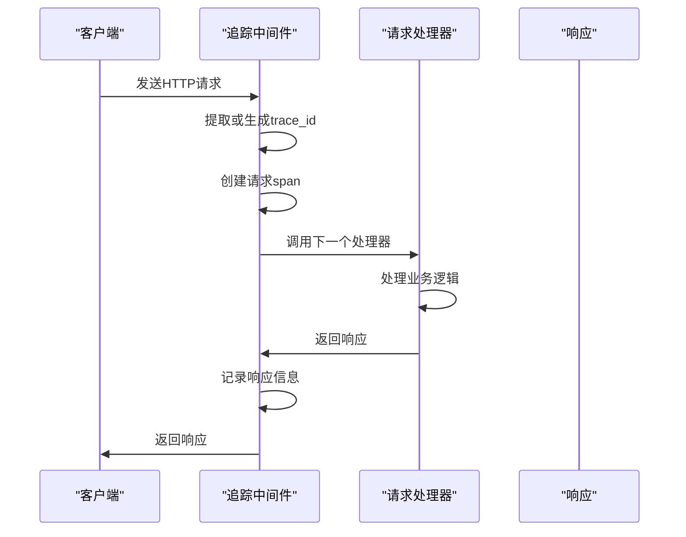
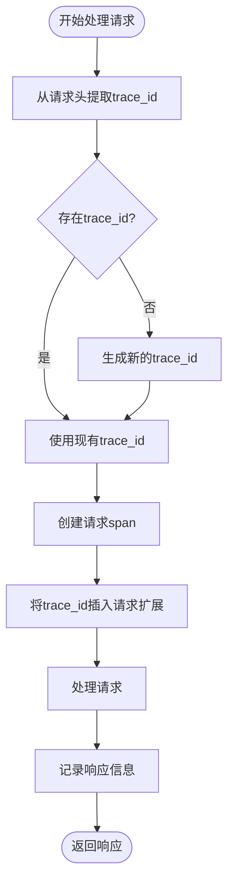
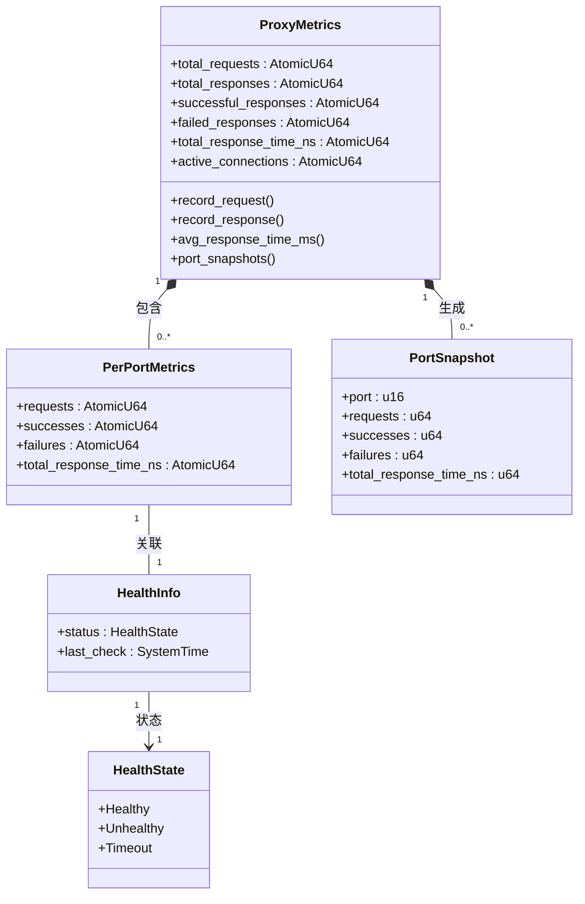

# 可观测性

<cite>
**本文档引用的文件**
- [tracing_middleware.rs](file://crates/rcoder/src/middleware/tracing_middleware.rs)
- [main.rs](file://crates/rcoder/src/main.rs)
- [service.rs](file://crates/pingora-proxy/src/service.rs)
- [http_result.rs](file://crates/rcoder/src/model/http_result.rs)
- [proxy_handler_api.rs](file://crates/rcoder/src/handler/proxy_handler_api.rs)
</cite>

## 目录
1. [引言](#引言)
2. [日志系统](#日志系统)
3. [链路追踪](#链路追踪)
4. [指标监控](#指标监控)
5. [日志分析示例](#日志分析示例)
6. [监控告警建议](#监控告警建议)
7. [结论](#结论)

## 引言
rcoder系统提供了一套完整的可观测性解决方案，涵盖日志记录、链路追踪和指标监控三个方面。本文档详细说明了系统的可观测性功能，包括基于Tracing库的日志系统实现、tracing_middleware的追踪ID生成机制、与OpenTelemetry的集成方式，以及关键性能指标的收集和监控建议。

## 日志系统

rcoder系统实现了结构化的日志记录功能，支持多级别日志输出和上下文信息注入。系统使用tracing库作为日志框架，提供了丰富的日志功能。

日志系统的主要特性包括：
- 支持多种日志级别（debug、info、warn、error等）
- 结构化JSON格式输出，便于后续分析和处理
- 按天滚动的日志文件管理
- 同时输出到控制台和文件，满足不同场景需求
- 包含线程ID和线程名称等上下文信息

日志系统在启动时通过`init_telemetry`函数进行初始化，配置了文件日志层和控制台日志层。文件日志采用JSON格式，便于后续的日志分析工具处理；控制台日志采用简洁格式，便于开发和调试时实时查看。

**Section sources**
- [main.rs](file://crates/rcoder/src/main.rs#L171-L215)

## 链路追踪

### 追踪中间件实现

rcoder系统通过`tracing_middleware`模块实现了HTTP请求的链路追踪功能。该中间件为每个请求生成唯一的追踪ID，并贯穿整个处理链路，确保请求的完整追踪。

追踪中间件的核心功能包括：
1. 为每个HTTP请求自动生成trace_id
2. 创建请求span用于日志跟踪
3. 记录请求和响应信息
4. 自动将trace_id注入到OpenTelemetry context中



**Diagram sources**
- [tracing_middleware.rs](file://crates/rcoder/src/middleware/tracing_middleware.rs#L11-L18)

### 追踪ID生成机制

`tracing_middleware_handler`函数是追踪中间件的核心处理函数，负责处理每个HTTP请求的追踪逻辑。其工作流程如下：

1. 从请求头中提取trace_id，支持多种标准头字段：
   - x-trace-id
   - x-request-id
   - traceparent
   - x-correlation-id

2. 如果请求头中没有trace_id，则生成新的UUID作为trace_id

3. 创建包含trace_id信息的请求span，记录请求方法、URI、用户代理等信息

4. 将trace_id添加到请求扩展中，供后续处理器使用

5. 记录请求开始和完成的日志信息



**Diagram sources**
- [tracing_middleware.rs](file://crates/rcoder/src/middleware/tracing_middleware.rs#L70-L129)

### OpenTelemetry集成

rcoder系统与OpenTelemetry深度集成，实现了分布式追踪数据的导出。系统通过以下方式实现OpenTelemetry集成：

1. 设置全局文本传播器，用于trace context的传播
2. 使用tracing_opentelemetry库将tracing span转换为OpenTelemetry span
3. 在HTTP响应中自动注入trace_id信息

`get_trace_id_from_context`函数从当前OpenTelemetry context中获取trace_id，确保在整个请求处理链路中trace_id的一致性。该函数在多个模块中被调用，包括日志记录和API响应生成。

**Section sources**
- [tracing_middleware.rs](file://crates/rcoder/src/middleware/tracing_middleware.rs#L27-L41)
- [http_result.rs](file://crates/rcoder/src/model/http_result.rs#L7-L21)

## 指标监控

### 关键性能指标

rcoder系统收集了多个关键性能指标，用于监控系统运行状态和性能表现。主要指标包括：

- **请求延迟**：记录每个请求的处理时间
- **错误率**：统计失败请求的比例
- **代理调用耗时**：监控代理服务的响应时间
- **活跃连接数**：跟踪当前活跃的连接数量
- **请求吞吐量**：统计单位时间内的请求数量

### 指标收集点

系统在多个关键位置收集性能指标：

1. **HTTP请求处理**：在追踪中间件中记录请求开始和完成时间，计算请求延迟
2. **代理服务**：在Pingora代理服务中记录每个请求的响应时间和状态
3. **后端健康检查**：定期检查后端服务的健康状态，记录检查结果
4. **资源使用**：监控系统资源使用情况，如内存、CPU等



**Diagram sources**
- [service.rs](file://crates/pingora-proxy/src/service.rs#L51-L85)

### 指标API接口

系统提供了REST API接口，用于查询当前的监控指标。主要接口包括：

- `/proxy/stats`：获取代理服务的统计信息
- `/proxy/backends`：获取后端服务列表和健康状态
- `/proxy/config`：获取代理服务的配置信息

`proxy_handler_api.rs`文件中的`proxy_stats`函数实现了指标查询功能，返回包含以下信息的JSON响应：
- 总请求数
- 成功请求数
- 失败请求数
- 平均响应时间
- 活跃连接数
- 按端口统计的详细信息

**Section sources**
- [service.rs](file://crates/pingora-proxy/src/service.rs#L87-L125)
- [proxy_handler_api.rs](file://crates/rcoder/src/handler/proxy_handler_api.rs#L136-L176)

## 日志分析示例

### 常见问题诊断

通过分析系统日志，可以诊断和解决常见的运行问题。以下是几个典型的日志分析示例：

#### 请求处理超时
当出现请求处理超时问题时，可以通过以下步骤进行诊断：

1. 在日志中搜索"HTTP 请求处理完成"条目，查找响应时间较长的记录
2. 检查对应的trace_id，追踪整个请求处理链路
3. 分析各处理阶段的耗时，定位性能瓶颈

```log
INFO  rcoder::middleware::tracing_middleware: HTTP 请求处理完成: POST /chat -> 200 (trace_id: abcdef123456) duration=5.2s
```

#### 代理服务故障
当代理服务出现问题时，可以检查以下日志信息：

1. 查找代理服务相关的错误日志
2. 检查后端服务的健康状态
3. 分析请求转发过程中的异常

```log
ERROR pingora_proxy: 代理请求失败: connection refused (trace_id: xyz789)
INFO  rcoder::handler::proxy_handler_api: 查询代理统计: 总请求 100, 成功 95, 失败 5, 平均耗时 150.2ms
```

#### 资源耗尽
当系统资源耗尽时，可以关注以下日志模式：

1. 查找内存分配失败的错误
2. 检查线程池饱和情况
3. 分析连接数变化趋势

```log
WARN  rcoder::proxy_agent::cleanup_task: 发现闲置agent: project_id=proj123, 状态=Idle, 闲置时长: 1200秒
INFO  rcoder::middleware::tracing_middleware: 开始处理 HTTP 请求: GET /health (trace_id: 123456) active_connections=98
```

**Section sources**
- [tracing_middleware.rs](file://crates/rcoder/src/middleware/tracing_middleware.rs#L94-L148)
- [cleanup_task.rs](file://crates/rcoder/src/proxy_agent/cleanup_task.rs#L91-L113)

## 监控告警建议

### 告警阈值配置

为确保系统稳定运行，建议配置以下监控告警规则：

| 指标 | 告警阈值 | 告警级别 | 建议操作 |
|------|----------|----------|----------|
| 平均响应时间 | >1000ms | 警告 | 检查系统负载和资源使用 |
| 错误率 | >5% | 警告 | 分析错误日志，定位问题根源 |
| 活跃连接数 | >90%最大连接数 | 警告 | 扩容或优化连接管理 |
| 后端服务健康状态 | unhealthy | 紧急 | 立即检查后端服务状态 |
| 请求延迟P99 | >3000ms | 紧急 | 紧急排查性能瓶颈 |

### 性能基线参考

根据系统运行经验，以下是rcoder系统的性能基线参考：

- **正常情况**：
  - 平均响应时间：<200ms
  - 错误率：<1%
  - CPU使用率：<70%
  - 内存使用率：<80%

- **压力情况**：
  - 平均响应时间：<1000ms
  - 错误率：<5%
  - CPU使用率：<90%
  - 内存使用率：<95%

- **异常情况**：
  - 平均响应时间：>1000ms
  - 错误率：>5%
  - CPU使用率：>90%
  - 内存使用率：>95%

建议定期收集和分析系统性能数据，建立动态的性能基线，及时发现和解决潜在问题。

## 结论

rcoder系统通过完善的可观测性设计，提供了强大的日志记录、链路追踪和指标监控功能。系统基于tracing库实现了结构化的日志输出，通过tracing_middleware为每个请求生成唯一的追踪ID，并与OpenTelemetry集成实现分布式追踪。同时，系统收集了关键性能指标，提供了丰富的监控API接口，为运维人员提供了全面的系统视图。

通过合理的日志分析和监控告警配置，可以有效保障系统的稳定运行，快速定位和解决各种问题。建议运维人员充分利用系统的可观测性功能，建立完善的监控体系，确保rcoder系统在各种负载条件下都能提供稳定可靠的服务。