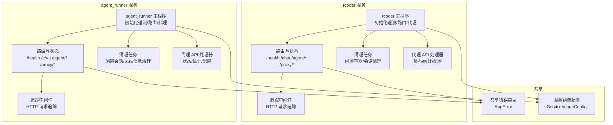
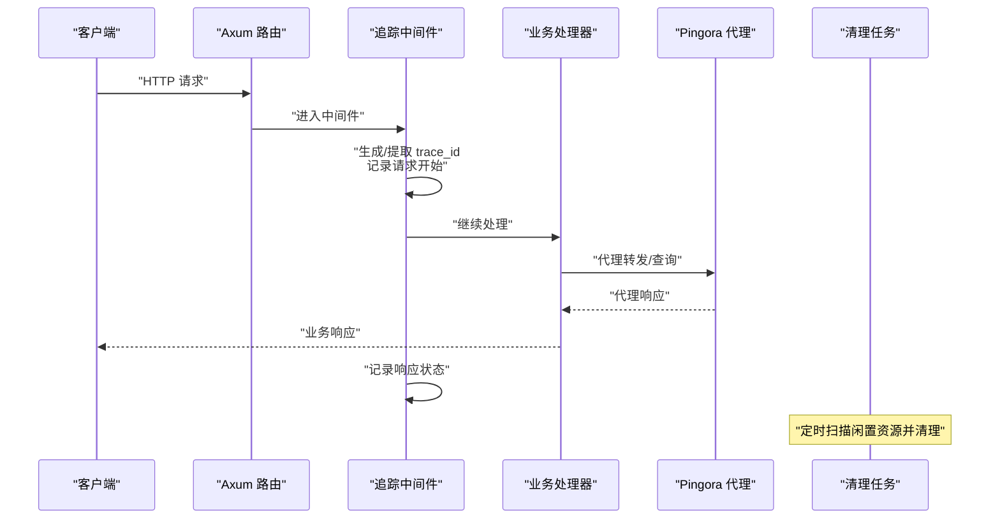
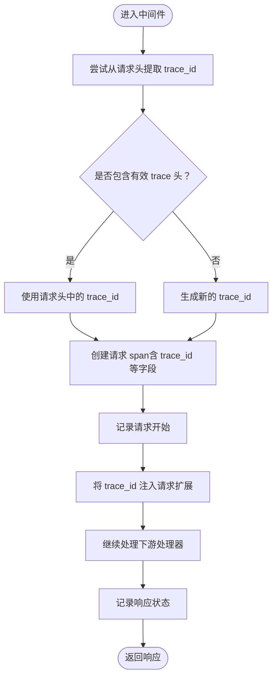
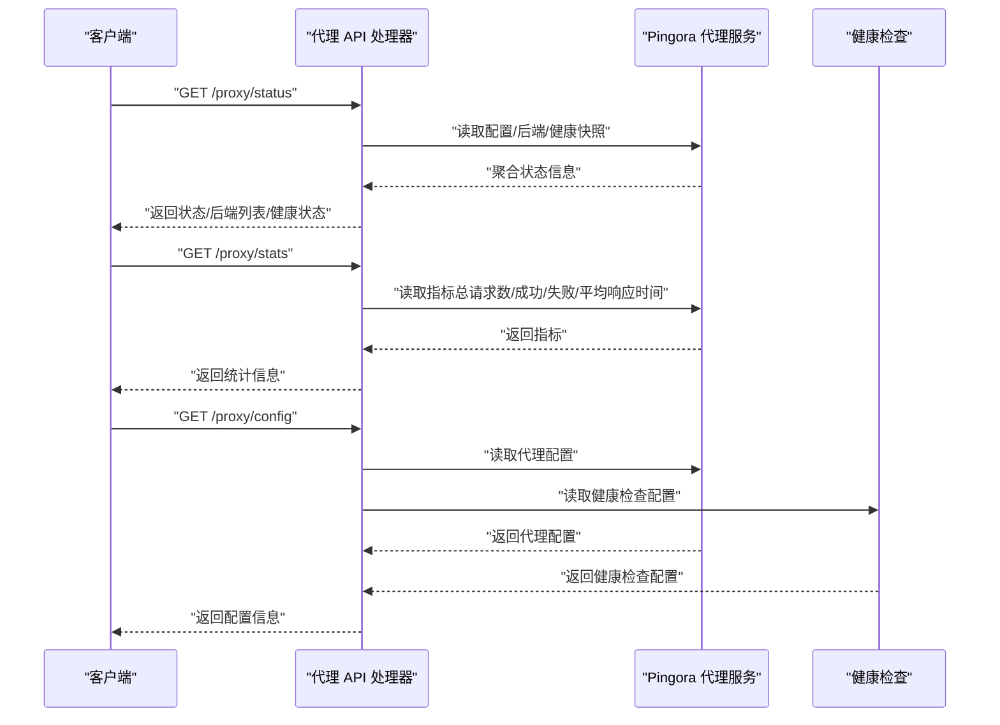
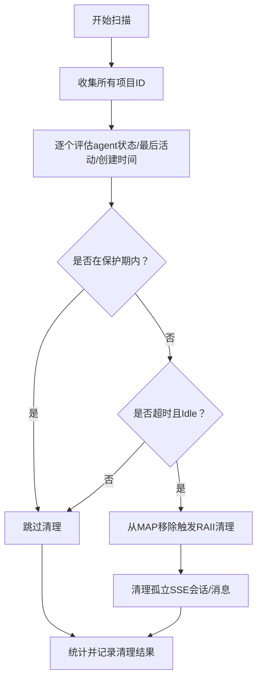
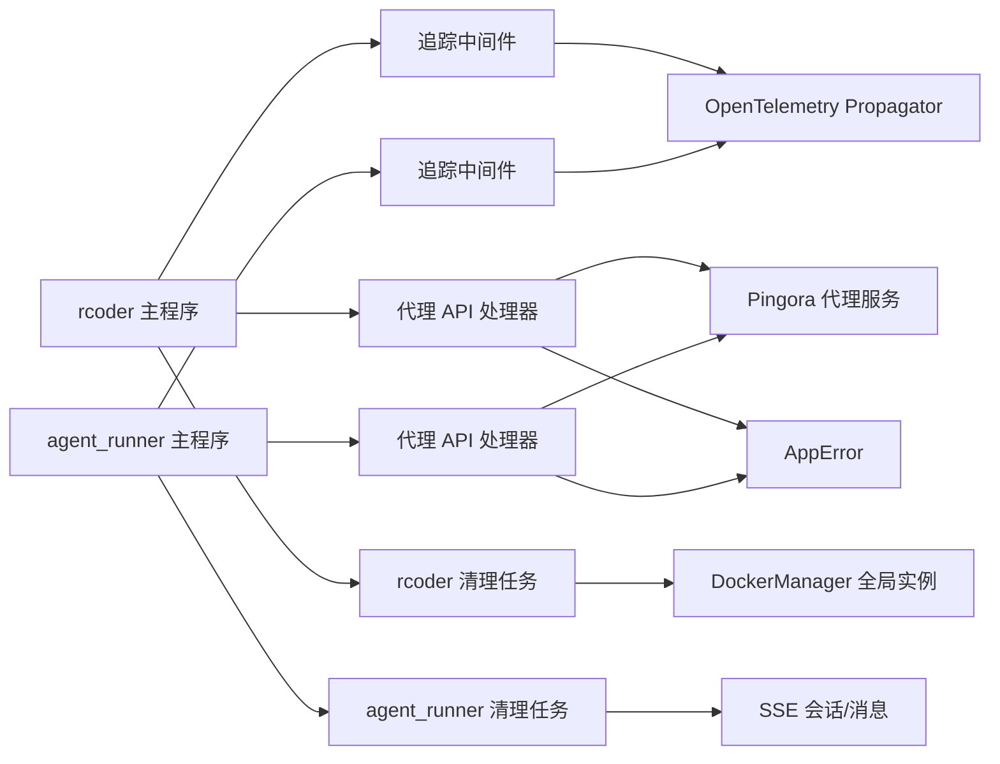

# 可观测性

<cite>
**本文引用的文件**
- [rcoder 主程序](file://crates/rcoder/src/main.rs)
- [agent_runner 主程序](file://crates/agent_runner/src/main.rs)
- [rcoder 路由与状态](file://crates/rcoder/src/router.rs)
- [agent_runner 路由与状态](file://crates/agent_runner/src/router.rs)
- [rcoder 健康检查处理器](file://crates/rcoder/src/handler/health_handler.rs)
- [agent_runner 健康检查处理器](file://crates/agent_runner/src/handler/health_handler.rs)
- [rcoder 配置](file://crates/rcoder/src/config.rs)
- [agent_runner 配置](file://crates/agent_runner/src/config.rs)
- [rcoder 代理 API 处理器](file://crates/rcoder/src/handler/proxy_handler_api.rs)
- [agent_runner 代理 API 处理器](file://crates/agent_runner/src/handler/proxy_handler_api.rs)
- [rcoder 清理任务](file://crates/rcoder/src/proxy_agent/cleanup_task.rs)
- [agent_runner 清理任务](file://crates/agent_runner/src/proxy_agent/cleanup_task.rs)
- [共享错误类型](file://crates/shared_types/src/model/app_error.rs)
- [服务镜像配置](file://crates/shared_types/src/service_config.rs)
- [rcoder 追踪中间件](file://crates/rcoder/src/middleware/tracing_middleware.rs)
- [agent_runner 追踪中间件](file://crates/agent_runner/src/middleware/tracing_middleware.rs)
</cite>

## 目录
1. [简介](#简介)
2. [项目结构](#项目结构)
3. [核心组件](#核心组件)
4. [架构总览](#架构总览)
5. [详细组件分析](#详细组件分析)
6. [依赖关系分析](#依赖关系分析)
7. [性能考量](#性能考量)
8. [故障排查指南](#故障排查指南)
9. [结论](#结论)

## 简介
本文件系统性阐述本仓库的可观测性实现，涵盖日志系统、链路追踪、性能监控与错误处理。内容基于实际代码库，提供面向初学者的易懂说明与面向资深工程师的技术深度，包括配置项、参数与返回值、组件关系、常见问题与解决方案。

## 项目结构
- 两个主要服务：
  - rcoder：主服务，提供聊天、SSE 实时通知、代理与健康检查等能力
  - agent_runner：代理运行器，负责代理会话、清理任务与健康检查
- 共享模块：
  - shared_types：共享模型与错误类型
  - 配置模块：统一的配置加载与环境变量覆盖
  - 追踪中间件：HTTP 请求级链路追踪与日志注入
  - 清理任务：闲置资源回收与孤立容器清理
  - 代理 API：Pingora 代理的状态、统计与配置查询

图表来源
- [rcoder 主程序](file://crates/rcoder/src/main.rs#L1-L120)
- [agent_runner 主程序](file://crates/agent_runner/src/main.rs#L1-L120)
- [rcoder 路由与状态](file://crates/rcoder/src/router.rs#L52-L84)
- [agent_runner 路由与状态](file://crates/agent_runner/src/router.rs#L41-L70)
- [rcoder 代理 API 处理器](file://crates/rcoder/src/handler/proxy_handler_api.rs#L1-L60)
- [agent_runner 代理 API 处理器](file://crates/agent_runner/src/handler/proxy_handler_api.rs#L1-L60)
- [rcoder 清理任务](file://crates/rcoder/src/proxy_agent/cleanup_task.rs#L1-L120)
- [agent_runner 清理任务](file://crates/agent_runner/src/proxy_agent/cleanup_task.rs#L1-L120)
- [共享错误类型](file://crates/shared_types/src/model/app_error.rs#L1-L65)
- [服务镜像配置](file://crates/shared_types/src/service_config.rs#L1-L120)

章节来源
- [rcoder 主程序](file://crates/rcoder/src/main.rs#L1-L120)
- [agent_runner 主程序](file://crates/agent_runner/src/main.rs#L1-L120)
- [rcoder 路由与状态](file://crates/rcoder/src/router.rs#L52-L84)
- [agent_runner 路由与状态](file://crates/agent_runner/src/router.rs#L41-L70)

## 核心组件
- 日志系统
  - 使用 tracing 与 tracing-subscriber 输出到文件与控制台，按天滚动，JSON 格式便于后续分析
  - rcoder 与 agent_runner 分别初始化各自的遥测系统，设置 TraceContextPropagator
- 链路追踪
  - HTTP 请求中间件自动生成 trace_id，注入 OpenTelemetry 上下文，记录请求/响应
  - 中间件将 trace_id 放入请求扩展，便于后续处理器使用
- 性能监控
  - Pingora 代理内置指标：总请求数、成功/失败响应数、平均响应时间等
  - 代理 API 提供 /proxy/status、/proxy/stats、/proxy/config 查询
- 错误处理
  - 统一的 AppError 类型，实现 IntoResponse，返回标准化错误体
  - 代理 API 对未启用代理场景返回明确的错误码与消息

章节来源
- [rcoder 主程序](file://crates/rcoder/src/main.rs#L274-L320)
- [agent_runner 主程序](file://crates/agent_runner/src/main.rs#L181-L231)
- [rcoder 追踪中间件](file://crates/rcoder/src/middleware/tracing_middleware.rs#L71-L130)
- [agent_runner 追踪中间件](file://crates/agent_runner/src/middleware/tracing_middleware.rs#L71-L130)
- [rcoder 代理 API 处理器](file://crates/rcoder/src/handler/proxy_handler_api.rs#L1-L120)
- [agent_runner 代理 API 处理器](file://crates/agent_runner/src/handler/proxy_handler_api.rs#L1-L120)
- [共享错误类型](file://crates/shared_types/src/model/app_error.rs#L1-L65)

## 架构总览
可观测性贯穿请求生命周期：从 HTTP 入口经中间件注入 trace_id，进入路由与处理器，期间产生日志与指标；代理服务提供运行时状态与统计；清理任务定期回收闲置资源；错误统一收敛。

图表来源
- [rcoder 主程序](file://crates/rcoder/src/main.rs#L220-L271)
- [agent_runner 主程序](file://crates/agent_runner/src/main.rs#L120-L178)
- [rcoder 路由与状态](file://crates/rcoder/src/router.rs#L52-L84)
- [agent_runner 路由与状态](file://crates/agent_runner/src/router.rs#L41-L70)
- [rcoder 追踪中间件](file://crates/rcoder/src/middleware/tracing_middleware.rs#L71-L130)
- [agent_runner 追踪中间件](file://crates/agent_runner/src/middleware/tracing_middleware.rs#L71-L130)
- [rcoder 清理任务](file://crates/rcoder/src/proxy_agent/cleanup_task.rs#L278-L310)
- [agent_runner 清理任务](file://crates/agent_runner/src/proxy_agent/cleanup_task.rs#L294-L310)

## 详细组件分析

### 日志系统
- 初始化
  - 创建 logs 目录，按天滚动，最多保留 N 份日志文件
  - 控制台输出简洁格式，文件输出 JSON 格式，包含目标、线程 ID/名称等
  - 设置全局 TextMapPropagator，支持 trace_id 传播
- 输出位置
  - rcoder：日志前缀 rcoder
  - agent_runner：日志前缀 agent-runner
- 使用方式
  - 通过 tracing::info/warn/error/debug 等宏记录结构化日志
  - 中间件在请求开始与结束处记录关键信息，便于关联 trace_id

章节来源
- [rcoder 主程序](file://crates/rcoder/src/main.rs#L274-L320)
- [agent_runner 主程序](file://crates/agent_runner/src/main.rs#L181-L231)

### 链路追踪中间件
- 功能要点
  - 自动生成 trace_id（UUID v4 简短格式）
  - 从常见 trace 请求头提取 trace_id（如 x-trace-id、traceparent 等）
  - 为每次请求创建 info_span，记录 method、URI、trace_id、User-Agent、Content-Type
  - 将 trace_id 插入请求扩展，供后续处理器使用
  - 在 span 中执行请求处理，记录响应状态
- 适用范围
  - rcoder 与 agent_runner 各自提供独立的中间件实现，均注册到各自路由

图表来源
- [rcoder 追踪中间件](file://crates/rcoder/src/middleware/tracing_middleware.rs#L44-L130)
- [agent_runner 追踪中间件](file://crates/agent_runner/src/middleware/tracing_middleware.rs#L44-L130)

章节来源
- [rcoder 追踪中间件](file://crates/rcoder/src/middleware/tracing_middleware.rs#L44-L130)
- [agent_runner 追踪中间件](file://crates/agent_runner/src/middleware/tracing_middleware.rs#L44-L130)

### 健康检查与代理监控
- 健康检查
  - /health 返回标准结构，包含状态、时间戳与服务名
  - rcoder 与 agent_runner 均提供独立实现
- 代理监控
  - /proxy/status：返回代理配置、后端列表与健康状态快照
  - /proxy/stats：返回总请求数、成功/失败响应数、平均响应时间等指标
  - /proxy/config：返回代理配置与健康检查配置
- 代理健康检查
  - 配置包含启用开关、检查间隔、超时、健康阈值与不健康阈值
  - 启动时可按配置启动健康检查循环

图表来源
- [rcoder 代理 API 处理器](file://crates/rcoder/src/handler/proxy_handler_api.rs#L1-L206)
- [agent_runner 代理 API 处理器](file://crates/agent_runner/src/handler/proxy_handler_api.rs#L1-L206)
- [rcoder 配置](file://crates/rcoder/src/config.rs#L52-L80)
- [agent_runner 配置](file://crates/agent_runner/src/config.rs#L51-L73)

章节来源
- [rcoder 健康检查处理器](file://crates/rcoder/src/handler/health_handler.rs#L1-L36)
- [agent_runner 健康检查处理器](file://crates/agent_runner/src/handler/health_handler.rs#L1-L36)
- [rcoder 代理 API 处理器](file://crates/rcoder/src/handler/proxy_handler_api.rs#L1-L206)
- [agent_runner 代理 API 处理器](file://crates/agent_runner/src/handler/proxy_handler_api.rs#L1-L206)
- [rcoder 配置](file://crates/rcoder/src/config.rs#L52-L80)
- [agent_runner 配置](file://crates/agent_runner/src/config.rs#L51-L73)

### 清理任务与资源回收
- rcoder 清理任务
  - 基于 RAII 原则：从 project_and_agent_map 移除条目，触发 AgentLifecycleGuard 自动清理
  - 保护期：新建容器在最小保护时间内不清理，避免误删
  - 超时判断：考虑最后活动时间与创建时间，加入 1 秒缓冲避免时间误差
  - 孤立容器清理：扫描 rcoder-agent-* 容器，批量并行清理，限制单次清理数量
  - 超时保护：清理过程整体超时，防止阻塞
- agent_runner 清理任务
  - 清理孤立的 SSE 会话与消息
  - 仅清理 Idle 状态且超时的 agent，避免中断 Active/Terminating 状态

图表来源
- [rcoder 清理任务](file://crates/rcoder/src/proxy_agent/cleanup_task.rs#L248-L420)
- [agent_runner 清理任务](file://crates/agent_runner/src/proxy_agent/cleanup_task.rs#L156-L245)

章节来源
- [rcoder 清理任务](file://crates/rcoder/src/proxy_agent/cleanup_task.rs#L1-L420)
- [agent_runner 清理任务](file://crates/agent_runner/src/proxy_agent/cleanup_task.rs#L1-L245)

### 错误处理与返回值
- 统一错误类型
  - AppError：AnyhowError、IoError、Generic
  - 实现 IntoResponse，返回 JSON 结构，包含 success=false 与 error.code/message
- 代理 API 错误
  - 未启用代理时返回 SERVICE_UNAVAILABLE，携带错误码与消息
- 健康检查
  - /health 返回标准结构，包含 status、timestamp、service

章节来源
- [共享错误类型](file://crates/shared_types/src/model/app_error.rs#L1-L65)
- [rcoder 代理 API 处理器](file://crates/rcoder/src/handler/proxy_handler_api.rs#L1-L120)
- [agent_runner 代理 API 处理器](file://crates/agent_runner/src/handler/proxy_handler_api.rs#L1-L120)
- [rcoder 健康检查处理器](file://crates/rcoder/src/handler/health_handler.rs#L1-L36)
- [agent_runner 健康检查处理器](file://crates/agent_runner/src/handler/health_handler.rs#L1-L36)

### 配置与参数
- rcoder 配置
  - AppConfig：default_agent、projects_dir、port、proxy_config、docker_config
  - ProxyConfig：listen_port、default_backend_port、backend_host、port_param、health_check
  - HealthCheckConfig：enabled、interval_seconds、timeout_seconds、healthy_threshold、unhealthy_threshold
  - DockerConfig：multi_image_config、network_mode、work_dir、auto_cleanup、container_ttl_seconds
- agent_runner 配置
  - AppConfig：default_agent、projects_dir、port、proxy_config
  - ProxyConfig：listen_port、default_backend_port、backend_host、port_param、health_check
  - HealthCheckConfig：enabled、interval_seconds、timeout_seconds、healthy_threshold、unhealthy_threshold
- 环境变量覆盖
  - rcoder：RCODER_PORT、RCODER_PROJECTS_DIR、RCODER_NETWORK_MODE、RCODER_WORK_DIR、RCODER_AUTO_CLEANUP、RCODER_CONTAINER_TTL
  - agent_runner：RCODER_PORT、RCODER_PROJECTS_DIR（部分）

章节来源
- [rcoder 配置](file://crates/rcoder/src/config.rs#L37-L110)
- [rcoder 配置](file://crates/rcoder/src/config.rs#L112-L210)
- [rcoder 配置](file://crates/rcoder/src/config.rs#L253-L332)
- [agent_runner 配置](file://crates/agent_runner/src/config.rs#L38-L110)
- [agent_runner 配置](file://crates/agent_runner/src/config.rs#L112-L180)
- [agent_runner 配置](file://crates/agent_runner/src/config.rs#L252-L315)

### 与容器与镜像的关系
- 服务镜像配置
  - ServiceImageConfig：image/arm64_image/amd64_image/default_image、environment、mounts、resource_limits、work_dir、network_mode、container_path_template
  - 支持镜像选择、环境变量合并、挂载点校验与路径模板解析
- Docker 配置
  - rcoder DockerConfig 支持多镜像配置与环境变量覆盖，提供验证与摘要信息
  - 启动时合并应用配置与多镜像配置，初始化全局 DockerManager

章节来源
- [服务镜像配置](file://crates/shared_types/src/service_config.rs#L1-L120)
- [服务镜像配置](file://crates/shared_types/src/service_config.rs#L120-L262)
- [服务镜像配置](file://crates/shared_types/src/service_config.rs#L314-L401)
- [rcoder 配置](file://crates/rcoder/src/config.rs#L148-L211)

## 依赖关系分析
- 日志与追踪
  - rcoder/agent_runner 主程序分别初始化 tracing-subscriber 与 OpenTelemetry Propagator
  - 追踪中间件依赖 tracing/tracing-opentelemetry，生成/注入 trace_id
- 代理与监控
  - 代理 API 依赖 Pingora 服务对象，读取配置、后端列表与健康快照
  - 代理配置包含健康检查参数，启动时可开启健康检查循环
- 清理任务
  - rcoder 清理任务依赖 DockerManager 全局实例，清理孤立容器与会话
  - agent_runner 清理任务清理 SSE 会话与消息
- 错误处理
  - AppError 实现 IntoResponse，统一错误返回格式

图表来源
- [rcoder 主程序](file://crates/rcoder/src/main.rs#L274-L320)
- [agent_runner 主程序](file://crates/agent_runner/src/main.rs#L181-L231)
- [rcoder 追踪中间件](file://crates/rcoder/src/middleware/tracing_middleware.rs#L71-L130)
- [agent_runner 追踪中间件](file://crates/agent_runner/src/middleware/tracing_middleware.rs#L71-L130)
- [rcoder 代理 API 处理器](file://crates/rcoder/src/handler/proxy_handler_api.rs#L1-L120)
- [agent_runner 代理 API 处理器](file://crates/agent_runner/src/handler/proxy_handler_api.rs#L1-L120)
- [rcoder 清理任务](file://crates/rcoder/src/proxy_agent/cleanup_task.rs#L431-L602)
- [agent_runner 清理任务](file://crates/agent_runner/src/proxy_agent/cleanup_task.rs#L156-L245)
- [共享错误类型](file://crates/shared_types/src/model/app_error.rs#L1-L65)

章节来源
- [rcoder 主程序](file://crates/rcoder/src/main.rs#L274-L320)
- [agent_runner 主程序](file://crates/agent_runner/src/main.rs#L181-L231)
- [rcoder 代理 API 处理器](file://crates/rcoder/src/handler/proxy_handler_api.rs#L1-L120)
- [agent_runner 代理 API 处理器](file://crates/agent_runner/src/handler/proxy_handler_api.rs#L1-L120)
- [rcoder 清理任务](file://crates/rcoder/src/proxy_agent/cleanup_task.rs#L431-L602)
- [agent_runner 清理任务](file://crates/agent_runner/src/proxy_agent/cleanup_task.rs#L156-L245)
- [共享错误类型](file://crates/shared_types/src/model/app_error.rs#L1-L65)

## 性能考量
- 日志滚动与保留
  - 按天滚动，限制日志文件数量，降低磁盘占用与 IO 压力
- 代理指标
  - 通过 /proxy/stats 获取平均响应时间等关键指标，辅助容量规划与性能调优
- 清理策略
  - rcoder 清理任务对孤立容器清理加总超时与单次上限，避免阻塞
  - agent_runner 清理任务仅清理 Idle 且超时的 agent，避免中断活跃任务
- 超时与保护
  - 清理过程整体超时、单容器清理超时、新建容器保护期，提升稳定性

章节来源
- [rcoder 主程序](file://crates/rcoder/src/main.rs#L274-L320)
- [agent_runner 主程序](file://crates/agent_runner/src/main.rs#L181-L231)
- [rcoder 清理任务](file://crates/rcoder/src/proxy_agent/cleanup_task.rs#L431-L602)
- [agent_runner 清理任务](file://crates/agent_runner/src/proxy_agent/cleanup_task.rs#L156-L245)

## 故障排查指南
- Docker 相关
  - 启动时自动检测宿主机挂载路径，失败时提供详细配置帮助与排错步骤
  - 建议检查 DOCKER_SOCKET_PATH、Docker socket 权限与挂载路径
- 代理未启用
  - 调用 /proxy/* 接口返回 SERVICE_UNAVAILABLE，需确认代理配置与启动参数
- 日志定位
  - 使用 trace_id 关联请求全链路日志，结合 /proxy/stats 观察异常时段的指标波动
- 清理异常
  - rcoder 清理任务对单次清理与总清理过程设置超时，若出现长时间卡顿，检查 Docker API 可用性与容器状态
- 健康检查
  - /health 返回 healthy 表示服务正常，若异常需结合日志与代理状态进一步排查

章节来源
- [rcoder 主程序](file://crates/rcoder/src/main.rs#L48-L118)
- [rcoder 主程序](file://crates/rcoder/src/main.rs#L322-L351)
- [rcoder 代理 API 处理器](file://crates/rcoder/src/handler/proxy_handler_api.rs#L1-L120)
- [agent_runner 代理 API 处理器](file://crates/agent_runner/src/handler/proxy_handler_api.rs#L1-L120)
- [rcoder 清理任务](file://crates/rcoder/src/proxy_agent/cleanup_task.rs#L431-L602)

## 结论
本项目通过统一的日志与链路追踪中间件、Pingora 代理指标、定时清理任务与统一错误类型，构建了完善的可观测性体系。rcoder 与 agent_runner 在同一套可观测框架下运行，既保证了跨服务的 trace_id 一致性，又提供了可操作的健康检查与代理监控接口。建议在生产环境中结合日志滚动策略、代理指标与清理任务配置，持续优化性能与稳定性。