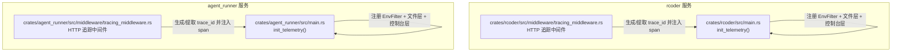
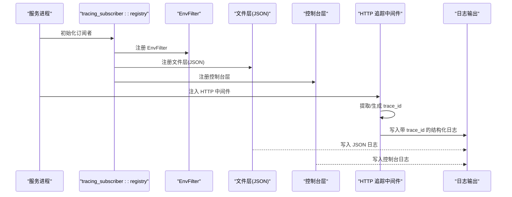
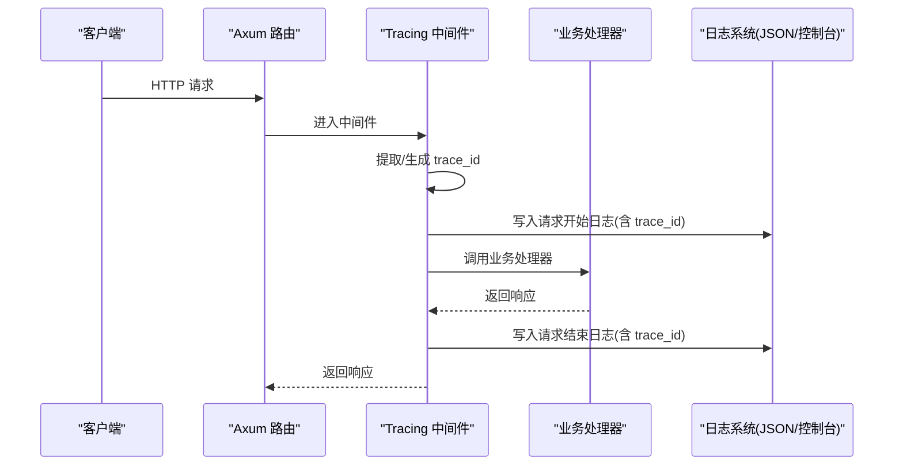
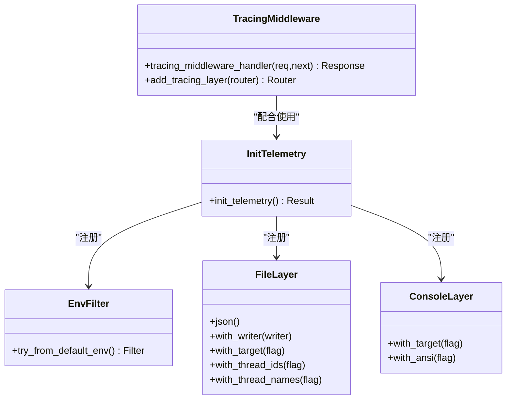

# 日志系统

<cite>
**本文引用的文件**
- [Cargo.toml](file://Cargo.toml)
- [rcoder 主程序](file://crates/rcoder/src/main.rs)
- [agent_runner 主程序](file://crates/agent_runner/src/main.rs)
- [rcoder 追踪中间件](file://crates/rcoder/src/middleware/tracing_middleware.rs)
- [agent_runner 追踪中间件](file://crates/agent_runner/src/middleware/tracing_middleware.rs)
- [诊断脚本](file://docker/scripts/diagnose-blocking.sh)
</cite>

## 目录
1. [简介](#简介)
2. [项目结构](#项目结构)
3. [核心组件](#核心组件)
4. [架构总览](#架构总览)
5. [详细组件分析](#详细组件分析)
6. [依赖分析](#依赖分析)
7. [性能考量](#性能考量)
8. [故障排查指南](#故障排查指南)
9. [结论](#结论)

## 简介
本文件系统性阐述基于 tracing 和 tracing-appender 的日志实现，覆盖以下要点：
- 控制台与文件双输出配置
- JSON 格式化输出
- 按天滚动策略与日志保留
- 日志级别与过滤
- 线程信息包含
- 与链路追踪的集成（trace_id 注入）
- 常见问题（路径不存在、权限不足）及解决方案
- 性能优化建议（异步写入、滚动开销）

该说明面向初学者与资深开发者，既提供清晰的背景知识，也给出深入的技术细节与可视化图示。

## 项目结构
日志系统在两个二进制服务中分别初始化：
- rcoder 服务：负责主业务逻辑与容器管理
- agent_runner 服务：负责代理与子进程交互

两者均通过统一的遥测初始化流程，创建 logs 目录、配置文件 appender、控制台层，并注册 EnvFilter 作为日志级别来源。

图表来源
- [rcoder 主程序](file://crates/rcoder/src/main.rs#L274-L320)
- [agent_runner 主程序](file://crates/agent_runner/src/main.rs#L181-L231)
- [rcoder 追踪中间件](file://crates/rcoder/src/middleware/tracing_middleware.rs#L1-L179)
- [agent_runner 追踪中间件](file://crates/agent_runner/src/middleware/tracing_middleware.rs#L1-L179)

章节来源
- [Cargo.toml](file://Cargo.toml#L91-L105)
- [rcoder 主程序](file://crates/rcoder/src/main.rs#L274-L320)
- [agent_runner 主程序](file://crates/agent_runner/src/main.rs#L181-L231)

## 核心组件
- 日志订阅者与层级
  - EnvFilter：从环境变量读取日志级别，若未设置则回退到默认级别
  - 文件层（JSON）：按天滚动，保留最近 N 份日志文件
  - 控制台层：简洁输出，便于本地调试
- 链路追踪集成
  - 设置全局 TextMapPropagator，支持 trace context 传播
  - HTTP 中间件为每个请求生成/提取 trace_id，并注入到日志 span
- 目录与文件管理
  - 启动时自动创建 logs 目录
  - 文件名前缀区分不同服务（rcoder、agent-runner）

章节来源
- [rcoder 主程序](file://crates/rcoder/src/main.rs#L274-L320)
- [agent_runner 主程序](file://crates/agent_runner/src/main.rs#L181-L231)
- [rcoder 追踪中间件](file://crates/rcoder/src/middleware/tracing_middleware.rs#L1-L179)
- [agent_runner 追踪中间件](file://crates/agent_runner/src/middleware/tracing_middleware.rs#L1-L179)

## 架构总览
日志系统由“订阅者注册 + 层级配置 + 过滤 + 追踪中间件”构成，形成“双输出 + 结构化 + 可追踪”的日志体系。

图表来源
- [rcoder 主程序](file://crates/rcoder/src/main.rs#L274-L320)
- [agent_runner 主程序](file://crates/agent_runner/src/main.rs#L181-L231)
- [rcoder 追踪中间件](file://crates/rcoder/src/middleware/tracing_middleware.rs#L1-L179)
- [agent_runner 追踪中间件](file://crates/agent_runner/src/middleware/tracing_middleware.rs#L1-L179)

## 详细组件分析

### 1) 日志订阅者与层级配置
- EnvFilter
  - 从环境变量读取日志级别；若未设置，则 rcoder 回退到 info，agent_runner 回退到更细粒度的调试级别
- 文件层（JSON）
  - 使用 tracing-appender 的按天滚动策略
  - 通过 filename_prefix 区分服务
  - max_log_files 限制保留的旧日志数量
  - 输出 JSON，便于后续结构化分析
- 控制台层
  - 简洁输出，便于本地快速查看
  - 关闭 ANSI，避免非终端环境污染

章节来源
- [rcoder 主程序](file://crates/rcoder/src/main.rs#L274-L320)
- [agent_runner 主程序](file://crates/agent_runner/src/main.rs#L181-L231)

### 2) 日志目录创建与文件滚动策略
- 目录创建
  - 启动时检查 logs 目录是否存在，不存在则创建
- 滚动策略
  - Rotation::DAILY：按自然日滚动
  - filename_prefix：rcoder 或 agent-runner 前缀
  - max_log_files：保留最近 N 个日志文件，超出自动清理

章节来源
- [rcoder 主程序](file://crates/rcoder/src/main.rs#L274-L320)
- [agent_runner 主程序](file://crates/agent_runner/src/main.rs#L181-L231)

### 3) 日志级别与输出格式
- 日志级别
  - EnvFilter 优先级：环境变量 > 默认值
  - rcoder 默认 info
  - agent_runner 默认更细粒度，便于调试
- 输出格式
  - 文件层：JSON，包含目标、线程 ID、线程名等字段
  - 控制台层：简洁，便于人类阅读

章节来源
- [rcoder 主程序](file://crates/rcoder/src/main.rs#L274-L320)
- [agent_runner 主程序](file://crates/agent_runner/src/main.rs#L181-L231)

### 4) 线程信息包含
- 文件层开启线程 ID 与线程名，便于定位并发场景下的日志来源
- 控制台层关闭线程信息，避免冗余

章节来源
- [rcoder 主程序](file://crates/rcoder/src/main.rs#L274-L320)
- [agent_runner 主程序](file://crates/agent_runner/src/main.rs#L181-L231)

### 5) 链路追踪与 trace_id 注入
- 全局传播器
  - 设置 TraceContextPropagator，支持 trace context 传播
- HTTP 中间件
  - 从请求头提取 trace_id；若无则生成新的 UUID
  - 为每次请求创建 info_span，携带 trace_id、方法、URI、UA、Content-Type 等
  - 将 trace_id 注入请求扩展，便于后续处理器使用
  - 在 span 中记录请求开始与结束，形成完整的调用链日志

图表来源
- [rcoder 追踪中间件](file://crates/rcoder/src/middleware/tracing_middleware.rs#L1-L179)
- [agent_runner 追踪中间件](file://crates/agent_runner/src/middleware/tracing_middleware.rs#L1-L179)

章节来源
- [rcoder 主程序](file://crates/rcoder/src/main.rs#L274-L320)
- [agent_runner 主程序](file://crates/agent_runner/src/main.rs#L181-L231)
- [rcoder 追踪中间件](file://crates/rcoder/src/middleware/tracing_middleware.rs#L1-L179)
- [agent_runner 追踪中间件](file://crates/agent_runner/src/middleware/tracing_middleware.rs#L1-L179)

### 6) 类图：日志与追踪相关组件

图表来源
- [rcoder 主程序](file://crates/rcoder/src/main.rs#L274-L320)
- [agent_runner 主程序](file://crates/agent_runner/src/main.rs#L181-L231)
- [rcoder 追踪中间件](file://crates/rcoder/src/middleware/tracing_middleware.rs#L1-L179)
- [agent_runner 追踪中间件](file://crates/agent_runner/src/middleware/tracing_middleware.rs#L1-L179)

## 依赖分析
- 核心依赖
  - tracing、tracing-subscriber：日志框架与订阅者
  - tracing-appender：文件滚动与 writer
  - opentelemetry、opentelemetry_sdk、tracing-opentelemetry、axum-tracing-opentelemetry：链路追踪与传播
  - uuid：生成 trace_id
- 服务差异
  - rcoder：EnvFilter 默认 info
  - agent_runner：EnvFilter 默认更细粒度，便于调试

章节来源
- [Cargo.toml](file://Cargo.toml#L91-L105)
- [rcoder 主程序](file://crates/rcoder/src/main.rs#L274-L320)
- [agent_runner 主程序](file://crates/agent_runner/src/main.rs#L181-L231)

## 性能考量
- 异步日志写入
  - tracing-appender 默认异步写入，减少阻塞
  - 建议保持默认异步配置，避免同步 I/O 导致延迟放大
- 滚动开销
  - 按天滚动在高吞吐下会产生少量文件系统操作
  - max_log_files 控制保留数量，避免无限增长
- JSON 输出
  - JSON 格式便于结构化分析，但序列化成本略高于文本
  - 若对性能极度敏感，可在生产环境切换为文本格式或减少字段
- 级别过滤
  - EnvFilter 仅在必要时进行解析，建议通过环境变量集中管理
- 并发与线程信息
  - 启用线程 ID/名称会增加少量开销，建议仅在调试阶段开启

[本节为通用性能建议，无需特定文件来源]

## 故障排查指南
- 日志文件路径不存在
  - 现象：启动时报错或无日志文件
  - 处理：确认 logs 目录存在；若不存在，服务会自动创建
  - 参考：日志初始化中包含目录创建逻辑
- 权限不足
  - 现象：无法写入日志文件
  - 处理：确保运行用户对 logs 目录具有写权限
- 日志过多占用磁盘
  - 现象：磁盘空间被占满
  - 处理：调整 max_log_files，或定期清理旧日志
- 无法看到 trace_id
  - 现象：日志中缺少 trace_id
  - 处理：确认中间件已注入；检查请求头是否携带 trace_id；或允许自动生成
- 诊断脚本辅助
  - 使用诊断脚本检查今日日志中的 ERROR/WARN
  - 参考：诊断脚本中对日志文件的读取与错误定位

章节来源
- [rcoder 主程序](file://crates/rcoder/src/main.rs#L274-L320)
- [agent_runner 主程序](file://crates/agent_runner/src/main.rs#L181-L231)
- [诊断脚本](file://docker/scripts/diagnose-blocking.sh#L49-L85)

## 结论
该日志系统以 tracing 为核心，结合 tracing-appender 实现了“双输出 + JSON + 按天滚动 + trace_id 注入”的完整方案。通过 EnvFilter 精准控制日志级别，借助 HTTP 中间件将 trace_id 无缝注入到每条日志中，既满足日常运维需求，又为分布式追踪提供了坚实基础。建议在生产环境中保持异步写入与合理的滚动策略，并根据需要调整日志级别与输出格式，以平衡可观测性与性能。