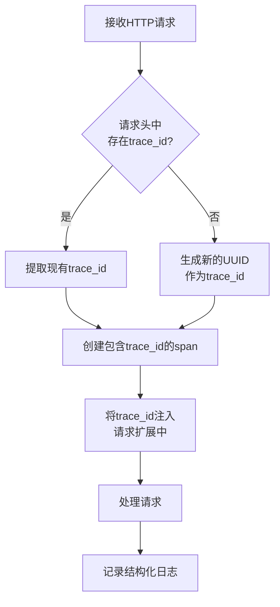
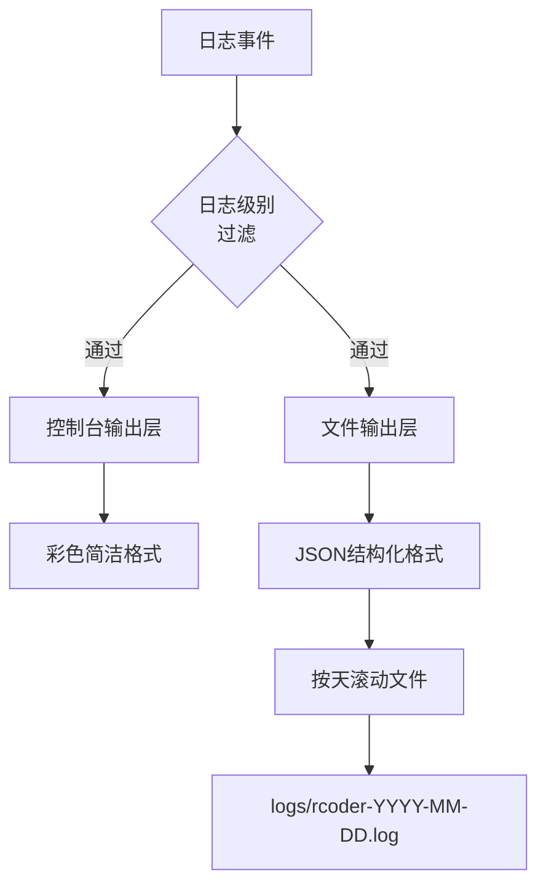
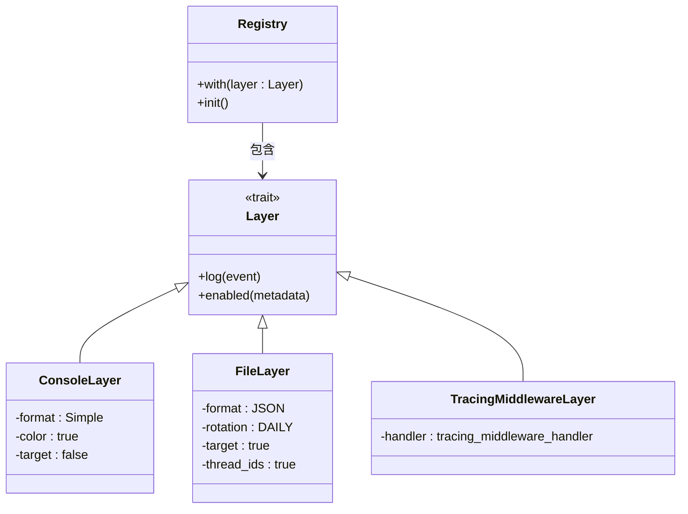
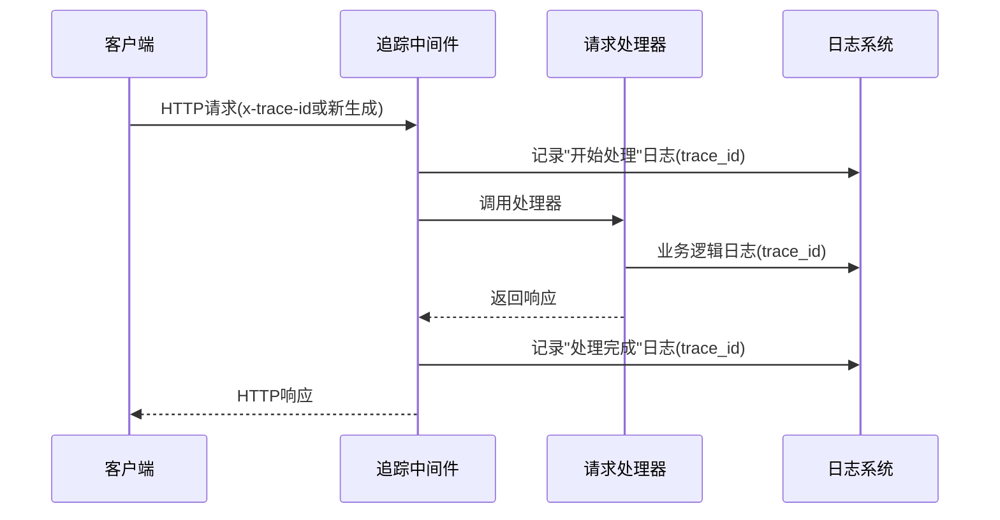

# 日志系统

<cite>
**本文档引用的文件**
- [tracing_middleware.rs](file://crates/rcoder/src/middleware/tracing_middleware.rs)
- [main.rs](file://crates/rcoder/src/main.rs)
- [config.yml](file://config.yml)
</cite>

## 目录
1. [日志系统概述](#日志系统概述)
2. [日志级别配置与使用建议](#日志级别配置与使用建议)
3. [结构化日志格式与上下文注入](#结构化日志格式与上下文注入)
4. [日志输出目标配置](#日志输出目标配置)
5. [基于Layer和Subscriber的日志行为定制](#基于layer和subscriber的日志行为定制)
6. [实际日志输出样例](#实际日志输出样例)
7. [请求流程追踪与异常定位](#请求流程追踪与异常定位)
8. [性能影响评估与日志采样策略](#性能影响评估与日志采样策略)

## 日志系统概述

rcoder项目基于Rust的`tracing`库构建了完整的分布式追踪日志系统，实现了请求级别的全链路追踪能力。系统通过OpenTelemetry标准集成，支持trace_id的跨服务传播，确保在复杂的微服务架构中能够准确关联同一请求的全部日志记录。

日志系统核心功能包括：自动生成全局唯一的trace_id、创建结构化日志记录、支持多目标日志输出、实现请求上下文自动注入。系统在启动时通过`init_telemetry`函数完成初始化，配置了控制台和文件双输出通道，满足开发调试和生产运维的不同需求。

**Section sources**
- [main.rs](file://crates/rcoder/src/main.rs#L171-L215)
- [tracing_middleware.rs](file://crates/rcoder/src/middleware/tracing_middleware.rs#L11-L18)

## 日志级别配置与使用建议

系统采用标准的五级日志分类：trace、debug、info、warn、error，通过`tracing_subscriber::EnvFilter`进行灵活配置。默认配置在`init_telemetry`函数中定义为`rcoder=debug,tower_http=debug,axum_tracing_opentelemetry=info`，实现了不同模块的差异化日志级别控制。

在不同运行环境下，建议采用以下配置策略：

- **开发环境**：设置为`rcoder=debug`，全面开启调试信息，便于开发者快速定位问题
- **测试环境**：设置为`rcoder=info`，记录关键业务流程，避免过多日志干扰测试分析
- **生产环境**：设置为`rcoder=warn`，仅记录警告和错误信息，降低日志存储成本和I/O压力

通过环境变量`RUST_LOG`可以动态调整日志级别，无需重新编译代码，实现了运行时的灵活配置。

**Section sources**
- [main.rs](file://crates/rcoder/src/main.rs#L203-L208)

## 结构化日志格式与上下文注入

日志系统采用JSON格式输出结构化日志，便于后续的日志收集、分析和可视化。文件日志层通过`.json()`方法启用JSON格式，包含完整的上下文信息，如线程ID、线程名称、目标模块等。

关键的上下文信息自动注入机制通过`tracing_middleware_handler`中间件实现。系统为每个HTTP请求自动生成或提取`trace_id`，支持从`x-trace-id`、`x-request-id`、`traceparent`、`x-correlation-id`等标准头部获取。若请求头中不存在这些标识，则使用UUID生成新的trace_id。



**Diagram sources**
- [tracing_middleware.rs](file://crates/rcoder/src/middleware/tracing_middleware.rs#L70-L129)

**Section sources**
- [tracing_middleware.rs](file://crates/rcoder/src/middleware/tracing_middleware.rs#L43-L92)

## 日志输出目标配置

系统支持多目标日志输出，通过`tracing_subscriber::registry`组合不同的日志层实现。当前配置了两个主要输出目标：

1. **控制台输出**：使用简洁格式，启用ANSI颜色，便于开发人员实时观察系统运行状态
2. **文件输出**：采用JSON格式，按天滚动，存储在`logs`目录下，文件名为`rcoder`前缀

文件输出配置了丰富的元数据，包括日志目标、线程ID和线程名称，便于复杂场景下的问题排查。日志文件按天自动滚动，避免单个文件过大，同时保留历史日志供后续分析。



**Diagram sources**
- [main.rs](file://crates/rcoder/src/main.rs#L180-L195)

**Section sources**
- [main.rs](file://crates/rcoder/src/main.rs#L171-L215)

## 基于Layer和Subscriber的日志行为定制

系统通过`tracing_subscriber`的Layer和Subscriber机制实现日志行为的灵活定制。`registry`作为全局订阅者，组合了多个日志层，每个层可以独立配置输出格式、目标和过滤规则。

`tracing_middleware`模块中的`add_tracing_layer`函数展示了如何为Axum应用添加自定义追踪中间件。该函数使用`axum::middleware::from_fn`将异步处理函数转换为中间件层，通过`router.layer()`方法注入到路由系统中。



**Diagram sources**
- [main.rs](file://crates/rcoder/src/main.rs#L197-L215)
- [tracing_middleware.rs](file://crates/rcoder/src/middleware/tracing_middleware.rs#L131-L137)

**Section sources**
- [tracing_middleware.rs](file://crates/rcoder/src/middleware/tracing_middleware.rs#L131-L137)

## 实际日志输出样例

以下是系统生成的典型日志输出样例：

**控制台输出（简洁格式）：**
```
2024-01-01T10:00:00.000Z  INFO rcoder: 开始处理 HTTP 请求: POST /chat (trace_id: a1b2c3d4e5f6g7h8i9j0k1l2m3n4o5p6)
2024-01-01T10:00:00.500Z  INFO rcoder: HTTP 请求处理完成: POST /chat -> 200 (trace_id: a1b2c3d4e5f6g7h8i9j0k1l2m3n4o5p6)
```

**文件输出（JSON格式）：**
```json
{
  "timestamp": "2024-01-01T10:00:00.000Z",
  "level": "INFO",
  "fields": {
    "message": "开始处理 HTTP 请求: POST /chat (trace_id: a1b2c3d4e5f6g7h8i9j0k1l2m3n4o5p6)",
    "method": "POST",
    "uri": "/chat",
    "trace_id": "a1b2c3d4e5f6g7h8i9j0k1l2m3n4o5p6",
    "user_agent": "Mozilla/5.0...",
    "content_type": "application/json"
  },
  "target": "rcoder::middleware::tracing_middleware",
  "thread_id": "12",
  "thread_name": "tokio-runtime-worker"
}
```

**Section sources**
- [tracing_middleware.rs](file://crates/rcoder/src/middleware/tracing_middleware.rs#L97-L115)

## 请求流程追踪与异常定位

系统通过trace_id实现了完整的请求流程追踪能力。每个HTTP请求被分配唯一的trace_id，该ID贯穿整个请求处理生命周期，从接收到响应的每个环节都记录相同的trace_id，使得跨多个组件和异步任务的日志关联成为可能。

当发生异常时，开发者可以通过以下步骤快速定位问题：

1. 从客户端获取或记录trace_id
2. 在日志系统中搜索该trace_id的所有相关日志
3. 按时间顺序分析请求处理流程
4. 定位异常发生的具体环节和上下文

中间件在请求开始和结束时分别记录日志，形成清晰的请求边界，便于识别处理耗时过长或未完成的请求。结合OpenTelemetry的span机制，还可以分析各处理阶段的性能瓶颈。



**Diagram sources**
- [tracing_middleware.rs](file://crates/rcoder/src/middleware/tracing_middleware.rs#L94-L115)

**Section sources**
- [tracing_middleware.rs](file://crates/rcoder/src/middleware/tracing_middleware.rs#L94-L148)

## 性能影响评估与日志采样策略

日志系统在设计时充分考虑了性能影响，采用了多项优化策略：

1. **条件日志记录**：通过`tracing::enabled!`宏在编译时或运行时检查日志级别，避免不必要的字符串格式化开销
2. **异步日志**：虽然当前使用同步输出，但`tracing-appender`支持异步文件写入，可进一步降低I/O阻塞
3. **选择性字段收集**：仅收集必要的上下文信息，避免过度记录影响性能

在高负载场景下，建议实施日志采样策略：

- **固定采样率**：对debug及以下级别日志按固定比例采样
- **关键路径全量记录**：对error和warn级别日志保持全量记录
- **基于trace_id的采样**：对特定trace_id的请求进行全量日志记录，便于问题排查

通过`EnvFilter`的动态配置能力，可以在发现问题时临时提高日志级别，收集详细诊断信息，问题解决后立即恢复，实现精准的性能与可观测性平衡。

**Section sources**
- [main.rs](file://crates/rcoder/src/main.rs#L180-L215)
- [tracing_middleware.rs](file://crates/rcoder/src/middleware/tracing_middleware.rs#L70-L129)