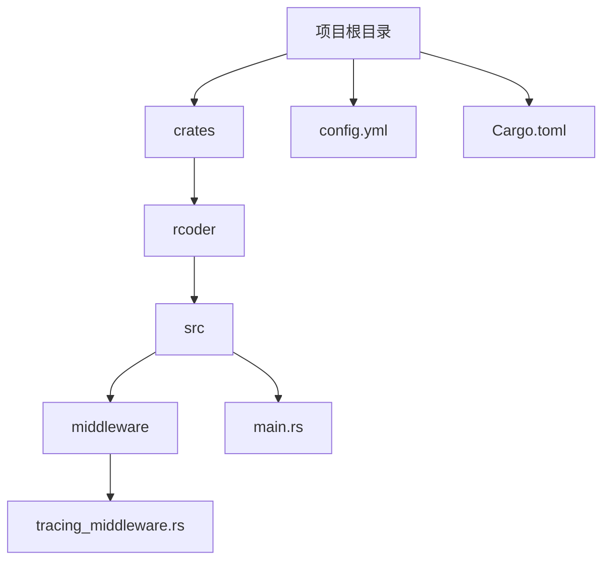
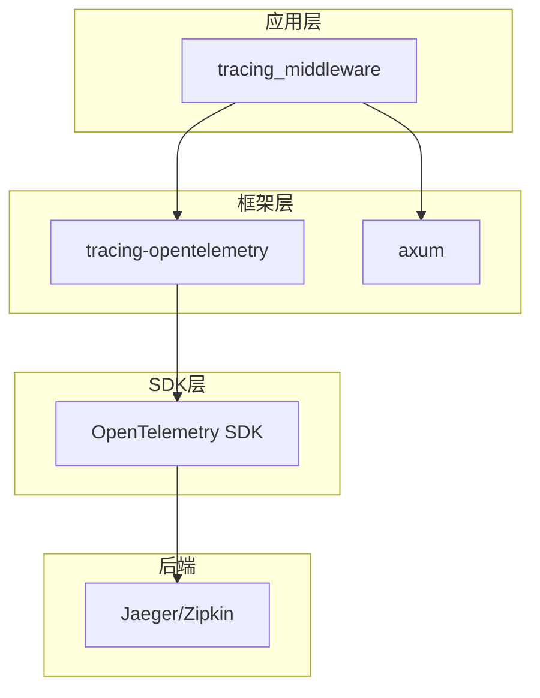
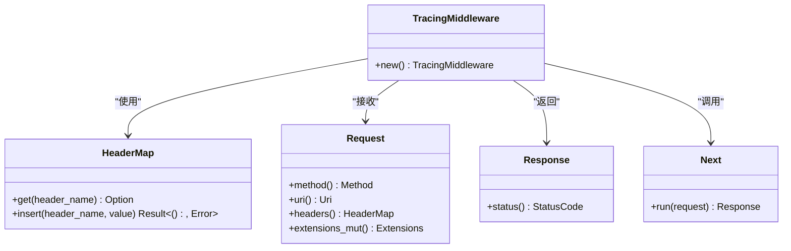
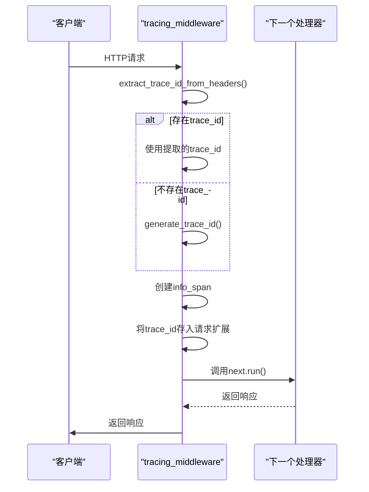
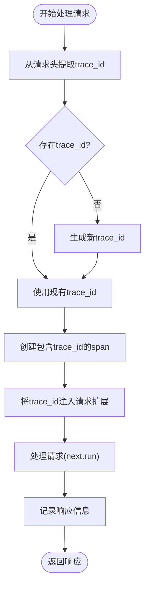
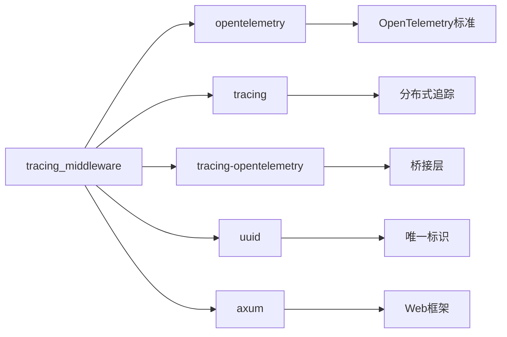

# 链路追踪

<cite>
**本文档中引用的文件**   
- [tracing_middleware.rs](file://crates/rcoder/src/middleware/tracing_middleware.rs)
- [main.rs](file://crates/rcoder/src/main.rs)
- [config.yml](file://config.yml)
- [Cargo.toml](file://crates/rcoder/Cargo.toml)
</cite>

## 目录
1. [简介](#简介)
2. [项目结构](#项目结构)
3. [核心组件](#核心组件)
4. [架构概述](#架构概述)
5. [详细组件分析](#详细组件分析)
6. [依赖分析](#依赖分析)
7. [性能考虑](#性能考虑)
8. [故障排除指南](#故障排除指南)
9. [结论](#结论)

## 简介
本文档深入文档化rcoder的分布式链路追踪实现。详细说明`tracing_middleware`如何为每个HTTP请求生成唯一的trace_id，并在整个请求处理链路中传递上下文。解释与OpenTelemetry的集成机制，包括Span的创建、标注和跨组件传播。描述如何配置OTLP导出器将追踪数据发送到Jaeger、Zipkin等后端系统。结合代码示例说明在代理调用、异步任务等关键路径上手动创建Span的方法。提供典型请求的调用链路分析图，帮助理解系统内部调用关系。包含追踪数据采样率配置、敏感信息过滤和性能开销优化建议。

## 项目结构
rcoder项目采用Rust语言开发，基于模块化架构设计。项目根目录包含主配置文件和启动脚本，核心功能位于`crates/rcoder`目录下。追踪功能主要实现在`src/middleware/tracing_middleware.rs`文件中，通过Axum框架的中间件机制为HTTP请求提供分布式追踪能力。项目依赖OpenTelemetry生态系统实现标准化的遥测数据收集和传播。

**Diagram sources**
- [tracing_middleware.rs](file://crates/rcoder/src/middleware/tracing_middleware.rs#L1-L178)
- [main.rs](file://crates/rcoder/src/main.rs#L1-L216)

**Section sources**
- [tracing_middleware.rs](file://crates/rcoder/src/middleware/tracing_middleware.rs#L1-L178)
- [main.rs](file://crates/rcoder/src/main.rs#L1-L216)

## 核心组件
链路追踪的核心组件是`TracingMiddleware`，它实现了为每个HTTP请求生成和传播trace_id的功能。该中间件利用OpenTelemetry SDK和tracing库，创建包含丰富上下文信息的Span，并自动将trace_id注入到请求处理链中。中间件支持从多种标准请求头（如x-trace-id、traceparent）中提取trace_id，若不存在则生成新的UUID作为trace_id。

**Section sources**
- [tracing_middleware.rs](file://crates/rcoder/src/middleware/tracing_middleware.rs#L11-L18)

## 架构概述
rcoder的链路追踪架构基于OpenTelemetry标准构建，采用分层设计。最底层是OpenTelemetry SDK，负责trace context的传播和数据导出；中间层是tracing库，提供Rust友好的API；最上层是自定义的`tracing_middleware`，将追踪功能集成到Axum Web框架中。整个架构支持将追踪数据通过OTLP协议发送到Jaeger、Zipkin等后端系统进行可视化分析。

**Diagram sources**
- [tracing_middleware.rs](file://crates/rcoder/src/middleware/tracing_middleware.rs#L1-L178)
- [Cargo.toml](file://crates/rcoder/Cargo.toml#L45-L78)

## 详细组件分析

### 追踪中间件分析
`tracing_middleware`是实现分布式追踪的核心组件，负责处理每个HTTP请求的追踪上下文。

#### 对于面向对象的组件：

**Diagram sources**
- [tracing_middleware.rs](file://crates/rcoder/src/middleware/tracing_middleware.rs#L11-L18)

#### 对于API/服务组件：

**Diagram sources**
- [tracing_middleware.rs](file://crates/rcoder/src/middleware/tracing_middleware.rs#L70-L129)

#### 对于复杂逻辑组件：

**Diagram sources**
- [tracing_middleware.rs](file://crates/rcoder/src/middleware/tracing_middleware.rs#L70-L129)

**Section sources**
- [tracing_middleware.rs](file://crates/rcoder/src/middleware/tracing_middleware.rs#L1-L178)

### 概念概述
链路追踪是一种用于监控和诊断分布式系统的技术，通过为每个请求分配唯一的trace_id，可以跟踪请求在系统各组件间的流转路径。这种技术对于理解系统行为、定位性能瓶颈和排查错误至关重要。

## 依赖分析
rcoder的链路追踪功能依赖多个关键库和组件。核心依赖包括OpenTelemetry SDK用于标准兼容的追踪实现，tracing库提供Rust异步环境下的日志和追踪支持，以及uuid库用于生成唯一标识符。这些依赖通过Cargo.toml文件进行管理，确保版本兼容性和可重复构建。

**Diagram sources**
- [Cargo.toml](file://crates/rcoder/Cargo.toml#L45-L78)

**Section sources**
- [Cargo.toml](file://crates/rcoder/Cargo.toml#L45-L78)

## 性能考虑
链路追踪虽然提供了宝贵的可观测性，但也会带来一定的性能开销。建议通过配置采样率来平衡追踪数据的完整性和系统性能。对于生产环境，可以采用自适应采样策略，对错误请求和慢请求进行100%采样，而对正常快速请求进行低比例采样。此外，应避免在Span中记录敏感信息或大量数据，以减少内存占用和网络传输开销。

## 故障排除指南
当链路追踪功能出现问题时，首先检查OpenTelemetry初始化是否成功，确认`init_telemetry`函数已正确调用。验证trace_id是否正确生成和传播，可以通过检查日志中的trace_id字段来确认。如果追踪数据未能发送到后端系统，检查OTLP导出器配置和网络连接状态。使用提供的单元测试验证中间件的基本功能是否正常。

**Section sources**
- [main.rs](file://crates/rcoder/src/main.rs#L180-L215)
- [tracing_middleware.rs](file://crates/rcoder/src/middleware/tracing_middleware.rs#L150-L177)

## 结论
rcoder的分布式链路追踪实现提供了一套完整的解决方案，能够有效监控系统行为、诊断性能问题和排查错误。通过标准化的OpenTelemetry集成，系统可以与多种追踪后端无缝对接。建议在生产环境中合理配置采样策略，在保证可观测性的同时最小化性能影响。未来可以考虑增加更精细的Span标注和自定义指标收集，进一步提升系统的可观测性水平。