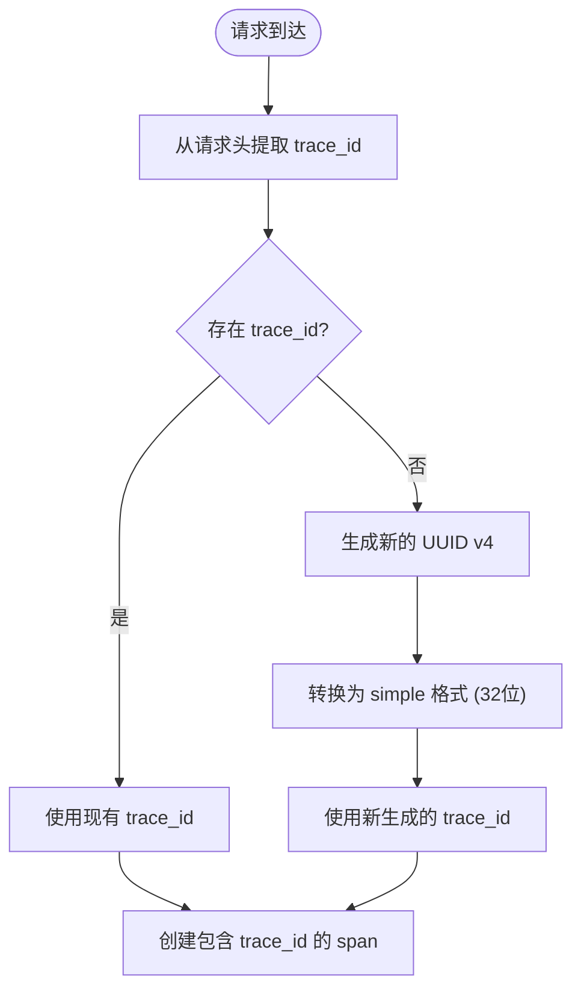
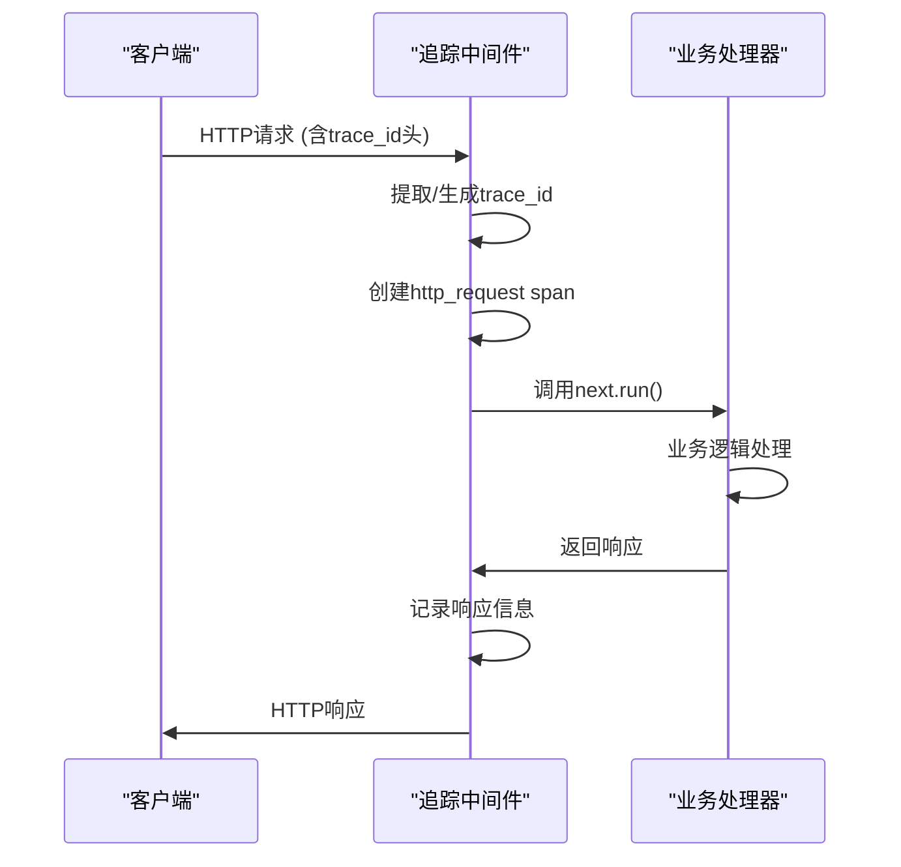
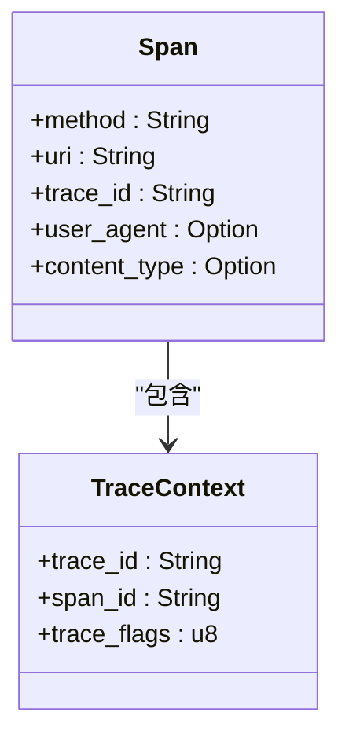
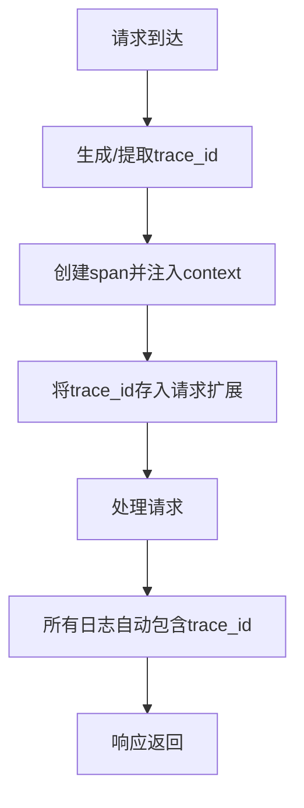

# 链路追踪

<cite>
**本文档引用的文件**
- [tracing_middleware.rs](file://crates/rcoder/src/middleware/tracing_middleware.rs)
- [tracing_middleware.rs](file://crates/agent_runner/src/middleware/tracing_middleware.rs)
- [main.rs](file://crates/rcoder/src/main.rs)
- [main.rs](file://crates/agent_runner/src/main.rs)
- [router.rs](file://crates/rcoder/src/router.rs)
- [router.rs](file://crates/agent_runner/src/router.rs)
- [Cargo.toml](file://Cargo.toml)
- [Cargo.lock](file://Cargo.lock)
</cite>

## 目录
1. [引言](#引言)
2. [trace_id生成与传播机制](#trace_id生成与传播机制)
3. [追踪中间件实现](#追踪中间件实现)
4. [OpenTelemetry集成配置](#opentelemetry集成配置)
5. [日志系统协同工作](#日志系统协同工作)
6. [常见问题与解决方案](#常见问题与解决方案)
7. [性能优化建议](#性能优化建议)
8. [结论](#结论)

## 引言

链路追踪是分布式系统中至关重要的可观测性工具，它能够帮助开发者理解请求在系统中的完整执行路径。本项目基于OpenTelemetry实现了完整的分布式追踪系统，通过`tracing_middleware_handler`中间件为每个HTTP请求生成和传播`trace_id`，并将其与日志系统深度集成。该系统支持跨服务的请求追踪，确保在复杂的微服务架构中能够准确地定位问题和分析性能瓶颈。

**本文档引用的文件**
- [tracing_middleware.rs](file://crates/rcoder/src/middleware/tracing_middleware.rs)
- [tracing_middleware.rs](file://crates/agent_runner/src/middleware/tracing_middleware.rs)

## trace_id生成与传播机制

### trace_id生成策略

系统采用UUID v4作为`trace_id`的生成策略，确保了全局唯一性和高熵值。在`tracing_middleware.rs`文件中，`generate_trace_id()`函数通过`uuid::Uuid::new_v4().simple().to_string()`生成32位无连字符的UUID字符串。这种格式既保证了唯一性，又便于日志记录和查询。

**图示来源**
- [tracing_middleware.rs](file://crates/rcoder/src/middleware/tracing_middleware.rs#L44-L47)

### 请求头提取逻辑

系统支持从多种标准请求头中提取`trace_id`，包括`x-trace-id`、`x-request-id`、`traceparent`和`x-correlation-id`。`extract_trace_id_from_headers()`函数遍历这些头字段，优先使用最先找到的有效值。这种多头支持的设计提高了系统的兼容性，能够与不同的追踪系统和代理工具无缝集成。

**本文档引用的文件**
- [tracing_middleware.rs](file://crates/rcoder/src/middleware/tracing_middleware.rs#L49-L69)

## 追踪中间件实现

### tracing_middleware_handler完整流程

`tracing_middleware_handler`是链路追踪的核心处理函数，它在请求处理管道中扮演着关键角色。该函数首先从请求头中提取或生成`trace_id`，然后创建一个包含丰富上下文信息的span。通过`info_span!`宏，系统记录了HTTP方法、URI、用户代理、内容类型等关键信息。

**图示来源**
- [tracing_middleware.rs](file://crates/rcoder/src/middleware/tracing_middleware.rs#L72-L130)

### info_span!宏的使用

`info_span!`宏用于创建结构化的日志span，它不仅记录了基本的请求信息，还包含了`trace_id`作为核心标识。在中间件中，span的创建包含了HTTP方法、URI、`trace_id`、用户代理和内容类型等字段，为后续的调试和分析提供了丰富的上下文信息。

**图示来源**
- [tracing_middleware.rs](file://crates/rcoder/src/middleware/tracing_middleware.rs#L86-L93)

### .instrument(span)调用

`.instrument(span)`是tracing框架的关键特性，它将异步代码块与创建的span关联起来。在中间件中，整个请求处理过程被包裹在`.instrument(span)`中，确保了所有在该代码块内生成的日志都会自动关联到同一个`trace_id`下。这种设计实现了零侵入式的追踪集成，业务代码无需关心追踪细节。

**本文档引用的文件**
- [tracing_middleware.rs](file://crates/rcoder/src/middleware/tracing_middleware.rs#L126-L127)

## OpenTelemetry集成配置

### 上下文注入配置

系统通过`opentelemetry::global::set_text_map_propagator()`设置了全局的文本映射传播器，使用`TraceContextPropagator::new()`来处理W3C Trace Context标准。这确保了`traceparent`头能够在服务间正确传播，实现了跨服务的链路追踪。

**本文档引用的文件**
- [main.rs](file://crates/rcoder/src/main.rs#L302-L305)

### Jaeger后端集成

通过Cargo.toml中的依赖配置，系统集成了Jaeger作为追踪后端。`cf-rustracing-jaeger`依赖在Cargo.lock中被明确列出，表明系统支持将追踪数据发送到Jaeger服务器进行可视化和分析。这种集成使得开发者可以通过Jaeger UI直观地查看请求的完整调用链路。

**本文档引用的文件**
- [Cargo.toml](file://Cargo.toml)
- [Cargo.lock](file://Cargo.lock#L969-L983)

## 日志系统协同工作

### trace_id一致性保证

系统通过多种机制确保`trace_id`在所有日志条目中保持一致。首先，在请求开始时生成的`trace_id`被存储在请求扩展中（`req.extensions_mut().insert(trace_id.clone())`），可供后续处理器访问。其次，通过`.instrument(span)`确保了整个请求处理过程中的所有日志都自动关联到同一个span。

**图示来源**
- [tracing_middleware.rs](file://crates/rcoder/src/middleware/tracing_middleware.rs#L106-L109)

### JSON日志格式

系统配置了JSON格式的日志输出，便于后续的集中式日志分析。通过`fmt::layer().json()`设置，所有日志以结构化JSON格式写入文件，包含时间戳、级别、目标、消息和自定义字段（如`trace_id`）。这种格式与ELK或Loki等日志系统完美兼容。

**本文档引用的文件**
- [main.rs](file://crates/rcoder/src/main.rs#L291-L297)

## 常见问题与解决方案

### trace_id丢失问题

`trace_id`丢失通常发生在异步任务或跨线程调用中。解决方案是确保在任务创建时正确传播OpenTelemetry上下文。对于`!Send`类型的值，可以使用`tokio::task::LocalSet`来确保它们在同一个线程中执行，避免上下文丢失。

### 跨服务传播失败

跨服务传播失败可能是由于代理或网关修改了请求头。确保`x-trace-id`、`traceparent`等头字段在服务间传递时未被过滤或修改。在Kubernetes环境中，检查Ingress控制器的配置，确保追踪头被正确转发。

**本文档引用的文件**
- [tracing_middleware.rs](file://crates/rcoder/src/middleware/tracing_middleware.rs)

## 性能优化建议

### 采样策略

在高流量场景下，建议配置合理的采样策略以减少追踪数据量。可以通过设置`EnvFilter`来控制追踪的详细程度，例如只对错误请求或特定路径进行全量追踪，对正常请求进行低频采样。

### span开销控制

避免在热点路径上创建过多细粒度的span，这会增加性能开销。建议只在关键业务逻辑和外部调用处创建span。对于高频调用的简单操作，可以考虑使用计时器而非完整的span。

**本文档引用的文件**
- [main.rs](file://crates/rcoder/src/main.rs#L309-L311)

## 结论

本项目的链路追踪实现基于OpenTelemetry标准，通过精心设计的中间件和配置，实现了高效、可靠的分布式追踪功能。`trace_id`的生成和传播机制确保了请求的完整可追溯性，与日志系统的深度集成提供了强大的调试能力。对于初学者，系统提供了清晰的`trace_id`生命周期；对于专家，提供了丰富的性能优化选项。这种分层的设计既满足了基本的可观测性需求，又为高级用例留下了扩展空间。