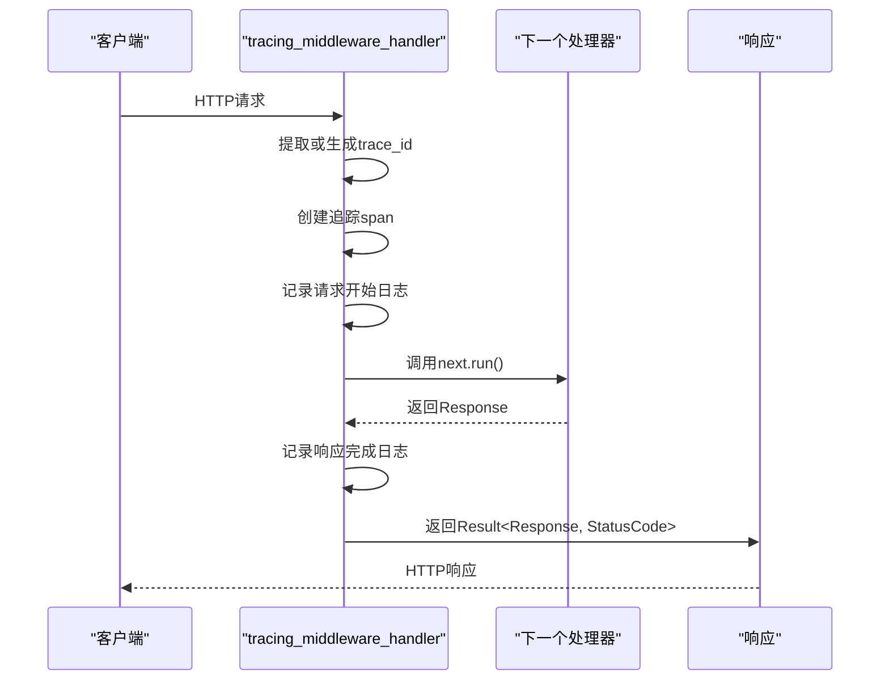
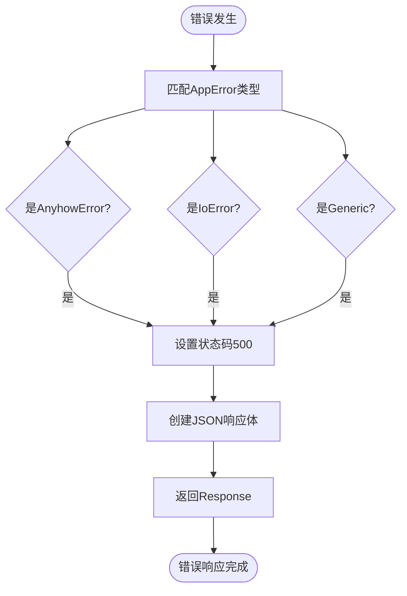
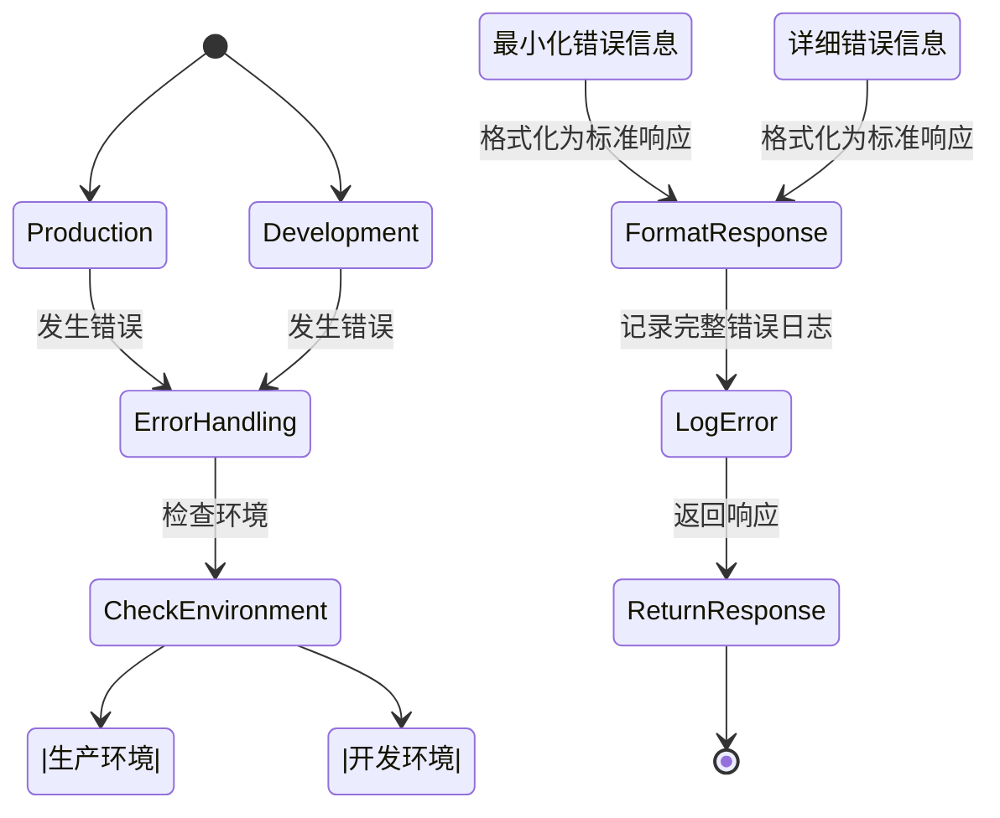
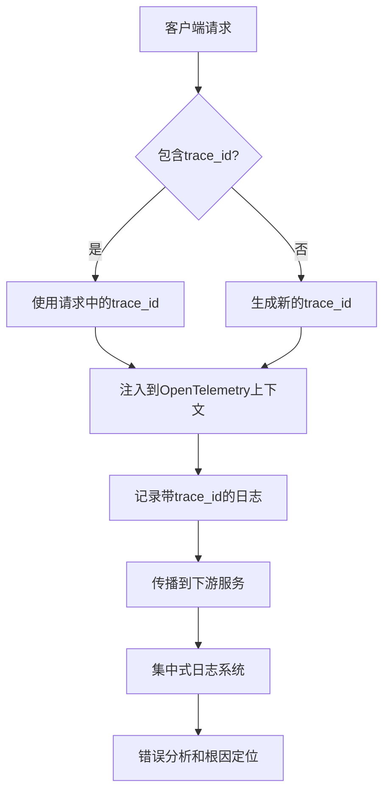
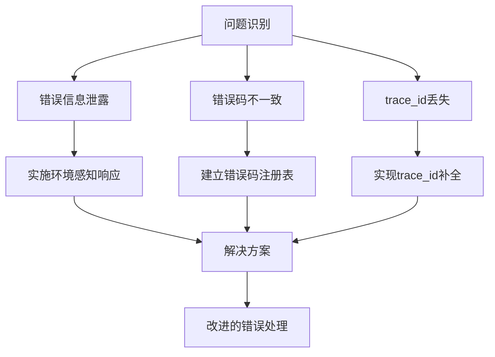
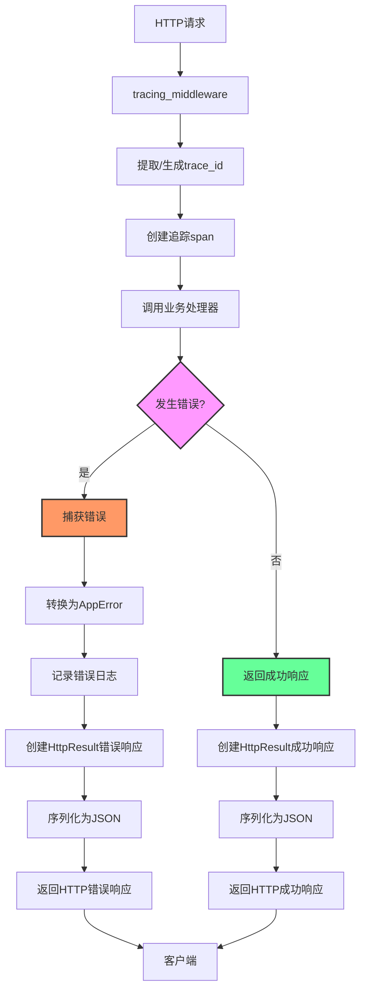

# 错误处理

<cite>
**本文档中引用的文件**  
- [app_error.rs](file://crates/shared_types/src/model/app_error.rs)
- [http_result.rs](file://crates/shared_types/src/model/http_result.rs)
- [tracing_middleware.rs](file://crates/agent_runner/src/middleware/tracing_middleware.rs)
- [tracing_middleware.rs](file://crates/rcoder/src/middleware/tracing_middleware.rs)
- [chat_handler.rs](file://crates/agent_runner/src/handler/chat_handler.rs)
- [agent_cancel_handler.rs](file://crates/agent_runner/src/handler/agent_cancel_handler.rs)
- [lib.rs](file://crates/shared_types/src/lib.rs)
</cite>

## 目录
1. [简介](#简介)
2. [核心错误类型](#核心错误类型)
3. [HTTP中间件错误处理](#http中间件错误处理)
4. [应用级错误结构](#应用级错误结构)
5. [错误传播与日志记录](#错误传播与日志记录)
6. [错误分类与状态码映射](#错误分类与状态码映射)
7. [错误信息暴露策略](#错误信息暴露策略)
8. [可观测性集成](#可观测性集成)
9. [常见问题与解决方案](#常见问题与解决方案)
10. [错误处理流程图](#错误处理流程图)
11. [监控与告警最佳实践](#监控与告警最佳实践)

## 简介
本文档全面解释系统中的错误处理机制，重点描述在 `tracing_middleware_handler` 中如何捕获和处理HTTP中间件错误，包括 `Result<Response, StatusCode>` 的返回模式。结合 `shared_types` 中的 `AppError` 模型，说明应用级错误的结构设计和序列化方式。文档包括来自实际代码库的具体示例，如中间件中错误的传播和日志记录，以及错误处理与可观测性的集成。

## 核心错误类型

系统采用分层错误处理架构，主要包含两种核心错误类型：`AppError` 和 `HttpResult`。`AppError` 作为应用级错误的统一抽象，封装了不同来源的错误，而 `HttpResult` 则是标准化的HTTP响应格式，用于向客户端返回一致的错误信息。

```mermaid
classDiagram
class AppError {
+AnyhowError(anyhow : : Error)
+IoError(std : : io : : Error)
+Generic(String)
+generic(msg : impl Into<String>) AppError
+internal_server_error(msg : &str) AppError
+validation_error(msg : &str) AppError
}
class HttpResult~T~ {
+code : String
+message : String
+data : Option~T~
+tid : Option~String~
+success : bool
+success(data : T) HttpResult~T~
+error(code : &str, message : &str) HttpResult~T~
+internal_error(message : &str) HttpResult~T~
}
AppError --> "implements" axum : : response : : IntoResponse
HttpResult~T~ --> "implements" axum : : response : : IntoResponse
HttpResult~T~ --> "serializes to" JSON
```

**图源**
- [app_error.rs](file://crates/shared_types/src/model/app_error.rs#L3-L30)
- [http_result.rs](file://crates/shared_types/src/model/http_result.rs#L24-L58)

**本节源**
- [app_error.rs](file://crates/shared_types/src/model/app_error.rs#L1-L64)
- [http_result.rs](file://crates/shared_types/src/model/http_result.rs#L1-L103)

## HTTP中间件错误处理

`tracing_middleware_handler` 是系统中的核心HTTP中间件，负责请求追踪和错误处理。该中间件采用 `Result<Response, StatusCode>` 的返回模式，确保所有HTTP请求都能被正确处理或以适当的HTTP状态码返回错误。

中间件的主要功能包括：
1. 为每个HTTP请求自动生成 `trace_id`
2. 创建请求span用于日志跟踪
3. 记录请求和响应信息
4. 自动将 `trace_id` 注入到OpenTelemetry上下文中



**图源**
- [tracing_middleware.rs](file://crates/agent_runner/src/middleware/tracing_middleware.rs#L72-L130)
- [tracing_middleware.rs](file://crates/rcoder/src/middleware/tracing_middleware.rs#L72-L130)

**本节源**
- [tracing_middleware.rs](file://crates/agent_runner/src/middleware/tracing_middleware.rs#L1-L179)
- [tracing_middleware.rs](file://crates/rcoder/src/middleware/tracing_middleware.rs#L1-L179)

## 应用级错误结构

`AppError` 枚举是系统中应用级错误的核心数据结构，定义了三种主要的错误类型：

1. **AnyhowError**: 包装 `anyhow::Error` 类型，用于处理任意错误
2. **IoError**: 包装标准库的 `std::io::Error`，用于处理I/O操作错误
3. **Generic**: 通用错误类型，用于表示自定义错误消息

`AppError` 实现了 `axum::response::IntoResponse` trait，使其可以直接作为HTTP响应返回。当错误发生时，系统会根据错误类型映射到相应的HTTP状态码，并生成结构化的JSON响应。



**图源**
- [app_error.rs](file://crates/shared_types/src/model/app_error.rs#L33-L56)

**本节源**
- [app_error.rs](file://crates/shared_types/src/model/app_error.rs#L1-L64)

## 错误传播与日志记录

系统中的错误传播遵循Rust的错误处理最佳实践，使用 `?` 操作符进行错误传播，并在适当的位置使用 `map_err` 进行错误转换。这种模式确保了错误信息能够在调用栈中正确传递，同时保持代码的简洁性。

在日志记录方面，系统使用 `tracing` 库进行结构化日志记录。每个错误都会被记录为包含 `trace_id` 的结构化日志条目，便于后续的错误追踪和分析。

```rust
// 示例：错误传播和日志记录
let project_workspace = get_project_workspace(&project_id).await?;
```

```rust
// 示例：错误转换
.map_err(|e| anyhow::anyhow!(e))?;
```

```rust
// 示例：错误日志记录
error!(
    "❌ 收到 agent 执行结果失败: {}",
    e
);
```

**本节源**
- [chat_handler.rs](file://crates/agent_runner/src/handler/chat_handler.rs#L261-L261)
- [chat_handler.rs](file://crates/agent_runner/src/handler/chat_handler.rs#L283-L283)
- [chat_handler.rs](file://crates/agent_runner/src/handler/chat_handler.rs#L312-L316)

## 错误分类与状态码映射

系统采用统一的错误分类和状态码映射策略，确保错误处理的一致性。错误分类主要基于错误的严重程度和来源：

1. **客户端错误** (4xx): 由客户端请求引起的错误，如参数验证失败
2. **服务器错误** (5xx): 由服务器内部问题引起的错误，如数据库连接失败
3. **业务逻辑错误**: 特定于业务场景的错误，使用自定义错误码

状态码映射遵循HTTP标准，同时使用自定义错误码提供更详细的错误信息。例如，`5000` 表示内部服务器错误，`9010` 表示Agent正在执行任务等。

```mermaid
erDiagram
ERROR_CATEGORY {
string code PK
string name
string description
int http_status
string severity
}
ERROR_CODE {
string code PK
string category FK
string message
string solution
datetime created_at
}
ERROR_CATEGORY ||--o{ ERROR_CODE : contains
ERROR_CATEGORY {
"CLIENT_ERROR" "客户端错误" "请求参数错误等" 400 "HIGH"
"SERVER_ERROR" "服务器错误" "内部服务错误" 500 "CRITICAL"
"BUSINESS_ERROR" "业务错误" "业务逻辑错误" 400 "MEDIUM"
}
ERROR_CODE {
"0001" "BUSINESS_ERROR" "停止智能体执行失败" "重试或联系管理员" "2024-01-01"
"5000" "SERVER_ERROR" "内部服务器错误" "检查服务日志" "2024-01-01"
"9010" "BUSINESS_ERROR" "Agent正在执行任务" "等待当前任务完成" "2024-01-01"
"PROMPT001" "SERVER_ERROR" "Agent处理失败" "检查Agent状态" "2024-01-01"
}
```

**图源**
- [http_result.rs](file://crates/shared_types/src/model/http_result.rs#L56-L57)
- [agent_cancel_handler.rs](file://crates/agent_runner/src/handler/agent_cancel_handler.rs#L213-L213)
- [chat_handler.rs](file://crates/agent_runner/src/handler/chat_handler.rs#L218-L218)

**本节源**
- [http_result.rs](file://crates/shared_types/src/model/http_result.rs#L46-L58)
- [agent_cancel_handler.rs](file://crates/agent_runner/src/handler/agent_cancel_handler.rs#L134-L138)
- [chat_handler.rs](file://crates/agent_runner/src/handler/chat_handler.rs#L181-L184)

## 错误信息暴露策略

系统采用谨慎的错误信息暴露策略，平衡了调试需求和安全考虑。错误信息暴露遵循以下原则：

1. **生产环境最小化暴露**: 在生产环境中，只暴露必要的错误信息，避免泄露敏感信息
2. **开发环境详细暴露**: 在开发环境中，提供详细的错误信息，便于调试
3. **结构化错误响应**: 所有错误都以统一的JSON格式返回，包含错误码、消息和trace_id

`HttpResult` 结构的设计体现了这一策略，它包含 `code`、`message`、`data`、`tid` 和 `success` 字段，确保客户端能够获得足够的信息来处理错误，同时不会暴露过多的内部细节。



**图源**
- [http_result.rs](file://crates/shared_types/src/model/http_result.rs#L24-L33)
- [app_error.rs](file://crates/shared_types/src/model/app_error.rs#L33-L56)

**本节源**
- [http_result.rs](file://crates/shared_types/src/model/http_result.rs#L1-L103)

## 可观测性集成

错误处理与系统的可观测性深度集成，主要体现在以下几个方面：

1. **分布式追踪**: 每个请求都分配唯一的 `trace_id`，贯穿整个请求处理链路
2. **结构化日志**: 所有错误日志都包含 `trace_id`，便于跨服务追踪
3. **指标监控**: 错误发生时记录相应的指标，用于监控和告警

`trace_id` 的生成和传播机制确保了在复杂的微服务架构中，能够快速定位和诊断问题。系统优先从请求头中提取 `trace_id`，如果不存在则生成新的UUID作为 `trace_id`。



**图源**
- [tracing_middleware.rs](file://crates/agent_runner/src/middleware/tracing_middleware.rs#L80-L83)
- [http_result.rs](file://crates/shared_types/src/model/http_result.rs#L9-L22)
- [http_result.rs](file://crates/shared_types/src/model/http_result.rs#L51-L51)

**本节源**
- [tracing_middleware.rs](file://crates/agent_runner/src/middleware/tracing_middleware.rs#L1-L179)
- [http_result.rs](file://crates/shared_types/src/model/http_result.rs#L1-L103)

## 常见问题与解决方案

在实际使用中，可能会遇到一些常见的错误处理问题，以下是这些问题及其解决方案：

### 错误信息泄露
**问题**: 生产环境中暴露了过多的内部错误细节，可能导致安全风险。
**解决方案**: 实现环境感知的错误响应策略，在生产环境中只返回通用的错误消息，详细的错误信息仅在开发环境中暴露。

### 错误码不一致
**问题**: 不同的处理器使用不同的错误码，导致客户端难以处理。
**解决方案**: 建立统一的错误码注册表，所有错误码都从中心化的位置获取，确保一致性。

### trace_id丢失
**问题**: 在某些异步操作中，`trace_id` 可能丢失，导致无法完整追踪请求链路。
**解决方案**: 在 `HttpResult` 的 `into_response` 实现中添加 `trace_id` 的补全逻辑，确保即使在中间件之外创建的响应也能包含 `trace_id`。



**图源**
- [http_result.rs](file://crates/shared_types/src/model/http_result.rs#L82-L84)
- [app_error.rs](file://crates/shared_types/src/model/app_error.rs#L17-L29)

**本节源**
- [http_result.rs](file://crates/shared_types/src/model/http_result.rs#L78-L85)
- [app_error.rs](file://crates/shared_types/src/model/app_error.rs#L16-L30)

## 错误处理流程图

以下是系统错误处理的完整流程图，展示了从错误发生到最终响应的整个过程：



**图源**
- [tracing_middleware.rs](file://crates/agent_runner/src/middleware/tracing_middleware.rs#L72-L130)
- [app_error.rs](file://crates/shared_types/src/model/app_error.rs#L33-L56)
- [http_result.rs](file://crates/shared_types/src/model/http_result.rs#L77-L102)

**本节源**
- [tracing_middleware.rs](file://crates/agent_runner/src/middleware/tracing_middleware.rs#L72-L130)
- [app_error.rs](file://crates/shared_types/src/model/app_error.rs#L33-L56)
- [http_result.rs](file://crates/shared_types/src/model/http_result.rs#L77-L102)

## 监控与告警最佳实践

为了有效监控和告警系统中的错误，建议采用以下最佳实践：

1. **基于trace_id的根因分析**: 利用 `trace_id` 作为关键字，在日志系统中搜索完整的请求链路，快速定位问题根源。
2. **错误率监控**: 监控不同错误码的发生频率，设置告警阈值。
3. **P99延迟监控**: 监控错误响应的P99延迟，确保错误处理不会成为性能瓶颈。
4. **错误分类仪表板**: 创建按错误类型、服务、时间维度分类的仪表板，便于趋势分析。

通过这些实践，可以建立一个健壮的错误监控体系，及时发现和解决系统中的问题。

**本节源**
- [tracing_middleware.rs](file://crates/agent_runner/src/middleware/tracing_middleware.rs#L98-L103)
- [tracing_middleware.rs](file://crates/agent_runner/src/middleware/tracing_middleware.rs#L115-L122)