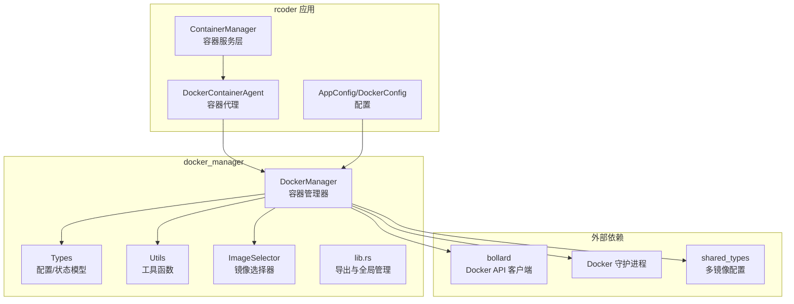
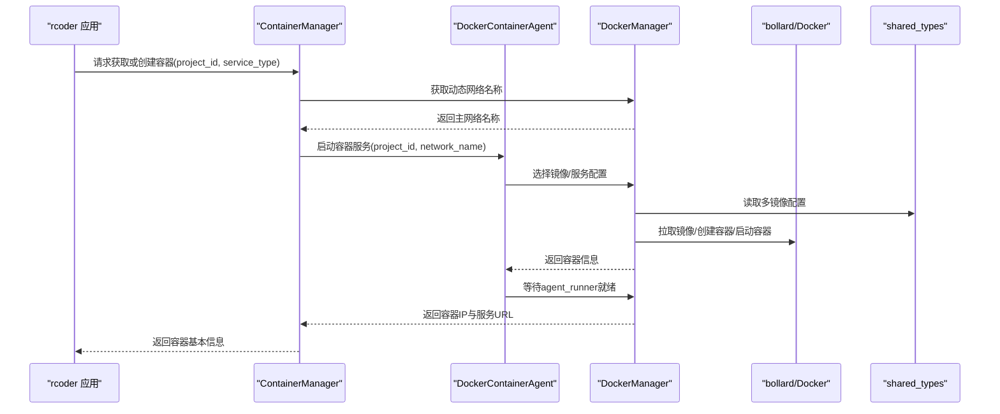
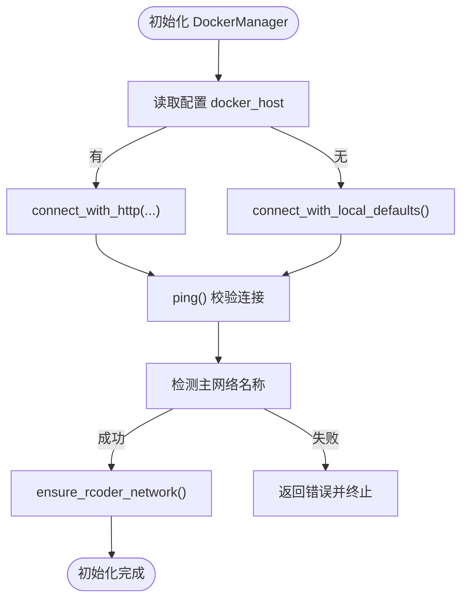
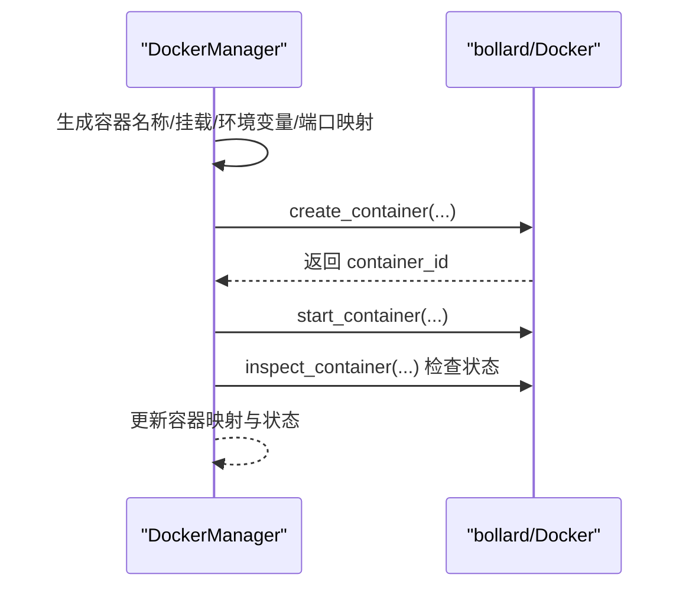
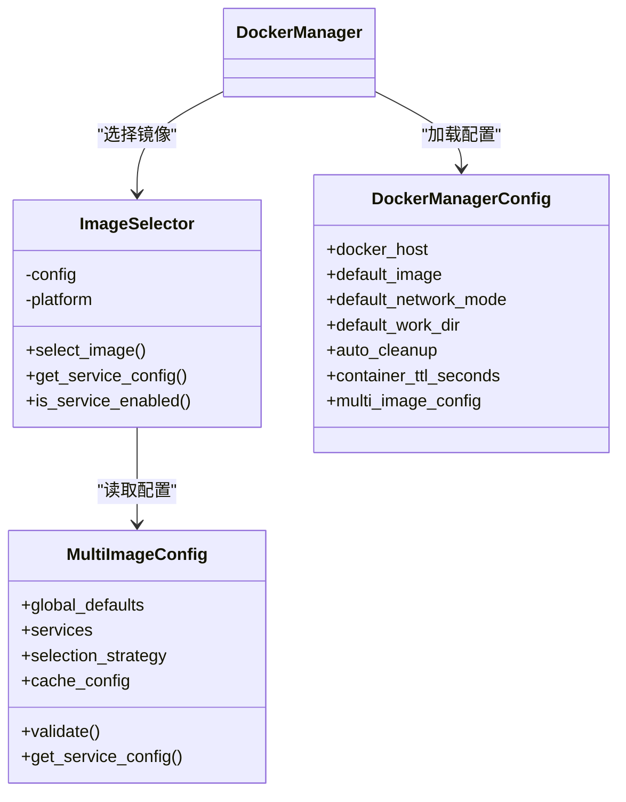
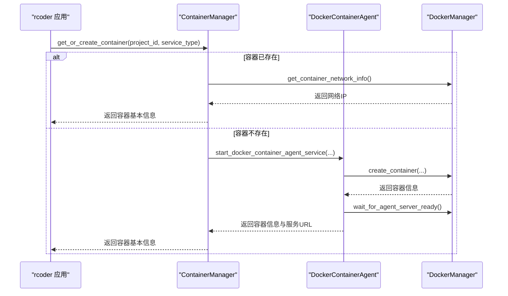
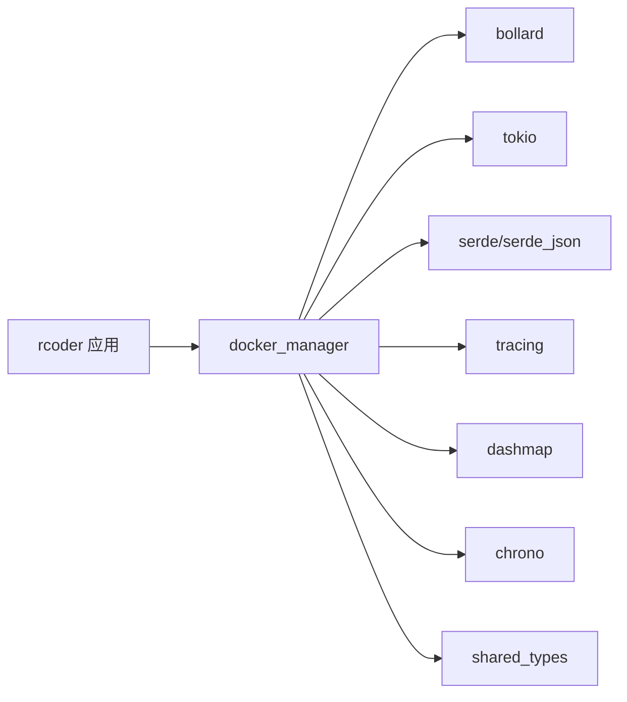

# Docker集成

<cite>
**本文引用的文件**
- [crates/docker_manager/src/lib.rs](file://crates/docker_manager/src/lib.rs)
- [crates/docker_manager/src/manager.rs](file://crates/docker_manager/src/manager.rs)
- [crates/docker_manager/src/types.rs](file://crates/docker_manager/src/types.rs)
- [crates/docker_manager/src/utils.rs](file://crates/docker_manager/src/utils.rs)
- [crates/docker_manager/src/image_selector.rs](file://crates/docker_manager/src/image_selector.rs)
- [crates/docker_manager/Cargo.toml](file://crates/docker_manager/Cargo.toml)
- [crates/rcoder/src/proxy_agent/docker_container_agent.rs](file://crates/rcoder/src/proxy_agent/docker_container_agent.rs)
- [crates/rcoder/src/service/container_manager.rs](file://crates/rcoder/src/service/container_manager.rs)
- [crates/rcoder/src/config.rs](file://crates/rcoder/src/config.rs)
- [crates/shared_types/src/multi_image_config.rs](file://crates/shared_types/src/multi_image_config.rs)
- [Cargo.lock](file://Cargo.lock)
</cite>

## 目录
1. [简介](#简介)
2. [项目结构](#项目结构)
3. [核心组件](#核心组件)
4. [架构总览](#架构总览)
5. [详细组件分析](#详细组件分析)
6. [依赖关系分析](#依赖关系分析)
7. [性能考量](#性能考量)
8. [故障排查指南](#故障排查指南)
9. [结论](#结论)
10. [附录](#附录)

## 简介
本文件围绕 docker_manager crate 与 bollard 库的集成，系统阐述其如何通过 Docker 守护进程通信、客户端初始化、连接配置与 API 调用模式，实现容器的创建、启动与状态查询。文档还结合 rcoder 主应用与 agent_runner 的集成方式，说明会话上下文传递与生命周期协调；并提供权限配置、Docker 套接字访问、网络模式选择等常见问题的解决方案与生产环境安全配置建议。

## 项目结构
docker_manager crate 位于 crates/docker_manager，核心职责是面向 rcoder 的容器生命周期管理与镜像选择。rcoder 主应用通过 proxy_agent 与 service 层协作，驱动 docker_manager 完成容器的动态创建与网络通信。

图表来源
- [crates/docker_manager/src/manager.rs](file://crates/docker_manager/src/manager.rs#L35-L74)
- [crates/docker_manager/src/types.rs](file://crates/docker_manager/src/types.rs#L1-L120)
- [crates/docker_manager/src/utils.rs](file://crates/docker_manager/src/utils.rs#L1-L120)
- [crates/docker_manager/src/image_selector.rs](file://crates/docker_manager/src/image_selector.rs#L1-L60)
- [crates/rcoder/src/service/container_manager.rs](file://crates/rcoder/src/service/container_manager.rs#L150-L220)
- [crates/rcoder/src/proxy_agent/docker_container_agent.rs](file://crates/rcoder/src/proxy_agent/docker_container_agent.rs#L1-L120)
- [crates/rcoder/src/config.rs](file://crates/rcoder/src/config.rs#L80-L120)
- [crates/shared_types/src/multi_image_config.rs](file://crates/shared_types/src/multi_image_config.rs#L1-L60)

章节来源
- [crates/docker_manager/src/lib.rs](file://crates/docker_manager/src/lib.rs#L1-L120)
- [crates/docker_manager/src/manager.rs](file://crates/docker_manager/src/manager.rs#L35-L74)
- [crates/rcoder/src/service/container_manager.rs](file://crates/rcoder/src/service/container_manager.rs#L150-L220)

## 核心组件
- DockerManager：封装 bollard 客户端，负责容器创建、启动、状态查询、日志获取、网络检测与镜像拉取等。
- DockerContainerConfig/DockerContainerInfo：容器配置与运行信息的数据模型。
- DockerManagerConfig：管理器配置，包含默认镜像、网络模式、工作目录、平台、自动清理等。
- DockerUtils：平台检测、镜像兼容性判断、配置从环境变量加载、容器命名等工具。
- ImageSelector：基于多镜像配置选择镜像与服务配置，支持按服务类型与平台选择。
- 全局管理：提供全局 DockerManager 单例初始化与获取，简化跨模块使用。

章节来源
- [crates/docker_manager/src/manager.rs](file://crates/docker_manager/src/manager.rs#L35-L120)
- [crates/docker_manager/src/types.rs](file://crates/docker_manager/src/types.rs#L1-L120)
- [crates/docker_manager/src/utils.rs](file://crates/docker_manager/src/utils.rs#L1-L120)
- [crates/docker_manager/src/image_selector.rs](file://crates/docker_manager/src/image_selector.rs#L1-L60)
- [crates/docker_manager/src/lib.rs](file://crates/docker_manager/src/lib.rs#L143-L211)

## 架构总览
docker_manager 通过 bollard 与 Docker 守护进程交互，采用“配置驱动 + 多镜像选择 + 动态网络”的设计，确保容器在 rcoder 生态中可复用、可扩展且安全可控。

图表来源
- [crates/rcoder/src/service/container_manager.rs](file://crates/rcoder/src/service/container_manager.rs#L150-L220)
- [crates/rcoder/src/proxy_agent/docker_container_agent.rs](file://crates/rcoder/src/proxy_agent/docker_container_agent.rs#L1-L120)
- [crates/docker_manager/src/manager.rs](file://crates/docker_manager/src/manager.rs#L100-L220)
- [crates/shared_types/src/multi_image_config.rs](file://crates/shared_types/src/multi_image_config.rs#L1-L60)

## 详细组件分析

### DockerManager：客户端初始化与连接配置
- 客户端初始化
  - 若配置提供 docker_host，则使用 HTTP 连接；否则使用本地默认连接。
  - 初始化后执行 ping 校验，确保与 Docker 守护进程连通。
- 主网络检测
  - 通过静态方法检测主网络名称，若失败则中断初始化，保证后续网络连接的可靠性。
- 网络与安全
  - 默认连接到动态检测的主网络，避免硬编码网络名。
  - 容器安全：移除 NET_RAW/NET_ADMIN 能力，禁用特权模式，降低容器逃逸风险。
- 资源限制
  - 支持内存、swap、CPU（nano_cpus）限制，按配置注入到 HostConfig。

图表来源
- [crates/docker_manager/src/manager.rs](file://crates/docker_manager/src/manager.rs#L35-L74)
- [crates/docker_manager/src/manager.rs](file://crates/docker_manager/src/manager.rs#L51-L74)

章节来源
- [crates/docker_manager/src/manager.rs](file://crates/docker_manager/src/manager.rs#L35-L74)

### 容器创建流程：创建、启动与健康检查
- 名称与挂载
  - 使用统一容器命名规则，便于管理与调试。
  - 绑定宿主机路径到容器路径，支持额外挂载点与只读挂载。
- 环境变量与端口映射
  - 环境变量以“键=值”形式注入；端口映射支持动态分配。
- 网络连接
  - 优先连接到主网络，支持 host 模式；通过 NetworkingConfig 指定网络别名。
- 启动与健康检查
  - 创建后立即启动容器，短暂等待后检查容器状态，确保运行正常。
- 资源限制与安全
  - 注入资源限制；默认移除敏感能力，禁用特权模式。

图表来源
- [crates/docker_manager/src/manager.rs](file://crates/docker_manager/src/manager.rs#L81-L294)
- [crates/docker_manager/src/manager.rs](file://crates/docker_manager/src/manager.rs#L758-L800)

章节来源
- [crates/docker_manager/src/manager.rs](file://crates/docker_manager/src/manager.rs#L81-L294)
- [crates/docker_manager/src/manager.rs](file://crates/docker_manager/src/manager.rs#L758-L800)

### 镜像选择与配置加载
- 多镜像配置
  - 通过 MultiImageConfig 定义全局默认与服务特定镜像，支持 ARM64/AMD64 平台选择。
- 镜像选择器
  - ImageSelector 强制明确服务类型，按服务配置优先级选择镜像；必要时回退到全局默认。
- 配置来源
  - DockerManagerConfig 可从环境变量与 rcoder 配置加载，支持镜像、网络、工作目录、自动清理等参数。

图表来源
- [crates/shared_types/src/multi_image_config.rs](file://crates/shared_types/src/multi_image_config.rs#L1-L120)
- [crates/docker_manager/src/image_selector.rs](file://crates/docker_manager/src/image_selector.rs#L1-L120)
- [crates/docker_manager/src/types.rs](file://crates/docker_manager/src/types.rs#L175-L232)

章节来源
- [crates/shared_types/src/multi_image_config.rs](file://crates/shared_types/src/multi_image_config.rs#L1-L120)
- [crates/docker_manager/src/image_selector.rs](file://crates/docker_manager/src/image_selector.rs#L1-L120)
- [crates/docker_manager/src/utils.rs](file://crates/docker_manager/src/utils.rs#L172-L244)

### rcoder 集成：会话上下文与生命周期
- 会话上下文传递
  - ContainerManager 通过 project_id 标识容器，返回包含容器ID、名称、IP、端口、状态与服务URL的基本信息。
- 生命周期协调
  - DockerContainerAgent 在创建容器后等待 agent_runner 就绪，失败时自动销毁容器，避免资源泄漏。
  - rcoder 侧通过 get_or_create_container 与 create_container_for_request 统一管理容器生命周期。

图表来源
- [crates/rcoder/src/service/container_manager.rs](file://crates/rcoder/src/service/container_manager.rs#L150-L220)
- [crates/rcoder/src/proxy_agent/docker_container_agent.rs](file://crates/rcoder/src/proxy_agent/docker_container_agent.rs#L1-L120)
- [crates/docker_manager/src/manager.rs](file://crates/docker_manager/src/manager.rs#L296-L372)

章节来源
- [crates/rcoder/src/service/container_manager.rs](file://crates/rcoder/src/service/container_manager.rs#L150-L220)
- [crates/rcoder/src/proxy_agent/docker_container_agent.rs](file://crates/rcoder/src/proxy_agent/docker_container_agent.rs#L1-L120)

## 依赖关系分析
- 外部依赖
  - bollard：Docker API 客户端，版本在 Cargo.lock 中记录。
  - tokio/futures-serde/tracing/dashmap/chrono/uuid 等：异步运行时、序列化、日志、并发容器与时序。
- 内部依赖
  - shared_types：提供多镜像配置与服务类型定义，支撑镜像选择与挂载配置。
  - rcoder 应用：通过 proxy_agent 与 service 层调用 docker_manager。

图表来源
- [crates/docker_manager/Cargo.toml](file://crates/docker_manager/Cargo.toml#L1-L40)
- [Cargo.lock](file://Cargo.lock#L805-L869)

章节来源
- [crates/docker_manager/Cargo.toml](file://crates/docker_manager/Cargo.toml#L1-L40)
- [Cargo.lock](file://Cargo.lock#L805-L869)

## 性能考量
- 并发与映射
  - 使用 DashMap 存储容器映射，支持高并发读写，减少锁竞争。
- 网络与I/O
  - 通过动态网络检测与容器内部DNS解析，避免宿主机端口映射带来的额外开销。
- 镜像拉取
  - 拉取镜像采用流式处理，边拉取边记录进度，避免阻塞主线程。
- 资源限制
  - 合理设置 CPU/内存/swap，避免容器争抢导致的抖动。

章节来源
- [crates/docker_manager/src/manager.rs](file://crates/docker_manager/src/manager.rs#L167-L175)
- [crates/docker_manager/src/manager.rs](file://crates/docker_manager/src/manager.rs#L545-L585)

## 故障排查指南
- Docker 连接失败
  - 现象：初始化时 ping 失败或网络检测失败。
  - 排查：确认 DOCKER_HOST 环境变量、Docker 守护进程状态、socket 权限。
  - 参考路径：[DockerManager::new](file://crates/docker_manager/src/manager.rs#L35-L74)
- 镜像拉取失败
  - 现象：create_container 中拉取镜像报错。
  - 排查：检查网络、镜像地址、认证信息；查看拉取进度日志。
  - 参考路径：[ensure_image_exists](file://crates/docker_manager/src/manager.rs#L545-L585)
- 容器启动后立即退出
  - 现象：check_container_health 报错，退出码非零。
  - 排查：查看容器日志、环境变量、挂载路径权限、资源限制。
  - 参考路径：[check_container_health](file://crates/docker_manager/src/manager.rs#L758-L800)
- 端口冲突或不可用
  - 现象：宿主机端口映射失败。
  - 排查：使用端口管理器分配端口或改为内部网络通信。
  - 参考路径：[PortManager](file://crates/rcoder/src/proxy_agent/port_manager.rs#L1-L96)
- 网络连接异常
  - 现象：容器未连接到期望网络。
  - 排查：确认主网络名称检测结果、容器网络别名、Docker Compose 项目名称。
  - 参考路径：[get_dynamic_network_name](file://crates/rcoder/src/service/container_manager.rs#L142-L151)

章节来源
- [crates/docker_manager/src/manager.rs](file://crates/docker_manager/src/manager.rs#L35-L74)
- [crates/docker_manager/src/manager.rs](file://crates/docker_manager/src/manager.rs#L545-L585)
- [crates/docker_manager/src/manager.rs](file://crates/docker_manager/src/manager.rs#L758-L800)
- [crates/rcoder/src/proxy_agent/port_manager.rs](file://crates/rcoder/src/proxy_agent/port_manager.rs#L1-L96)
- [crates/rcoder/src/service/container_manager.rs](file://crates/rcoder/src/service/container_manager.rs#L142-L151)

## 结论
docker_manager 通过 bollard 与 Docker 守护进程紧密集成，提供稳定可靠的容器生命周期管理能力。配合 rcoder 的容器服务层与代理层，实现了以 project_id 为中心的会话上下文传递与生命周期协调。多镜像配置与动态网络检测进一步提升了灵活性与安全性。建议在生产环境中严格控制权限、合理设置资源限制，并通过日志与健康检查保障稳定性。

## 附录

### Docker 连接配置与示例路径
- 客户端初始化与连接校验
  - [DockerManager::new](file://crates/docker_manager/src/manager.rs#L35-L74)
- 环境变量配置（Docker）
  - [DockerUtils::config_from_env](file://crates/docker_manager/src/utils.rs#L172-L209)
- rcoder 配置加载与镜像选择
  - [DockerConfig::apply_env_overrides](file://crates/rcoder/src/config.rs#L212-L239)
  - [DockerManagerConfig::default](file://crates/docker_manager/src/types.rs#L218-L232)
  - [ImageSelector::select_image](file://crates/docker_manager/src/image_selector.rs#L32-L63)

### 常见问题与解决方案
- 权限配置与 Docker 套接字访问
  - 将运行用户加入 docker 用户组；确保 /var/run/docker.sock 权限正确。
  - 参考路径：[DockerManager::new](file://crates/docker_manager/src/manager.rs#L35-L74)
- 网络模式选择
  - bridge 模式适合容器间互通；host 模式适合低延迟场景但牺牲隔离性。
  - 参考路径：[DockerContainerConfig::default](file://crates/docker_manager/src/types.rs#L62-L82)
- 生产环境安全配置建议
  - 移除敏感能力（NET_RAW/NET_ADMIN）、禁用特权模式、限制资源、最小化镜像与只读根文件系统。
  - 参考路径：[HostConfig 安全配置](file://crates/docker_manager/src/manager.rs#L147-L166)