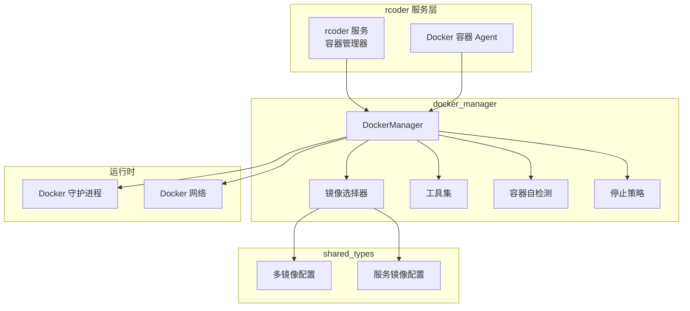
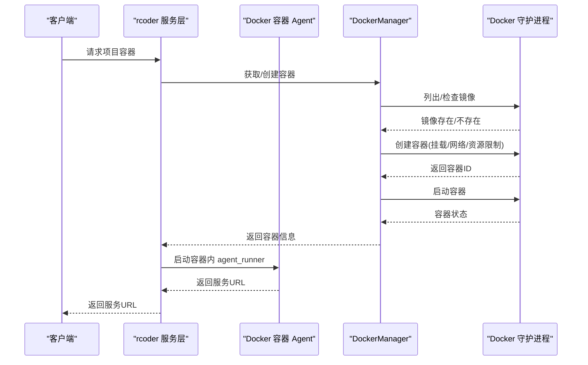
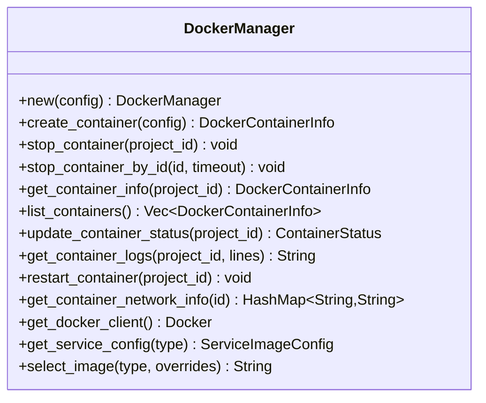
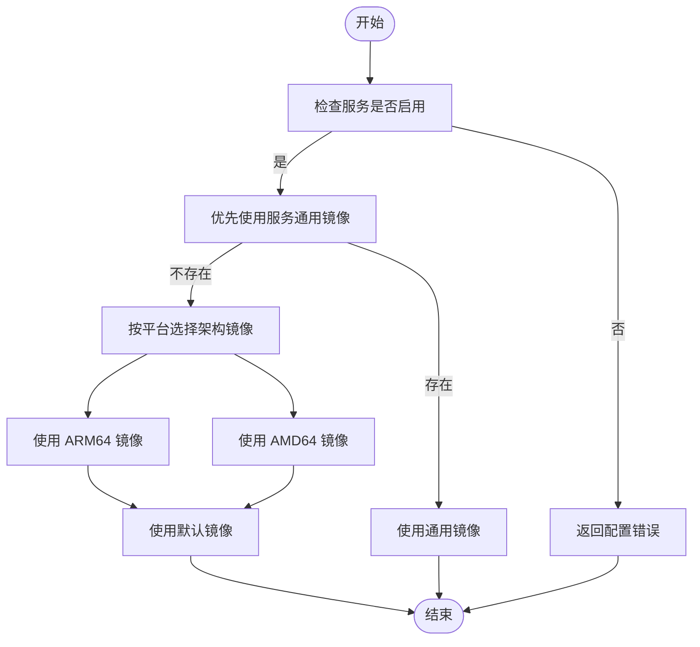
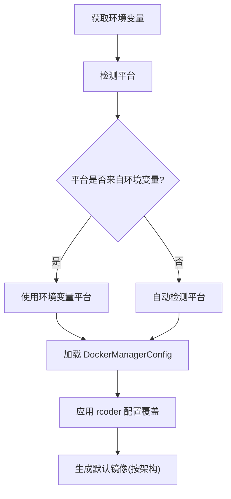
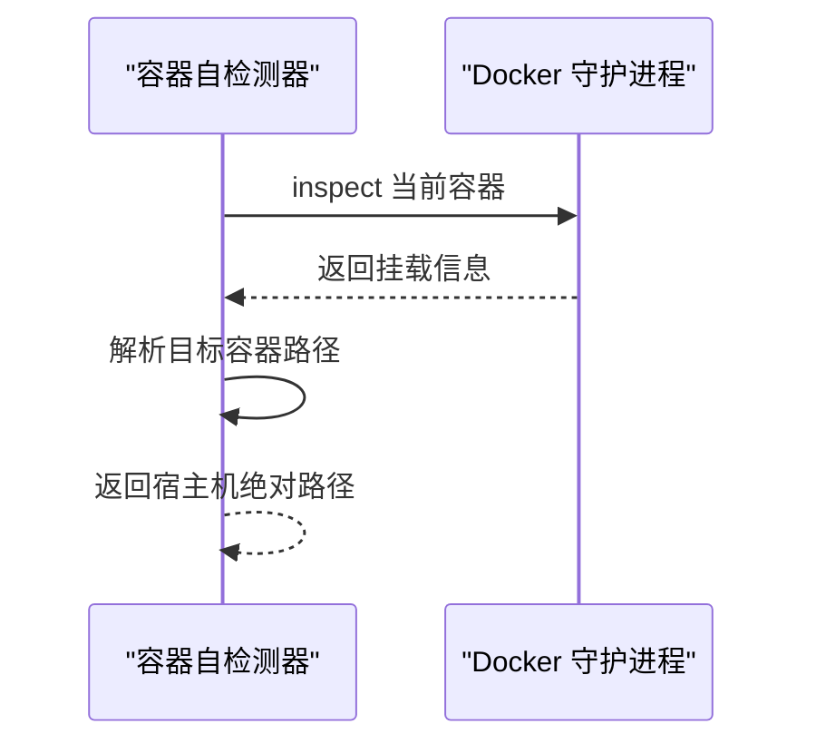
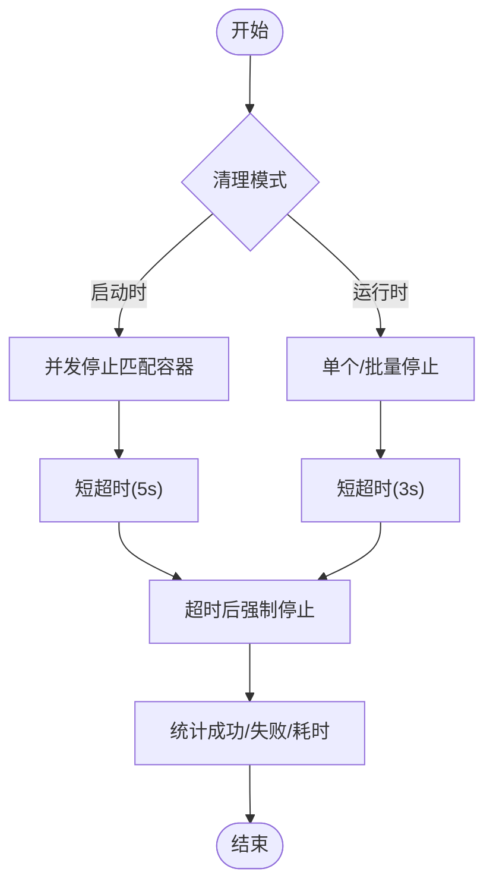
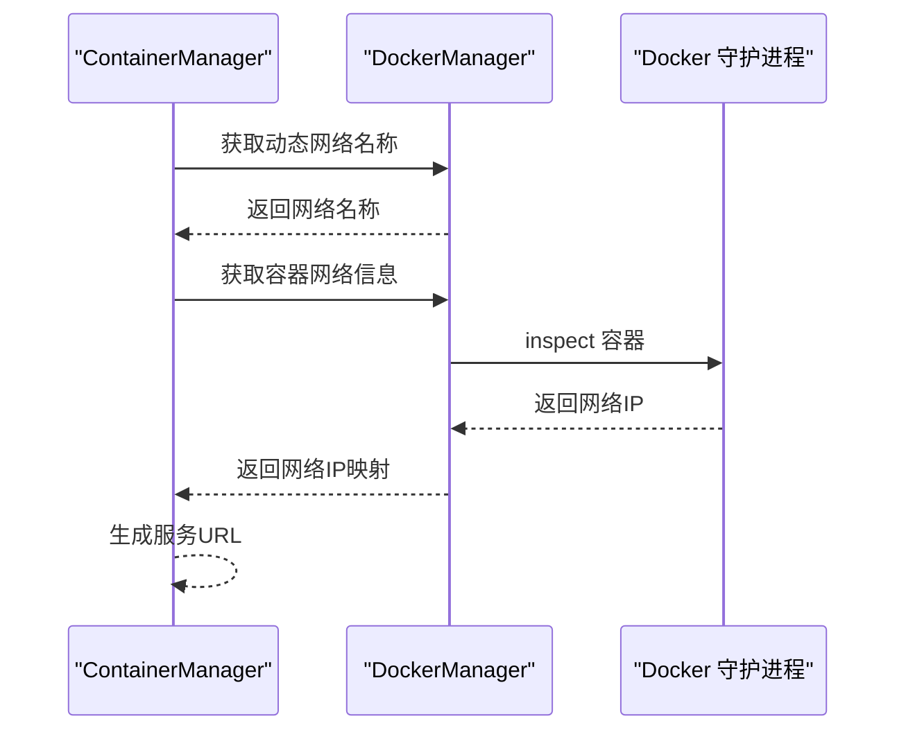
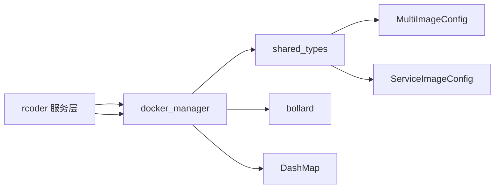

# 容器化管理

<cite>
**本文引用的文件**
- [crates/docker_manager/src/lib.rs](file://crates/docker_manager/src/lib.rs)
- [crates/docker_manager/src/manager.rs](file://crates/docker_manager/src/manager.rs)
- [crates/docker_manager/src/types.rs](file://crates/docker_manager/src/types.rs)
- [crates/docker_manager/src/utils.rs](file://crates/docker_manager/src/utils.rs)
- [crates/docker_manager/src/image_selector.rs](file://crates/docker_manager/src/image_selector.rs)
- [crates/docker_manager/src/container_self_inspector.rs](file://crates/docker_manager/src/container_self_inspector.rs)
- [crates/docker_manager/src/container_stop.rs](file://crates/docker_manager/src/container_stop.rs)
- [crates/rcoder/src/proxy_agent/docker_container_agent.rs](file://crates/rcoder/src/proxy_agent/docker_container_agent.rs)
- [crates/rcoder/src/service/container_manager.rs](file://crates/rcoder/src/service/container_manager.rs)
- [crates/rcoder/src/config.rs](file://crates/rcoder/src/config.rs)
- [crates/rcoder/src/rcoder_default.yml](file://crates/rcoder/src/rcoder_default.yml)
- [crates/shared_types/multi_image_config.rs](file://crates/shared_types/src/multi_image_config.rs)
- [crates/shared_types/src/service_config.rs](file://crates/shared_types/src/service_config.rs)
- [docker/Dockerfile](file://docker/Dockerfile)
- [docker/docker-compose.yml](file://docker/docker-compose.yml)
</cite>

## 目录
1. [引言](#引言)
2. [项目结构](#项目结构)
3. [核心组件](#核心组件)
4. [架构总览](#架构总览)
5. [详细组件分析](#详细组件分析)
6. [依赖关系分析](#依赖关系分析)
7. [性能考虑](#性能考虑)
8. [故障排查指南](#故障排查指南)
9. [结论](#结论)
10. [附录](#附录)

## 引言
本文件系统性阐述本项目的容器化管理能力，涵盖 Docker 集成、容器生命周期、资源隔离与镜像管理的实现细节。文档基于实际代码库，提供面向初学者的循序讲解与面向资深工程师的技术深度，包括配置选项、参数与返回值说明、组件间关系、常见问题与解决方案，并辅以可视化图示帮助理解。

## 项目结构
围绕容器化管理的关键模块分布如下：
- docker_manager：Docker 客户端封装、容器生命周期管理、镜像选择、网络与资源限制、容器自检测与停止策略
- rcoder 服务层：容器编排入口、容器信息查询与服务 URL 生成、与 docker_manager 的交互
- shared_types：多镜像配置模型、服务镜像配置、服务类型枚举等
- docker 目录：Dockerfile 与 docker-compose.yml，定义运行时镜像与编排网络

图表来源
- [crates/rcoder/src/service/container_manager.rs](file://crates/rcoder/src/service/container_manager.rs#L1-L200)
- [crates/rcoder/src/proxy_agent/docker_container_agent.rs](file://crates/rcoder/src/proxy_agent/docker_container_agent.rs#L1-L120)
- [crates/docker_manager/src/manager.rs](file://crates/docker_manager/src/manager.rs#L1-L120)
- [crates/docker_manager/src/image_selector.rs](file://crates/docker_manager/src/image_selector.rs#L1-L80)
- [crates/shared_types/src/multi_image_config.rs](file://crates/shared_types/src/multi_image_config.rs#L1-L120)

章节来源
- [crates/docker_manager/src/lib.rs](file://crates/docker_manager/src/lib.rs#L1-L120)
- [crates/rcoder/src/service/container_manager.rs](file://crates/rcoder/src/service/container_manager.rs#L1-L120)
- [crates/rcoder/src/proxy_agent/docker_container_agent.rs](file://crates/rcoder/src/proxy_agent/docker_container_agent.rs#L1-L120)
- [docker/docker-compose.yml](file://docker/docker-compose.yml#L1-L37)

## 核心组件
- DockerManager：统一的 Docker 客户端封装，负责容器创建、启动、停止、删除、状态查询、日志获取、网络信息查询、镜像存在性检查与拉取等
- 镜像选择器：基于服务类型与多镜像配置选择镜像，支持架构特定镜像与全局默认镜像
- 工具集：平台检测、镜像兼容性判断、容器命名、配置加载（环境变量/配置文件）、路径规范化
- 容器自检测：在容器内部通过 Docker API 获取自身挂载信息，解析容器内路径到宿主机路径
- 停止策略：提供启动时清理与运行时清理两种策略，支持并发停止、超时控制与错误过滤
- rcoder 服务层：容器编排入口，负责按项目维度创建/复用容器，生成服务 URL，查询网络信息

章节来源
- [crates/docker_manager/src/manager.rs](file://crates/docker_manager/src/manager.rs#L1-L200)
- [crates/docker_manager/src/image_selector.rs](file://crates/docker_manager/src/image_selector.rs#L1-L120)
- [crates/docker_manager/src/utils.rs](file://crates/docker_manager/src/utils.rs#L1-L120)
- [crates/docker_manager/src/container_self_inspector.rs](file://crates/docker_manager/src/container_self_inspector.rs#L1-L120)
- [crates/docker_manager/src/container_stop.rs](file://crates/docker_manager/src/container_stop.rs#L1-L120)
- [crates/rcoder/src/service/container_manager.rs](file://crates/rcoder/src/service/container_manager.rs#L1-L120)

## 架构总览
容器化管理采用“服务层 + docker_manager + Docker 守护进程”的分层设计。rcoder 服务层通过 DockerManager 与 Docker 守护进程交互，镜像选择器根据服务类型与多镜像配置决定镜像，工具集负责平台检测与配置加载，容器自检测与停止策略分别用于容器内部路径解析与资源回收。

图表来源
- [crates/rcoder/src/service/container_manager.rs](file://crates/rcoder/src/service/container_manager.rs#L150-L320)
- [crates/rcoder/src/proxy_agent/docker_container_agent.rs](file://crates/rcoder/src/proxy_agent/docker_container_agent.rs#L1-L180)
- [crates/docker_manager/src/manager.rs](file://crates/docker_manager/src/manager.rs#L80-L180)

## 详细组件分析

### DockerManager：容器生命周期与资源隔离
- 连接与初始化：支持通过环境变量或本地默认连接 Docker 守护进程；初始化时检测主网络名称并确保 RCoder 网络存在
- 容器创建：生成容器名称、检查同项目容器、拉取镜像、绑定挂载点、设置环境变量与端口映射、应用资源限制（内存、CPU、交换）、连接到动态检测的网络
- 容器停止：提供按项目与按容器 ID 的停止接口，支持超时与强制删除；并发清理提升效率
- 状态与日志：查询容器状态、健康状态、获取容器日志
- 网络信息：通过 Docker API 获取容器网络 IP，支持基于网络名称的通信
- 错误处理：统一的 DockerError 错误类型，区分连接、创建、启动、停止、删除、拉取、配置、IO、序列化、Bollard 错误

图表来源
- [crates/docker_manager/src/manager.rs](file://crates/docker_manager/src/manager.rs#L1-L200)
- [crates/docker_manager/src/types.rs](file://crates/docker_manager/src/types.rs#L1-L120)

章节来源
- [crates/docker_manager/src/manager.rs](file://crates/docker_manager/src/manager.rs#L1-L200)
- [crates/docker_manager/src/types.rs](file://crates/docker_manager/src/types.rs#L1-L120)

### 镜像选择器：多镜像配置与架构适配
- 多镜像配置：支持全局默认镜像、服务特定镜像（通用/ARM64/AMD64/默认回退）、镜像选择策略（当前为 ServiceOnly）、缓存配置
- 服务镜像配置：包含服务类型、镜像、环境变量、挂载点、命令、入口点、资源限制、工作目录、网络模式、容器路径模板等
- 选择逻辑：优先使用服务通用镜像，否则按平台选择架构特定镜像，最后回退到默认镜像；支持项目级镜像覆盖与环境变量合并

图表来源
- [crates/docker_manager/src/image_selector.rs](file://crates/docker_manager/src/image_selector.rs#L1-L120)
- [crates/shared_types/src/multi_image_config.rs](file://crates/shared_types/src/multi_image_config.rs#L1-L120)
- [crates/shared_types/src/service_config.rs](file://crates/shared_types/src/service_config.rs#L1-L120)

章节来源
- [crates/docker_manager/src/image_selector.rs](file://crates/docker_manager/src/image_selector.rs#L1-L160)
- [crates/shared_types/src/multi_image_config.rs](file://crates/shared_types/src/multi_image_config.rs#L1-L200)
- [crates/shared_types/src/service_config.rs](file://crates/shared_types/src/service_config.rs#L1-L200)

### 工具集：平台检测、镜像兼容性与配置加载
- 平台检测：自动检测系统架构并返回 Docker 平台字符串，支持环境变量覆盖
- 镜像兼容性：根据镜像标签判断与当前平台的兼容性
- 配置加载：从环境变量与 rcoder 配置加载 DockerManagerConfig，支持网络模式、工作目录、自动清理、容器 TTL、默认镜像等
- 容器命名：使用 project_id 生成稳定容器名称，便于管理与调试

图表来源
- [crates/docker_manager/src/utils.rs](file://crates/docker_manager/src/utils.rs#L1-L120)
- [crates/rcoder/src/config.rs](file://crates/rcoder/src/config.rs#L120-L220)
- [crates/rcoder/src/rcoder_default.yml](file://crates/rcoder/src/rcoder_default.yml#L1-L120)

章节来源
- [crates/docker_manager/src/utils.rs](file://crates/docker_manager/src/utils.rs#L1-L200)
- [crates/rcoder/src/config.rs](file://crates/rcoder/src/config.rs#L120-L220)
- [crates/rcoder/src/rcoder_default.yml](file://crates/rcoder/src/rcoder_default.yml#L1-L175)

### 容器自检测：容器内路径解析
- 在容器内部通过 Docker API 获取自身挂载信息，解析容器内路径到宿主机路径
- 提供容器路径到宿主机路径的解析器，支持已知路径的硬编码映射与通用路径解析

图表来源
- [crates/docker_manager/src/container_self_inspector.rs](file://crates/docker_manager/src/container_self_inspector.rs#L1-L120)

章节来源
- [crates/docker_manager/src/container_self_inspector.rs](file://crates/docker_manager/src/container_self_inspector.rs#L1-L200)

### 停止策略：启动时清理与运行时清理
- 启动时清理：并发停止匹配模式的容器，使用较短超时，过滤 409 冲突错误，快速清理遗留容器
- 运行时清理：单个或批量容器停止，使用较短超时，超时后强制停止，快速释放资源

图表来源
- [crates/docker_manager/src/container_stop.rs](file://crates/docker_manager/src/container_stop.rs#L1-L180)

章节来源
- [crates/docker_manager/src/container_stop.rs](file://crates/docker_manager/src/container_stop.rs#L1-L200)

### rcoder 服务层：容器编排与服务 URL 生成
- 容器编排：按项目维度检查/创建容器，动态获取网络名称，生成服务 URL
- 服务 URL：通过 Docker API 获取容器在动态网络中的 IP，拼接服务端口生成 URL
- 与 docker_manager 的交互：调用 DockerManager 的容器创建、网络信息查询、服务配置获取等

图表来源
- [crates/rcoder/src/service/container_manager.rs](file://crates/rcoder/src/service/container_manager.rs#L120-L220)

章节来源
- [crates/rcoder/src/service/container_manager.rs](file://crates/rcoder/src/service/container_manager.rs#L1-L220)
- [crates/rcoder/src/proxy_agent/docker_container_agent.rs](file://crates/rcoder/src/proxy_agent/docker_container_agent.rs#L1-L200)

## 依赖关系分析
- docker_manager 依赖 bollard 与 DashMap，提供 Docker 客户端、并发容器映射与错误类型
- rcoder 服务层依赖 docker_manager 的全局实例与容器信息结构
- shared_types 提供多镜像配置与服务镜像配置模型，被 docker_manager 与 rcoder 共同使用
- docker 目录提供运行时镜像与编排网络，与 rcoder 服务层配合实现容器化部署

图表来源
- [crates/docker_manager/src/lib.rs](file://crates/docker_manager/src/lib.rs#L1-L60)
- [crates/shared_types/src/multi_image_config.rs](file://crates/shared_types/src/multi_image_config.rs#L1-L120)
- [crates/shared_types/src/service_config.rs](file://crates/shared_types/src/service_config.rs#L1-L120)

章节来源
- [crates/docker_manager/src/lib.rs](file://crates/docker_manager/src/lib.rs#L1-L60)
- [crates/shared_types/src/multi_image_config.rs](file://crates/shared_types/src/multi_image_config.rs#L1-L120)
- [crates/shared_types/src/service_config.rs](file://crates/shared_types/src/service_config.rs#L1-L120)

## 性能考虑
- 并发停止：启动时清理与运行时批量清理均采用并发任务，显著缩短清理时间
- 超时控制：启动时使用较短超时（5s），运行时使用更短超时（3s），在保证稳定性的同时快速回收资源
- 网络连接：容器创建时直接连接到动态检测的网络，避免跨网络通信开销
- 资源限制：通过 HostConfig 的内存、CPU、交换限制实现资源隔离，避免资源争用
- 镜像拉取：仅在本地不存在时拉取镜像，减少重复下载

章节来源
- [crates/docker_manager/src/container_stop.rs](file://crates/docker_manager/src/container_stop.rs#L1-L120)
- [crates/docker_manager/src/manager.rs](file://crates/docker_manager/src/manager.rs#L140-L220)

## 故障排查指南
- Docker 连接失败
  - 现象：初始化 DockerManager 报错
  - 排查：确认 DOCKER_HOST 环境变量、Docker 守护进程状态、socket 权限
  - 参考：DockerError::ConnectionError
- 容器创建失败
  - 现象：创建容器报错
  - 排查：检查镜像是否存在、挂载路径、网络名称、资源限制参数
  - 参考：DockerError::ContainerCreationError
- 容器启动失败
  - 现象：容器创建后立即退出
  - 排查：查看容器日志、健康检查状态、入口点与命令、环境变量
  - 参考：DockerError::ContainerStartError、get_container_logs
- 容器停止失败
  - 现象：删除容器报错
  - 排查：忽略 409 冲突错误（已在启动清理中处理）；检查容器是否已删除或正在删除
  - 参考：DockerError::ContainerStopError、DockerError::ContainerRemoveError
- 镜像拉取失败
  - 现象：ensure_image_exists 失败
  - 排查：检查镜像仓库可达性、认证配置、网络策略
  - 参考：DockerError::ImagePullError
- 网络不存在
  - 现象：ensure_rcoder_network 失败
  - 排查：确认 docker-compose 网络已创建、主容器处于预期网络
  - 参考：DockerError::ConnectionError
- 容器自检测失败
  - 现象：无法解析容器内路径到宿主机路径
  - 排查：确认 Docker socket 挂载与权限、/proc 文件系统可读
  - 参考：ContainerSelfInspector::detect_host_path_for_container_dir

章节来源
- [crates/docker_manager/src/lib.rs](file://crates/docker_manager/src/lib.rs#L1-L60)
- [crates/docker_manager/src/manager.rs](file://crates/docker_manager/src/manager.rs#L540-L760)
- [crates/docker_manager/src/container_self_inspector.rs](file://crates/docker_manager/src/container_self_inspector.rs#L1-L120)

## 结论
本项目通过 docker_manager 提供了完善的容器化管理能力：统一的 Docker 客户端封装、灵活的多镜像配置与架构适配、稳定的容器生命周期管理、资源隔离与网络连接、以及容器内部路径解析与高效停止策略。rcoder 服务层在此基础上实现了按项目维度的容器编排与服务 URL 生成，整体架构清晰、扩展性强，既满足初学者快速上手，也为高级用户提供深入定制的空间。

## 附录

### 配置选项与参数说明
- DockerManagerConfig
  - docker_host：Docker 守护进程地址（可选）
  - default_image：默认镜像
  - default_platform：默认平台（如 linux/amd64）
  - default_network_mode：默认网络模式（如 bridge）
  - default_work_dir：默认工作目录
  - auto_cleanup：是否启用自动清理
  - container_ttl_seconds：容器存活时间（秒）
  - multi_image_config：多镜像配置（来自 rcoder 配置）
- DockerContainerConfig
  - project_id：项目标识
  - image：镜像名称
  - name_prefix：容器名称前缀
  - host_path：宿主机路径
  - container_path：容器内路径
  - work_dir：工作目录
  - env_vars：环境变量
  - port_bindings：端口映射
  - network_mode：网络模式
  - auto_remove：容器停止后自动删除
  - resource_limits：资源限制（内存、CPU、交换）
  - extra_mounts：额外挂载点
  - command：启动命令
  - entrypoint：入口点
  - network_name：网络名称（可选）
- DockerConfig（rcoder 配置）
  - multi_image_config：多镜像配置
  - network_mode：网络模式
  - work_dir：工作目录
  - auto_cleanup：自动清理
  - container_ttl_seconds：容器存活时间（秒）

章节来源
- [crates/docker_manager/src/types.rs](file://crates/docker_manager/src/types.rs#L1-L200)
- [crates/rcoder/src/config.rs](file://crates/rcoder/src/config.rs#L80-L220)
- [crates/rcoder/src/rcoder_default.yml](file://crates/rcoder/src/rcoder_default.yml#L1-L175)

### 运行时镜像与编排
- Dockerfile：包含调试工具与健康检查，暴露端口，设置环境变量
- docker-compose.yml：定义 rcoder 服务、端口映射、环境变量、卷挂载、健康检查、网络

章节来源
- [docker/Dockerfile](file://docker/Dockerfile#L1-L120)
- [docker/docker-compose.yml](file://docker/docker-compose.yml#L1-L37)