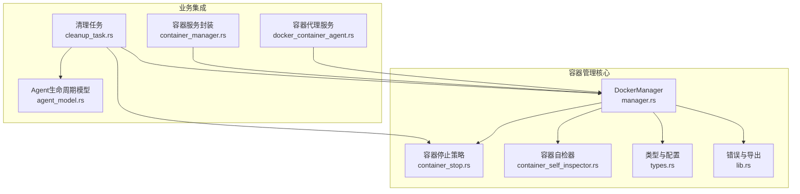
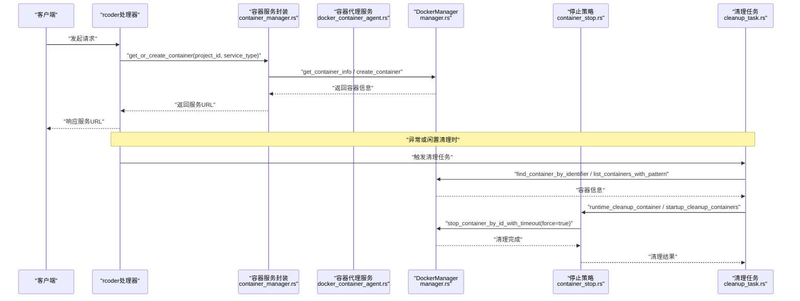
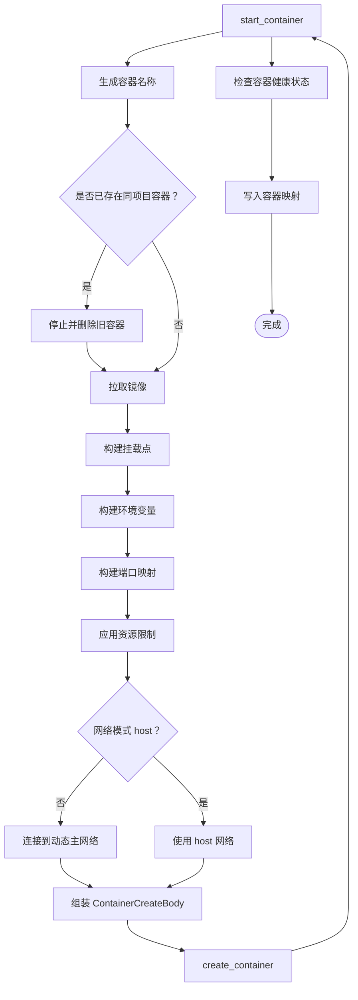
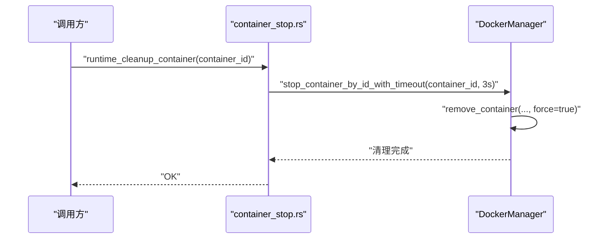
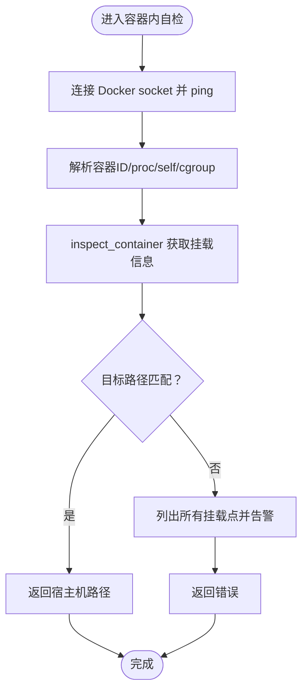
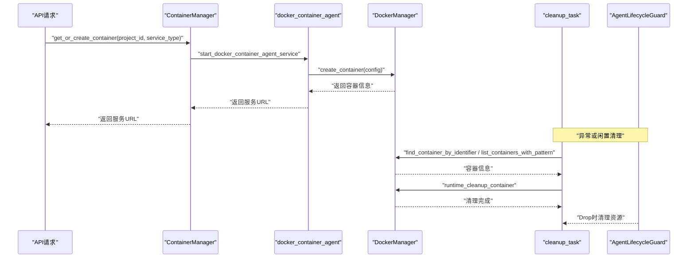
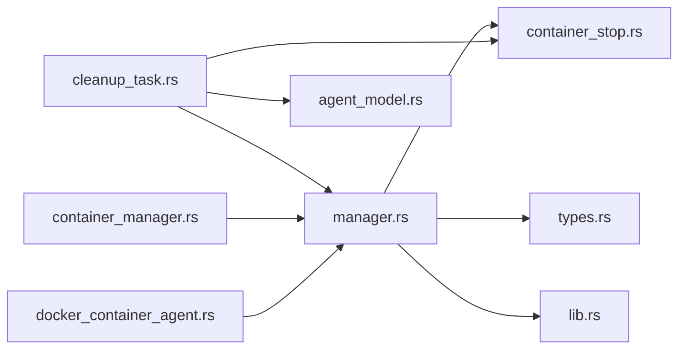

# 容器生命周期管理

<cite>
**本文引用的文件**
- [manager.rs](file://crates/docker_manager/src/manager.rs)
- [container_stop.rs](file://crates/docker_manager/src/container_stop.rs)
- [container_self_inspector.rs](file://crates/docker_manager/src/container_self_inspector.rs)
- [types.rs](file://crates/docker_manager/src/types.rs)
- [lib.rs](file://crates/docker_manager/src/lib.rs)
- [docker_container_agent.rs](file://crates/rcoder/src/proxy_agent/docker_container_agent.rs)
- [container_manager.rs](file://crates/rcoder/src/service/container_manager.rs)
- [cleanup_task.rs](file://crates/rcoder/src/proxy_agent/cleanup_task.rs)
- [agent_model.rs](file://crates/shared_types/src/model/agent_model.rs)
</cite>

## 目录
1. [引言](#引言)
2. [项目结构](#项目结构)
3. [核心组件](#核心组件)
4. [架构总览](#架构总览)
5. [详细组件分析](#详细组件分析)
6. [依赖分析](#依赖分析)
7. [性能考虑](#性能考虑)
8. [故障排查指南](#故障排查指南)
9. [结论](#结论)
10. [附录](#附录)

## 引言
本文件围绕容器的完整生命周期管理展开，涵盖创建、启动、运行时监控、优雅停止与清理。重点基于 docker_manager 中的 create_container/start_container 流程，解析容器配置参数（资源限制、挂载卷、环境变量、网络与端口等）的设置逻辑；结合 container_stop 中的终止策略（超时与强制清理）、container_self_inspector 的容器内自检能力，以及 rcoder 层面的会话与容器映射关系，给出从 API 请求到容器终止的完整调用链路，并讨论异常终止场景下的恢复与资源泄漏防范策略。

## 项目结构
该仓库采用多 crate 的模块化组织，其中与容器生命周期直接相关的关键模块如下：
- docker_manager：容器生命周期与资源编排的核心实现
- rcoder：业务层容器管理与会话映射
- shared_types：跨模块共享的数据模型与生命周期抽象

图表来源
- [manager.rs](file://crates/docker_manager/src/manager.rs#L1-L120)
- [container_stop.rs](file://crates/docker_manager/src/container_stop.rs#L1-L60)
- [container_self_inspector.rs](file://crates/docker_manager/src/container_self_inspector.rs#L1-L40)
- [types.rs](file://crates/docker_manager/src/types.rs#L1-L60)
- [lib.rs](file://crates/docker_manager/src/lib.rs#L1-L40)
- [docker_container_agent.rs](file://crates/rcoder/src/proxy_agent/docker_container_agent.rs#L1-L40)
- [container_manager.rs](file://crates/rcoder/src/service/container_manager.rs#L1-L40)
- [cleanup_task.rs](file://crates/rcoder/src/proxy_agent/cleanup_task.rs#L400-L480)
- [agent_model.rs](file://crates/shared_types/src/model/agent_model.rs#L1-L40)

章节来源
- [manager.rs](file://crates/docker_manager/src/manager.rs#L1-L120)
- [docker_container_agent.rs](file://crates/rcoder/src/proxy_agent/docker_container_agent.rs#L1-L40)

## 核心组件
- DockerManager：负责容器创建、启动、状态更新、日志获取、重启与网络信息查询；提供统一的容器停止接口（支持超时与强制清理）。
- 容器停止策略：提供启动时清理与运行时清理两类策略，分别针对遗留容器与即时回收资源。
- 容器自检器：在容器内部通过 Docker API 检测挂载信息，解析容器内路径到宿主机路径。
- 类型与配置：集中定义容器配置、状态、清理结果等数据结构。
- 业务容器代理：将服务类型映射为镜像与配置，构造 DockerContainerConfig 并驱动 DockerManager 创建容器。
- 容器服务封装：对外暴露容器信息查询与服务 URL 生成，屏蔽底层网络细节。
- 清理任务：周期性扫描孤立容器并统一清理，结合运行时停止策略与 RAII 资源回收。
- Agent 生命周期模型：提供优雅停止与强制清理的 RAII 抽象，确保资源释放。

章节来源
- [types.rs](file://crates/docker_manager/src/types.rs#L1-L120)
- [lib.rs](file://crates/docker_manager/src/lib.rs#L1-L60)
- [container_manager.rs](file://crates/rcoder/src/service/container_manager.rs#L1-L60)
- [agent_model.rs](file://crates/shared_types/src/model/agent_model.rs#L1-L60)

## 架构总览
下图展示从 API 请求到容器终止的完整调用链路，强调会话 ID 与容器的映射关系。

图表来源
- [container_manager.rs](file://crates/rcoder/src/service/container_manager.rs#L150-L270)
- [docker_container_agent.rs](file://crates/rcoder/src/proxy_agent/docker_container_agent.rs#L1-L120)
- [manager.rs](file://crates/docker_manager/src/manager.rs#L80-L120)
- [container_stop.rs](file://crates/docker_manager/src/container_stop.rs#L226-L390)
- [cleanup_task.rs](file://crates/rcoder/src/proxy_agent/cleanup_task.rs#L431-L520)

## 详细组件分析

### DockerManager：创建与启动流程
- 容器创建与启动
  - 生成容器名称并检查是否已有同项目容器，若存在则先停止并删除。
  - 拉取镜像（本地不存在时）。
  - 构造挂载点（绑定宿主机路径到容器路径，支持只读与额外挂载）。
  - 设置环境变量、端口映射、资源限制（内存、CPU、Swap）。
  - 主动连接到动态检测的主网络，或使用 host 网络模式。
  - 设置容器主机名、域名为便于识别。
  - 设置启动命令与入口点。
  - 调用 create_container 并立即 start_container。
  - 等待短暂时间后检查容器健康状态，再写入容器映射。
- 停止与清理
  - 提供 stop_container_by_id_with_timeout（支持超时与强制清理）。
  - 提供 stop_container（按 project_id 停止并移除映射）。
  - 提供 find_container_by_identifier（支持 project_id、容器名称与 Docker API 查询）。
  - 提供 update_container_status、get_container_network_info、get_container_logs 等辅助能力。
- 资源限制与网络
  - 资源限制通过 HostConfig 的 memory、memory_swap、nano_cpus 设置。
  - 网络通过 NetworkingConfig 连接到动态主网络，支持 aliases 与 host 模式。

图表来源
- [manager.rs](file://crates/docker_manager/src/manager.rs#L80-L294)

章节来源
- [manager.rs](file://crates/docker_manager/src/manager.rs#L80-L294)
- [types.rs](file://crates/docker_manager/src/types.rs#L1-L120)

### 容器停止策略：优雅停止与强制清理
- 启动时清理（startup_cleanup）
  - 使用 5 秒超时，支持并发停止多个容器。
  - 过滤 409 冲突错误（容器已在删除中），避免阻塞服务启动。
- 运行时清理（runtime_cleanup）
  - 使用 3 秒优雅停止超时，超时后强制停止，快速释放资源。
  - 支持单个与批量清理，返回详细清理统计。
- 统一停止接口
  - stop_container_by_id_with_timeout 内部使用 force=true 的 remove_container，避免“removal already in progress”竞态。

图表来源
- [container_stop.rs](file://crates/docker_manager/src/container_stop.rs#L226-L390)
- [manager.rs](file://crates/docker_manager/src/manager.rs#L296-L372)

章节来源
- [container_stop.rs](file://crates/docker_manager/src/container_stop.rs#L1-L180)
- [container_stop.rs](file://crates/docker_manager/src/container_stop.rs#L226-L390)
- [manager.rs](file://crates/docker_manager/src/manager.rs#L296-L372)

### 容器自检器：容器内状态探测与路径解析
- 在容器内部通过 Docker API 检测自身挂载信息，解析容器内路径到宿主机路径。
- 支持列出所有挂载点、验证 Docker socket 连接、从 /proc/self/cgroup 解析容器 ID 等能力。
- 为容器内路径解析提供同步与异步两种接口，便于不同上下文使用。

图表来源
- [container_self_inspector.rs](file://crates/docker_manager/src/container_self_inspector.rs#L1-L140)
- [container_self_inspector.rs](file://crates/docker_manager/src/container_self_inspector.rs#L140-L220)

章节来源
- [container_self_inspector.rs](file://crates/docker_manager/src/container_self_inspector.rs#L1-L140)
- [container_self_inspector.rs](file://crates/docker_manager/src/container_self_inspector.rs#L140-L220)

### 业务集成：从 API 到容器终止的调用链
- 会话与容器映射
  - rcoder 层通过 ProjectAndContainerInfo 维护 project_id 与 session_id 的映射关系。
  - 容器服务封装 ContainerManager 提供 get_or_create_container/get_container_info，内部通过 DockerManager 获取网络信息并生成服务 URL。
- 容器代理服务
  - docker_container_agent 根据服务类型选择镜像与配置，构造 DockerContainerConfig 并调用 DockerManager.create_container。
  - 等待容器内 agent_runner 就绪后返回服务 URL。
- 清理与异常恢复
  - cleanup_task 周期性扫描孤立容器，使用 runtime_cleanup_container 统一清理。
  - 采用 RAII 的 AgentLifecycleGuard，当容器或 Agent 被移除时自动清理子进程与任务，避免资源泄漏。

图表来源
- [container_manager.rs](file://crates/rcoder/src/service/container_manager.rs#L150-L270)
- [docker_container_agent.rs](file://crates/rcoder/src/proxy_agent/docker_container_agent.rs#L1-L120)
- [cleanup_task.rs](file://crates/rcoder/src/proxy_agent/cleanup_task.rs#L431-L520)
- [agent_model.rs](file://crates/shared_types/src/model/agent_model.rs#L100-L200)

章节来源
- [container_manager.rs](file://crates/rcoder/src/service/container_manager.rs#L150-L270)
- [docker_container_agent.rs](file://crates/rcoder/src/proxy_agent/docker_container_agent.rs#L1-L120)
- [cleanup_task.rs](file://crates/rcoder/src/proxy_agent/cleanup_task.rs#L431-L520)
- [agent_model.rs](file://crates/shared_types/src/model/agent_model.rs#L100-L200)

### 容器配置参数设置逻辑（资源限制、挂载卷、环境变量）
- 资源限制
  - 通过 HostConfig.nano_cpus 设置 CPU 限制（1 CPU = 1e9 nano CPUs）。
  - 通过 memory/memory_swap 设置内存与 Swap 限制。
- 挂载卷
  - 默认绑定项目工作目录到容器内路径，支持只读。
  - 支持额外挂载点，逐项转换为 Mount。
- 环境变量
  - 将 HashMap 转换为 "KEY=VALUE" 形式的字符串列表注入。
- 端口映射
  - 通过端口绑定映射，host_ip 固定为 0.0.0.0，host_port 由映射提供。
- 网络与主机名
  - 通过 NetworkingConfig 连接到动态主网络，设置 aliases。
  - 设置 hostname/domainname 便于识别。

章节来源
- [manager.rs](file://crates/docker_manager/src/manager.rs#L108-L206)
- [types.rs](file://crates/docker_manager/src/types.rs#L1-L120)

### 终止策略：信号发送、超时处理与强制杀灭
- 优雅停止
  - 运行时清理使用 3 秒超时，超时后强制停止。
  - 启动时清理使用 5 秒超时，过滤 409 冲突错误。
- 强制杀灭
  - stop_container_by_id_with_timeout 内部使用 force=true 的 remove_container，避免“removal already in progress”竞态。
- 统一清理统计
  - 返回 total_found、successfully_removed、failed_removals、removed_container_ids、failed_removals_details、duration_ms 等指标。

章节来源
- [container_stop.rs](file://crates/docker_manager/src/container_stop.rs#L1-L180)
- [container_stop.rs](file://crates/docker_manager/src/container_stop.rs#L226-L390)
- [types.rs](file://crates/docker_manager/src/types.rs#L234-L284)

### 容器内状态探测与自检流程
- 通过 Docker API 获取容器挂载信息，匹配目标容器内路径并返回宿主机绝对路径。
- 支持列出所有挂载点用于调试，支持从 /proc/self/cgroup 解析容器 ID。
- 提供 verify_docker_connection 与 get_all_mounts 辅助诊断。

章节来源
- [container_self_inspector.rs](file://crates/docker_manager/src/container_self_inspector.rs#L60-L140)
- [container_self_inspector.rs](file://crates/docker_manager/src/container_self_inspector.rs#L140-L220)

## 依赖分析
- 组件耦合
  - DockerManager 与 container_stop：停止策略依赖 DockerManager 的 remove_container 接口。
  - docker_container_agent 与 DockerManager：代理服务通过 DockerManager 创建容器。
  - cleanup_task 与 DockerManager/container_stop：清理任务统一调用停止策略。
  - rcoder 的会话与容器映射：ProjectAndContainerInfo 与 cleanup_task 的映射关系。
- 外部依赖
  - bollard：Docker API 客户端。
  - tokio/dashmap/tracing：异步运行时、并发容器与日志。
- 循环依赖
  - 未见循环导入；各模块职责清晰，通过公共类型与接口解耦。

图表来源
- [docker_container_agent.rs](file://crates/rcoder/src/proxy_agent/docker_container_agent.rs#L1-L120)
- [container_manager.rs](file://crates/rcoder/src/service/container_manager.rs#L1-L120)
- [cleanup_task.rs](file://crates/rcoder/src/proxy_agent/cleanup_task.rs#L431-L520)
- [container_stop.rs](file://crates/docker_manager/src/container_stop.rs#L1-L120)
- [manager.rs](file://crates/docker_manager/src/manager.rs#L1-L120)
- [types.rs](file://crates/docker_manager/src/types.rs#L1-L60)
- [lib.rs](file://crates/docker_manager/src/lib.rs#L1-L40)
- [agent_model.rs](file://crates/shared_types/src/model/agent_model.rs#L1-L60)

章节来源
- [docker_container_agent.rs](file://crates/rcoder/src/proxy_agent/docker_container_agent.rs#L1-L120)
- [container_manager.rs](file://crates/rcoder/src/service/container_manager.rs#L1-L120)
- [cleanup_task.rs](file://crates/rcoder/src/proxy_agent/cleanup_task.rs#L431-L520)
- [container_stop.rs](file://crates/docker_manager/src/container_stop.rs#L1-L120)
- [manager.rs](file://crates/docker_manager/src/manager.rs#L1-L120)
- [types.rs](file://crates/docker_manager/src/types.rs#L1-L60)
- [lib.rs](file://crates/docker_manager/src/lib.rs#L1-L40)
- [agent_model.rs](file://crates/shared_types/src/model/agent_model.rs#L1-L60)

## 性能考虑
- 并发清理：container_stop 支持并发停止多个容器，显著提升启动时遗留容器清理效率。
- 超时控制：运行时清理使用短超时（3 秒），避免阻塞；启动时清理使用更短超时（5 秒），保证服务启动不被拖慢。
- 端口映射优化：业务侧采用内部网络通信，避免端口分配与释放带来的开销。
- 资源限制：合理设置 CPU 与内存限制，避免容器争抢影响整体稳定性。
- 日志与健康检查：通过 get_container_logs 与健康检查减少无效重试与等待。

[本节为通用指导，不直接分析具体文件]

## 故障排查指南
- 容器启动后立即退出
  - 检查 DockerManager.check_container_health 的错误输出，定位退出码与错误信息。
- 容器不存在或已在删除中
  - stop_container_by_id_with_timeout 对 No such container 与 removal already in progress 做了特殊处理，可忽略相关警告。
- 网络连接问题
  - 使用 get_container_network_info 获取容器网络信息，确认容器已连接到动态主网络。
- 清理统计异常
  - 通过 CleanupResult 的字段（如 failed_removals_details）定位失败容器与错误原因。
- 会话与容器映射丢失
  - 使用 cleanup_task 的孤立容器检查与清理，结合 RAII 的 AgentLifecycleGuard 自动清理资源。

章节来源
- [manager.rs](file://crates/docker_manager/src/manager.rs#L758-L800)
- [container_stop.rs](file://crates/docker_manager/src/container_stop.rs#L1-L120)
- [cleanup_task.rs](file://crates/rcoder/src/proxy_agent/cleanup_task.rs#L431-L520)
- [agent_model.rs](file://crates/shared_types/src/model/agent_model.rs#L200-L320)

## 结论
本系统通过 DockerManager 提供统一的容器生命周期管理能力，配合 container_stop 的优雅停止与强制清理策略、container_self_inspector 的容器内自检能力，以及 rcoder 层的会话与容器映射、清理任务与 RAII 资源回收，实现了从 API 请求到容器终止的闭环管理。在异常终止场景下，通过统一的停止接口与清理统计，能够快速定位问题并防止资源泄漏。建议在生产环境中合理设置资源限制与网络策略，并持续监控清理任务的执行效果。

[本节为总结性内容，不直接分析具体文件]

## 附录
- 关键流程路径参考
  - 创建与启动：[manager.rs](file://crates/docker_manager/src/manager.rs#L80-L294)
  - 停止与清理：[manager.rs](file://crates/docker_manager/src/manager.rs#L296-L372)、[container_stop.rs](file://crates/docker_manager/src/container_stop.rs#L226-L390)
  - 自检与路径解析：[container_self_inspector.rs](file://crates/docker_manager/src/container_self_inspector.rs#L60-L140)
  - 业务集成与映射：[container_manager.rs](file://crates/rcoder/src/service/container_manager.rs#L150-L270)、[cleanup_task.rs](file://crates/rcoder/src/proxy_agent/cleanup_task.rs#L431-L520)
  - Agent 生命周期：[agent_model.rs](file://crates/shared_types/src/model/agent_model.rs#L100-L200)