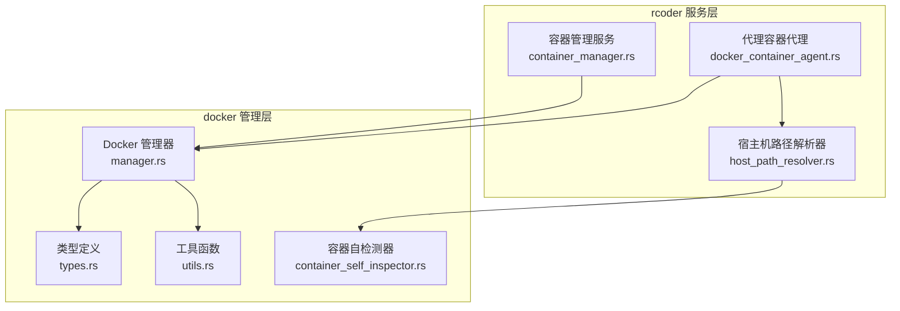
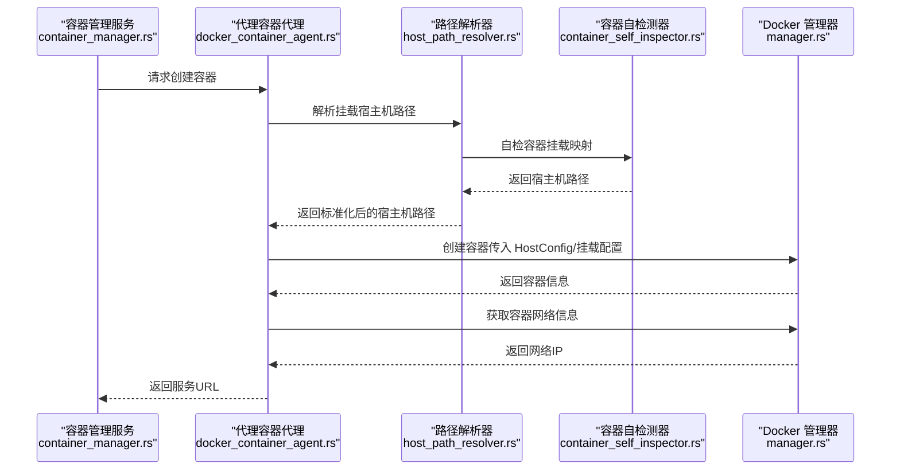
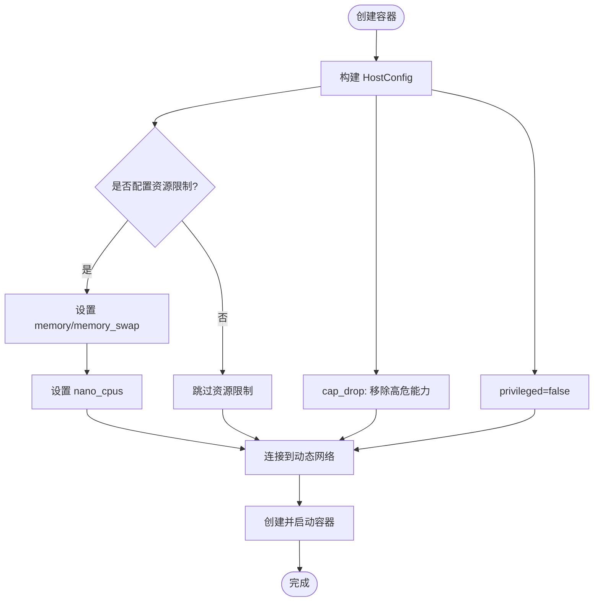
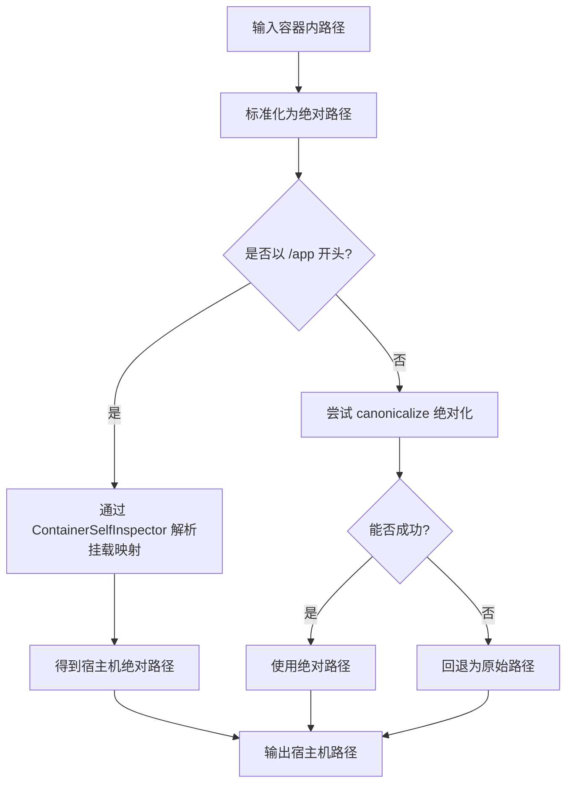
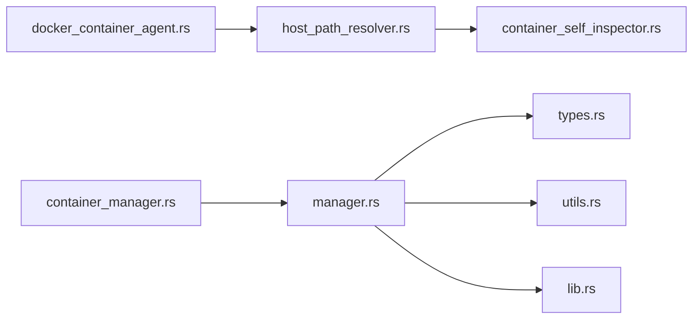

# 资源隔离与安全

<cite>
**本文引用的文件**
- [manager.rs](file://crates/docker_manager/src/manager.rs)
- [types.rs](file://crates/docker_manager/src/types.rs)
- [host_path_resolver.rs](file://crates/rcoder/src/utils/host_path_resolver.rs)
- [container_manager.rs](file://crates/rcoder/src/service/container_manager.rs)
- [docker_container_agent.rs](file://crates/rcoder/src/proxy_agent/docker_container_agent.rs)
- [container_self_inspector.rs](file://crates/docker_manager/src/container_self_inspector.rs)
- [utils.rs](file://crates/docker_manager/src/utils.rs)
- [lib.rs](file://crates/docker_manager/src/lib.rs)
</cite>

## 目录
1. [引言](#引言)
2. [项目结构](#项目结构)
3. [核心组件](#核心组件)
4. [架构总览](#架构总览)
5. [详细组件分析](#详细组件分析)
6. [依赖关系分析](#依赖关系分析)
7. [性能考量](#性能考量)
8. [故障排查指南](#故障排查指南)
9. [结论](#结论)
10. [附录](#附录)

## 引言
本文件聚焦容器化环境中的资源隔离与安全实践，围绕命名空间、cgroups、文件系统隔离展开，并结合代码实现说明如何在 manager.rs 中配置容器的资源限制（CPU、内存），如何通过只读挂载与安全选项（如能力集降级、禁用特权模式）提升安全性；同时基于 types.rs 中的 DockerContainerConfig 与 ResourceLimits 结构体解释各隔离参数的作用与默认值；并阐述 host_path_resolver.rs 如何与 docker_manager 协作，安全地解析宿主机路径，防止路径遍历攻击。最后给出实际配置示例，讨论容器逃逸风险缓解与最小权限原则的应用。

## 项目结构
本项目采用多 crate 的模块化组织，其中与容器资源隔离和安全直接相关的关键模块如下：
- docker_manager：负责容器生命周期管理、资源限制与网络配置
- rcoder/utils：提供宿主机路径解析工具，保障挂载路径的安全性
- rcoder/service：容器管理服务，协调容器创建与网络信息获取
- rcoder/proxy_agent：代理层，负责挂载路径解析与容器间通信

图表来源
- [container_manager.rs](file://crates/rcoder/src/service/container_manager.rs#L1-L120)
- [docker_container_agent.rs](file://crates/rcoder/src/proxy_agent/docker_container_agent.rs#L280-L360)
- [host_path_resolver.rs](file://crates/rcoder/src/utils/host_path_resolver.rs#L1-L120)
- [manager.rs](file://crates/docker_manager/src/manager.rs#L140-L210)
- [types.rs](file://crates/docker_manager/src/types.rs#L1-L120)
- [utils.rs](file://crates/docker_manager/src/utils.rs#L1-L120)
- [container_self_inspector.rs](file://crates/docker_manager/src/container_self_inspector.rs#L1-L120)

章节来源
- [container_manager.rs](file://crates/rcoder/src/service/container_manager.rs#L1-L120)
- [docker_container_agent.rs](file://crates/rcoder/src/proxy_agent/docker_container_agent.rs#L280-L360)
- [host_path_resolver.rs](file://crates/rcoder/src/utils/host_path_resolver.rs#L1-L120)
- [manager.rs](file://crates/docker_manager/src/manager.rs#L140-L210)
- [types.rs](file://crates/docker_manager/src/types.rs#L1-L120)
- [utils.rs](file://crates/docker_manager/src/utils.rs#L1-L120)
- [container_self_inspector.rs](file://crates/docker_manager/src/container_self_inspector.rs#L1-L120)

## 核心组件
- DockerManager：负责容器创建、启动、网络连接、资源限制与清理；在创建阶段应用能力集降级、禁用特权模式等安全策略，并按配置设置 CPU/内存限制。
- DockerContainerConfig/ResourceLimits：定义容器配置与资源限制的结构体，包含默认值与可选字段。
- HostPathResolver：在容器内自动检测挂载映射，将容器内路径解析为宿主机绝对路径，避免路径遍历与越权访问。
- ContainerManager：服务层容器管理器，负责网络名称动态获取、容器信息查询与服务 URL 构造。
- DockerContainerAgent：代理层，负责挂载路径解析、容器健康检查等待与网络 IP 获取。

章节来源
- [manager.rs](file://crates/docker_manager/src/manager.rs#L140-L210)
- [types.rs](file://crates/docker_manager/src/types.rs#L1-L120)
- [host_path_resolver.rs](file://crates/rcoder/src/utils/host_path_resolver.rs#L1-L120)
- [container_manager.rs](file://crates/rcoder/src/service/container_manager.rs#L1-L120)
- [docker_container_agent.rs](file://crates/rcoder/src/proxy_agent/docker_container_agent.rs#L280-L360)

## 架构总览
容器资源隔离与安全的关键流程如下：
- 配置阶段：通过 DockerContainerConfig/ResourceLimits 设置 CPU、内存、交换等限制，并决定挂载点与只读属性。
- 创建阶段：DockerManager 构建 HostConfig，应用能力集降级与禁用特权模式，设置网络连接与端口映射。
- 安全挂载：docker_container_agent 使用 HostPathResolver 将容器内路径标准化并解析为宿主机绝对路径，避免路径穿越。
- 运行阶段：容器网络信息通过 Docker API 获取，服务 URL 基于容器网络 IP 构造，避免不必要的宿主机端口暴露。

图表来源
- [container_manager.rs](file://crates/rcoder/src/service/container_manager.rs#L180-L270)
- [docker_container_agent.rs](file://crates/rcoder/src/proxy_agent/docker_container_agent.rs#L280-L360)
- [host_path_resolver.rs](file://crates/rcoder/src/utils/host_path_resolver.rs#L80-L170)
- [container_self_inspector.rs](file://crates/docker_manager/src/container_self_inspector.rs#L60-L140)
- [manager.rs](file://crates/docker_manager/src/manager.rs#L140-L210)

## 详细组件分析

### 资源限制与安全选项（manager.rs）
- 资源限制
  - 内存限制：通过 HostConfig.memory 与 HostConfig.memory_swap 设置内存与交换上限。
  - CPU 限制：通过 HostConfig.nano_cpus 设置 CPU 配额（1 CPU = 1e9 nano CPUs）。
  - 交换限制：memory_swap 与 memory_limit 配合控制内存+交换总量。
- 安全选项
  - 能力集降级：cap_drop 显式移除 NET_RAW、NET_ADMIN 等高危能力，降低网络层面的攻击面。
  - 禁用特权模式：privileged=false，避免容器获得宿主机同等权限。
  - 网络连接：通过 NetworkingConfig 将容器连接到动态检测的主网络，而非 host 网络模式，减少直接暴露风险。

图表来源
- [manager.rs](file://crates/docker_manager/src/manager.rs#L140-L210)

章节来源
- [manager.rs](file://crates/docker_manager/src/manager.rs#L140-L210)

### 配置结构体与默认值（types.rs）
- DockerContainerConfig
  - 关键字段：project_id、image、name_prefix、host_path、container_path、work_dir、env_vars、port_bindings、network_mode、auto_remove、resource_limits、extra_mounts、command、entrypoint、network_name。
  - 默认值：默认镜像、默认网络模式、默认工作目录、默认 auto_remove=false、默认 resource_limits=None。
- ResourceLimits
  - 字段：memory_limit（字节）、cpu_limit（核心数）、swap_limit（字节）。
  - 默认值：均为 None，表示不强制限制。
- MountPoint
  - 字段：host_path、container_path、read_only。
  - 作用：用于 extra_mounts 的扩展挂载，支持只读挂载。

章节来源
- [types.rs](file://crates/docker_manager/src/types.rs#L1-L120)
- [types.rs](file://crates/docker_manager/src/types.rs#L120-L220)

### 宿主机路径解析与安全挂载（host_path_resolver.rs 与 docker_container_agent.rs）
- HostPathResolver
  - 自动检测容器内 /app/project_workspace 对应的宿主机路径，记录容器内与宿主机的基础路径。
  - 提供 resolve_to_host_path：将容器内路径标准化为绝对路径，优先通过 ContainerSelfInspector 解析挂载映射，其次基于项目工作目录拼接，最后回退到绝对路径解析。
  - 提供诊断接口 get_diagnostics 与连接验证 check_docker_connection。
- docker_container_agent
  - 在挂载解析阶段，先将 host_path 标准化为绝对路径，再判断是否为容器内路径（以 /app 开头），若是则通过 HostPathResolver 转换为宿主机路径；否则直接使用该路径。
  - 输出调试日志，记录每个挂载的容器路径、宿主机路径与只读标记。

图表来源
- [host_path_resolver.rs](file://crates/rcoder/src/utils/host_path_resolver.rs#L80-L170)
- [container_self_inspector.rs](file://crates/docker_manager/src/container_self_inspector.rs#L60-L140)
- [docker_container_agent.rs](file://crates/rcoder/src/proxy_agent/docker_container_agent.rs#L297-L346)

章节来源
- [host_path_resolver.rs](file://crates/rcoder/src/utils/host_path_resolver.rs#L1-L170)
- [container_self_inspector.rs](file://crates/docker_manager/src/container_self_inspector.rs#L1-L140)
- [docker_container_agent.rs](file://crates/rcoder/src/proxy_agent/docker_container_agent.rs#L280-L346)

### 网络与容器管理（container_manager.rs 与 manager.rs）
- ContainerManager
  - 动态获取 Docker Compose 项目名称（优先环境变量，其次容器 labels，再次容器名称推断）。
  - 通过 DockerManager 检测主网络名称并连接容器到该网络，避免 host 网络模式带来的风险。
  - 获取容器网络信息，构造服务 URL（基于容器网络 IP 与固定端口）。
- DockerManager
  - 在创建容器时，通过 NetworkingConfig 连接容器到主网络，而非使用 network_mode 字符串。
  - 通过 Docker API 获取容器网络信息，用于服务 URL 构造。

章节来源
- [container_manager.rs](file://crates/rcoder/src/service/container_manager.rs#L1-L120)
- [container_manager.rs](file://crates/rcoder/src/service/container_manager.rs#L180-L270)
- [manager.rs](file://crates/docker_manager/src/manager.rs#L170-L210)

### 错误处理与全局管理（lib.rs 与 utils.rs）
- DockerError：统一的错误类型，涵盖连接失败、容器创建/启动/停止/删除失败、镜像拉取失败、配置错误、IO/序列化/Bollard 错误等。
- DockerUtils：提供平台检测、镜像兼容性判断、从 rcoder 配置加载 DockerManagerConfig、规范化项目路径等工具函数。

章节来源
- [lib.rs](file://crates/docker_manager/src/lib.rs#L1-L120)
- [utils.rs](file://crates/docker_manager/src/utils.rs#L1-L120)

## 依赖关系分析
- docker_container_agent 依赖 host_path_resolver 与 container_self_inspector，实现挂载路径解析与诊断。
- container_manager 依赖 docker_manager 获取容器网络信息与动态网络名称。
- docker_manager 依赖 bollard API 与 types.rs 中的配置结构体，构建 HostConfig 并执行容器生命周期操作。
- utils.rs 与 lib.rs 为公共工具与错误类型，被多个模块复用。

图表来源
- [docker_container_agent.rs](file://crates/rcoder/src/proxy_agent/docker_container_agent.rs#L280-L360)
- [host_path_resolver.rs](file://crates/rcoder/src/utils/host_path_resolver.rs#L1-L120)
- [container_self_inspector.rs](file://crates/docker_manager/src/container_self_inspector.rs#L1-L120)
- [container_manager.rs](file://crates/rcoder/src/service/container_manager.rs#L1-L120)
- [manager.rs](file://crates/docker_manager/src/manager.rs#L140-L210)
- [types.rs](file://crates/docker_manager/src/types.rs#L1-L120)
- [utils.rs](file://crates/docker_manager/src/utils.rs#L1-L120)
- [lib.rs](file://crates/docker_manager/src/lib.rs#L1-L120)

章节来源
- [docker_container_agent.rs](file://crates/rcoder/src/proxy_agent/docker_container_agent.rs#L280-L360)
- [host_path_resolver.rs](file://crates/rcoder/src/utils/host_path_resolver.rs#L1-L120)
- [container_self_inspector.rs](file://crates/docker_manager/src/container_self_inspector.rs#L1-L120)
- [container_manager.rs](file://crates/rcoder/src/service/container_manager.rs#L1-L120)
- [manager.rs](file://crates/docker_manager/src/manager.rs#L140-L210)
- [types.rs](file://crates/docker_manager/src/types.rs#L1-L120)
- [utils.rs](file://crates/docker_manager/src/utils.rs#L1-L120)
- [lib.rs](file://crates/docker_manager/src/lib.rs#L1-L120)

## 性能考量
- 资源限制
  - 合理设置 memory_limit 与 swap_limit，避免 OOM 导致频繁回收；CPU 限制通过 nano_cpus 控制配额，避免“饿死”其他容器。
  - 使用 HostConfig.memory_swap 与 memory_limit 的组合，确保内存+交换总量可控。
- 网络连接
  - 通过动态网络连接而非 host 网络模式，减少不必要的端口暴露与网络冲突。
- I/O 与挂载
  - 优先使用只读挂载（read_only=true），降低写入风险；对大文件或频繁读写场景，评估磁盘 IO 与缓存策略。
- 日志与诊断
  - 在开发阶段开启调试日志，生产环境适度降低日志级别，避免 I/O 影响。

## 故障排查指南
- 容器创建失败
  - 检查 Docker 连接状态与权限；确认镜像存在或可拉取；核对 HostConfig 的 cap_drop、privileged、mounts 等配置。
- 容器启动后立即退出
  - 通过 DockerManager 的健康检查与状态查询定位退出原因；查看容器日志与错误信息。
- 网络连接异常
  - 使用 ContainerManager 的 get_container_network_info 获取容器网络信息；确认容器已连接到动态检测的主网络。
- 路径解析失败
  - 使用 HostPathResolver 的 get_diagnostics 获取挂载信息；确认容器内路径以 /app 开头且存在相应挂载映射；必要时回退到绝对路径解析。
- 权限不足
  - 确认 Docker socket 权限与容器内 /proc 访问权限；检查 cap_drop 是否移除了必要的能力集。

章节来源
- [manager.rs](file://crates/docker_manager/src/manager.rs#L580-L790)
- [container_manager.rs](file://crates/rcoder/src/service/container_manager.rs#L200-L270)
- [host_path_resolver.rs](file://crates/rcoder/src/utils/host_path_resolver.rs#L160-L210)
- [container_self_inspector.rs](file://crates/docker_manager/src/container_self_inspector.rs#L250-L309)

## 结论
本项目通过在 manager.rs 中应用能力集降级、禁用特权模式与资源限制，结合 types.rs 的配置结构体，实现了对容器 CPU、内存与交换的可控约束；通过 host_path_resolver.rs 与 docker_container_agent.rs 的协作，有效防止路径遍历与越权挂载，提升了挂载阶段的安全性；配合 container_manager.rs 的动态网络连接与服务 URL 构造，进一步降低了容器间与宿主机的暴露面。整体遵循最小权限原则，兼顾开发便利性与运行时安全。

## 附录

### 实际配置示例（平衡开发便利性与安全）
- 资源限制
  - 在 DockerContainerConfig 中设置 resource_limits：memory_limit、cpu_limit、swap_limit，按项目需求设定上限。
  - 对开发环境可适当放宽限制，生产环境严格限制并开启 swap 保护。
- 只读挂载
  - 对不需要写入的挂载点设置 read_only=true，减少数据破坏风险。
- 安全选项
  - 保持 privileged=false，cap_drop 包含 NET_RAW、NET_ADMIN 等高危能力。
  - 避免使用 host 网络模式，通过动态网络连接实现容器间通信。
- 路径解析
  - 使用 docker_container_agent 的挂载解析流程，确保容器内路径统一标准化并解析为宿主机绝对路径，防止 ../ 等路径穿越。

章节来源
- [types.rs](file://crates/docker_manager/src/types.rs#L1-L120)
- [manager.rs](file://crates/docker_manager/src/manager.rs#L140-L210)
- [docker_container_agent.rs](file://crates/rcoder/src/proxy_agent/docker_container_agent.rs#L297-L346)
- [host_path_resolver.rs](file://crates/rcoder/src/utils/host_path_resolver.rs#L80-L170)

### 容器逃逸风险缓解与最小权限原则
- 风险缓解
  - 禁用特权模式与能力集降级，限制容器对宿主机内核与网络的访问。
  - 使用只读挂载与最小权限文件系统，避免容器写入关键目录。
  - 通过动态网络连接与端口映射策略，减少不必要的网络暴露。
- 最小权限原则
  - 仅授予容器完成任务所需的最小能力与权限；对挂载路径进行白名单校验与标准化处理。
  - 在开发与测试环境中适度放宽限制，生产环境严格执行安全策略。

章节来源
- [manager.rs](file://crates/docker_manager/src/manager.rs#L140-L210)
- [docker_container_agent.rs](file://crates/rcoder/src/proxy_agent/docker_container_agent.rs#L297-L346)
- [host_path_resolver.rs](file://crates/rcoder/src/utils/host_path_resolver.rs#L80-L170)