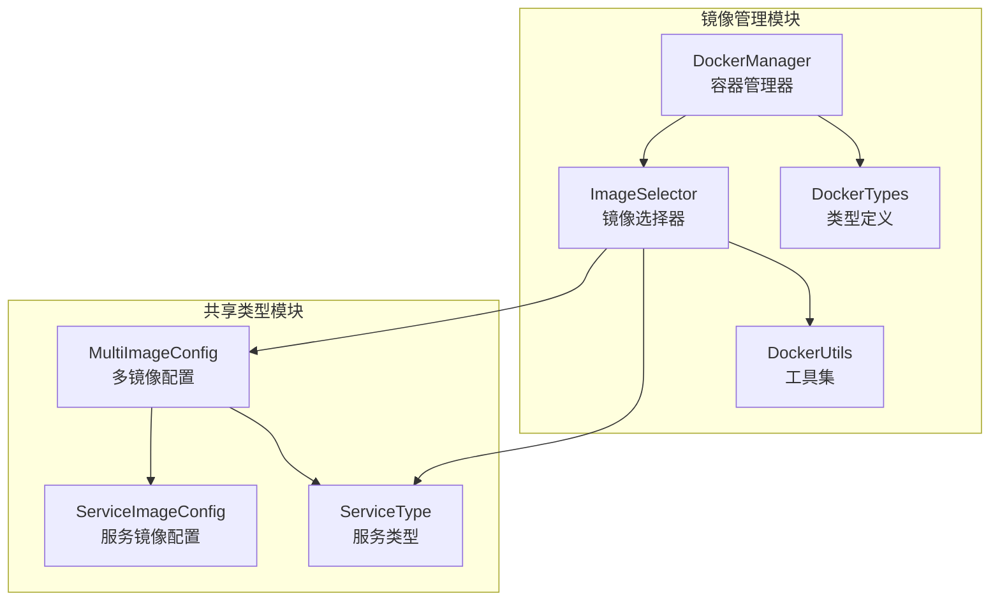
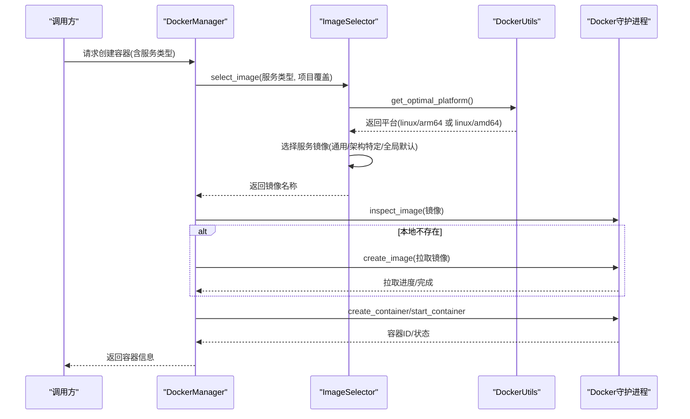
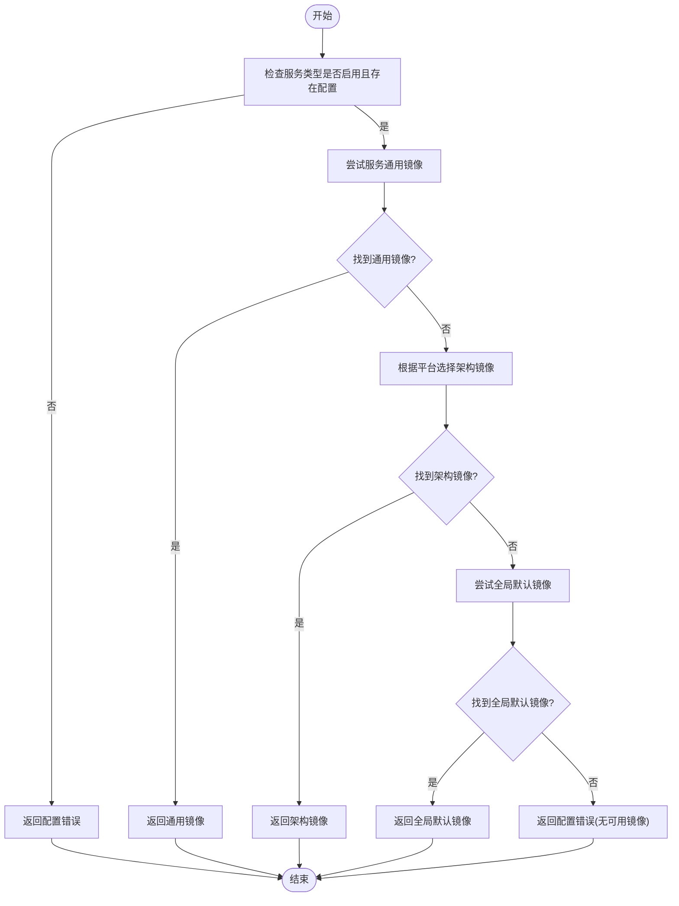
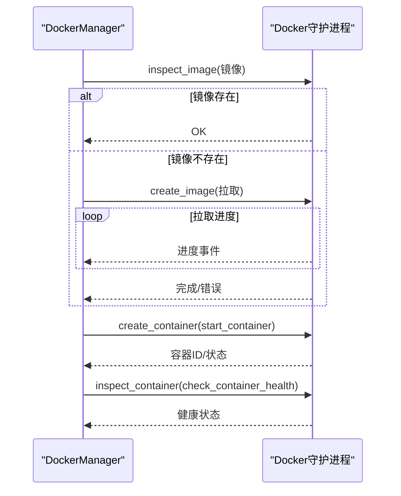
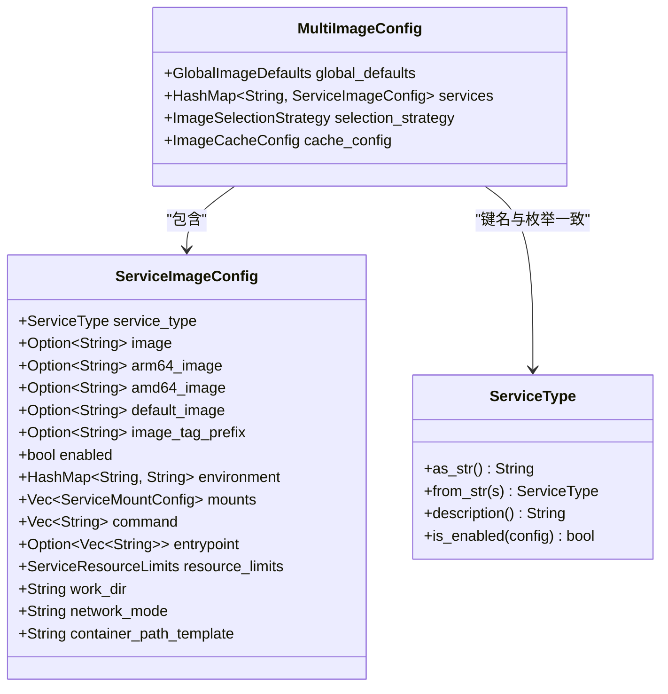
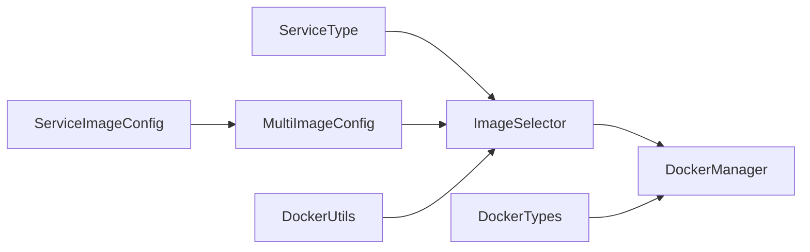

# 镜像管理与选择

<cite>
**本文引用的文件**
- [image_selector.rs](file://crates/docker_manager/src/image_selector.rs)
- [manager.rs](file://crates/docker_manager/src/manager.rs)
- [multi_image_config.rs](file://crates/shared_types/src/multi_image_config.rs)
- [service_config.rs](file://crates/shared_types/src/service_config.rs)
- [service_type.rs](file://crates/shared_types/src/service_type.rs)
- [types.rs](file://crates/docker_manager/src/types.rs)
- [utils.rs](file://crates/docker_manager/src/utils.rs)
- [lib.rs](file://crates/docker_manager/src/lib.rs)
- [multi-docker-image-design.md](file://specs/multi-docker-image-design.md)
- [rcoder_default.yml](file://crates/rcoder/src/rcoder_default.yml)
</cite>

## 目录
1. [简介](#简介)
2. [项目结构](#项目结构)
3. [核心组件](#核心组件)
4. [架构总览](#架构总览)
5. [详细组件分析](#详细组件分析)
6. [依赖关系分析](#依赖关系分析)
7. [性能考量](#性能考量)
8. [故障排查指南](#故障排查指南)
9. [结论](#结论)
10. [附录](#附录)

## 简介
本文件围绕多Docker镜像管理策略展开，重点解析 image_selector.rs 中的镜像选择逻辑，说明如何根据 AI 代理类型（如 Claude、Codex 对应的服务类型）动态选择最优基础镜像；解释镜像标签策略、本地缓存检查与自动拉取机制；结合 multi-docker-image-design.md 设计文档阐述支持多镜像配置的架构考量；描述 manager.rs 如何将选定镜像应用于容器创建流程；并提供配置示例，涵盖自定义镜像源、私有仓库认证、开发/生产镜像切换等场景，以及镜像拉取超时、校验失败等常见问题的解决方案。

## 项目结构
本项目采用按功能域划分的模块化组织方式，镜像管理相关的核心位于 crates/docker_manager 与 crates/shared_types：
- crates/docker_manager：容器生命周期与镜像管理（镜像拉取、容器创建、网络等）
- crates/shared_types：跨模块共享的数据结构与配置模型（多镜像配置、服务类型、服务镜像配置等）

图表来源
- [image_selector.rs](file://crates/docker_manager/src/image_selector.rs#L1-L160)
- [manager.rs](file://crates/docker_manager/src/manager.rs#L1-L120)
- [multi_image_config.rs](file://crates/shared_types/src/multi_image_config.rs#L1-L120)
- [service_config.rs](file://crates/shared_types/src/service_config.rs#L1-L120)
- [service_type.rs](file://crates/shared_types/src/service_type.rs#L1-L65)
- [utils.rs](file://crates/docker_manager/src/utils.rs#L1-L73)
- [types.rs](file://crates/docker_manager/src/types.rs#L175-L216)

章节来源
- [image_selector.rs](file://crates/docker_manager/src/image_selector.rs#L1-L160)
- [manager.rs](file://crates/docker_manager/src/manager.rs#L1-L120)
- [multi_image_config.rs](file://crates/shared_types/src/multi_image_config.rs#L1-L120)
- [service_config.rs](file://crates/shared_types/src/service_config.rs#L1-L120)
- [service_type.rs](file://crates/shared_types/src/service_type.rs#L1-L65)
- [utils.rs](file://crates/docker_manager/src/utils.rs#L1-L73)
- [types.rs](file://crates/docker_manager/src/types.rs#L175-L216)

## 核心组件
- 镜像选择器（ImageSelector）：基于服务类型与平台，从多镜像配置中选择具体镜像；支持服务级覆盖与全局默认回退。
- DockerManager：负责容器创建、网络连接、镜像拉取与健康检查；在创建容器前调用镜像选择器确定镜像。
- 多镜像配置（MultiImageConfig）：集中管理全局默认镜像、各服务类型镜像配置、选择策略与缓存配置。
- 服务镜像配置（ServiceImageConfig）：定义每种服务类型的镜像、环境变量、挂载点、资源限制等。
- 服务类型（ServiceType）：枚举 RCoder 与 AgentRunner，强制明确指定服务类型，避免默认值带来的歧义。
- 工具集（DockerUtils）：平台检测、镜像兼容性判断、容器命名等辅助能力。
- 类型定义（DockerTypes）：容器配置、状态、管理器配置等数据结构。

章节来源
- [image_selector.rs](file://crates/docker_manager/src/image_selector.rs#L1-L160)
- [manager.rs](file://crates/docker_manager/src/manager.rs#L545-L585)
- [multi_image_config.rs](file://crates/shared_types/src/multi_image_config.rs#L1-L120)
- [service_config.rs](file://crates/shared_types/src/service_config.rs#L1-L120)
- [service_type.rs](file://crates/shared_types/src/service_type.rs#L1-L65)
- [utils.rs](file://crates/docker_manager/src/utils.rs#L1-L73)
- [types.rs](file://crates/docker_manager/src/types.rs#L175-L216)

## 架构总览
镜像管理的整体流程如下：
- 输入：服务类型（如 RCoder、AgentRunner）、可选的项目级镜像覆盖、全局多镜像配置。
- 处理：镜像选择器根据“服务类型优先”策略与平台选择镜像；若服务配置缺失或禁用，则回退到全局默认镜像。
- 输出：返回具体镜像名称。
- 应用：DockerManager 在创建容器前检查镜像是否存在，不存在则自动拉取，随后创建并启动容器。

图表来源
- [manager.rs](file://crates/docker_manager/src/manager.rs#L80-L294)
- [manager.rs](file://crates/docker_manager/src/manager.rs#L545-L585)
- [image_selector.rs](file://crates/docker_manager/src/image_selector.rs#L32-L159)
- [utils.rs](file://crates/docker_manager/src/utils.rs#L39-L73)

章节来源
- [manager.rs](file://crates/docker_manager/src/manager.rs#L80-L294)
- [manager.rs](file://crates/docker_manager/src/manager.rs#L545-L585)
- [image_selector.rs](file://crates/docker_manager/src/image_selector.rs#L32-L159)
- [utils.rs](file://crates/docker_manager/src/utils.rs#L39-L73)

## 详细组件分析

### 镜像选择器（ImageSelector）
- 作用：根据服务类型与平台选择镜像，支持服务级覆盖与全局默认回退。
- 关键行为：
  - 强制验证服务类型已启用且存在配置。
  - 优先使用服务通用镜像；若未配置，则按平台选择架构特定镜像；若仍不可用，则回退到全局默认镜像。
  - 当前实现为简化版本，未内置缓存；设计文档中提供了带缓存的完整实现思路。
- 与平台的关系：通过 DockerUtils 获取最佳平台（优先环境变量，其次自动检测），并据此选择镜像。

图表来源
- [image_selector.rs](file://crates/docker_manager/src/image_selector.rs#L92-L159)
- [utils.rs](file://crates/docker_manager/src/utils.rs#L39-L73)

章节来源
- [image_selector.rs](file://crates/docker_manager/src/image_selector.rs#L32-L159)
- [utils.rs](file://crates/docker_manager/src/utils.rs#L39-L73)

### DockerManager 与容器创建流程
- 容器创建前的镜像检查与拉取：
  - 若镜像不存在，调用 create_image 拉取；拉取过程通过流式事件输出进度，遇到错误时返回镜像拉取失败。
- 容器创建：
  - 构建 HostConfig、NetworkingConfig、EnvVars、Mounts、端口映射等。
  - 使用配置中的 default_platform 作为创建容器的平台参数。
  - 创建完成后进行健康检查与状态确认。
- 与镜像选择器的集成：
  - DockerManager.select_image 调用 ImageSelector，将最终镜像注入到 DockerContainerConfig 中，再交由 create_container 流程使用。

图表来源
- [manager.rs](file://crates/docker_manager/src/manager.rs#L545-L585)
- [manager.rs](file://crates/docker_manager/src/manager.rs#L80-L294)

章节来源
- [manager.rs](file://crates/docker_manager/src/manager.rs#L545-L585)
- [manager.rs](file://crates/docker_manager/src/manager.rs#L80-L294)

### 多镜像配置与服务类型
- MultiImageConfig：集中管理全局默认镜像、各服务类型镜像配置、选择策略与缓存配置。
- ServiceImageConfig：定义每种服务的镜像（通用/架构特定/默认）、环境变量、挂载点、资源限制、工作目录、网络模式等。
- ServiceType：枚举 RCoder 与 AgentRunner，强制明确指定服务类型，避免默认值导致的歧义。
- 设计文档中的完整实现包含镜像缓存与更丰富的策略，当前简化实现聚焦于“服务类型优先”。

图表来源
- [multi_image_config.rs](file://crates/shared_types/src/multi_image_config.rs#L1-L120)
- [service_config.rs](file://crates/shared_types/src/service_config.rs#L1-L120)
- [service_type.rs](file://crates/shared_types/src/service_type.rs#L1-L65)

章节来源
- [multi_image_config.rs](file://crates/shared_types/src/multi_image_config.rs#L1-L120)
- [service_config.rs](file://crates/shared_types/src/service_config.rs#L1-L120)
- [service_type.rs](file://crates/shared_types/src/service_type.rs#L1-L65)

### 镜像标签策略与平台检测
- 平台检测：优先使用环境变量 DOCKER_DEFAULT_PLATFORM，否则自动检测当前系统架构，返回 linux/arm64 或 linux/amd64。
- 镜像标签策略：镜像名称中包含架构后缀（如 -arm64/-amd64/-latest）时，选择器按平台优先选择对应镜像；若未包含架构后缀，则按默认镜像回退。
- 工具函数还提供镜像与当前架构兼容性判断，便于提前发现潜在问题。

章节来源
- [utils.rs](file://crates/docker_manager/src/utils.rs#L39-L73)
- [image_selector.rs](file://crates/docker_manager/src/image_selector.rs#L133-L159)

### 本地缓存检查与自动拉取机制
- 本地缓存：当前简化实现未内置缓存；设计文档提供了带缓存的实现思路（缓存键包含服务类型、平台与项目覆盖哈希）。
- 自动拉取：DockerManager.ensure_image_exists 在镜像不存在时触发拉取，拉取过程持续输出进度事件，遇到错误返回镜像拉取失败。

章节来源
- [image_selector.rs](file://crates/docker_manager/src/image_selector.rs#L1-L30)
- [manager.rs](file://crates/docker_manager/src/manager.rs#L545-L585)

### 结合设计文档的架构考量
- 服务类型定义：明确 RCoder 与 AgentRunner，避免默认值；提供 from_str 与描述信息。
- 服务镜像配置：支持通用镜像、架构特定镜像与默认回退镜像；支持服务特定环境变量与挂载点。
- 多镜像配置：支持全局默认镜像、服务类型特定配置、选择策略（当前为 ServiceOnly）与缓存配置。
- 项目级覆盖：支持在项目层面对镜像与环境变量进行覆盖，并生成哈希键用于缓存区分。
- 容器创建集成：在创建容器前选择镜像，合并服务特定环境变量与挂载点，再执行创建与启动。

章节来源
- [multi-docker-image-design.md](file://specs/multi-docker-image-design.md#L41-L120)
- [multi-docker-image-design.md](file://specs/multi-docker-image-design.md#L122-L172)
- [multi-docker-image-design.md](file://specs/multi-docker-image-design.md#L251-L448)
- [multi-docker-image-design.md](file://specs/multi-docker-image-design.md#L450-L575)

### manager.rs 中镜像选择的应用
- DockerManager.select_image 直接委托给 ImageSelector，返回镜像名称。
- DockerManager.create_container 在创建容器前调用 ensure_image_exists，确保镜像存在后再创建与启动。
- 通过 DockerContainerConfig.image 字段将选定镜像注入到容器创建流程。

章节来源
- [manager.rs](file://crates/docker_manager/src/manager.rs#L702-L727)
- [manager.rs](file://crates/docker_manager/src/manager.rs#L80-L120)

## 依赖关系分析
- ImageSelector 依赖：
  - MultiImageConfig：读取全局默认与服务配置
  - ServiceType：键名与配置映射
  - DockerUtils：平台检测
- DockerManager 依赖：
  - ImageSelector：镜像选择
  - Docker 客户端：镜像检查与拉取、容器创建与启动
  - DockerTypes：容器配置、状态、管理器配置
- 共享类型：
  - MultiImageConfig、ServiceImageConfig、ServiceType：跨模块共享

图表来源
- [image_selector.rs](file://crates/docker_manager/src/image_selector.rs#L1-L30)
- [manager.rs](file://crates/docker_manager/src/manager.rs#L702-L727)
- [multi_image_config.rs](file://crates/shared_types/src/multi_image_config.rs#L1-L120)
- [service_config.rs](file://crates/shared_types/src/service_config.rs#L1-L120)
- [service_type.rs](file://crates/shared_types/src/service_type.rs#L1-L65)
- [utils.rs](file://crates/docker_manager/src/utils.rs#L1-L73)
- [types.rs](file://crates/docker_manager/src/types.rs#L175-L216)

章节来源
- [image_selector.rs](file://crates/docker_manager/src/image_selector.rs#L1-L30)
- [manager.rs](file://crates/docker_manager/src/manager.rs#L702-L727)
- [multi_image_config.rs](file://crates/shared_types/src/multi_image_config.rs#L1-L120)
- [service_config.rs](file://crates/shared_types/src/service_config.rs#L1-L120)
- [service_type.rs](file://crates/shared_types/src/service_type.rs#L1-L65)
- [utils.rs](file://crates/docker_manager/src/utils.rs#L1-L73)
- [types.rs](file://crates/docker_manager/src/types.rs#L175-L216)

## 性能考量
- 镜像拉取：拉取过程为流式事件，建议在高并发场景下控制拉取频率与并发度，避免网络拥塞。
- 平台检测：平台检测为 O(1)，成本极低；建议通过环境变量固定平台以减少检测开销。
- 缓存策略：当前简化实现未内置缓存；设计文档提供了缓存键与 TTL 机制，可在双服务场景下显著降低重复计算与网络请求。
- 资源限制：容器资源限制在 DockerManager 中设置，合理配置可避免资源争用。

[本节为通用指导，不涉及具体文件分析]

## 故障排查指南
- 镜像拉取超时
  - 现象：ensure_image_exists 拉取过程中长时间无响应或报错。
  - 排查要点：检查网络连通性、镜像仓库可达性、代理/防火墙设置；确认镜像名称与标签正确。
  - 参考实现位置：[manager.rs](file://crates/docker_manager/src/manager.rs#L545-L585)
- 镜像校验失败
  - 现象：inspect_image 报错或容器启动后立即退出。
  - 排查要点：确认镜像架构与当前平台匹配；检查镜像标签是否包含架构后缀；查看容器健康状态与日志。
  - 参考实现位置：[manager.rs](file://crates/docker_manager/src/manager.rs#L759-L800)
- 服务类型未启用或配置缺失
  - 现象：select_image 返回配置错误。
  - 排查要点：检查 MultiImageConfig.services 中对应服务是否 enabled；确认服务键名与 ServiceType.as_str() 一致。
  - 参考实现位置：[image_selector.rs](file://crates/docker_manager/src/image_selector.rs#L92-L114)
- 平台不匹配
  - 现象：镜像与当前平台不兼容导致运行异常。
  - 排查要点：通过 DockerUtils.get_optimal_platform 检查平台；必要时设置 DOCKER_DEFAULT_PLATFORM；确认镜像标签包含正确架构后缀。
  - 参考实现位置：[utils.rs](file://crates/docker_manager/src/utils.rs#L39-L73)

章节来源
- [manager.rs](file://crates/docker_manager/src/manager.rs#L545-L585)
- [manager.rs](file://crates/docker_manager/src/manager.rs#L759-L800)
- [image_selector.rs](file://crates/docker_manager/src/image_selector.rs#L92-L114)
- [utils.rs](file://crates/docker_manager/src/utils.rs#L39-L73)

## 结论
本系统通过“服务类型优先”的镜像选择策略与平台感知，实现了对多镜像配置的灵活管理。当前简化实现聚焦于核心流程与可维护性，设计文档提供了完善的缓存与策略扩展方案。在实际部署中，建议：
- 明确服务类型并启用所需服务；
- 为不同架构提供架构特定镜像标签；
- 通过环境变量固定平台以提升稳定性；
- 在高并发场景下优化镜像拉取与缓存策略；
- 遇到镜像拉取与校验问题时，结合日志与平台检测进行定位。

[本节为总结性内容，不涉及具体文件分析]

## 附录

### 配置示例与最佳实践
- 自定义镜像源与镜像标签
  - 在 rcoder_default.yml 的 multi_image_config.services.{rcoder|agent-runner} 下配置 arm64_image、amd64_image、default_image，或使用 image 指定通用镜像。
  - 参考路径：[rcoder_default.yml](file://crates/rcoder/src/rcoder_default.yml#L46-L153)
- 私有仓库认证
  - DockerManager 未内置私有仓库认证逻辑；建议通过 Docker 守护进程侧的认证配置或在镜像名称中携带凭据（不推荐）。
  - 参考实现位置：[manager.rs](file://crates/docker_manager/src/manager.rs#L545-L585)
- 开发/生产镜像切换
  - 通过 MultiImageConfig.services.{rcoder|agent-runner}.enabled 控制服务启用状态；在 rcoder_default.yml 中调整 enabled 与镜像标签。
  - 参考实现位置：[multi_image_config.rs](file://crates/shared_types/src/multi_image_config.rs#L198-L210)
  - 参考配置位置：[rcoder_default.yml](file://crates/rcoder/src/rcoder_default.yml#L46-L153)
- 项目级镜像覆盖
  - 使用 ProjectImageOverrides 在项目层面对镜像与环境变量进行覆盖，并通过 hash_key 区分缓存。
  - 参考实现位置：[multi_image_config.rs](file://crates/shared_types/src/multi_image_config.rs#L308-L390)
- 平台固定与镜像标签
  - 设置环境变量 DOCKER_DEFAULT_PLATFORM 以固定平台；确保镜像标签包含架构后缀（如 -arm64/-amd64/-latest）。
  - 参考实现位置：[utils.rs](file://crates/docker_manager/src/utils.rs#L39-L73)

章节来源
- [rcoder_default.yml](file://crates/rcoder/src/rcoder_default.yml#L46-L153)
- [multi_image_config.rs](file://crates/shared_types/src/multi_image_config.rs#L308-L390)
- [utils.rs](file://crates/docker_manager/src/utils.rs#L39-L73)