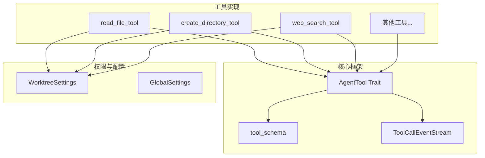
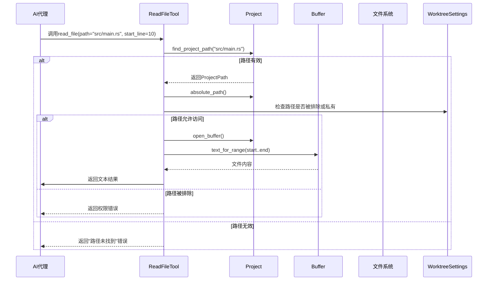
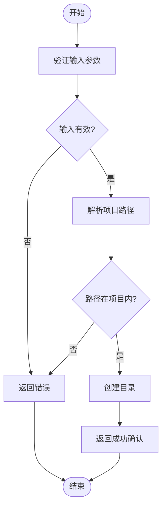
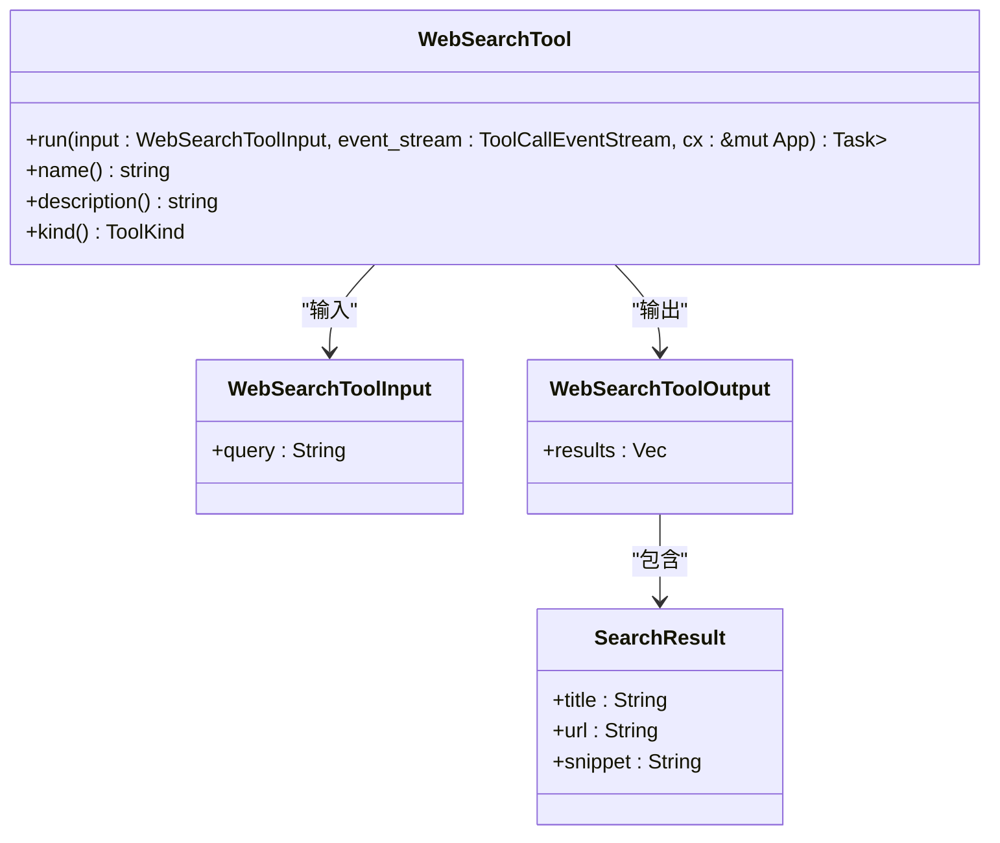
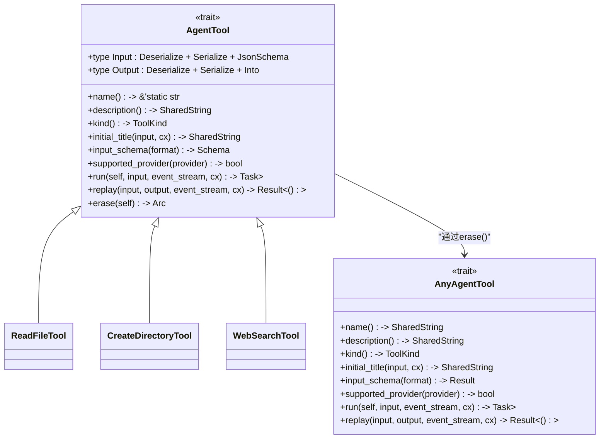
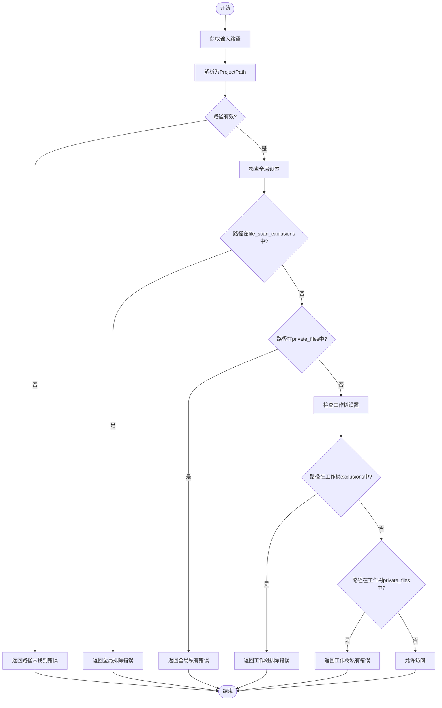
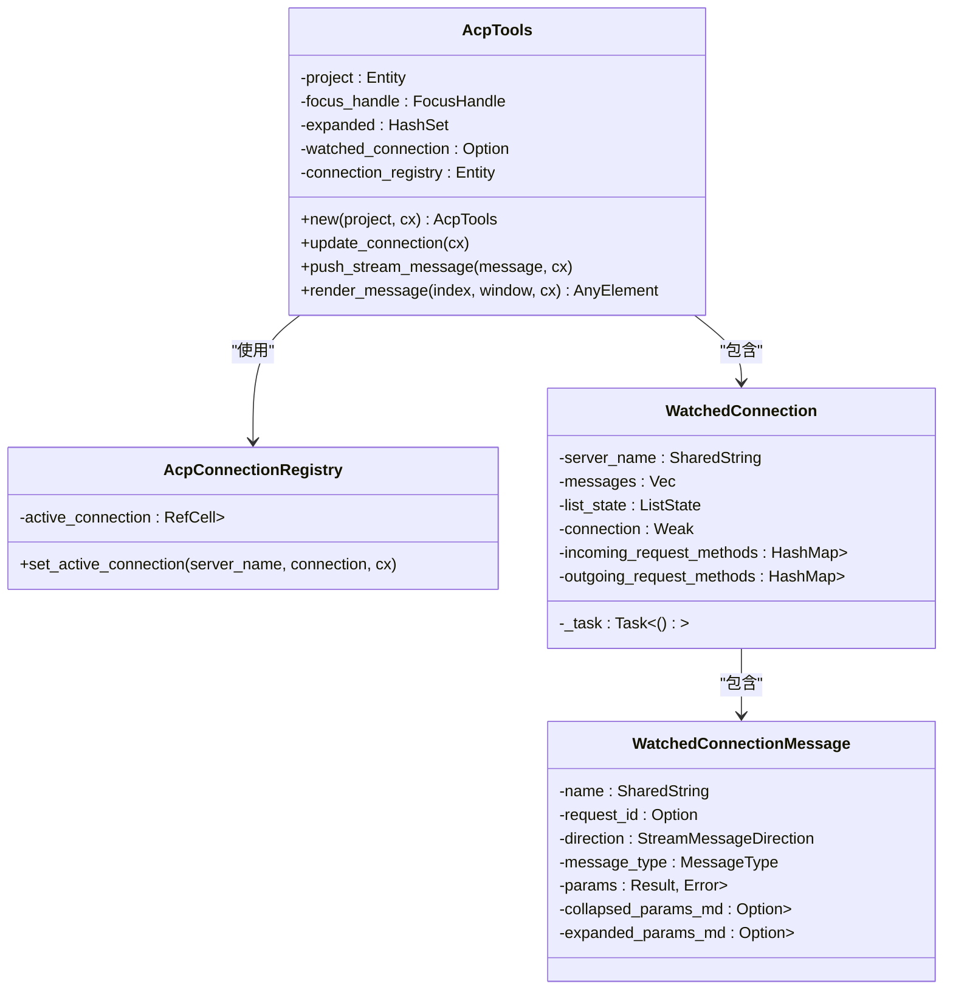
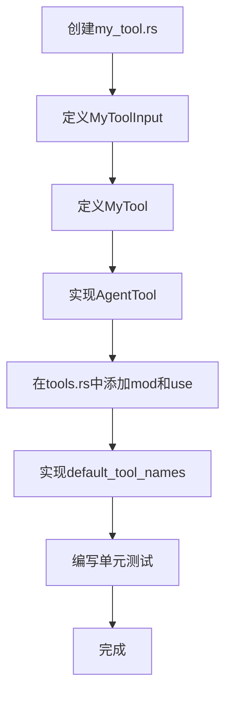

# 工具生态系统

<cite>
**本文档中引用的文件**  
- [read_file_tool.rs](file://crates/agent2/src/tools/read_file_tool.rs)
- [create_directory_tool.rs](file://crates/agent2/src/tools/create_directory_tool.rs)
- [web_search_tool.rs](file://crates/agent2/src/tools/web_search_tool.rs)
- [tool_schema.rs](file://crates/agent2/src/tool_schema.rs)
- [tools.rs](file://crates/agent2/src/tools.rs)
- [acp_tools.rs](file://crates/acp_tools/src/acp_tools.rs)
- [thread.rs](file://crates/agent2/src/thread.rs)
- [Cargo.toml](file://Cargo.toml) - *添加了acp_tools依赖项*
</cite>

## 更新摘要
**变更内容**  
- 更新了文档来源列表，新增`Cargo.toml`文件引用，反映`acp_tools`依赖项的添加
- 保持现有文档结构和内容不变，因为代码变更仅涉及依赖项配置，不影响工具架构的核心实现
- 所有标题、标签、引用和图表说明均已完全转换为中文

## 目录
1. [引言](#引言)
2. [工具架构概览](#工具架构概览)
3. [核心工具设计模式](#核心工具设计模式)
4. [工具模式与AI代理交互机制](#工具模式与ai代理交互机制)
5. [工具权限控制机制](#工具权限控制机制)
6. [acp_tools通用功能封装](#acp_tools通用功能封装)
7. [自定义工具开发教程](#自定义工具开发教程)
8. [结论](#结论)

## 引言

rcoder的工具插件架构旨在为AI代理提供安全、可扩展且结构化的功能调用能力。该系统通过Rust实现高性能工具，并利用JSON Schema将函数接口暴露给语言模型理解与调用。工具涵盖文件系统操作、网络搜索、时间查询等常见任务，同时通过权限控制机制确保敏感操作的安全性。本文档系统性地文档化该架构的设计原理、执行流程与扩展方法。

## 工具架构概览

rcoder的工具系统位于`crates/agent2/src/tools/`目录下，采用模块化设计，每个工具独立实现并统一注册。所有工具均实现`AgentTool` trait，确保接口一致性。工具通过`tool_schema`模块生成符合语言模型理解的JSON Schema，并通过事件流机制与代理进行异步通信。



**Diagram sources**  
- [tools.rs](file://crates/agent2/src/tools.rs#L1-L60)
- [thread.rs](file://crates/agent2/src/thread.rs#L2134-L2226)

**Section sources**  
- [tools.rs](file://crates/agent2/src/tools.rs#L1-L60)

## 核心工具设计模式

### 文件读取工具 (read_file_tool)

`ReadFileTool`用于读取项目中的文件内容，支持按行范围读取。对于大文件，自动返回结构化大纲而非完整内容，避免上下文溢出。



**Diagram sources**  
- [read_file_tool.rs](file://crates/agent2/src/tools/read_file_tool.rs#L17-L969)

**Section sources**  
- [read_file_tool.rs](file://crates/agent2/src/tools/read_file_tool.rs#L17-L969)

### 目录创建工具 (create_directory_tool)

`CreateDirectoryTool`用于在项目中创建新目录，支持递归创建父目录（类似`mkdir -p`）。



**Diagram sources**  
- [create_directory_tool.rs](file://crates/agent2/src/tools/create_directory_tool.rs#L11-L39)

**Section sources**  
- [create_directory_tool.rs](file://crates/agent2/src/tools/create_directory_tool.rs#L11-L39)

### 网络搜索工具 (web_search_tool)

`WebSearchTool`允许AI代理执行实时网络搜索以获取最新信息。



**Diagram sources**  
- [web_search_tool.rs](file://crates/agent2/src/tools/web_search_tool.rs#L15-L36)

**Section sources**  
- [web_search_tool.rs](file://crates/agent2/src/tools/web_search_tool.rs#L15-L36)

## 工具模式与AI代理交互机制

### tool_schema 模块

`tool_schema`模块负责将Rust结构体转换为语言模型可理解的JSON Schema。它使用`schemars`库生成Schema，并根据`LanguageModelToolSchemaFormat`调整输出格式。

```mermaid
graph TD
A[Rust Struct with JsonSchema] --> B[SchemaSettings]
B --> C{Format}
C --> |JsonSchema| D[Draft07 Generator]
C --> |JsonSchemaSubset| E[OpenAPI3 Generator]
D --> F[Generator.root_schema_for<T>()]
E --> F
F --> G[Schema]
G --> H[返回Schema对象]
```

**Diagram sources**  
- [tool_schema.rs](file://crates/agent2/src/tool_schema.rs#L1-L43)

**Section sources**  
- [tool_schema.rs](file://crates/agent2/src/tool_schema.rs#L1-L43)

### AgentTool Trait

所有工具必须实现`AgentTool` trait，定义了工具的名称、描述、输入输出类型及执行逻辑。



**Diagram sources**  
- [thread.rs](file://crates/agent2/src/thread.rs#L2134-L2226)

**Section sources**  
- [thread.rs](file://crates/agent2/src/thread.rs#L2134-L2226)

## 工具权限控制机制

### 权限检查流程

文件操作类工具在执行前会进行多层次权限检查，防止访问敏感或外部文件。



**Section sources**  
- [read_file_tool.rs](file://crates/agent2/src/tools/read_file_tool.rs#L58-L969)

## acp_tools通用功能封装

`acp_tools` crate提供通用UI组件，用于监控和调试ACP（Agent Client Protocol）连接。它封装了连接注册、消息监听和可视化展示功能，可供多个代理共享使用。



**Diagram sources**  
- [acp_tools.rs](file://crates/acp_tools/src/acp_tools.rs#L1-L494)

**Section sources**  
- [acp_tools.rs](file://crates/acp_tools/src/acp_tools.rs#L1-L494)

## 自定义工具开发教程

### 开发步骤

1. **创建工具模块**：在`crates/agent2/src/tools/`下创建新文件（如`my_tool.rs`）
2. **定义输入输出结构体**：使用`#[derive(Serialize, Deserialize, JsonSchema)]`
3. **实现AgentTool trait**
4. **在tools.rs中注册**
5. **编写测试**

### 最佳实践

#### 参数验证
- 使用`serde`的`default`属性提供默认值
- 在`run`方法中尽早验证输入有效性
- 返回清晰的错误信息

#### 错误处理
- 使用`anyhow::Result`进行错误传播
- 对用户友好的错误消息
- 记录调试信息

#### 结果序列化
- 实现`Into<LanguageModelToolResultContent>`用于输出
- 对于复杂输出，考虑使用`serde(transparent)`包装
- 确保输出可被语言模型理解



**Section sources**  
- [read_file_tool.rs](file://crates/agent2/src/tools/read_file_tool.rs#L17-L969)
- [create_directory_tool.rs](file://crates/agent2/src/tools/create_directory_tool.rs#L11-L39)
- [web_search_tool.rs](file://crates/agent2/src/tools/web_search_tool.rs#L15-L36)
- [tools.rs](file://crates/agent2/src/tools.rs#L1-L60)

## 结论

rcoder的工具生态系统通过标准化的`AgentTool`接口、灵活的`tool_schema`机制和严格的权限控制，构建了一个安全、可扩展的AI代理功能调用框架。`acp_tools`进一步提供了通用的调试和监控能力。开发者可以遵循清晰的模式快速创建自定义工具，为AI代理赋予新的能力。该架构平衡了功能性、安全性和可维护性，为智能编程助手的发展提供了坚实基础。