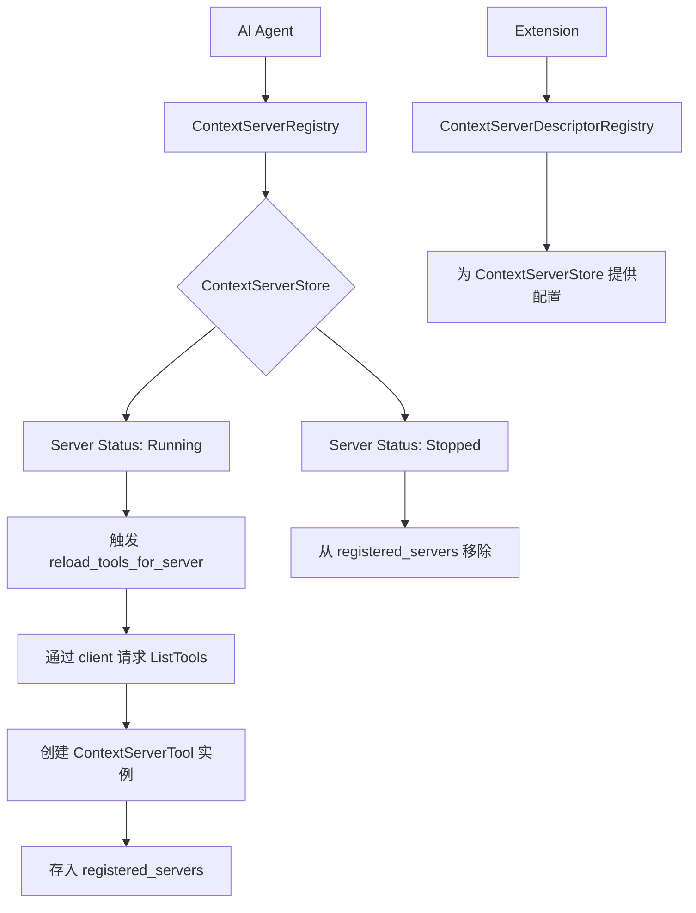
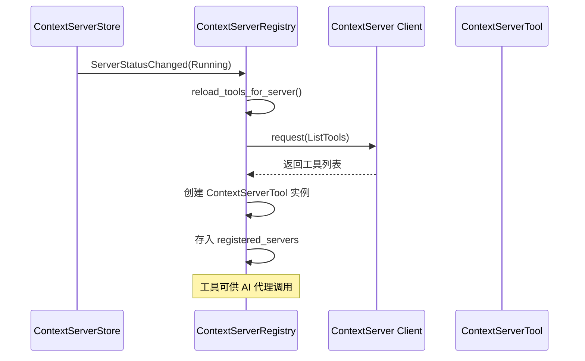
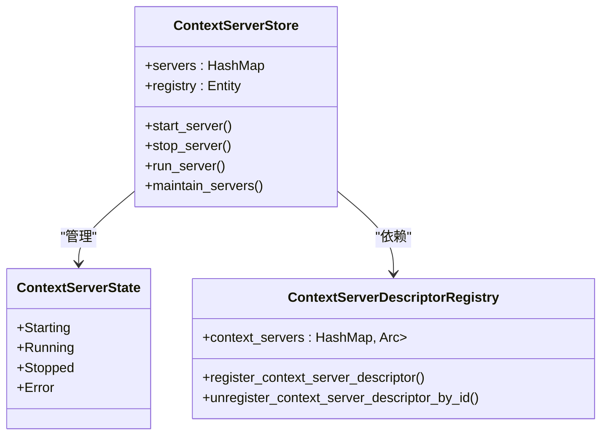
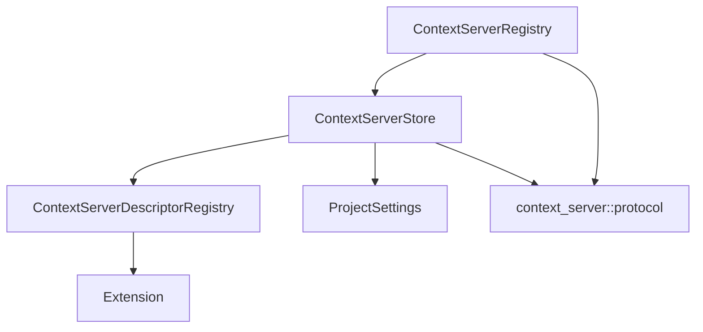

# 上下文管理工具

<cite>
**本文档中引用的文件**  
- [context_server_registry.rs](file://crates/agent2/src/tools/context_server_registry.rs)
- [context_server_store.rs](file://crates/project/src/context_server_store.rs)
- [registry.rs](file://crates/project/src/context_server_store/registry.rs)
- [extension.rs](file://crates/project/src/context_server_store/extension.rs)
</cite>

## 目录
1. [引言](#引言)
2. [项目结构](#项目结构)
3. [核心组件](#核心组件)
4. [架构概述](#架构概述)
5. [详细组件分析](#详细组件分析)
6. [依赖分析](#依赖分析)
7. [性能考虑](#性能考虑)
8. [故障排查指南](#故障排查指南)
9. [结论](#结论)

## 引言
`context_server_registry` 是一个用于管理 AI 代理上下文服务器注册与发现的核心工具。它在分布式环境中确保上下文请求的正确路由，支持上下文服务的动态注册、注销与生命周期管理。该工具通过监听上下文服务器状态变化，自动加载和卸载可用工具，并维护服务映射表，实现服务的健康检查与动态更新。本文档详细说明其设计目的、运行机制、内部数据结构、配置参数及常见问题处理方法。

## 项目结构
`context_server_registry` 工具位于 `crates/agent2/src/tools/` 目录下，是 AI 代理工具系统的一部分。其功能依赖于 `crates/project/src/context_server_store/` 模块提供的上下文服务器存储与管理能力。整个系统采用模块化设计，`context_server_store` 负责服务器的启动、停止和状态维护，而 `context_server_registry` 则专注于工具的注册与发现。

```mermaid
graph TB
subgraph "上下文服务器管理"
CSS[ContextServerStore]
CSDR[ContextServerDescriptorRegistry]
Extension[Extension]
end
subgraph "AI代理工具"
CSR[ContextServerRegistry]
CST[ContextServerTool]
end
Extension --> CSDR : 注册描述符
CSDR --> CSS : 提供配置
CSS --> CSR : 状态事件
CSR --> CST : 创建工具实例
```

**图示来源**
- [context_server_registry.rs](file://crates/agent2/src/tools/context_server_registry.rs#L10-L14)
- [context_server_store.rs](file://crates/project/src/context_server_store.rs#L143-L153)
- [registry.rs](file://crates/project/src/context_server_store/registry.rs#L27-L30)

**本节来源**
- [context_server_registry.rs](file://crates/agent2/src/tools/context_server_registry.rs#L1-L242)
- [context_server_store.rs](file://crates/project/src/context_server_store.rs#L1-L1348)

## 核心组件
`context_server_registry` 的核心是 `ContextServerRegistry` 结构体，它持有对 `ContextServerStore` 的引用，并维护一个 `registered_servers` 哈希表，用于存储已注册的上下文服务器及其可用工具。当服务器状态变为“运行中”时，它会触发工具加载流程；当服务器停止时，它会从映射表中移除对应的工具集。

**本节来源**
- [context_server_registry.rs](file://crates/agent2/src/tools/context_server_registry.rs#L10-L14)
- [context_server_registry.rs](file://crates/agent2/src/tools/context_server_registry.rs#L20-L28)

## 架构概述
该工具的架构分为三层：注册层、存储层和描述符层。注册层（`ContextServerRegistry`）负责监听事件并管理工具实例。存储层（`ContextServerStore`）维护服务器的生命周期和状态。描述符层（`ContextServerDescriptorRegistry`）提供服务器启动和配置的工厂方法，支持通过扩展机制动态注册。



**图示来源**
- [context_server_registry.rs](file://crates/agent2/src/tools/context_server_registry.rs#L50-L79)
- [context_server_store.rs](file://crates/project/src/context_server_store.rs#L30-L45)
- [registry.rs](file://crates/project/src/context_server_store/registry.rs#L40-L50)

## 详细组件分析

### ContextServerRegistry 分析
`ContextServerRegistry` 是工具注册的中枢。它通过订阅 `ContextServerStore` 的事件来响应服务器状态变化。

#### 类图
```mermaid
classDiagram
class ContextServerRegistry {
+server_store : Entity<ContextServerStore>
+registered_servers : HashMap<ContextServerId, RegisteredContextServer>
+_subscription : Subscription
+new() : Self
+servers() : Iterator
+reload_tools_for_server()
+handle_context_server_store_event()
}
class RegisteredContextServer {
+tools : BTreeMap<SharedString, Arc<dyn AnyAgentTool>>
+load_tools : Task<Result<()>>
}
class ContextServerTool {
+store : Entity<ContextServerStore>
+server_id : ContextServerId
+tool : context_server : : types : : Tool
+run() : Task<Result<AgentToolOutput>>
+input_schema() : Result<Value>
}
ContextServerRegistry --> RegisteredContextServer : "包含"
ContextServerRegistry --> ContextServerTool : "创建"
ContextServerTool ..> AnyAgentTool : "实现"
```

**图示来源**
- [context_server_registry.rs](file://crates/agent2/src/tools/context_server_registry.rs#L10-L14)
- [context_server_registry.rs](file://crates/agent2/src/tools/context_server_registry.rs#L16-L19)
- [context_server_registry.rs](file://crates/agent2/src/tools/context_server_registry.rs#L105-L138)

#### 序列图


**图示来源**
- [context_server_registry.rs](file://crates/agent2/src/tools/context_server_registry.rs#L50-L79)
- [context_server_registry.rs](file://crates/agent2/src/tools/context_server_registry.rs#L141-L178)

**本节来源**
- [context_server_registry.rs](file://crates/agent2/src/tools/context_server_registry.rs#L10-L242)

### ContextServerStore 分析
`ContextServerStore` 是上下文服务器的生命周期管理器，负责服务器的启动、停止和状态维护。

#### 类图


**图示来源**
- [context_server_store.rs](file://crates/project/src/context_server_store.rs#L143-L153)
- [context_server_store.rs](file://crates/project/src/context_server_store.rs#L110-L120)
- [registry.rs](file://crates/project/src/context_server_store/registry.rs#L27-L30)

**本节来源**
- [context_server_store.rs](file://crates/project/src/context_server_store.rs#L1-L1348)
- [registry.rs](file://crates/project/src/context_server_store/registry.rs#L1-L84)

## 依赖分析
`context_server_registry` 的正常运行依赖于多个组件的协同工作。



**图示来源**
- [context_server_registry.rs](file://crates/agent2/src/tools/context_server_registry.rs#L1-L10)
- [context_server_store.rs](file://crates/project/src/context_server_store.rs#L1-L50)
- [registry.rs](file://crates/project/src/context_server_store/registry.rs#L1-L20)

**本节来源**
- [context_server_registry.rs](file://crates/agent2/src/tools/context_server_registry.rs#L1-L242)
- [context_server_store.rs](file://crates/project/src/context_server_store.rs#L1-L1348)
- [registry.rs](file://crates/project/src/context_server_store/registry.rs#L1-L84)

## 性能考虑
该工具的设计考虑了性能和资源效率。工具列表的加载是异步进行的，避免阻塞主线程。`BTreeMap` 用于存储工具，保证了工具名称的有序性和快速查找。`Task` 的使用确保了网络请求不会影响 UI 响应。在大规模部署时，应注意监控 `registered_servers` 的大小，避免内存占用过高。

## 故障排查指南
以下是一些常见问题及其解决方法。

### 服务注册失败
**现象**：新启动的上下文服务器未出现在可用工具列表中。
**排查步骤**：
1.  检查 `ContextServerStore` 中服务器状态是否为 `Running`。
2.  确认服务器实现了 `Tools` 能力（`client.capable(context_server::protocol::ServerCapability::Tools)`）。
3.  查看日志中是否有 `ListTools` 请求失败的记录。

**本节来源**
- [context_server_registry.rs](file://crates/agent2/src/tools/context_server_registry.rs#L65-L68)
- [context_server_registry.rs](file://crates/agent2/src/tools/context_server_registry.rs#L155-L165)

### 心跳超时
**现象**：服务器状态频繁在 `Running` 和 `Error` 之间切换。
**排查步骤**：
1.  检查上下文服务器进程是否稳定运行。
2.  验证服务器与客户端之间的网络连接。
3.  查看服务器日志，确认是否存在未处理的请求或异常。

**本节来源**
- [context_server_store.rs](file://crates/project/src/context_server_store.rs#L300-L325)
- [context_server_store.rs](file://crates/project/src/context_server_store.rs#L450-L470)

## 结论
`context_server_registry` 是一个设计精巧的上下文服务管理工具。它通过事件驱动的架构，实现了对上下文服务器的动态发现和工具注册。其与 `ContextServerStore` 和 `ContextServerDescriptorRegistry` 的紧密协作，确保了在复杂分布式环境下的可靠性和灵活性。通过理解其内部机制和依赖关系，开发者可以更有效地配置和维护 AI 代理的上下文服务能力。