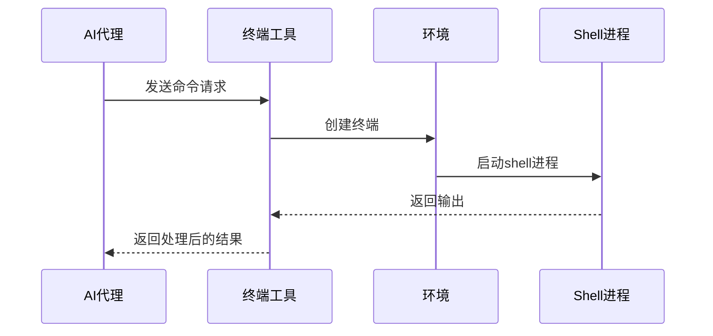
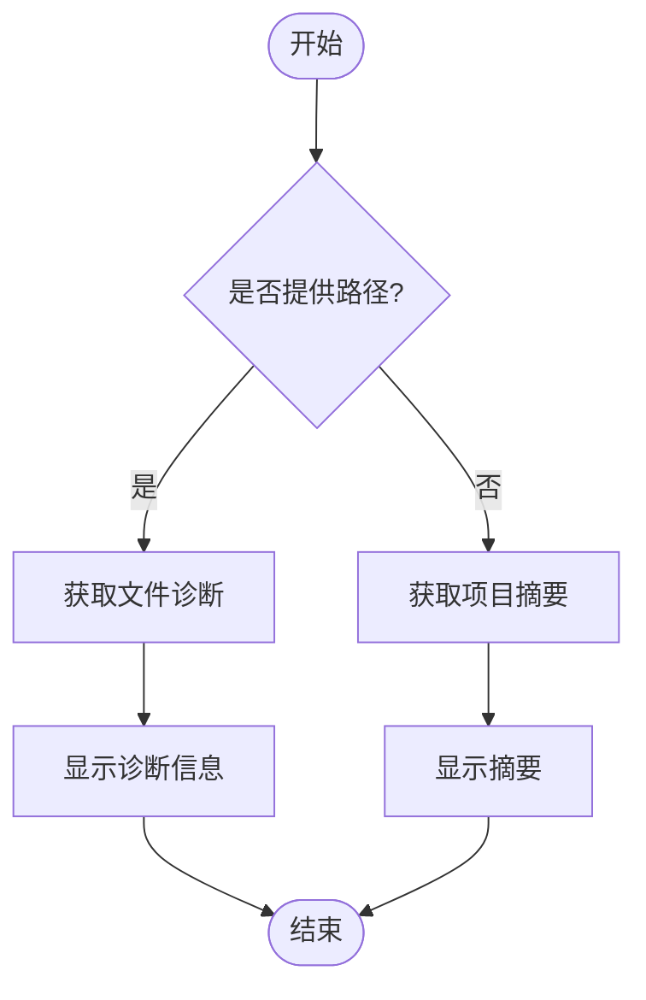
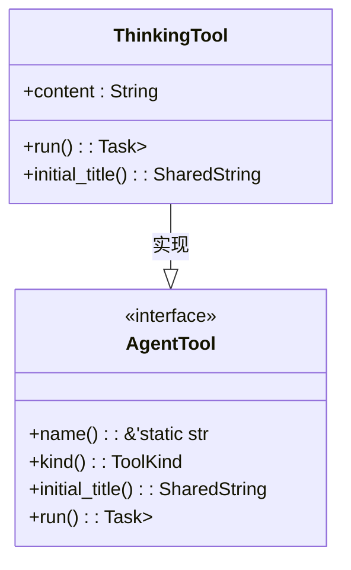
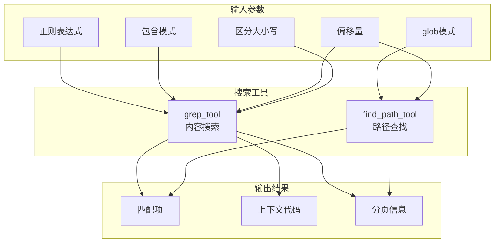
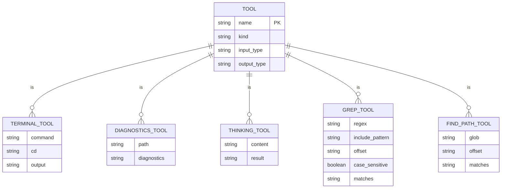

# 开发辅助工具

<cite>
**本文档引用的文件**   
- [terminal_tool.rs](file://crates/agent2/src/tools/terminal_tool.rs)
- [diagnostics_tool.rs](file://crates/agent2/src/tools/diagnostics_tool.rs)
- [thinking_tool.rs](file://crates/agent2/src/tools/thinking_tool.rs)
- [grep_tool.rs](file://crates/agent2/src/tools/grep_tool.rs)
- [find_path_tool.rs](file://crates/agent2/src/tools/find_path_tool.rs)
</cite>

## 目录
1. [介绍](#介绍)
2. [核心功能概览](#核心功能概览)
3. [终端执行工具](#终端执行工具)
4. [代码诊断工具](#代码诊断工具)
5. [思维链记录工具](#思维链记录工具)
6. [代码搜索与路径查找工具](#代码搜索与路径查找工具)
7. [工具集成与上下文感知](#工具集成与上下文感知)
8. [实际应用场景](#实际应用场景)
9. [结论](#结论)

## 介绍
本文件系统性地文档化了开发辅助类工具的功能与实现，涵盖代码诊断、终端执行、代码搜索、路径查找、文件打开、时间获取和思维链记录等功能。这些工具旨在增强AI代理的上下文感知与开发环境交互能力，为开发者提供智能化的辅助支持。

## 核心功能概览
开发辅助工具集包含多个核心组件，每个组件都针对特定的开发任务进行了优化。这些工具通过标准化的接口与开发环境进行交互，确保了安全性和可靠性。主要功能包括：
- **终端执行**：安全地执行shell命令并捕获输出
- **代码诊断**：集成LSP诊断信息，提供实时反馈
- **思维链记录**：在会话中维护推理状态
- **代码搜索**：通过正则表达式搜索文件内容
- **路径查找**：基于glob模式快速定位文件路径

**Section sources**
- [tools.rs](file://crates/agent2/src/tools.rs#L1-L16)

## 终端执行工具
`terminal_tool`允许AI代理安全地执行shell命令并捕获其输出。该工具通过用户shell启动进程，读取stdout和stderr（保持写入顺序），并返回包含组合输出结果的字符串。

### 安全执行机制
- **工作目录控制**：使用`cd`参数导航到项目根目录之一，避免在命令中直接使用`cd`
- **输出限制**：设置`COMMAND_OUTPUT_LIMIT`为16KB，防止输出过长
- **状态隔离**：每次调用都会启动新的shell进程，不依赖前次调用的状态

### 使用限制
- 不应用于无限期运行的命令（如服务器、文件监视器）
- 避免冗余输出，因为输出结果已显示给用户



**Diagram sources**
- [terminal_tool.rs](file://crates/agent2/src/tools/terminal_tool.rs#L25-L213)

**Section sources**
- [terminal_tool.rs](file://crates/agent2/src/tools/terminal_tool.rs#L1-L213)

## 代码诊断工具
`diagnostics_tool`用于获取项目的错误和警告信息。该工具可以集成LSP（Language Server Protocol）诊断信息，为开发者提供实时的代码质量反馈。

### 功能特性
- **文件级诊断**：当提供路径时，显示该文件的所有诊断信息
- **项目级摘要**：当未提供路径时，显示项目范围内错误和警告的统计摘要
- **详细定位**：报告诊断信息的具体行号和严重程度

### 使用指南
- 如果认为可以修复诊断问题，可尝试1-2次后放弃
- 不要仅因无法修复错误就删除已生成的代码，用户可以帮助修复



**Diagram sources**
- [diagnostics_tool.rs](file://crates/agent2/src/tools/diagnostics_tool.rs#L1-L167)

**Section sources**
- [diagnostics_tool.rs](file://crates/agent2/src/tools/diagnostics_tool.rs#L1-L167)

## 思维链记录工具
`thinking_tool`是一个用于思考问题、头脑风暴或规划的工具，无需执行任何实际操作。它允许AI代理在采取行动前深入思考复杂问题、制定策略或规划方法。

### 核心作用
- **问题解决**：工作解决复杂问题
- **策略开发**：制定应对策略
- **方法规划**：规划实施方法
- **状态维护**：在会话中维护推理状态

### 使用场景
- 需要解决复杂问题时
- 需要制定战略时
- 需要规划实施步骤时



**Diagram sources**
- [thinking_tool.rs](file://crates/agent2/src/tools/thinking_tool.rs#L1-L52)

**Section sources**
- [thinking_tool.rs](file://crates/agent2/src/tools/thinking_tool.rs#L1-L52)

## 代码搜索与路径查找工具
本节介绍两个关键的搜索工具：`grep_tool`用于搜索文件内容，`find_path_tool`用于查找文件路径。

### grep_tool - 内容搜索
`grep_tool`使用正则表达式在项目中搜索文件内容。

#### 主要特性
- **正则表达式支持**：支持完整的正则语法
- **模式过滤**：通过`include_pattern`参数缩小搜索范围
- **分页结果**：每页20个匹配项，使用`offset`参数请求后续页面
- **上下文显示**：显示匹配项周围的上下文代码

#### 使用建议
- 搜索符号时优先使用此工具，无需猜测路径
- 不要使用此工具搜索路径，仅用于搜索文件内容

**Section sources**
- [grep_tool.rs](file://crates/agent2/src/tools/grep_tool.rs#L1-L799)

### find_path_tool - 路径查找
`find_path_tool`使用glob模式快速匹配项目中的文件路径。

#### 主要特性
- **glob模式支持**：支持`**/*.js`或`src/**/*.ts`等模式
- **分页结果**：每页50个匹配项
- **排序输出**：按字母顺序返回匹配的文件路径

#### 使用建议
- 当需要根据名称模式查找文件时使用
- 当有特定路径信息时优先使用此工具



**Diagram sources**
- [grep_tool.rs](file://crates/agent2/src/tools/grep_tool.rs#L1-L799)
- [find_path_tool.rs](file://crates/agent2/src/tools/find_path_tool.rs#L1-L250)

**Section sources**
- [grep_tool.rs](file://crates/agent2/src/tools/grep_tool.rs#L1-L799)
- [find_path_tool.rs](file://crates/agent2/src/tools/find_path_tool.rs#L1-L250)

## 工具集成与上下文感知
这些开发辅助工具通过统一的接口与AI代理集成，增强了其上下文感知和开发环境交互能力。

### 集成架构
- **统一接口**：所有工具都实现`AgentTool` trait
- **事件流**：通过`ToolCallEventStream`与代理通信
- **上下文传递**：通过`cx`参数访问应用上下文

### 上下文感知能力
- **项目感知**：工具了解项目结构和文件系统
- **状态感知**：能够访问和修改项目状态
- **环境感知**：能够与外部环境（如shell）交互



**Diagram sources**
- [tools.rs](file://crates/agent2/src/tools.rs#L1-L16)

## 实际应用场景
本节提供各工具在实际开发场景中的使用案例。

### 通过grep_tool定位代码
```json
{
  "regex": "log.*Error",
  "include_pattern": "src/**/*.ts",
  "offset": 0,
  "case_sensitive": false
}
```
此调用将在TypeScript文件中搜索包含"log"后跟"Error"的代码行。

### 使用find_path_tool查找项目文件
```json
{
  "glob": "**/*.config.js",
  "offset": 0
}
```
此调用将查找项目中所有以".config.js"结尾的配置文件。

### 终端命令执行
```json
{
  "command": "npm run build",
  "cd": "frontend"
}
```
此调用将在frontend目录下执行npm构建命令。

### 诊断代码问题
```json
{
  "path": "src/main.ts"
}
```
此调用将获取main.ts文件的诊断信息，帮助识别和修复问题。

**Section sources**
- [grep_tool.rs](file://crates/agent2/src/tools/grep_tool.rs#L1-L799)
- [find_path_tool.rs](file://crates/agent2/src/tools/find_path_tool.rs#L1-L250)
- [terminal_tool.rs](file://crates/agent2/src/tools/terminal_tool.rs#L1-L213)
- [diagnostics_tool.rs](file://crates/agent2/src/tools/diagnostics_tool.rs#L1-L167)

## 结论
开发辅助工具集为AI代理提供了强大的开发环境交互能力。通过终端执行、代码诊断、思维链记录、代码搜索和路径查找等功能，这些工具显著增强了代理的上下文感知和问题解决能力。每个工具都经过精心设计，确保安全性和可靠性，同时提供丰富的功能来支持各种开发任务。这些工具的集成使用为智能化开发辅助奠定了坚实的基础。